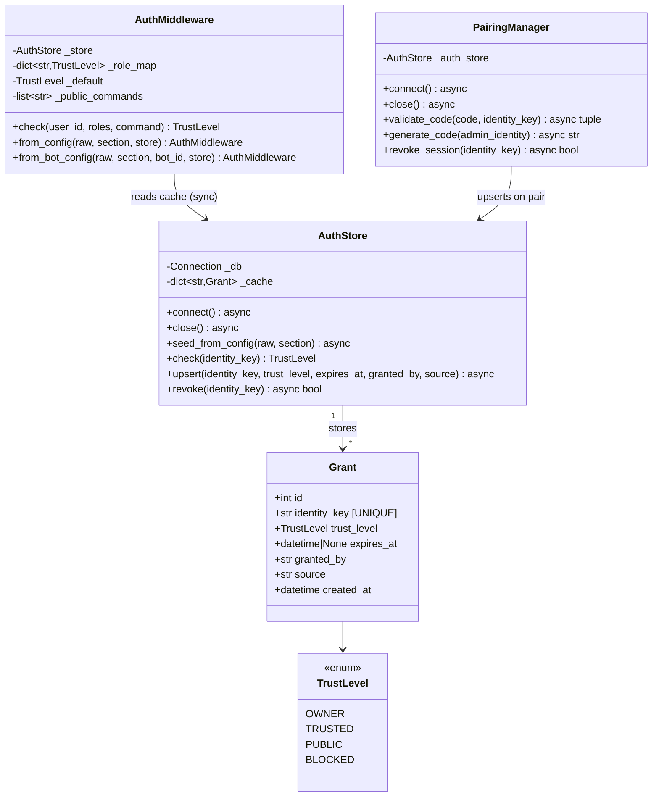

## Context

Promoted from frame: `artifacts/frames/245-unify-auth-store-frame.mdx` (approved 2026-03-14).

Auth is currently split across `AuthMiddleware` (in-memory dict from `config.toml`) and `PairingManager` (`paired_sessions` SQLite table). These two systems produce contradictions and have no shared state. This spec describes the unified `AuthStore` layer that becomes the single source of truth for all user-level grants.

## Goal

Replace the in-memory `user_map` dict in `AuthMiddleware` and the `paired_sessions` table in `PairingManager` with a single `AuthStore` (SQLite + write-through in-memory cache), so every user-level auth decision comes from one place.

## Users

- **Mickael (maintainer):** Single mental model for auth; runtime grant changes without restart; no more "paired but blocked" contradictions.
- **Telegram/Discord users:** Pairing (`/join`) correctly grants `TRUSTED` access visible at the adapter level; unauthenticated users can still send `/join` regardless of default trust level.

## Expected Behavior

### Boot path

1. `AuthStore.connect()` opens aiosqlite, creates the `grants` table (idempotent), sets WAL mode, then **warms the cache** by loading all non-expired grants from the DB into `_cache`. This is required so that `check()` (sync) can serve all subsequent lookups without any DB I/O.
2. `AuthStore.seed_from_config(raw, section)` is called for each adapter section (`telegram`, `discord`). It reads `owner_users` / `trusted_users` and upserts them as permanent grants (`expires_at = NULL`, `source = "config.toml"`, `granted_by = "config"`). Conflict rule: **permanent grants are never downgraded** — if a grant already exists with `expires_at = NULL`, the upsert preserves it unchanged.
3. `AuthMiddleware` is constructed with a reference to the warmed `AuthStore` plus the config-driven `role_map`, `default`, and `public_commands` list.

### Message path (adapter level)

1. Inbound message arrives at Telegram/Discord adapter.
2. Adapter calls `AuthMiddleware.check(user_id, roles, command=None)`.
3. Resolution order:
   a. If `command` is in `public_commands` (default: `["/join"]`) → return `TrustLevel.PUBLIC` immediately, bypassing all other checks. This replaces the `/join` exception previously handled by `Hub._pairing_gate_drop()`.
   b. `AuthStore.check(user_id)` (sync, cache lookup). If the store returns BLOCKED / TRUSTED / OWNER → return immediately; roles are not consulted.
   c. Role map lookup (Discord role snowflake IDs from config). Returns highest matching level.
   d. `self._default` fallback.
4. If `TrustLevel.BLOCKED` → message dropped at adapter. Hub never sees it.
5. Hub `_pairing_gate_drop()` and `MessagePipeline._pairing_gate()` no longer exist — trust is fully resolved at adapter level.

### Pairing path (`/join` command)

1. User sends `/join <CODE>`. The `public_commands` bypass ensures this reaches the pairing command handler regardless of the user's current trust level.
2. `PairingManager.validate_code()` validates the code (unchanged logic, including TOCTOU-safe `BEGIN IMMEDIATE` transaction), then calls `AuthStore.upsert(identity_key, TrustLevel.TRUSTED, expires_at=session_expires, granted_by="invite", source=code_hash)` instead of inserting into `paired_sessions`.
3. The upsert writes to DB, then updates `_cache`. Because the asyncio event loop is cooperative, no concurrent `check()` can observe an intermediate state between DB write and cache update within the same coroutine.
4. On the next message from that user, `AuthMiddleware.check()` reads the TRUSTED grant from `_cache` synchronously.

### Discord role grants (resolved: Option A)

Discord role grants (`trusted_roles` from config) remain in `AuthMiddleware._role_map` as in-memory config-only state. They are NOT stored in `AuthStore`. Rationale: roles are static configuration assigned in Discord, cannot be "revoked via AuthStore" in a meaningful way, and do not expire. Only user-level grants (pairing + explicit users from config) are persisted.

### Revocation and expiry

- Expired grants: lazily evicted on `check()` (DB delete + cache evict). Same pattern as current `is_paired()`.
- `AuthStore.revoke(identity_key)` → DB delete + cache evict → returns `True` if the grant existed. Returns `False` for absent keys.
- `PairingManager.revoke_session(identity_key)` delegates to `AuthStore.revoke(identity_key)`.

### `pairing_codes` table

The `pairing_codes` table remains in `PairingManager` unchanged. It manages invite codes (not user grants) and is unrelated to `AuthStore`. Only `paired_sessions` is removed.

### Runtime reload

Re-calling `seed_from_config()` updates static grants in DB + cache without restart. Permanent grants (expires_at = NULL) are not overwritten.

### `from_bot_config()` (multi-bot path)

`AuthMiddleware.from_bot_config()` also builds a `user_map` from the same config keys. This factory is in scope for this refactor — it must be updated to accept an `auth_store` parameter and use the same `AuthStore` instance as `from_config()`. The multi-bot path must not bypass `AuthStore`.

## Data Model & Consumers



```mermaid
flowchart TD
    Config["config.toml\n[auth.telegram]"] -->|seed_from_config| AS[AuthStore\ngrants table + cache]
    Pairing["PairingManager\nvalidate_code()"] -->|upsert TRUSTED + TTL| AS
    AS -->|warm cache on connect| AS
    AS -->|check() sync cache lookup| AM[AuthMiddleware]
    AM -->|public_commands bypass| Pass1["→ PUBLIC\n(e.g. /join)"]
    AM -->|store.check() BLOCKED| Drop["Message Dropped\nat adapter"]
    AM -->|store.check() TRUSTED/OWNER| Hub["Hub / Pool"]
    AM -->|role_map / default| Hub

    style AS fill:#d4edda,stroke:#28a745
    style Drop fill:#f8d7da,stroke:#dc3545
    style Pass1 fill:#fff3cd,stroke:#ffc107
```

| Consumer | Fields Consumed | When | Status |
|----------|----------------|------|--------|
| `AuthMiddleware.check()` | `identity_key`, `trust_level`, `expires_at` (via cache) | Every inbound message | This issue |
| `PairingManager.validate_code()` | writes `identity_key`, `trust_level`, `expires_at` | On `/join` | This issue |
| `AuthStore.seed_from_config()` | writes from config `owner_users`/`trusted_users` | Boot + runtime reload | This issue |
| Audit log / admin commands | `granted_by`, `source`, `created_at` | Future | Out of scope |

## Breadboard

### U1 — AuthStore CRUD

DDL:
```sql
CREATE TABLE IF NOT EXISTS grants (
    id          INTEGER PRIMARY KEY,
    identity_key TEXT NOT NULL UNIQUE,
    trust_level  TEXT NOT NULL,
    expires_at   TEXT,           -- ISO datetime or NULL (permanent)
    granted_by   TEXT NOT NULL,  -- "config", "invite", "system"
    source       TEXT NOT NULL,  -- "config.toml", code_hash, etc.
    created_at   TEXT NOT NULL DEFAULT (datetime('now'))
)
```

| Affordance | Handler | Data Flow |
|------------|---------|-----------|
| `AuthStore.connect()` | `aiosqlite.connect()` + DDL + WAL mode + full cache warm (`SELECT * FROM grants WHERE expires_at IS NULL OR expires_at > now`) | DB file → `_cache` populated |
| `AuthStore.seed_from_config(raw, section)` | Parse `owner_users`/`trusted_users` → upsert with conflict rule: skip update if existing `expires_at IS NULL` | config → grants + cache |
| `AuthStore.check(identity_key)` | `_cache.get(identity_key)` → if expired, evict (DB delete + cache del) → return `_default` | sync, no I/O on cache hit |
| `AuthStore.upsert(...)` | `INSERT ... ON CONFLICT(identity_key) DO UPDATE` → cache write | grant params → DB + cache |
| `AuthStore.revoke(identity_key)` | `DELETE FROM grants WHERE identity_key = ?` + `_cache.pop()` | identity_key → bool |
| `AuthStore.close()` | `await self._db.close()` | shutdown |

Connection ownership: `AuthStore` and `PairingManager` each hold their own `aiosqlite.Connection` to the same SQLite file. WAL mode supports concurrent writers; the cooperative event loop prevents reentrant writes on the same connection.

### U2 — AuthMiddleware (refactored)

| Affordance | Handler | Data Flow |
|------------|---------|-----------|
| `AuthMiddleware.__init__(store, role_map, default, public_commands)` | Store `store` ref; replace `user_map` with `store` | `public_commands` defaults to `["/join"]` |
| `AuthMiddleware.check(user_id, roles, command=None)` | (a) public_commands check → PUBLIC; (b) `store.check(user_id)` → if not PUBLIC, return; (c) role_map; (d) default | AuthStore cache → TrustLevel |
| `AuthMiddleware.from_config(raw, section, store)` | Accept `store` param; role_map + default + public_commands still from config | config + AuthStore → middleware |
| `AuthMiddleware.from_bot_config(raw, section, bot_id, store)` | Same as above, per-bot config path | config + AuthStore → middleware |

### U3 — PairingManager (refactored)

| Affordance | Handler | Data Flow |
|------------|---------|-----------|
| `PairingManager.__init__(..., auth_store)` | Replace `_db_path` paired_sessions dep with `_auth_store` | AuthStore ref stored |
| `PairingManager.connect()` | Create `pairing_codes` table only (no `paired_sessions`) | DB → pairing_codes table |
| `PairingManager.validate_code(code, identity_key)` | On success (inside `BEGIN IMMEDIATE`): `await auth_store.upsert(identity_key, TRUSTED, session_expires, ...)` instead of `INSERT paired_sessions` | code → AuthStore grant |
| `PairingManager.is_paired()` | **Removed** — use `AuthStore.check()` at adapter level | — |
| `PairingManager.revoke_session(identity_key)` | Delegates to `auth_store.revoke(identity_key)` | identity_key → bool |

### U4 — Hub (cleanup)

| Affordance | Handler | Data Flow |
|------------|---------|-----------|
| `Hub._pairing_gate_drop()` | **Removed** | — |
| `MessagePipeline._pairing_gate()` | **Removed** | — |
| `Hub.__init__(pairing_manager=...)` | Param kept for code generation only (no gate logic uses it) | — |

**Dependency note:** S4 (hub cleanup) must not be merged until S3 (PairingManager → AuthStore) is verified end-to-end. The gate is the current fallback for paired-user auth; removing it before the AuthStore write path is confirmed would silently break paired users.

## Slices

| # | Slice | Files | Demo |
|---|-------|-------|------|
| S1 | `AuthStore` class: `grants` DDL, connect (+ cache warm), seed, check, upsert, revoke, close | `src/lyra/core/auth_store.py` | `AuthStore.check()` returns correct TrustLevel for seeded user without restart |
| S2 | `AuthMiddleware` reads `AuthStore`; add `public_commands`; update both factories | `src/lyra/core/auth.py` | `AuthMiddleware.check()` returns seeded trust level; `/join` bypasses trust check |
| S3 | `PairingManager` writes TRUSTED grant to `AuthStore`; `paired_sessions` removed; `is_paired()` removed | `src/lyra/core/pairing.py` | `/join` → user is TRUSTED in subsequent auth checks without being in config.toml |
| S4 | `Hub._pairing_gate_drop` + `MessagePipeline._pairing_gate` removed (depends on S3) | `src/lyra/core/hub.py` | Pipeline has no pairing gate stage; paired users pass via AuthStore |
| S5 | Wiring: shared `AuthStore` DI in both bootstrap paths; `await auth_store.connect()` + `seed_from_config()` before adapter construction; `auth_store.close()` in shutdown | `src/lyra/__main__.py` | Full boot → messages flow correctly end-to-end |

**Boot sequence constraint (S5):** `await auth_store.connect()` and `await auth_store.seed_from_config(...)` must complete before `AuthMiddleware.from_config(...)` / `from_bot_config(...)` is called, since the middleware reads from the warmed cache immediately.

## Success Criteria

- [ ] `AuthStore` creates the `grants` table with UNIQUE constraint on `identity_key` and WAL mode on connect (idempotent)
- [ ] `AuthStore.connect()` warms `_cache` from DB on startup; subsequent `check()` calls require no DB I/O for cached identities
- [ ] Boot seeds `owner_users` and `trusted_users` from each adapter's config as permanent grants (`expires_at = NULL`); re-seeding does not downgrade or overwrite permanent grants
- [ ] `AuthMiddleware.check(user_id, command="/join")` returns `TrustLevel.PUBLIC` regardless of the user's grant status (public_commands bypass)
- [ ] `AuthMiddleware.check(user_id)` returns the correct `TrustLevel` for a user seeded via `seed_from_config()` — no restart required
- [ ] `PairingManager.validate_code()` upserts a `TRUSTED` grant with `expires_at` into `AuthStore`; a user paired via `/join` gets `TrustLevel.TRUSTED` from subsequent `AuthMiddleware.check()` calls, without being in `config.toml`
- [ ] `paired_sessions` table is no longer created or queried
- [ ] `Hub._pairing_gate_drop()` and `MessagePipeline._pairing_gate()` no longer exist
- [ ] `AuthStore.revoke(identity_key)` returns `True` when the grant existed and `False` when absent; the evicted identity is no longer returned by `check()`
- [ ] `AuthStore.close()` is awaited in the shutdown sequence
- [ ] Existing `auth`, `pairing`, and `hub` test modules pass after refactor with no modification to test file structure; new unit tests cover at minimum: (a) `check()` returns correct level after `upsert`, (b) expired grant returns default (not cached level), (c) `seed_from_config()` called twice does not duplicate or downgrade permanent grants, (d) `revoke()` returns `False` for absent key
