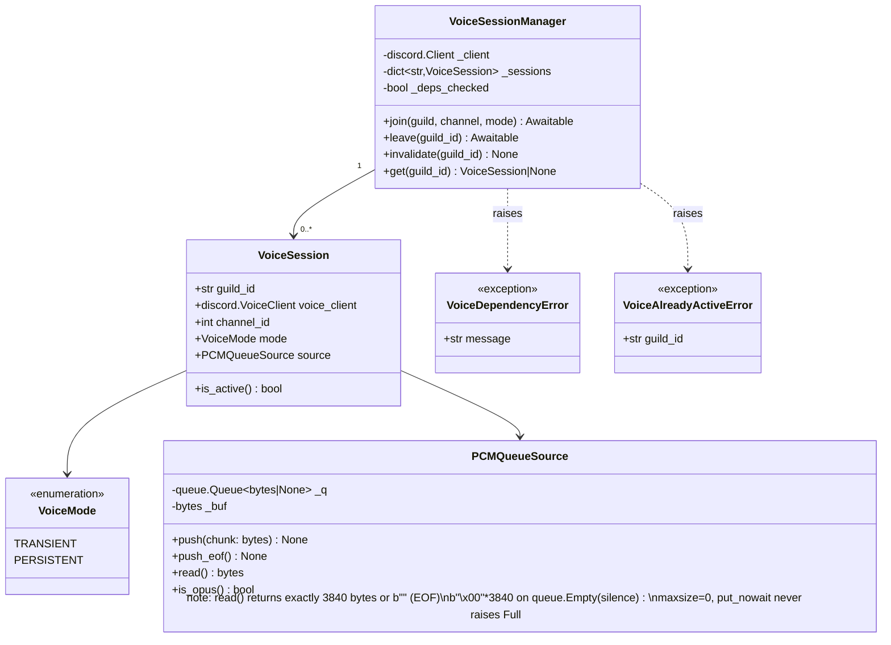
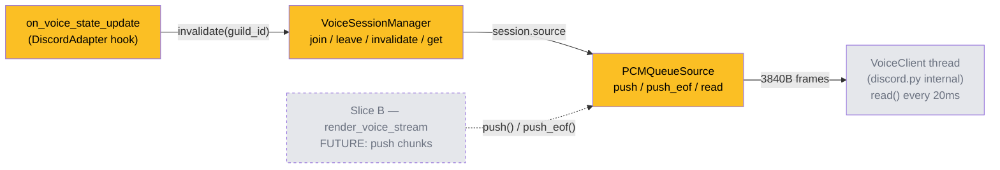

## Context

Sub-issue A of [#185 live audio streaming](../specs/185-live-audio-streaming-spec.mdx). Implements the foundational voice infrastructure that Slice B (streaming) and Slice C (commands) depend on. Analysis was skipped (F-lite); promoted from [frame](../frames/255-voice-session-manager-frame.mdx).

Scope: `VoiceSessionManager`, `VoiceSession`, `VoiceMode`, `PCMQueueSource`, `VoiceDependencyError`, `VoiceAlreadyActiveError`, startup checks, `on_voice_state_update` hook. All in `src/lyra/adapters/discord_voice.py` — **new file** (the existing Discord adapter lives in `src/lyra/adapters/discord.py`).

## Goal

Provide a thread-safe voice session store and PCM audio source class for `DiscordAdapter`, with dependency validation on first join.

## Users

- **Primary:** `DiscordAdapter` — calls VSM to manage join/leave/invalidate lifecycle
- **Secondary:** Slice B (`render_voice_stream`) — will use `PCMQueueSource.push()` and `push_eof()`

## Expected Behavior

### Session lifecycle

`VoiceSessionManager.join(guild, channel, mode)`:
- If a session already exists for `guild.id` → raise `VoiceAlreadyActiveError` (caller catches and surfaces "Already in a voice channel." to the user; this is Slice C's responsibility)
- Run dependency check (libopus + ffmpeg) — raise `VoiceDependencyError` with actionable message if missing
- `await channel.connect()` → store `VoiceSession(guild_id, voice_client, channel_id, mode, source=PCMQueueSource())`
- `VoiceClient.play(source)` is NOT called here — deferred to Slice B. Calling `play()` at join time would immediately start the VoiceClient read loop, consuming silence frames at 3840 bytes/20 ms before any audio is available.

`VoiceSessionManager.leave(guild_id)`:
- Retrieve session; if none → return silently
- Call `session.source.push_eof()` to drain any blocked `read()` in the VoiceClient thread
- `await session.voice_client.disconnect()`
- Remove session from `_sessions`

`VoiceSessionManager.invalidate(guild_id)`:
- Remove session entry without calling `disconnect()` (VoiceClient is already stale)
- No error if guild_id not found

`VoiceSessionManager.get(guild_id) -> VoiceSession | None`:
- Return session or None

### PCMQueueSource

`discord.AudioSource` subclass backed by `queue.Queue[bytes | None]` (stdlib, **not** `asyncio.Queue`):
- `read()` is called from a non-async `threading.Thread` by VoiceClient — stdlib queue is thread-safe without additional locking
- `maxsize=0` (unbounded) — `put_nowait()` never raises `queue.Full`
- `push(chunk: bytes)`: append to internal `_buf`; while `len(_buf) >= 3840`: dequeue 3840 bytes into `_q`; keep remainder in `_buf`
- `push_eof()`: flush `_buf` (pad to 3840 with null bytes if `_buf` non-empty), then `_q.put_nowait(None)` sentinel. Calling `push_eof()` a second time is safe — it enqueues a second `None`, which `read()` will consume as another `b""` return. This is harmless because the VoiceClient stops on the first `b""` and never calls `read()` again.
- `read()`: blocking `_q.get(timeout=0.1)` (short timeout to avoid deadlock if `leave()` is called before sentinel arrives); `bytes` → return; `None` → return `b""`; `queue.Empty` → return `b"\x00" * 3840` (3840 null bytes = PCM silence frame, keeps VoiceClient alive while waiting)
- `is_opus() -> bool`: return `False` (raw PCM)

### Startup dependency check

Called by `VoiceSessionManager.join()` on first join (lazy, not at import time). Guarded by `_deps_checked` flag to avoid re-checking on every join:
- `discord.opus.load_opus()` fails → raise `VoiceDependencyError("libopus not found — install libopus-dev")`
- `shutil.which("ffmpeg") is None` → raise `VoiceDependencyError("ffmpeg not found — install ffmpeg")`
- `ImportError` on `discord.voice_client` → wrap in `VoiceDependencyError`

### Forced disconnect hook

`on_voice_state_update(member, before, after)` in `DiscordAdapter`:
- Guard: `member.id != self.client.user.id or after.channel is not None` → return immediately. `member.guild` is always populated in voice state update events (Discord only sends these in guild context, not DMs).
- `VSM.invalidate(member.guild.id)` — no error propagated

## Data Model & Consumers

| Consumer | Fields consumed | When | Status |
|----------|----------------|------|--------|
| `DiscordAdapter` (join/leave) | `guild_id`, `voice_client`, `mode` | On voice command | This issue |
| `on_voice_state_update` | `guild_id` (via `member.guild.id`) | On forced bot disconnect | This issue |
| `VoiceClient thread` (discord.py internal) | `PCMQueueSource.read()` → 3840-byte frame | Every 20 ms | This issue |
| `render_voice_stream` (Slice B) | `PCMQueueSource.push()`, `push_eof()`, `VoiceSession.is_active()` | Per stream chunk | Future |

## Breadboard

### N1 — Session lifecycle

| Affordance | Handler | Data |
|------------|---------|------|
| `VSM.join(guild, channel, mode)` — no existing session | dep check → `await channel.connect()` → store `VoiceSession` | guild_id, VoiceClient, mode |
| `VSM.join()` — session already exists | raise `VoiceAlreadyActiveError(guild_id)` | guild_id |
| `VSM.leave(guild_id)` — session active | `push_eof()` → `await disconnect()` → remove from `_sessions` | guild_id |
| `VSM.leave(guild_id)` — no session | return silently | — |
| `VSM.invalidate(guild_id)` | remove from `_sessions` only, no disconnect | guild_id |
| `VSM.get(guild_id)` | return `VoiceSession` or `None` | guild_id |

### S1 — Startup checks

| Affordance | Handler | Data |
|------------|---------|------|
| `libopus` missing | `discord.opus.load_opus()` fails → `VoiceDependencyError("libopus not found — install libopus-dev")` | — |
| `ffmpeg` missing | `shutil.which("ffmpeg") is None` → `VoiceDependencyError("ffmpeg not found — install ffmpeg")` | — |
| `discord.py[voice]` not installed | `ImportError` on `discord.voice_client` → `VoiceDependencyError` | — |

### N2 — Forced disconnect

| Affordance | Handler | Data |
|------------|---------|------|
| `on_voice_state_update` — other member or same-channel move | `member.id != self.client.user.id or after.channel is not None` → return | — |
| `on_voice_state_update` — bot disconnected | `VSM.invalidate(member.guild.id)` | guild_id |

## Slices

| Slice | Title | Depends on | Demo |
|-------|-------|-----------|------|
| 1 | `VoiceSession`, `VoiceMode`, `PCMQueueSource` — data types + PCM source | — | `pytest`: `push(bytes)` + `push_eof()` → `read()` returns correct 3840-byte frames, then `b""`; `queue.Empty` → `b"\x00" * 3840` |
| 2 | `VoiceDependencyError`, `VoiceAlreadyActiveError` + startup check | — | `pytest`: mock missing libopus/ffmpeg → `VoiceDependencyError` raised with correct message |
| 3 | `VoiceSessionManager.join/leave/invalidate/get` | Slice 1, 2 | `pytest`: `join()` stores session; duplicate `join()` raises `VoiceAlreadyActiveError`; `leave()` removes + calls `disconnect()`; `invalidate()` removes without disconnect |
| 4 | `on_voice_state_update` hook in `DiscordAdapter` | Slice 3 | `pytest`: mock event — bot disconnected → `invalidate()` called; other member disconnected → `invalidate()` not called |

## Success Criteria

- [ ] `join()` stores a `VoiceSession` keyed by `guild_id` (verified: `VSM.get(guild_id) is not None` after join)
- [ ] `join()` raises `VoiceAlreadyActiveError` when a session already exists for that guild (verified: second `join()` call raises)
- [ ] `leave()` calls `VoiceClient.disconnect()` and removes the session (verified: mock `VoiceClient.disconnect` called once; `VSM.get(guild_id) is None`)
- [ ] `invalidate()` removes the session without calling `VoiceClient.disconnect()` (verified: disconnect mock NOT called; session removed)
- [ ] `PCMQueueSource.read()` returns exactly 3840 bytes per frame via re-framing buffer (verified: push N bytes → `read()` × expected_frames each return exactly 3840 bytes)
- [ ] `PCMQueueSource.read()` returns `b"\x00" * 3840` (silence) when the queue is empty and no EOF has been received (verified: call `read()` with empty queue, no `push_eof()` — returns 3840 null bytes, not `b""`)
- [ ] `PCMQueueSource.read()` returns `b""` after `push_eof()` (verified: `read()` returns `b""` after sentinel)
- [ ] Missing `libopus` raises `VoiceDependencyError` with message containing "libopus" (verified: message substring check)
- [ ] Missing `ffmpeg` raises `VoiceDependencyError` with message containing "ffmpeg" (verified: message substring check)
- [ ] `on_voice_state_update` calls `invalidate()` only when `member.id == bot.id and after.channel is None` (verified: four cases — bot+disconnect, bot+move, other+disconnect, other+move — only first triggers invalidate)
- [ ] `discord.py[voice]` added to `pyproject.toml` dependencies
- [ ] All existing `render_audio_stream()` / `render_audio()` tests pass unmodified
