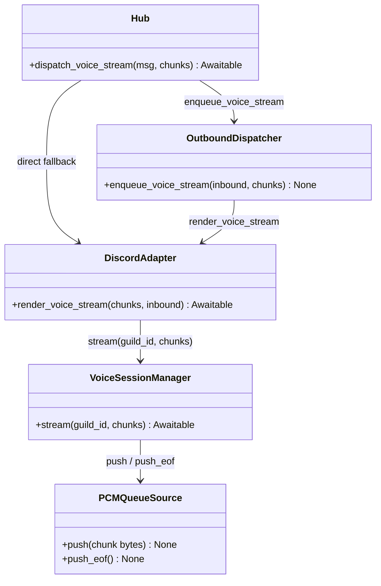
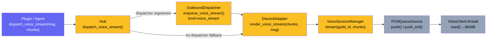

## Context

Slice B of the live audio streaming sub-epic (#185). Parent spec:
[`artifacts/specs/185-live-audio-streaming-spec.mdx`](../specs/185-live-audio-streaming-spec.mdx).

Promoted from [frame](../frames/256-render-voice-stream-dispatch-voice-stream-frame.mdx).
Blocked by #255 (VoiceSessionManager + PCMQueueSource — already merged); adds the missing
Hub→Adapter→VSM streaming path on top.

## Goal

Wire TTS audio chunks from the Hub all the way to a live Discord `VoiceClient`, completing
the `dispatch_voice_stream → render_voice_stream → VSM.stream → PCMQueueSource` call chain.

## Users

- **Primary:** Discord users in voice channels — they receive live-streamed TTS audio from Lyra.
- **Secondary:** Plugin/agent authors — `dispatch_voice_stream` is the stable Hub API they call to produce voice output.

## Out of Scope

- Non-Discord adapters (Telegram, etc.) — voice streaming is Discord-only at this stage.
- Session creation/join — handled by Slice A (#255).
- Concurrent multi-guild simultaneous streaming edge cases beyond VSM per-guild isolation.
- Queuing multiple simultaneous streams to the same guild — a concurrent `dispatch_voice_stream` call to an already-playing guild is logged and dropped.
- Audio format conversion — input is assumed to be 48 kHz stereo 16-bit PCM.
- Error recovery / reconnect logic for dropped voice connections.

## Preconditions

- `discord.py[voice]` and `PyNaCl` are already declared in `pyproject.toml` (satisfied pre-merge of #255). No change needed.

## Expected Behavior

### Streaming flow (happy path)

1. A plugin calls `hub.dispatch_voice_stream(msg, chunks)` with `msg.platform_meta["guild_id"]` set.
2. If an `OutboundDispatcher` is registered for `(platform, bot_id)`, it enqueues a `voice_stream` item (fire-and-forget, mirrors `dispatch_audio_stream`). The `voice_stream` kind is added to the existing `kind in ("audio", "audio_stream", "attachment")` routing/destructuring branch.
3. The dispatcher worker calls `adapter.render_voice_stream(chunks, msg)`.
4. `render_voice_stream` extracts `guild_id = msg.platform_meta["guild_id"]` and calls `VSM.stream(guild_id, chunks)`.
5. `VSM.stream()` retrieves the active `VoiceSession`. If none, logs `WARNING` and returns without raising.
6. If a session is active and already playing (`voice_client.is_playing()` is `True`), logs `WARNING` ("Already streaming to guild {guild_id}") and returns without raising. Concurrent streaming to the same guild is not supported.
7. If a session is active and not playing, starts playback: `voice_client.play(session.source)`.
8. Chunks are drained: each chunk's `.chunk_bytes` are pushed via `source.push()`; when `is_final=True`, `source.push_eof()` is called.
9. After the drain loop exits (whether or not `is_final=True` was seen), `source.push_eof()` is called unconditionally as a safety net. `push_eof()` is idempotent — extra sentinels are harmless.
10. If `session.mode == TRANSIENT`, `VSM.leave(guild_id)` is called automatically. `leave()` internally calls `push_eof()` again; this pushes a second `None` sentinel which is safe per the `PCMQueueSource` idempotency contract.

### No-session guard

`VSM.stream()` called with no active session for `guild_id` → log `WARNING` at `logging.WARNING` level, return `None`. The `render_voice_stream` adapter method also guards for missing/wrong `guild_id` in `platform_meta` separately (see N3 breadboard).

### Fallback (no dispatcher)

`dispatch_voice_stream()` falls back to a direct `adapter.render_voice_stream(chunks, msg)` call when no `OutboundDispatcher` is registered, matching the `dispatch_audio_stream` fallback pattern.

## Data Model & Consumers

| Consumer | Fields consumed | When | Status |
|----------|----------------|------|--------|
| `Hub.dispatch_voice_stream()` | `msg.platform`, `msg.bot_id`, `msg.platform_meta["guild_id"]` | Per stream call | This issue |
| `OutboundDispatcher.enqueue_voice_stream()` | `inbound`, `chunks` iterator | Fire-and-forget enqueue | This issue |
| `DiscordAdapter.render_voice_stream()` | `msg.platform_meta["guild_id"]`, `chunks` | Per stream delivery | This issue |
| `VoiceSessionManager.stream()` | `guild_id`, `chunk.chunk_bytes`, `chunk.is_final` | Drain loop | This issue |
| `PCMQueueSource.push()` / `push_eof()` | `chunk_bytes` bytes, EOF sentinel | Each chunk + final | Already in #255 |

## Breadboard

### N1 — Hub dispatch

| Affordance | Handler | Data |
|------------|---------|------|
| `hub.dispatch_voice_stream(msg, chunks)` | Resolve `(platform, bot_id)` → dispatcher lookup | `msg.platform`, `msg.bot_id` |
| Dispatcher registered | `dispatcher.enqueue_voice_stream(msg, chunks)` (fire-and-forget) | `msg`, `chunks` |
| No dispatcher | `await adapter.render_voice_stream(chunks, msg)` (direct) | `chunks`, `msg` |
| No adapter registered | raise `KeyError` with actionable message | — |

### N2 — OutboundDispatcher extension

| Affordance | Handler | Data |
|------------|---------|------|
| `enqueue_voice_stream(inbound, chunks)` | `_queue.put_nowait(("voice_stream", inbound, chunks))` | `inbound`, `chunks` |
| Worker destructuring | Added to `kind in ("send", "audio", "audio_stream", "attachment", "voice_stream")` branch → `_, msg, payload = item` | 3-tuple, same branch as `audio_stream` |
| Worker routing | Added to `elif kind in ("audio", "audio_stream", "attachment", "voice_stream")` → `_routing = msg.routing` | Same routing branch as `audio_stream` |
| Worker dispatch: `kind == "voice_stream"` | `await self._adapter.render_voice_stream(payload, msg)` (payload=chunks) | Mirrors `audio_stream` → `render_audio_stream(payload, msg)` |
| Circuit open | drain iterator `async for _ in payload: pass`; added to `kind in ("streaming", "audio_stream", "voice_stream")` drain check | generator leak prevention |
| Routing mismatch | drain iterator; added to same drain check | generator leak prevention |

### N3 — DiscordAdapter.render_voice_stream

Signature: `render_voice_stream(chunks: AsyncIterator[OutboundAudioChunk], inbound: InboundMessage) -> None`
(matches `render_audio_stream(chunks, inbound)` convention)

| Affordance | Handler | Data |
|------------|---------|------|
| `render_voice_stream(chunks, inbound)` — non-discord platform | log WARNING; return | `inbound.platform` |
| `render_voice_stream(chunks, inbound)` — `guild_id` missing from `platform_meta` | log WARNING; return | `platform_meta` |
| `render_voice_stream(chunks, inbound)` — session active | `await self._vsm.stream(guild_id, chunks)` | `guild_id`, `chunks` |

### N4 — VoiceSessionManager.stream

| Affordance | Handler | Data |
|------------|---------|------|
| `stream(guild_id, chunks)` | `session = self.get(guild_id)` | `guild_id` |
| No session | log `WARNING` ("No active voice session for guild {guild_id}"); return | — |
| Session active, `is_playing()` True | log `WARNING` ("Already streaming to guild {guild_id}"); return | concurrent guard |
| Session active, not playing | `session.voice_client.play(session.source)` | `VoiceSession.source` |
| Drain loop | `async for chunk in chunks: source.push(chunk.chunk_bytes)` | `OutboundAudioChunk` |
| `chunk.is_final == True` | `source.push_eof()` | — |
| After loop exits (safety net) | `source.push_eof()` unconditionally — idempotent, extra sentinel harmless | EOF guarantee for non-conforming producers |
| `session.mode == TRANSIENT` | `await self.leave(guild_id)` — `leave()` calls `push_eof()` again (second sentinel), safe per idempotency contract | auto-leave |

## Slices

| Slice | Title | Demo |
|-------|-------|------|
| B1 | `VoiceSessionManager.stream()` + `DiscordAdapter.render_voice_stream()` | `pytest`: `render_voice_stream` with active mock session → `VoiceClient.play()` called; no-session path logs WARNING; concurrent-play path logs WARNING and returns |
| B2 | `Hub.dispatch_voice_stream()` + `OutboundDispatcher.enqueue_voice_stream()` | `pytest`: `dispatch_voice_stream()` with registered mock dispatcher → `enqueue_voice_stream` called; fallback path → direct `render_voice_stream` called |
| B3 | `PCMQueueSource` re-framing regression guard | `pytest` (regression): verifies existing #255 implementation — `read()` returns exactly 3840-byte frames for non-aligned input; `is_final=True` triggers EOF + TRANSIENT auto-leave. Tests land in this issue if not already present. |

## Success Criteria

- [ ] `dispatch_voice_stream()` routes through `OutboundDispatcher.enqueue_voice_stream()` when a dispatcher is registered (verified by mock assertion)
- [ ] `dispatch_voice_stream()` falls back to direct `adapter.render_voice_stream(chunks, msg)` when no dispatcher is registered (verified by mock assertion)
- [ ] `render_voice_stream()` with an active session calls `VoiceClient.play()` (verified by mock)
- [ ] `render_voice_stream()` with no active session (VSM returns None) logs a WARNING and returns without raising
- [ ] `render_voice_stream()` with `guild_id` absent from `platform_meta` logs a WARNING and returns without raising
- [ ] `VSM.stream()` with an already-playing `VoiceClient` logs a WARNING and returns without raising (no `ClientException`)
- [ ] `VSM.stream()` drains all chunks via `source.push()` and calls `source.push_eof()` on `is_final=True`
- [ ] `push_eof()` is called unconditionally after the drain loop exits, even when no chunk with `is_final=True` was received
- [ ] `PCMQueueSource.read()` returns exactly 3840-byte frames for non-aligned input: a final partial frame is zero-padded to 3840 bytes and emitted before the EOF sentinel (frame count × 3840 == total bytes enqueued including padding)
- [ ] After a TRANSIENT-mode stream ends (`is_final=True` received), Lyra disconnects automatically via `VSM.leave()`
- [ ] `OutboundDispatcher` drains the `voice_stream` iterator when the circuit is open or routing mismatches (no generator leak)
- [ ] All existing `render_audio_stream()` / `render_audio()` tests pass unmodified
