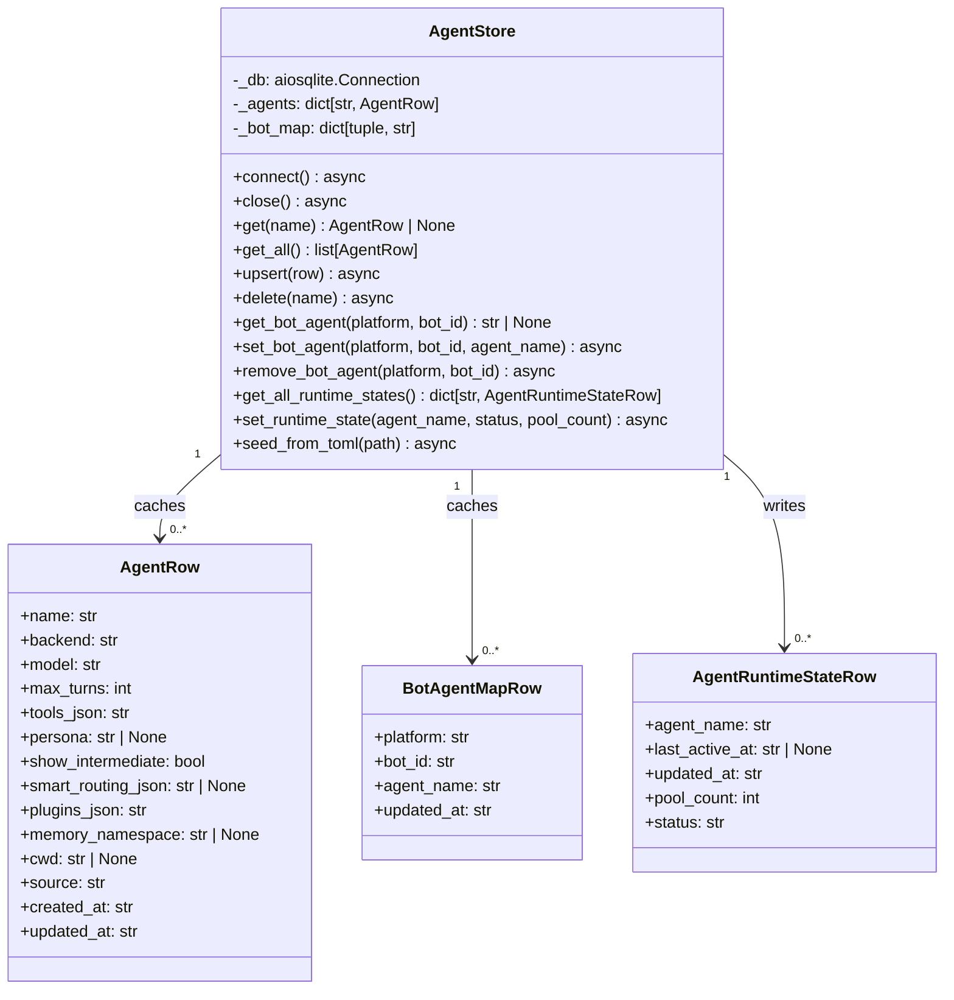
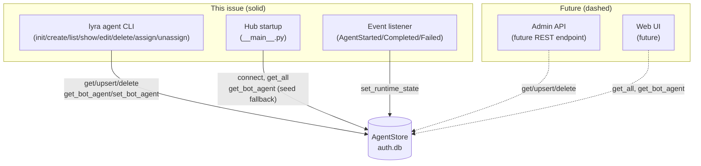

## Context

Promoted from [analysis #268](../analyses/268-agent-store-sqlite-analysis.mdx).
Selected shape: **AgentStore in auth.db** — joins AuthStore, CredentialStore, PrefsStore
under the same aiosqlite + WAL + write-through cache pattern. Three new tables:
`agents`, `bot_agent_map`, `agent_runtime_state`.

## Goal

Operators can create, edit, delete, and reassign agents via `lyra agent` CLI without editing
files or restarting the hub. New conversations pick up changes immediately. Existing TOML
files migrate via `lyra agent init`.

## Users

- **Operators / admins**: manage agents and bot↔agent assignments via CLI
- **Hub (runtime)**: reads agent config on startup from DB cache; `get_agent()` stays sync
- **Pool (runtime)**: unchanged — still calls `ctx.get_agent(name)` as a sync dict lookup

---

## Expected Behavior

### Init path (one-time migration)

Operator runs `lyra agent init` after upgrading. The command scans all TOML files in
`~/.lyra/agents/` and `src/lyra/agents/`, parses each, and inserts them into the `agents`
table with `source='toml-seed'`. Unparseable files are skipped with a warning. Already-present
rows (by `name`) are skipped unless `--force` is passed.

The operator then restarts the hub. On next startup, Hub reads agents from the DB cache
instead of TOML files.

### Hub startup (post-migration)

1. `AgentStore.connect()` opens auth.db, creates tables (idempotent), warms cache.
2. For each `(platform, bot_id)` from config.toml bots:
   - `AgentStore.get_bot_agent(platform, bot_id)` → agent name from cache.
   - No DB row → fall back to `bot_cfg.agent` from TOML and auto-seed `bot_agent_map`.
   - No DB row + no TOML agent field → log error, skip adapter.
   - DB row references agent not in `agents` table → log error, skip adapter.
   - DB row references bot not in config.toml → log warning, skip (do not delete).
3. Unique agent names collected → loaded from AgentStore cache → `Agent` objects created →
   `hub.register_agent(ag)`.
4. `hub.get_agent(name)` remains a sync dict lookup — Pool and Hub are unchanged.

**Machine-local override policy:** config.toml `[agents.<name>]` overrides can contain
machine-specific values (e.g. absolute `cwd` paths that differ between Machine 1 and Machine 2).
These overrides are **not baked into the DB row** at init time — they remain as a thin runtime
overlay applied by `_build_agent_overrides()` at Hub startup, same as today. The DB row stores
the portable base config (imported from TOML files). Machine-local per-machine config.toml
overrides continue to work unchanged.

### CLI commands

**`lyra agent init`** — seeds DB from TOML files. Idempotent (skips existing rows).
Accepts `--force` to overwrite. Prints a summary: N imported, M skipped, K errors.

**`lyra agent create`** — interactive wizard (existing UX preserved). Writes to DB
instead of TOML. Prints the inserted row on completion.

**`lyra agent list`** — reads all rows from `agents` + `bot_agent_map` + `agent_runtime_state`.
Columns: NAME, BACKEND, MODEL, BOT_ASSIGNMENTS, STATUS, SOURCE.

**`lyra agent show <name>`** — prints full config for one agent (all columns, pretty).

**`lyra agent validate <name>`** — validates DB row: backend is a known value, model
non-empty, smart_routing enabled only with anthropic-sdk backend, `tools_json` and
`plugins_json` are valid JSON arrays. Exits 0 = OK, exits 1 with specific error messages
for each failing check.

**`lyra agent edit <name>`** — interactive update. Shows current values, prompts for
each field (blank = keep current). Writes back to DB. Prints diff of changes.

**`lyra agent delete <name>`** — removes agent from DB. Guards: refuses if any bot is
assigned to this agent (`bot_agent_map` FK). Prints confirmation.

**`lyra agent assign <name> --bot <id> --platform <telegram|discord>`** — upserts
`bot_agent_map`. Validates agent exists. Takes effect on next pool creation (in-flight
pools drain naturally).

**`lyra agent unassign --bot <id> --platform <telegram|discord>`** — removes row from
`bot_agent_map`.

### Runtime state

Hub emits `AgentStarted` / `AgentCompleted` / `AgentFailed` events via the EventBus.
A listener (new or extended from existing monitoring) calls
`AgentStore.set_runtime_state(agent_name, status, pool_count)` asynchronously.
`lyra agent list` reads this table to show live status.

---

## Data Model & Consumers

| Consumer | Fields consumed | When | Status |
|----------|-----------------|------|--------|
| Hub startup | `name`, `backend`, `model`, `max_turns`, `tools_json`, `smart_routing_json`, `plugins_json`, `persona`, `memory_namespace`, `cwd`, `show_intermediate` | Startup only | This issue |
| Hub startup (bot map) | `bot_agent_map.agent_name` per `(platform, bot_id)` | Startup only | This issue |
| `lyra agent list` | all `agents` fields + `bot_agent_map` + `agent_runtime_state` | On demand | This issue |
| `lyra agent show` | all `agents` fields | On demand | This issue |
| Event listener | `agent_name`, `status`, `pool_count` → `agent_runtime_state` | Per turn | This issue |
| Admin REST API | all fields | On demand | Future |

---

## Breadboard

### AgentStore (internal API)

| Affordance | Handler | Data in | Data out |
|------------|---------|---------|---------|
| N1 `connect()` | `AgentStore.connect()` | db_path | — (idempotent, warms cache) |
| N2 `get_all()` | cache read | — | `list[AgentRow]` |
| N3 `get(name)` | cache read | name: str | `AgentRow \| None` |
| N4 `upsert(row)` | DB write + cache update | `AgentRow` | — |
| N5 `delete(name)` | DB delete + cache evict | name: str | raises if bot assigned (CLI-level check; no DB FK constraint — consistent with AuthStore pattern) |
| N6 `get_bot_agent(platform, bot_id)` | cache read | platform, bot_id | `str \| None` |
| N7 `set_bot_agent(platform, bot_id, agent_name)` | DB upsert + cache | platform, bot_id, agent_name | — |
| N8 `remove_bot_agent(platform, bot_id)` | DB delete + cache | platform, bot_id | — |
| N9 `get_all_runtime_states()` | direct DB read (not cached) | — | `dict[str, AgentRuntimeStateRow]` |
| N10 `set_runtime_state(agent_name, status, pool_count)` | DB upsert | agent_name, status, pool_count | — |
| N11 `seed_from_toml(path)` | parse TOML → N4 | Path | count: int (inserted) |
| N12 `close()` | close aiosqlite connection | — | — |

### CLI commands (operator-facing)

| Affordance | Handler | Node calls | Output |
|------------|---------|-----------|--------|
| U1 `lyra agent init` | `init_agents()` | N11 for each TOML | summary table |
| U2 `lyra agent create` | `create()` (wizard) | N4 | confirmation + next steps |
| U3 `lyra agent list` | `list_agents()` | N2 + N6 (all bots) + N9 | table: NAME/BACKEND/MODEL/BOTS/STATUS/SOURCE |
| U4 `lyra agent show <name>` | `show()` | N3 | full pretty-printed row |
| U5 `lyra agent validate <name>` | `validate()` | N3 | OK / error lines |
| U6 `lyra agent edit <name>` | `edit()` (interactive) | N3 (read) → N4 (write) | diff of changes |
| U7 `lyra agent delete <name>` | `delete_agent()` | N5 (guards via FK check) | confirmation |
| U8 `lyra agent assign <name> --bot <id> --platform 
` | `assign()` | N7 | confirmation |
| U9 `lyra agent unassign --bot <id> --platform 
` | `unassign()` | N8 | confirmation |

### Hub bootstrap wiring

| Step | Node | Output |
|------|------|--------|
| B1 Parse config.toml | — | `TelegramBotConfig[]`, `DiscordBotConfig[]` |
| B2 `AgentStore.connect()` | N1 | cache warmed |
| B3 Resolve bot↔agent per pair | N6 → fallback N7 | `{(platform,bot_id): agent_name}` |
| B4 Load agent rows from cache | N2 (filtered) | `list[AgentRow]` |
| B5 Create `Agent` objects | `_resolve_agents()` | `dict[str, AgentBase]` |
| B6 `hub.register_agent()` | Hub.agent_registry | — |

---

## Slices

| # | Name | Affordances | Demo | Dependencies |
|---|------|-------------|------|-------------|
| S1 | AgentStore foundation + `init` | N1–N12, U1 | `lyra agent init && sqlite3 ~/.lyra/vault/auth.db "SELECT name,backend FROM agents"` | none |
| S2 | Hub bootstrap from DB | B1–B6 (`__main__.py`) | start hub after init, no TOML needed for agent loading | S1 |
| S3 | CLI read commands | U3, U4, U5 | `lyra agent list` shows DB-backed agents with status | S1 |
| S4 | CLI write commands | U2, U6, U7 | full CRUD lifecycle: create → edit → delete | S1 |
| S5 _(optional cut)_ | Bot assignment + runtime state | U8, U9, N10 + event listener | `lyra agent assign lyra_default --bot aryl --platform telegram` + `lyra agent list` shows ACTIVE | S1, S2 |

> S1–S4 deliver a fully working operator-managed agent store. S5 adds live status and bot
> reassignment CLI; it can slip to a follow-on without breaking S1–S4.

---

## Success Criteria

- [ ] `lyra agent init` imports all valid TOML files from `~/.lyra/agents/` and `src/lyra/agents/` into the `agents` table; unparseable files produce a warning and are skipped without aborting.
- [ ] `lyra agent init` is idempotent: running it twice on an already-seeded DB produces the same state (existing rows are skipped, no duplicates, exit 0).
- [ ] `lyra agent init --force` overwrites existing rows in the `agents` table with values from the TOML files; rows not present in any TOML file are left untouched.
- [ ] Hub startup resolves `(platform, bot_id)` → agent name from the `bot_agent_map` table when a row exists for that pair.
- [ ] Hub startup falls back to `bot_cfg.agent` from config.toml and seeds `bot_agent_map` when no DB row exists for a `(platform, bot_id)` pair; the seeded row is present in the DB on subsequent startups.
- [ ] Hub startup logs an error and skips adapter registration when a `bot_agent_map` row references an agent not present in the `agents` table.
- [ ] `lyra agent create` writes the new agent to the DB and does not create a TOML file.
- [ ] `lyra agent list` reads from DB and displays NAME, BACKEND, MODEL, BOT_ASSIGNMENTS, STATUS, SOURCE columns; STATUS comes from `agent_runtime_state` (shows "idle" when no state row exists).
- [ ] `lyra agent show <name>` prints all config fields for an agent from DB; exits 1 with an error message if the agent does not exist.
- [ ] `lyra agent validate <name>` exits 0 for a valid DB row; exits 1 with specific error messages for: unknown backend, smart_routing enabled with non-sdk backend, malformed JSON in `tools_json` or `plugins_json`, empty model.
- [ ] `lyra agent edit <name>` updates the DB row; leaving a field blank in the interactive prompt keeps the current value.
- [ ] `lyra agent delete <name>` refuses (exits 1 with a clear message) when any `bot_agent_map` row references the agent; succeeds and removes the row when no mapping exists.
- [ ] `lyra agent assign <name> --bot <id> --platform 
` upserts `bot_agent_map`; exits 1 if the agent does not exist in the `agents` table.
- [ ] `lyra agent unassign --bot <id> --platform 
` removes the `bot_agent_map` row; exits 0 (no-op with no error) if the row did not exist.
- [ ] After an agent turn completes, `agent_runtime_state` for that agent reflects the correct `status` and incremented `pool_count`; `lyra agent list` shows the updated STATUS.
- [ ] `hub.get_agent(name)` remains a synchronous dict lookup; no async code is added to Pool or the Pool's `_process_loop`.
- [ ] All three new tables (`agents`, `bot_agent_map`, `agent_runtime_state`) are created idempotently by `AgentStore.connect()` on an existing auth.db without disturbing existing rows in other tables.
- [ ] `AgentStore.close()` is called during hub teardown; subsequent calls to `get()` or `upsert()` after `close()` raise `RuntimeError("call connect() first")` (consistent with AuthStore pattern).
