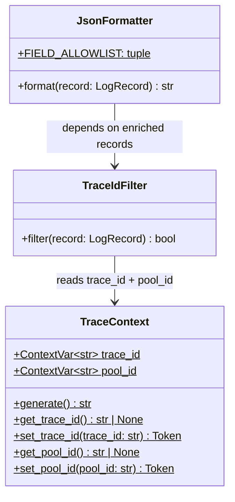
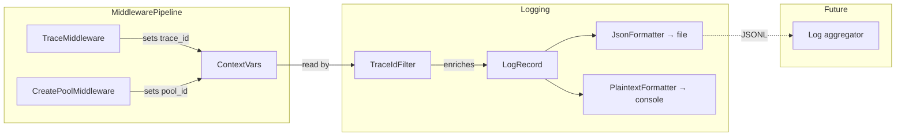

## Context

Promoted from [frame #270](../frames/270-structured-logging-trace-ids-frame.mdx).

Lyra uses plaintext rotating file logs (`%(asctime)s %(levelname)s %(name)s: message`) configured in `src/lyra/__main__.py:_setup_logging()`. The `pool_id` (format: `{platform}:{bot_id}:{scope_type}:{scope_id}`) serves as the only correlation key — it identifies a conversation scope, not a single turn. There is no per-request trace ID.

Log files are written to `~/.local/state/lyra/logs/` with 10 MB rotation × 5 backups. Console output goes to stderr via `StreamHandler`.

**Note:** The issue references `Hub.process()` as the injection point, but that method does not exist. The live inbound path is `Hub.run()` → `build_default_pipeline()` → `MiddlewarePipeline.process()`. This spec targets the middleware pipeline, not the legacy `MessagePipeline` class.

## Goal

Every inbound message turn gets a unique `trace_id` that appears in all log lines for that turn, and log files emit structured JSON (one object per line) while console output stays unchanged.

## Users

- **Primary:** Developer debugging production issues — needs to `grep trace_id=<uuid>` and get exactly one turn's log lines
- **Secondary:** Future log aggregation tooling (Loki, ELK) — needs machine-parseable JSON format

## Expected Behavior

1. An inbound message arrives at `Hub.run()` → `MiddlewarePipeline.process(msg)`.
2. `TraceMiddleware` (Stage 0, first in `build_default_pipeline()` before `ValidatePlatformMiddleware`) generates a `trace_id` (UUID4) and stores it in a `contextvars.ContextVar`. This must happen before any downstream middleware or `pool.submit()` call, so that `asyncio.create_task()` in pool workers inherits the context.
3. `CreatePoolMiddleware` (Stage 4) stores `pool_id` in a second `ContextVar` after resolving the routing key.
4. A `TraceIdFilter` attached to all logging handlers reads both context vars and injects `trace_id` and `pool_id` into every `LogRecord` — no call-site changes needed.
5. The **file handler** uses a `JsonFormatter` that emits an explicit allowlist of fields per line: `{"timestamp", "level", "logger", "message", "trace_id", "pool_id"}`. No `LogRecord.__dict__` dump — avoids noisy internal fields and PII leakage (`pathname`, `threadName`, etc.).
6. The **console handler** keeps the current plaintext format unchanged. `trace_id` does not appear on console — it is file-only.
7. JSON logging is configured via a new `[logging]` section in `config.toml`: `json_file = true` (default). A `LoggingConfig` dataclass is added to `bootstrap/config.py` and passed to `_setup_logging()`, which must use explicit handler construction (not `basicConfig`) to guarantee formatter attachment.
8. When no trace context exists (startup logs, background tasks created before `TraceContext.set()`), `trace_id` and `pool_id` are omitted from JSON output (field absent, not `null`). Note: fire-and-forget tasks created *during* a turn will inherit the caller's trace context — this is acceptable.
9. Logging must never fail if a context var is unset or corrupted — the filter must be defensive.

**Scope boundary:** Log lines emitted in `Hub.run()` outside of `MiddlewarePipeline.process()` (e.g., the main loop itself) will not carry a `trace_id`. This is intentional — only per-turn processing is traced.

## Data Model & Consumers

### Trace Context

### Consumer Map

### Consumer Summary

| Consumer | Fields | When | Status |
|----------|--------|------|--------|
| `JsonFormatter` (file handler) | `trace_id`, `pool_id`, `timestamp`, `level`, `logger`, `message` | Every log line | This issue |
| Plaintext console | unchanged (no `trace_id`) | Every log line | This issue |
| Log aggregator (Loki/ELK) | All JSON fields | Ingestion | Future (#57) |
| Turn store (#67) | `trace_id` as correlation key | Turn persist | Future (#67) |

## Breadboard

### Affordances

| ID | Element | Type |
|----|---------|------|
| U1 | `[logging]` config section + `LoggingConfig` dataclass | Config |
| N1 | `TraceContext` module (two context vars + helpers) | Context var + helpers |
| N2 | `TraceIdFilter` | Logging filter |
| N3 | `JsonFormatter` (allowlist-based) | Logging formatter |
| N4 | `TraceMiddleware` (Stage 0 in `build_default_pipeline`) | Middleware |
| N5 | `pool_id` ContextVar injection in `CreatePoolMiddleware` | Middleware extension |

### Wiring

| From | To | Trigger |
|------|----|---------|
| N4 (`TraceMiddleware`) | N1 (`TraceContext.set_trace_id()`) | Inbound message enters pipeline |
| N5 (`CreatePoolMiddleware`) | N1 (`TraceContext.set_pool_id()`) | Pool resolved (Stage 4) |
| N2 (`TraceIdFilter`) | N1 (`TraceContext.get_*()`) | Any log record emitted |
| `_setup_logging()` | N2 (`TraceIdFilter`) | Startup — attaches filter to all handlers |
| `_setup_logging()` | N3 (`JsonFormatter`) | Startup — attaches to file handler when `json_file = true` |
| U1 (config) | `_setup_logging()` | Startup — `LoggingConfig` selects file formatter |
| N3 (`JsonFormatter`) | Log file | Each log record |

## Slices

| # | Slice | Deliverable | Demo |
|---|-------|-------------|------|
| 1 | Trace context + filter + middleware | `TraceContext` module, `TraceIdFilter`, `TraceMiddleware` (Stage 0), `pool_id` ContextVar in `CreatePoolMiddleware`. Both IDs appear in plaintext file logs via filter. | `grep trace_id= ~/.lyra/logs/*.log` returns correlated lines for one turn |
| 2 | JSON formatter + config | `JsonFormatter` (allowlist), `LoggingConfig` dataclass, `[logging]` TOML section, `_setup_logging()` refactored to explicit handler construction. File handler uses JSON. | Log file contains valid JSONL; console stays unchanged |

## Success Criteria

- [ ] Each inbound turn gets a unique `trace_id` (UUID4), generated in `TraceMiddleware` before any downstream middleware
- [ ] `trace_id` propagates via `contextvars.ContextVar` — no explicit parameter threading
- [ ] `pool_id` propagates via a second `ContextVar`, set in `CreatePoolMiddleware`
- [ ] `trace_id` appears in log lines from: `lyra.core.hub`, `lyra.agents.anthropic_agent`, `lyra.llm.drivers.sdk`, `lyra.core.pool`
- [ ] Log file is valid JSONL (one JSON object per line) when `json_file = true`
- [ ] JSON records emit an explicit allowlist: `timestamp`, `level`, `logger`, `message`, `trace_id` (when set), `pool_id` (when set) — no full `LogRecord.__dict__` dump
- [ ] Console output is identical to current plaintext format (no `trace_id` appended)
- [ ] `jq -r '.trace_id' < logfile.log | sort -u` for lines matching a single turn returns exactly one UUID
- [ ] Existing log rotation config (10 MB × 5 backups) is unchanged
- [ ] No existing `log.info()`/`log.warning()`/`log.error()`/`log.debug()` call sites in the 4 named modules are modified
- [ ] Logging never fails when context vars are unset — filter is defensive, fields are simply absent
- [ ] `Hub.run()` loop-level logs (outside pipeline processing) correctly omit `trace_id`
