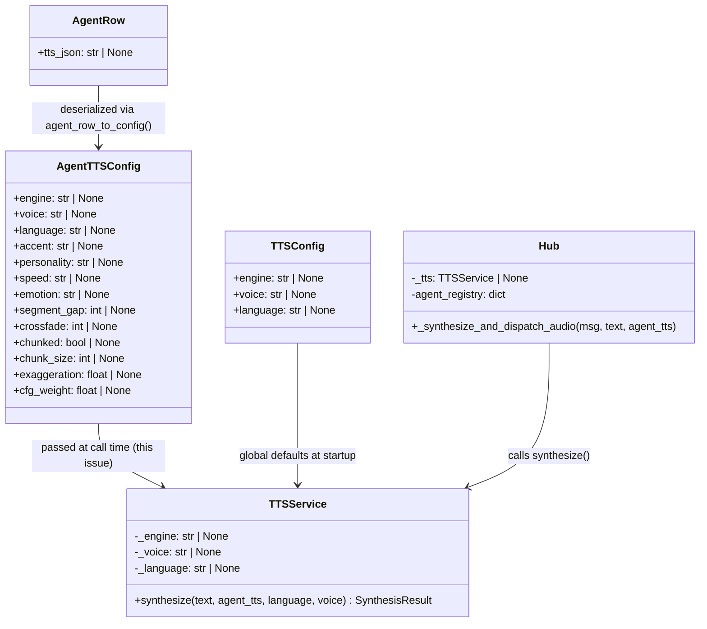
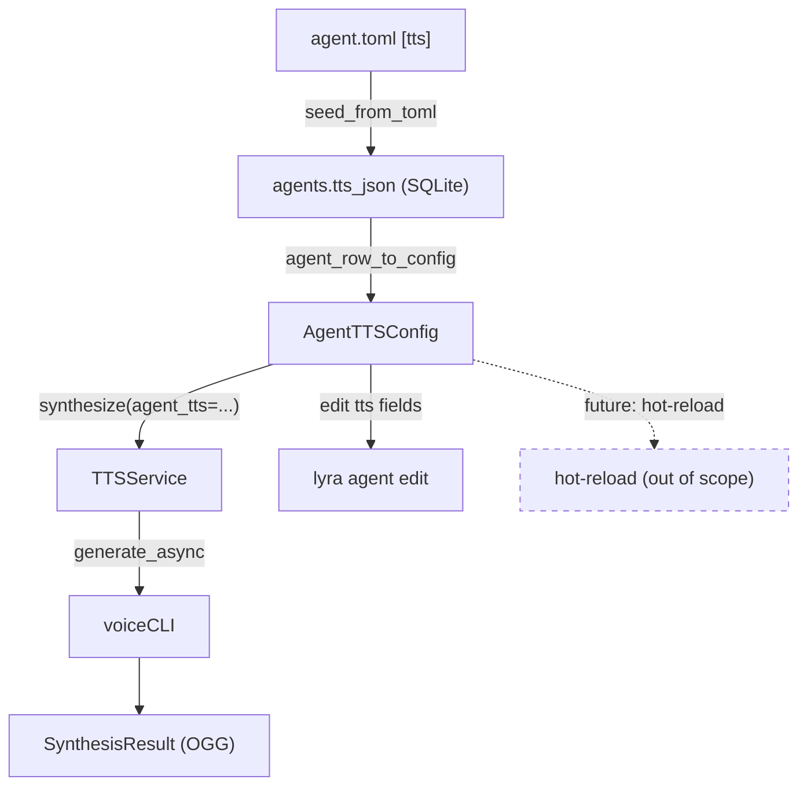

## Context

Per-agent TTS configuration is currently inoperative. `TTSService` is a single global
instance built at startup from the first agent's `[tts]` config (alphabetically). All
other agents' TTS settings are silently ignored. The full data model already exists
(`AgentTTSConfig`, `tts_json` DB column, TOML parsing) — the gap is at the call site:
nothing threads the per-agent config into `TTSService.synthesize()` at request time.

Source: [frame](../frames/280-per-agent-tts-config-frame.mdx)

---

## Goal

Each agent synthesizes voice using its own `[tts]` config. A global fallback (env vars)
applies when no per-agent config is set. The hub looks up the agent's TTS config at
synthesis time via the existing `resolve_binding(msg)` → `agent_registry` path.

---

## Users

- **Primary:** Mickael — configures distinct voice identities per agent via TOML or
  `lyra agent edit`.
- **Secondary:** End users on Telegram/Discord — hear the per-agent voice directly.

---

## Out of Scope

- Hot-reload of TTS config at runtime (without restart).
- Platform-specific TTS routing (Telegram vs. Discord get the same per-agent config).
- New TTS engine integrations beyond what voiceCLI already supports.
- Web or GUI interface for editing agent TTS config.
- Bulk migration / validation tooling for existing TOML files.
- `AgentTTSConfig` field value-range validation (delegated to voiceCLI downstream).
- DB schema migration (only additive field additions to `AgentTTSConfig` dataclass;
  existing `tts_json` rows without the new fields deserialize safely via `dict.get()`).

---

## Expected Behavior

### Startup

`TTSService` is built from env-var defaults only (`load_tts_config()`). No per-agent
overlay at startup. The "first agent alphabetically" logic and the multi-agent `[tts]`
warning are removed from `__main__.py`. The startup log line is updated to reflect that
engine/voice are global defaults, not agent-specific.

### Per-request synthesis — `dispatch_response()` path (voice modality)

When the hub enters `_synthesize_and_dispatch_audio(msg, text)`:

1. Hub calls `resolve_binding(msg)` → `Binding.agent_name` (uses full
   `RoutingKey(platform, bot_id, scope_id)` with wildcard fallback — existing logic).
2. Hub looks up `agent = self.agent_registry[agent_name]` → `agent.config.tts:
   AgentTTSConfig | None`.
3. Hub calls `self._tts.synthesize(text, agent_tts=agent_tts, language=lang, voice=voice)`.
4. `TTSService.synthesize()` merges (priority high→low):
   - User pref override for `language` and `voice` (sentinel-based, unchanged).
   - `agent_tts` fields for all remaining parameters.
   - `self._engine / self._voice / self._language` global env-var defaults.
5. All non-None merged fields are forwarded to `generate_async`. Audio returned and
   dispatched as before.

### Per-request synthesis — `dispatch_streaming()` path (voice modality)

`dispatch_streaming()` with `msg.modality == "voice"` accumulates the full stream and
delegates to `dispatch_response()` (existing behavior, line 585 of hub.py). The
`dispatch_response()` path above therefore covers both. No separate code path needed.

### New fields in `AgentTTSConfig`

`exaggeration: float | None` and `cfg_weight: float | None` are added. They are parsed
from TOML, serialized to `tts_json`, deserialized on load, and forwarded to
`generate_async` when non-None.

Note on `chunked`: the current `synthesize()` hardcodes `chunked=True` to avoid Qwen
model crashes on large inputs. This hardcode is preserved — `AgentTTSConfig.chunked`
is stored in the DB but **not** forwarded to `generate_async` as a per-agent override.
`chunk_size` is forwarded (it is safe to vary per agent).

### `lyra agent edit` — TTS sub-section

`lyra agent edit <name>` gains an optional TTS editing step after the existing scalar
fields loop:

- If `row.tts_json` is non-null: display current fields, prompt for new values (blank =
  keep). Serialize updated dict back to `tts_json`.
- If `row.tts_json` is null: offer "Initialize TTS config for this agent? [y/N]". If
  yes, prompt all fields from scratch (blank = skip field, leave None). If no, skip TTS
  editing entirely.
- Fields: `engine`, `voice`, `language`, `accent`, `personality`, `speed`, `emotion`,
  `exaggeration` (float), `cfg_weight` (float).
- `exaggeration` and `cfg_weight` are coerced to `float` (same pattern as `max_turns` →
  `int`); invalid input re-prompts or aborts with a clear error.

---

## Data Model & Consumers

### Core types

### Consumer map

### Consumer summary

| Consumer | Fields consumed | When | Status |
|----------|----------------|------|--------|
| `TTSService.synthesize()` | All except `chunked` | Per voice response | This issue |
| `lyra agent edit` | engine, voice, language, accent, personality, speed, emotion, exaggeration, cfg_weight | CLI editing | This issue |
| `apply_agent_tts_overlay()` | engine, voice, language | Startup (removed) | Deleted |
| Hot-reload | All fields | Runtime config change | Future (out of scope) |

---

## Breadboard

### N1 — `TTSService.synthesize()` — signature change

**Current:** `synthesize(text, *, language=None, voice=None) → SynthesisResult`

**New:** `synthesize(text, *, agent_tts=None, language=None, voice=None) → SynthesisResult`

| Element | Handler | Data |
|---------|---------|------|
| Merge language | user pref (`language`) > `agent_tts.language` > `self._language` | `str \| None` |
| Merge voice | user pref (`voice`) > `agent_tts.voice` > `self._voice` | `str \| None` |
| Merge engine | `agent_tts.engine` > `self._engine` (no user-pref layer) | `str \| None` |
| Forward to `generate_async` | All non-None: `engine`, `voice`, `language`, `accent`, `personality`, `speed`, `emotion`, `exaggeration`, `cfg_weight`, `segment_gap`, `crossfade`, `chunk_size` | From merged config |
| `chunked` | Always `True` (hardcoded, not overridable — safety) | `bool` |

### N2 — Hub dispatch → per-agent TTS resolution

| Element | Handler | Data |
|---------|---------|------|
| `dispatch_response(msg, response)` | Call `resolve_binding(msg)` → `Binding.agent_name` (full `RoutingKey` with scope, wildcard fallback) | `InboundMessage` |
| Agent config lookup | `self.agent_registry[agent_name].config.tts` → `AgentTTSConfig \| None` | `agent_name: str` |
| `_synthesize_and_dispatch_audio(msg, text, agent_tts)` | Pass `agent_tts` to `synthesize()` | `AgentTTSConfig \| None` |
| `dispatch_streaming()` voice path | Accumulates stream → delegates to `dispatch_response()` (existing) — no separate changes needed | — |

### N3 — `lyra agent edit` TTS sub-section

| Element | Handler | Data |
|---------|---------|------|
| Detect existing TTS | `row.tts_json is not None` | `AgentRow` |
| No TTS config → offer init | Prompt "Initialize TTS config? [y/N]" | User input |
| TTS field loop | Prompt each field (blank=keep / skip), coerce floats | Current `tts_json` dict |
| Persist | `dataclasses.replace(row, tts_json=json.dumps(new_tts))` + `store.upsert()` | Updated `AgentRow` |

---

## Slices

| # | Slice | Scope | Demo |
|---|-------|-------|------|
| S1 | Add `exaggeration`/`cfg_weight` + extend `synthesize()` | `agent.py`, `tts/__init__.py`, `agent_row_to_config()` | Call `synthesize(text, agent_tts=cfg)` with a full `AgentTTSConfig`; confirm all fields forwarded to `generate_async` via logs |
| S2 | Wire per-agent config through hub; remove startup logic | `hub.py`, `__main__.py` | Two agents with different `[tts].voice` → each responds in its own voice; startup log updated |
| S3 | `lyra agent edit` TTS support | `cli_agent.py` | `lyra agent edit lyra` → edit `voice`/`personality`; verify `tts_json` updated in DB via `lyra agent show` |

---

## Success Criteria

- [ ] `AgentTTSConfig` has `exaggeration: float | None` and `cfg_weight: float | None` fields.
- [ ] `agent_row_to_config()` deserializes `exaggeration` and `cfg_weight` from `tts_json` without error.
- [ ] TOML `[tts]` parsing accepts `exaggeration` and `cfg_weight` as floats without error.
- [ ] `TTSService.synthesize()` new signature is `synthesize(text, *, agent_tts=None, language=None, voice=None)`.
- [ ] When `agent_tts` is provided, all non-None fields — `engine`, `voice`, `language`, `accent`, `personality`, `speed`, `emotion`, `exaggeration`, `cfg_weight`, `segment_gap`, `crossfade`, `chunk_size` — are forwarded to `generate_async`.
- [ ] `chunked` is NOT forwarded from `AgentTTSConfig`; the `chunked=True` hardcode in `synthesize()` is preserved.
- [ ] Merge order is respected: user pref overrides `agent_tts` for `language` and `voice`; `agent_tts` fields override `self._` defaults for all other fields.
- [ ] `agent_tts.engine` overrides `self._engine`; no user-pref layer for `engine`.
- [ ] `Hub._synthesize_and_dispatch_audio()` resolves `agent_name` via `resolve_binding(msg)` (full `RoutingKey`) → `agent_registry` → `agent.config.tts`.
- [ ] `Hub._synthesize_and_dispatch_audio()` accepts `agent_tts: AgentTTSConfig | None` and passes it to `synthesize()`.
- [ ] `Hub.dispatch_response()` calls `resolve_binding(msg)` to get `agent_name` and passes `agent.config.tts` to `_synthesize_and_dispatch_audio()`.
- [ ] The "first agent alphabetically" startup logic is removed from `__main__.py`.
- [ ] The multi-agent `[tts]` startup warning is removed.
- [ ] `apply_agent_tts_overlay()` is no longer called at startup (may be deleted).
- [ ] The TTS startup log line is updated to reflect global defaults (not per-agent config).
- [ ] Two agents with different `[tts].voice` values each synthesize with their own voice — verifiable via debug logs.
- [ ] `lyra agent edit <name>` prompts for TTS fields when `tts_json` is non-null.
- [ ] `lyra agent edit <name>` offers "Initialize TTS config?" when `tts_json` is null; accepting creates a fresh TTS section.
- [ ] `lyra agent edit` correctly coerces `exaggeration` and `cfg_weight` as `float` in `tts_json`.
- [ ] Agent without `[tts]` section continues to use global env-var defaults — no regression.
- [ ] Existing tests pass without modification (global fallback path unchanged).
