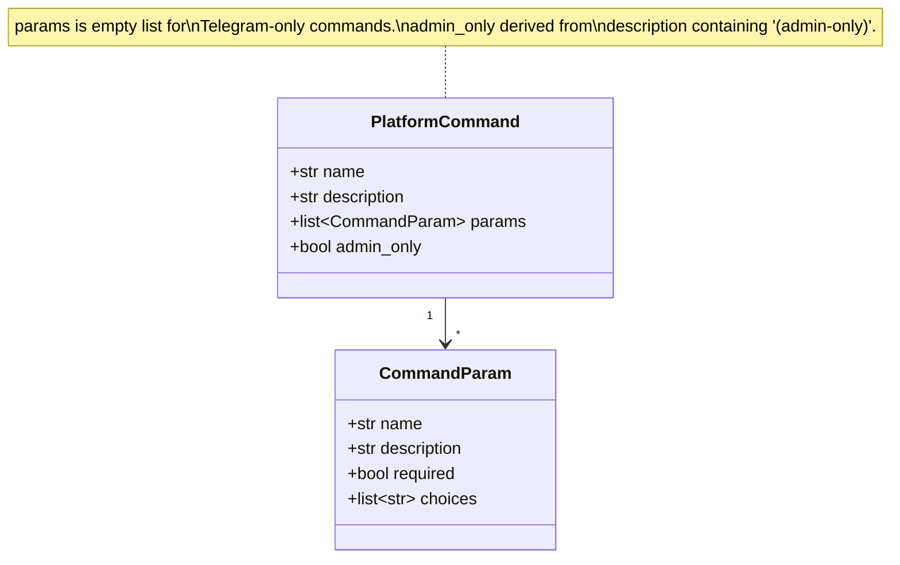
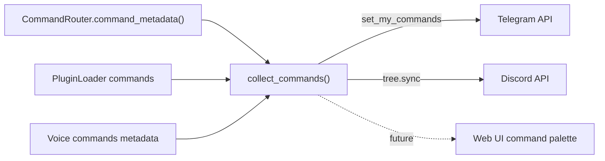

## Context

Promoted from [frame #291](../frames/291-native-platform-commands-frame.mdx). Lyra currently handles all commands via application-level text parsing (`CommandParser` + `CommandRouter`). Neither adapter registers commands with its platform's native API, so users see no autocomplete menu and must guess available commands.

The routing layer stays unchanged — this is a cosmetic/UX registration layer on top of the existing command dispatch.

## Goal

Register Lyra's commands with each platform's native command menu so users get autocomplete, descriptions, and (on Discord) typed parameters — without changing the existing command routing architecture.

## Users

- **Primary:** End users on Telegram and Discord who interact with Lyra via commands.
- **Secondary:** Developers adding new commands — `CommandRouter.command_metadata()` is the single source of truth for command listings.

## Expected Behavior

### Telegram

1. User opens chat with Lyra bot, types `/` in the input field.
2. Telegram shows a native menu listing all public (non-admin) commands with descriptions (e.g. `/help — List available commands`, `/voice — Generate speech`).
3. User taps a command → it's inserted into the input field. User adds arguments and sends.
4. Routing is unchanged — `CommandRouter` handles dispatch as before.

Registration happens via `lyra setup commands` CLI subcommand, NOT at every startup. It resolves each bot's token from `CredentialStore`, constructs a transient `aiogram.Bot`, calls `set_my_commands()`, and exits. The call is idempotent — safe to re-run. Re-running after adding/removing commands updates the menu.

### Discord

1. User types `/` in a channel where Lyra is present.
2. Discord shows native slash commands: `/join`, `/leave` with descriptions and typed parameters (e.g. `/join mode:stay`).
3. User selects a command → Discord validates parameters client-side → sends an Interaction.
4. Adapter handles the Interaction, delegates to existing voice command logic.
5. Text-prefix fallback (`!join`, `!leave`) continues to work for backward compatibility.

Registration happens at bot connect via `tree.sync(guild=...)` in `on_ready()`. Guild-scoped sync is used (instant propagation) rather than global sync (up to 1 hour delay). Discord deduplicates identical command trees server-side, so reconnects are safe.

If `tree.sync()` fails (network error, missing scope), the adapter logs a warning and continues — the bot remains usable with text-prefix commands only.

## Constraints

- **Multi-bot:** Lyra supports N bots per platform. `lyra setup commands` iterates all configured Telegram bots and calls `set_my_commands()` per-bot-token. Each bot may have different enabled plugins, so the command list is per-bot.
- **No runtime router at CLI time:** `lyra setup commands` runs outside the server process. It reads command metadata from `CommandRouter._DEFAULT_BUILTINS` (class attribute, no instance needed) + `PluginLoader` (constructed from agent TOML config). Session commands are excluded (they are registered at runtime per-agent and not meaningful in the native menu).
- **Discord: guild-scoped sync** to avoid 1-hour global propagation delay. The bot's guild list is available in `on_ready()`.
- **No new dependencies** — aiogram 3.26+ and discord.py 2.x already support these APIs.

## Out of Scope

- Telegram inline mode, Discord modals, ReplyKeyboardMarkup
- Dynamic command reload without restart
- Session commands in native menus (per-agent, runtime-only)
- Registering all Lyra commands as Discord app_commands (only voice commands for now — text routing handles the rest)

## Data Model & Consumers

| Consumer | Fields | When | Status |
|----------|--------|------|--------|
| Telegram `set_my_commands()` | name, description (admin_only excluded) | CLI `lyra setup commands` | This issue |
| Discord `tree.sync()` | name, description, params, choices | `on_ready()` at every connect | This issue |
| `/help` builtin | name, description | Runtime (already works via CommandRouter) | Existing |
| Web UI command palette | name, description, params | Future | Future |

## Breadboard

### Shared Registry

| Affordance | Handler | Data |
|------------|---------|------|
| `CommandRouter.command_metadata()` | New public method on `CommandRouter` | Returns `list[tuple[str, str, bool]]` — (name, description, admin_only) from `_builtins` + plugins. No private attr access needed by external code. |
| `collect_commands()` | `command_registry.py` | Calls `router.command_metadata()` + voice command metadata → returns `list[PlatformCommand]` |

### Telegram Registration

| Affordance | Handler | Data |
|------------|---------|------|
| `lyra setup commands` CLI | New Typer subcommand in `cli.py` | For each Telegram bot: load agent config → build `PluginLoader` → `collect_commands()` → filter `admin_only=False` → construct `BotCommand` list → `Bot(token).set_my_commands()` → close. Token from `CredentialStore`. |

### Discord Registration

| Affordance | Handler | Data |
|------------|---------|------|
| `CommandTree` setup | `DiscordAdapter.__init__()` | `self.tree = discord.app_commands.CommandTree(self)` — must be in `__init__`, not `on_ready` |
| `/join [mode]` slash command | `discord_voice_commands.py` — registered on tree | Interaction → extract `mode` param → delegate to `handle_join_command()` |
| `/leave` slash command | `discord_voice_commands.py` — registered on tree | Interaction → delegate to `handle_leave_command()` |
| `!join` / `!leave` text fallback | Existing `handle_voice_command()` | Unchanged — backward compat |
| `on_ready()` tree sync | `discord.py:on_ready()` | `await self.tree.sync(guild=g)` for each guild, wrapped in try/except |

## Slices

| # | Slice | Scope | Demo |
|---|-------|-------|------|
| 1 | Shared command registry | New public `CommandRouter.command_metadata()` method. New `command_registry.py` with `PlatformCommand` dataclass + `collect_commands()` reading from `command_metadata()` + voice command constants. Voice commands declared as module-level metadata in `discord_voice_commands.py`, not hardcoded in registry. | Unit test: `collect_commands()` returns all builtins + plugins + voice commands with correct names, descriptions, and admin_only flags |
| 2 | Telegram `set_my_commands()` | New `lyra setup commands` CLI subcommand. Per-bot token resolution from `CredentialStore`. Constructs transient `Bot`, calls `set_my_commands(commands)` with non-admin commands, logs result count. | Run `lyra setup commands` → "Registered N commands for bot @botname". Type `/` in Telegram → see menu. |
| 3 | Discord `app_commands` for voice | Add `CommandTree` to `DiscordAdapter.__init__`. Register `/join` (with optional `mode` choice param) + `/leave` as `@tree.command()`. Guild-scoped `tree.sync()` in `on_ready()` with error handling. Keep `!` text fallback. | Type `/` in Discord → see `/join`, `/leave` with typed params. `!join` still works. |

## Success Criteria

- [ ] `CommandRouter.command_metadata()` returns all builtins + plugin commands with name, description, and admin_only flag
- [ ] `collect_commands()` returns `PlatformCommand` list including builtins, plugin commands, and voice commands
- [ ] Admin commands (`/circuit`, `/routing`, `/config`) are marked `admin_only=True` and excluded from Telegram menu
- [ ] Plugin commands with descriptions appear in the Telegram menu
- [ ] Typing `/` in Telegram shows a native command menu with all public commands and descriptions
- [ ] `lyra setup commands` resolves per-bot tokens, calls `set_my_commands()`, and prints confirmation
- [ ] Re-running `lyra setup commands` after adding/removing commands updates the Telegram menu
- [ ] Re-running with identical commands is a no-op (idempotent, no error)
- [ ] Typing `/` in Discord shows native slash commands `/join` and `/leave`
- [ ] Discord `/join` works with optional `mode` parameter (choices: `transient`, `stay`)
- [ ] Discord `/leave` works and disconnects from voice
- [ ] `!join` and `!leave` text commands still work (backward compatibility)
- [ ] `tree.sync()` failure in `on_ready()` logs a warning but does not crash the adapter
- [ ] Existing `CommandRouter` dispatch is unchanged — no regression on text command routing
- [ ] No new external dependencies added

## Edge Cases

| Scenario | Handling |
|----------|----------|
| `lyra setup commands` with no Telegram bots configured | Print "No Telegram bots configured." and exit 0 |
| Bot token missing from CredentialStore | Log error per-bot, continue with next bot, exit 1 if any failed |
| Discord `tree.sync()` fails (network, missing scope) | Log warning, adapter continues with text-prefix commands only |
| Discord bot reconnects frequently | Guild-scoped sync is safe — Discord deduplicates identical trees |
| Plugin added after Telegram registration | Menu is stale until `lyra setup commands` is re-run (documented behavior) |
| Multi-bot: different agents with different plugins | `collect_commands()` takes enabled_plugins as param — per-bot command list |
| `/folder` and `/cd` in Telegram menu | Included as public commands (they check admin internally, but are useful for all users with access) |
