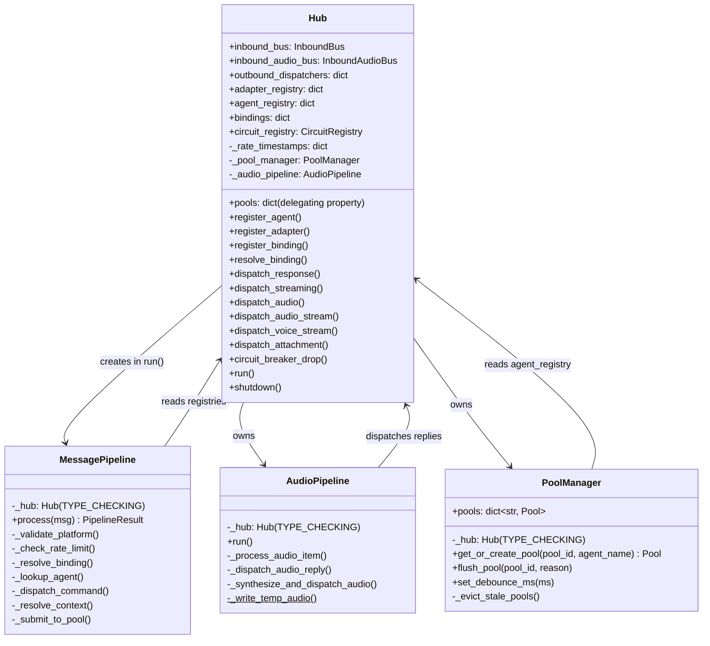
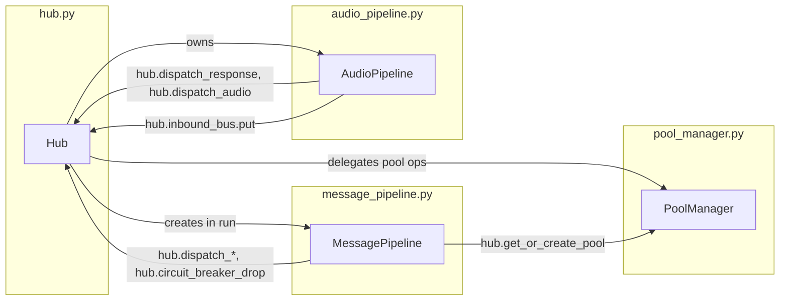

## Context

`core/hub.py` is 1,367 lines mixing 5+ concerns. This spec defines the extraction of three cohesive classes into their own modules, slimming Hub to a registry + coordinator. Child of #293.

## Goal

Reduce `hub.py` to ≤300 LOC by extracting `MessagePipeline`, `AudioPipeline`, and `PoolManager` into dedicated modules, with zero behavior change.

## Users

- **Primary:** Lyra developers — smaller files are easier to navigate, test, and review
- **Secondary:** CI — focused test files per concern

## Expected Behavior

After refactoring:

1. `core/message_pipeline.py` — contains `MessagePipeline`, `Action`, `PipelineResult`, `_DROP` sentinel, and the `_command_parser` module-level singleton (moved from `hub.py`). `MessagePipeline.__init__` takes a `Hub` reference (same pattern as today). Uses `TYPE_CHECKING` guard for the `Hub` type annotation to avoid circular imports. No public API change.

2. `core/audio_pipeline.py` — contains `AudioPipeline` class wrapping `_audio_loop`, `_process_audio_item`, `_dispatch_audio_reply`, `_synthesize_and_dispatch_audio`, `_write_temp_audio` (static method). Constructor takes a `Hub` reference (same pattern as `MessagePipeline`). Uses `TYPE_CHECKING` guard for the `Hub` type annotation. Hub creates an `AudioPipeline` instance in `__init__` and calls `audio_pipeline.run()` instead of `self._audio_loop()`.

3. `core/pool_manager.py` — contains `PoolManager` class wrapping `get_or_create_pool`, `_evict_stale_pools`, `flush_pool`, `set_debounce_ms`. Constructor takes a `Hub` reference (same pattern). Uses `TYPE_CHECKING` guard. Hub delegates pool operations through `self._pool_manager`. `Hub.pools` remains as a delegating property (`return self._pool_manager.pools`) so external code accessing `hub.pools` continues to work unchanged.

4. `hub.py` retains: `ChannelAdapter` protocol, `RoutingKey`, `Binding`, `Hub` class with registration methods, binding resolution, dispatch methods, rate limiting (`_is_rate_limited`, `_is_rate_limited_by_key`), circuit breaker (`circuit_breaker_drop` — promoted from `_circuit_breaker_drop` to public since `MessagePipeline` calls it cross-module), `_dispatch_pipeline_result`, `run()`, `shutdown()`, and the `_mime_to_ext` helper.

5. All imports across the codebase continue to work — `core/__init__.py` re-exports everything from the new locations. `hub.py` also re-exports `MessagePipeline`, `Action`, `PipelineResult` for backward compat with direct `from lyra.core.hub import ...` imports.

### Circular Import Strategy

All three child modules use `TYPE_CHECKING` guard for the `Hub` type annotation:

```python
from __future__ import annotations
from typing import TYPE_CHECKING
if TYPE_CHECKING:
    from .hub import Hub
```

At runtime, `Hub` is never imported by child modules — they receive it via `__init__(self, hub)`. `hub.py` imports the child classes at module level (no circularity since children don't import Hub at runtime).

## Out of Scope

- New features or behavior changes
- Refactoring rate limiting out of Hub (too tightly coupled)
- Refactoring OutboundDispatcher or other modules
- Performance optimizations
- Introducing abstract protocols for Hub (unnecessary complexity for this refactoring)

## Data Model & Consumers





| Consumer | Fields/Methods Used | When | Status |
|----------|-------------------|------|--------|
| `MessagePipeline` | `hub.agent_registry`, `hub.resolve_binding`, `hub.get_or_create_pool`, `hub.dispatch_response`, `hub.circuit_breaker_drop`, `hub._is_rate_limited` | Every inbound text message | This issue |
| `AudioPipeline` | `hub._stt`, `hub._tts`, `hub.dispatch_response`, `hub.dispatch_audio`, `hub.inbound_bus`, `hub._is_rate_limited_by_key`, `hub._msg_manager`, `hub._prefs_store` | Every inbound audio | This issue |
| `PoolManager` | `hub.agent_registry`, `hub._turn_store`, `hub._memory_tasks`, `hub._debounce_ms`, `hub._pool_ttl` | Pool creation, eviction, flush | This issue |
| `Hub.run()` | `MessagePipeline.process()`, `Hub._dispatch_pipeline_result()` | Main loop | This issue |
| `Hub.shutdown()` | `self._pool_manager.pools`, flush via `_pool_manager` | Shutdown | This issue |
| External (adapters, bootstrap) | `Hub.*` public API unchanged, `hub.pools` delegating property | Registration, dispatch | Unchanged |

## Breadboard

| ID | Affordance | Handler | Data |
|----|-----------|---------|------|
| S1 | `MessagePipeline.process()` | Routes msg through guard stages (validate, rate limit, bind, command, pool submit) | `InboundMessage → PipelineResult` |
| S2 | `AudioPipeline.run()` | Drains audio bus, transcribes via STT, dispatches transcript echo, synthesizes TTS reply via `hub.dispatch_audio`, re-enqueues as text on inbound bus | `InboundAudio → InboundMessage + OutboundAudio` |
| S3 | `PoolManager.get_or_create_pool()` | Creates/retrieves pools, evicts stale, wires turn_store | `pool_id → Pool` |
| S4 | `PoolManager.flush_pool()` | Explicit disconnect flush, delegates to agent.flush_session | `pool_id → None` |
| S5 | `Hub.run()` | Creates MessagePipeline, delegates to S1, dispatches results | Main loop |
| S6 | `Hub.shutdown()` | Delegates pool flush to PoolManager, drains memory tasks | Cleanup |

## Slices

| # | Slice | Affordances | Demo |
|---|-------|-------------|------|
| 1 | Extract `MessagePipeline` to `core/message_pipeline.py` | S1 | `uv run pytest tests/core/test_message_pipeline.py` passes (existing test file) |
| 2 | Extract `AudioPipeline` to `core/audio_pipeline.py` | S2 | `uv run pytest tests/core/test_hub_audio_loop.py` passes (existing test file) |
| 3 | Extract `PoolManager` to `core/pool_manager.py` | S3, S4 | `uv run pytest tests/core/test_hub.py` passes (existing test file) |
| 4 | Slim Hub + update imports + re-exports | S5, S6 | Full `uv run pytest` + `uv run ruff check .` + `uv run pyright` clean |

## Success Criteria

- [ ] `core/message_pipeline.py` exists with `MessagePipeline`, `Action`, `PipelineResult`, `_DROP`
- [ ] `core/audio_pipeline.py` exists with `AudioPipeline` class
- [ ] `core/pool_manager.py` exists with `PoolManager` class
- [ ] `core/hub.py` ≤ 300 lines (currently 1,367)
- [ ] `hub.pools` delegating property preserves external access
- [ ] `_circuit_breaker_drop` promoted to `circuit_breaker_drop` (public)
- [ ] `_command_parser` singleton moved to `message_pipeline.py`
- [ ] `core/__init__.py` re-exports all public names from new modules
- [ ] All external imports (`from lyra.core.hub import ...`) continue to work via re-exports
- [ ] `uv run pytest` — all tests pass, zero failures
- [ ] `uv run ruff check .` — clean, no violations
- [ ] `uv run pyright` — no new type errors
- [ ] No behavior changes — pure refactoring, identical runtime behavior
