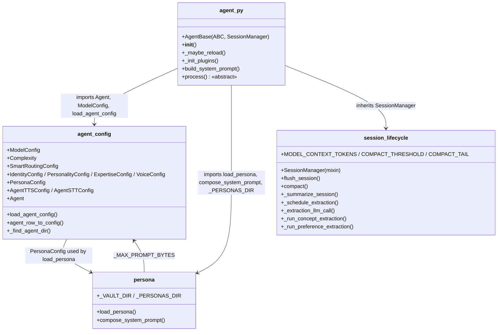
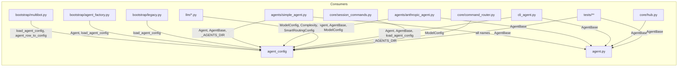

## Context

`core/agent.py` is 1,218 lines mixing four concerns. Frame approved 2026-03-16. Parent: #293.

## Goal

Split `core/agent.py` into four focused modules so each concern is independently navigable, reviewable, and testable — without changing any runtime behavior.

## Users

- **Primary:** Developers working on agent internals — faster navigation, smaller diffs
- **Secondary:** Reviewers — focused PRs on single-concern modules

## Expected Behavior

After this refactor:

1. `from lyra.core.agent import Agent, AgentBase, load_agent_config, ...` continues to work via re-exports — zero import breakage
2. Each new module owns a single concern:
   - `agent_config.py` — all dataclasses (`ModelConfig`, `Complexity`, `SmartRoutingConfig`, `IdentityConfig`, `PersonalityConfig`, `ExpertiseConfig`, `VoiceConfig`, `PersonaConfig`, `AgentTTSConfig`, `AgentSTTConfig`, `Agent`) + loaders (`_find_agent_dir`, `load_agent_config`, `agent_row_to_config`) + module-level constants (`_VALID_BACKENDS`, `_MAX_PROMPT_BYTES`, `_USER_AGENTS_DIR`, `_SYSTEM_AGENTS_DIR`, `_AGENTS_DIR`, `AGENTS_DIR`, `_WORKSPACE_BUILTIN_CONFLICTS`)
   - `persona.py` — `_VAULT_DIR`, `_PERSONAS_DIR`, `load_persona`, `compose_system_prompt`
   - `session_lifecycle.py` — `SessionManager` mixin owning `flush_session`, `_summarize_session`, `compact`, `_schedule_extraction`, `_extraction_llm_call`, `_run_concept_extraction`, `_run_preference_extraction` + compaction constants (`MODEL_CONTEXT_TOKENS`, `COMPACT_THRESHOLD`, `COMPACT_TAIL`). The mixin declares typed attribute stubs (`_memory: MemoryManager | None = None`, `_task_registry: set | None = None`, `_compact_context_tokens: int = MODEL_CONTEXT_TOKENS`) so pyright can verify method bodies without requiring `AgentBase` context
   - `agent.py` — slimmed `AgentBase` (~300 LOC): `__init__`, plugin management, hot-reload, `build_system_prompt`, `_ensure_system_prompt`, `_handle_voice_command`, `process` (abstract), `is_backend_alive`, `reset_backend`, `_PLUGINS_DIR` (used only by `AgentBase`)
3. `core/__init__.py` still exports `Agent` and `AgentBase` — public API unchanged

## Data Model & Consumers

| Consumer | Imports | From module |
|----------|---------|-------------|
| `bootstrap/multibot.py` | `load_agent_config`, `agent_row_to_config`, `Agent` | `agent_config` |
| `bootstrap/agent_factory.py` | `Agent`, `load_agent_config`, `AgentBase` | `agent_config` + `agent` |
| `bootstrap/legacy.py` | `load_agent_config` | `agent_config` |
| `agents/simple_agent.py` | `Agent`, `AgentBase`, `_AGENTS_DIR` | `agent_config` + `agent` |
| `agents/anthropic_agent.py` | `Agent`, `AgentBase`, `ModelConfig`, `_AGENTS_DIR` | `agent_config` + `agent` |
| `llm/base.py`, `llm/drivers/*`, `llm/decorators.py` | `ModelConfig` | `agent_config` |
| `llm/smart_routing.py` | `Complexity`, `ModelConfig`, `SmartRoutingConfig` | `agent_config` |
| `cli_agent.py` | `Agent`, `AgentBase`, multiple configs | `agent_config` + `agent` |
| `core/hub.py` | `AgentBase` | `agent` |
| `core/session_commands.py` | `ModelConfig` | `agent_config` |
| `core/command_router.py` | `_AGENTS_DIR` | `agent_config` |
| `core/pool.py` | `AgentBase` (TYPE_CHECKING) | `agent` (no change — re-export) |
| `core/cli_pool.py` | `ModelConfig` | `agent_config` (no change — re-export) |
| `core/runtime_config.py` | `Agent` (TYPE_CHECKING) | `agent_config` (no change — re-export) |
| `core/__init__.py` | `Agent`, `AgentBase` | `agent_config` + `agent` |
| Tests (19 files, 30+ import statements) | Various names | Via `lyra.core.agent` re-exports |

## Breadboard

### Slice 1 — Extract `agent_config.py`

| Affordance | Handler | Data |
|------------|---------|------|
| U1: `from lyra.core.agent_config import ModelConfig` | Direct import | `agent_config.py` |
| U2: `from lyra.core.agent import ModelConfig` | Re-export in `agent.py` | Backward compat |
| N1: `load_agent_config()` | Reads TOML, returns `Agent` | `agent_config.py` |
| N2: `agent_row_to_config()` | Converts DB row → `Agent` | `agent_config.py` |

### Slice 2 — Extract `persona.py`

| Affordance | Handler | Data |
|------------|---------|------|
| U3: `from lyra.core.persona import load_persona` | Direct import | `persona.py` |
| N3: `load_persona()` | Reads persona TOML → `PersonaConfig` | Uses `PersonaConfig` from `agent_config` |
| N4: `compose_system_prompt()` | Builds prompt string from `PersonaConfig` | `persona.py`, imports `_MAX_PROMPT_BYTES` from `agent_config` |

### Slice 3 — Extract `session_lifecycle.py`

| Affordance | Handler | Data |
|------------|---------|------|
| U4: `from lyra.core.session_lifecycle import SessionManager` | Direct import | `session_lifecycle.py` |
| N5: `SessionManager` attribute stubs | `_memory`, `_task_registry`, `_compact_context_tokens` declared with defaults | Pyright-clean mixin contract |
| N6: `flush_session()` | Write session to memory | Uses `MemoryManager`, `Pool` |
| N7: `compact()` | Truncate pool history | Uses `Pool`, compaction constants |
| N8: Extraction tasks | Concept + preference extraction | Background asyncio tasks |

### Slice 4 — Slim `agent.py`

| Affordance | Handler | Data |
|------------|---------|------|
| S1: `AgentBase` inherits `SessionManager` | MRO: `AgentBase(ABC, SessionManager)` | `agent.py` |
| S2: `_update_persona_tracking()` uses `_PERSONAS_DIR` | Imports `_PERSONAS_DIR` from `.persona` | `agent.py` → `persona.py` |
| S3: All re-exports in `agent.py` | `from .agent_config import ...` etc. | Backward compat |
| S4: `core/__init__.py` unchanged | Still imports from `.agent` | No consumer changes needed |

## Slices

| # | Slice | Files touched | Independently testable |
|---|-------|--------------|----------------------|
| 1 | Extract `agent_config.py` | `agent_config.py` (new), `agent.py` (remove + re-export) | Yes — `uv run pytest tests/core/test_agent.py` |
| 2 | Extract `persona.py` | `persona.py` (new), `agent.py` (remove + re-export) | Yes — `uv run pytest tests/core/test_agent.py` |
| 3 | Extract `session_lifecycle.py` | `session_lifecycle.py` (new), `agent.py` (remove + inherit) | Yes — `uv run pytest tests/core/test_agent.py` |
| 4 | Slim `agent.py` + verify | `agent.py` (final cleanup), verify re-exports | Yes — full `uv run pytest` |

## Success Criteria

- [ ] `core/agent.py` ≤ 350 lines (AgentBase + re-exports)
- [ ] `core/agent_config.py` exists with all dataclasses + loaders
- [ ] `core/persona.py` exists with `load_persona` + `compose_system_prompt`
- [ ] `core/session_lifecycle.py` exists with `SessionManager` mixin (new abstraction — extracted from `AgentBase`, does not exist today)
- [ ] `AgentBase.__mro__` includes `SessionManager` before `ABC`
- [ ] All existing `from lyra.core.agent import X` statements work without modification (re-exports)
- [ ] `uv run pytest` passes with zero test modifications
- [ ] `uv run ruff check .` clean
- [ ] `uv run pyright` passes (no new type errors)
