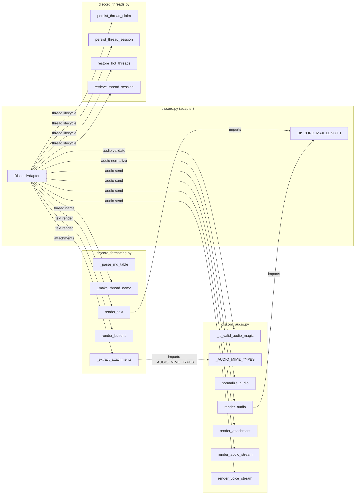

## Context

Promoted from [frame #296](../frames/296-decompose-discord-frame.mdx).
`adapters/discord.py` is 1,452 LOC — the largest file in the project. Three concerns are cleanly separable: text formatting, audio processing, and thread lifecycle. Voice session management was already extracted to `discord_voice.py` (270 LOC).

**LOC target deviation from issue:** The original issue targets `discord.py ≤ 300 LOC`, assuming helpers (`_reply_safe`, `_start_typing`, `_cancel_typing`, `_resolve_channel`, voice command handlers) would also be extracted. These helpers are tightly coupled to gateway state (`self.get_channel`, `self.http`, `asyncio.Task` dict) and cannot be cleanly extracted as free functions without introducing awkward DI for live connection objects. The realistic target is **≤ 1,000 LOC** after extracting formatting (~80), audio (~300), and threads (~100). The issue will be updated to reflect this.

## Goal

Decompose `discord.py` into focused modules so the main adapter file drops to ≤1,000 LOC and each extracted concern is testable and navigable independently.

## Users

- **Developers** maintaining formatting, audio, or thread logic — changes are isolated to the relevant module.
- **Reviewers** — smaller files are easier to reason about in PRs.

---

## Expected Behavior

### Module extraction

Three new files are created under `src/lyra/adapters/`. Each contains module-level functions (not classes) that the `DiscordAdapter` calls. The adapter passes `self` state as explicit arguments — no circular imports.

1. **`discord_formatting.py`** — text rendering and UI helpers
2. **`discord_audio.py`** — audio detection, normalization, and rendering
3. **`discord_threads.py`** — thread ownership tracking and session persistence

The `DiscordAdapter` class retains: `__init__`, `on_ready`, `on_message`, `on_voice_state_update`, `send`, `send_streaming`, `close`, and gateway-coupled helpers (`_reply_safe`, `_start_typing`, `_cancel_typing`, `_resolve_channel`, `_push_to_hub`, `_msg`, `_handle_voice_command`, `_handle_join_command`, `_handle_leave_command`, `normalize`). Methods that delegate to extracted modules become thin wrappers (1–3 lines).

### Import updates

All internal imports within `adapters/` are updated. No changes to files outside `src/lyra/adapters/`. The adapter's public API (class name, method signatures) is unchanged.

### Constant ownership

`DISCORD_MAX_LENGTH` stays in `discord.py`. Both `discord_formatting.py` and `discord_audio.py` import it from there. This avoids cross-module deps between extracted modules.

### `_shared.py` reuse

New modules must import from `_shared.py` — no duplication of `chunk_text`, `push_to_hub_guarded`, `buffer_audio_chunks`, `parse_reply_to_id`, `sanitize_filename`, `truncate_caption`.

---

## Data Model & Consumers

No data model changes — this is a pure structural refactor. All types (`InboundMessage`, `InboundAudio`, `OutboundAudio`, `OutboundAudioChunk`, `OutboundAttachment`, `OutboundMessage`) remain in `core/message.py`.

| Consumer | Functions consumed | When |
|----------|-------------------|------|
| `DiscordAdapter.on_message` | `_is_valid_audio_magic`, `normalize_audio`, `_make_thread_name`, `_extract_attachments`, `persist_thread_claim`, `retrieve_thread_session` | Inbound message processing |
| `DiscordAdapter.on_ready` | `restore_hot_threads` | Bot startup |
| `DiscordAdapter.send` | `render_text`, `render_buttons` | Outbound text response |
| `DiscordAdapter.send_streaming` | `render_text` | Outbound streaming response |
| `DiscordAdapter.render_audio` | (thin wrapper → `discord_audio.render_audio`) | Outbound audio |
| `DiscordAdapter.render_attachment` | (thin wrapper → `discord_audio.render_attachment`) | Outbound attachment |
| `DiscordAdapter.render_audio_stream` | (thin wrapper → `discord_audio.render_audio_stream`) | Outbound streamed audio |
| `DiscordAdapter.render_voice_stream` | (thin wrapper → `discord_audio.render_voice_stream`) | Voice session streaming |

**Cross-module dependency:** `_extract_attachments` (formatting) imports `_AUDIO_MIME_TYPES` from `discord_audio` to filter audio attachments. This is a one-way dep (formatting → audio); no cycles.

---

## Breadboard

### discord_formatting.py (~80 LOC)

| ID | Element | Source lines | Notes |
|----|---------|-------------|-------|
| F1 | `_TABLE_RE` | 64–69 | Module-level compiled regex |
| F2 | `_parse_md_table(match)` | 72–89 | Converts MD table → tabulate code block |
| F3 | `_MENTION_RE` | 233 | Module-level compiled regex |
| F4 | `_make_thread_name(content, fallback)` | 236–246 | Already a free function — direct move |
| F5 | `_extract_attachments(raw_attachments, audio_mime_types)` | 249–270 | Already a free function — move, pass `_AUDIO_MIME_TYPES` as arg or import from `discord_audio` |
| F6 | `render_text(text, max_length)` | 1080–1087 | Currently `self._render_text` — no instance state, extract as free function (drops `_` prefix). Imports `DISCORD_MAX_LENGTH` from `discord.py`, `chunk_text` from `_shared` |
| F7 | `render_buttons(buttons)` | 1089–1096 | Currently `self._render_buttons` — no instance state, extract as free function (drops `_` prefix) |

### discord_audio.py (~300 LOC)

| ID | Element | Source lines | Notes |
|----|---------|-------------|-------|
| A1 | `_AUDIO_MIME_TYPES` | 108–118 | Frozenset constant |
| A2 | `_VOICE_MESSAGE_FLAG` | 104 | Constant |
| A3 | `_is_valid_audio_magic(data)` | 121–150 | Already a free function — direct move |
| A4 | `normalize_audio(raw, audio_bytes, mime_type, *, bot_id, trust_level)` | 574–622 | Currently `self.normalize_audio` — reads `self._bot_id`. Extract as free function, pass `bot_id` explicitly. Requires imports: `Platform`, `RoutingContext`, `InboundAudio` from `core.message` |
| A5 | `render_audio(msg, inbound, *, bot_id, resolve_channel, http)` | 1258–1343 | Currently `self.render_audio` — uses `self.http` (discord.py HTTPClient), `self._resolve_channel`, `self._bot_id`. Extract as free function, adapter passes deps. `http` is typed `Any` (Discord internal). Known limitation: hard to unit-test without mocking Discord HTTP client |
| A6 | `render_attachment(msg, inbound, *, resolve_channel, attachment_exts)` | 1345–1409 | Currently `self.render_attachment` — uses `self._resolve_channel`. Extract as free function. Uses `sanitize_filename`, `truncate_caption`, `parse_reply_to_id` from `_shared` |
| A7 | `render_audio_stream(chunks, inbound, render_audio_fn)` | 1411–1431 | Currently `self.render_audio_stream` — delegates to `self.render_audio`. Extract, takes `render_audio_fn` callback. Uses `buffer_audio_chunks`, `_PartialAudioError` from `_shared` |
| A8 | `render_voice_stream(chunks, inbound, vsm)` | 1433–1452 | Currently `self.render_voice_stream` — delegates to `self._vsm`. Extract, takes `vsm` arg |

### discord_threads.py (~100 LOC)

| ID | Element | Source lines | Notes |
|----|---------|-------------|-------|
| T1 | `persist_thread_claim(thread_store, thread_id, bot_id, channel_id, guild_id)` | 441–465 | Currently `self._persist_thread_claim` — extract as free function, pass `thread_store` and `bot_id` explicitly |
| T2 | `persist_thread_session(thread_store, msg, session_id, pool_id, bot_id, cache)` | 467–491 | Currently `self._persist_thread_session` — **mutates `self._thread_sessions` dict (line 481)**. Extract as free function, pass `cache: dict` as mutable arg so the function can update it. Caller passes `self._thread_sessions` |
| T3 | `restore_hot_threads(thread_store, bot_id, hot_hours)` → `set[int]` | 393–413 | **Does not exist as a function today** — logic is inlined in `on_ready`. Extract the `if self._thread_store` block into a free function that returns the hot thread ID set. `on_ready` assigns the result to `self._owned_threads` |
| T4 | `retrieve_thread_session(thread_store, thread_id, bot_id, cache)` → `(str\|None, str\|None)` | 967–997 | **Does not exist as a function today** — logic is inlined in `on_message`. Extract the session retrieval block (cache check + DB fallback) into a free function. Returns `(session_id, pool_id)` tuple |

### DiscordAdapter (remaining ~1,000 LOC)

Keeps: `__init__`, `on_ready`, `on_message`, `on_voice_state_update`, `send`, `send_streaming`, `close`, `_reply_safe`, `_start_typing`, `_cancel_typing`, `_resolve_channel`, `_push_to_hub`, `_msg`, `_handle_voice_command`, `_handle_join_command`, `_handle_leave_command`, `normalize`, `DiscordConfig`, `load_discord_config`, `DISCORD_MAX_LENGTH`.

Thin wrappers replace: `render_audio`, `render_attachment`, `render_audio_stream`, `render_voice_stream` (each 2–4 lines, delegates to `discord_audio` function with `self` deps).

---

## Slices

| # | Slice | Deliverable | Dependencies |
|---|-------|------------|--------------|
| 1 | Extract formatting | `discord_formatting.py` created, adapter imports and calls it | None |
| 2 | Extract audio | `discord_audio.py` created, adapter delegates render_* and normalize_audio | None |
| 3 | Extract threads | `discord_threads.py` created, adapter delegates thread lifecycle | Slice 2 (for `_AUDIO_MIME_TYPES` import in `_extract_attachments`, or handled in slice 1 with forward import) |
| 4 | Verify & clean | Run tests + linter, verify LOC target, clean unused imports | 1, 2, 3 |

Slices 1–3 can be done in any order. Slice 1 has a soft dependency on slice 2 (`_extract_attachments` needs `_AUDIO_MIME_TYPES`); if done first, import the constant from `discord_audio.py` after it exists, or keep the constant in `discord.py` temporarily. Slice 4 is the integration check.

---

## Success Criteria

- [ ] `discord_formatting.py` exists with `_TABLE_RE`, `_parse_md_table`, `_MENTION_RE`, `_make_thread_name`, `_extract_attachments`, `render_text`, `render_buttons`
- [ ] `discord_audio.py` exists with `_AUDIO_MIME_TYPES`, `_VOICE_MESSAGE_FLAG`, `_is_valid_audio_magic`, `normalize_audio`, `render_audio`, `render_attachment`, `render_audio_stream`, `render_voice_stream`
- [ ] `discord_threads.py` exists with `persist_thread_claim`, `persist_thread_session`, `restore_hot_threads`, `retrieve_thread_session`
- [ ] `discord.py` ≤ 1,000 LOC (adapter + config + helpers + thin wrappers)
- [ ] No logic from `_shared.py` duplicated — all usages import from `_shared`
- [ ] All imports within `adapters/` updated — no broken references
- [ ] No files outside `src/lyra/adapters/` modified
- [ ] `uv run pytest` passes with no new failures
- [ ] `uv run ruff check .` clean
- [ ] No runtime behavior change — pure structural refactor
