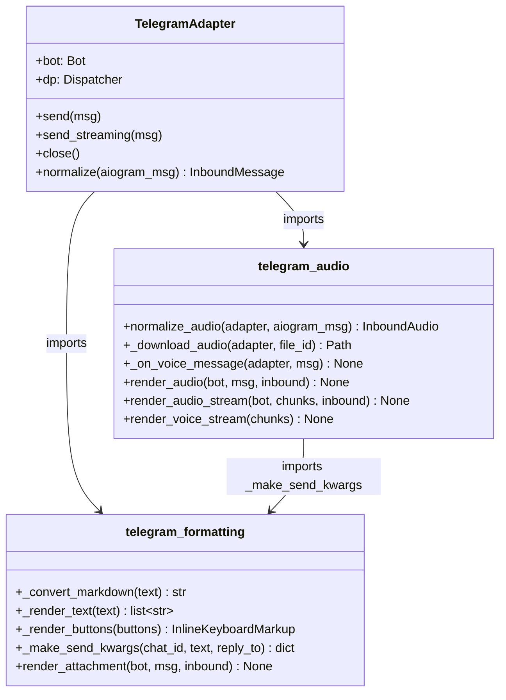
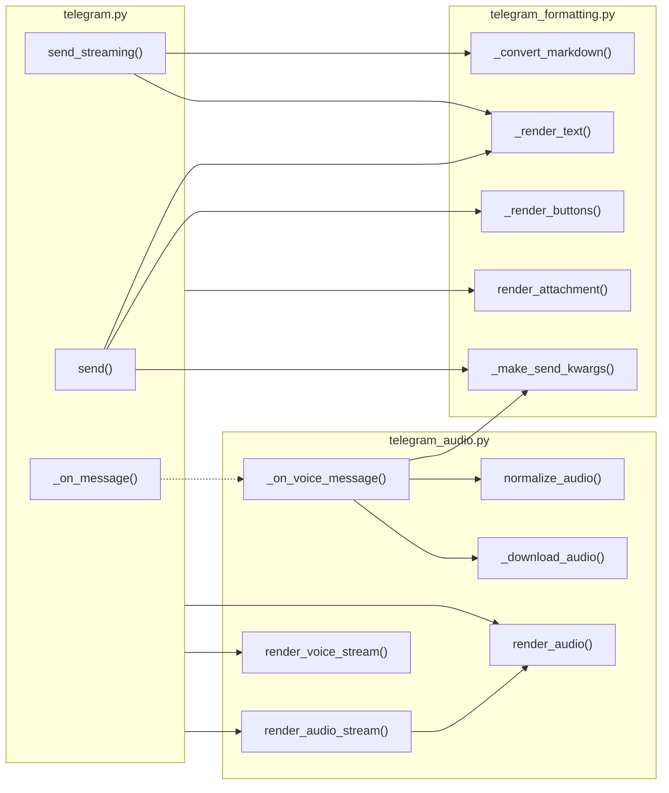

## Context

Parent: #293. Follows the same decomposition pattern applied to Discord (#296).
`adapters/telegram.py` is 1,143 lines mixing gateway handling, text formatting, audio processing, helpers, and config.

## Goal

Extract formatting and audio concerns into focused modules so `telegram.py` retains only core adapter logic (~730 LOC after extraction), while preserving identical runtime behavior.

## Users

- **Primary:** Maintainers editing Telegram adapter logic — smaller, focused files reduce cognitive load and merge conflict surface.
- **Secondary:** Contributors working on cross-adapter patterns — extracted modules make formatting/audio concerns reusable.

## Expected Behavior

After the refactor, the adapter directory contains three files instead of one:

1. **`telegram.py`** (~730 LOC) — Core adapter: `__init__`, `bot` property, `_register_routes`, `normalize`, `_on_message`, `_push_to_hub`, `send`, `send_streaming`, `close`, plus helpers (`_typing_*`, `_msg`, `_make_scope_id`, `_make_verifier`, `_extract_attachments`), config (`TelegramConfig`, `load_config`), and top-level sentinels/constants.
2. **`telegram_formatting.py`** (~105 LOC) — `_convert_markdown`, `_MARKDOWNV2_SPECIAL`, `TELEGRAM_MAX_LENGTH`, `_render_text`, `_render_buttons`, `_make_send_kwargs`, `render_attachment`, `_ATTACHMENT_EXTS`.
3. **`telegram_audio.py`** (~310 LOC) — `normalize_audio`, `_download_audio`, `_on_voice_message`, `render_audio`, `render_audio_stream`, `render_voice_stream`.

**Instance method → free function pattern:** All extracted methods are currently instance methods on `TelegramAdapter`. They become free functions receiving the adapter (or specific fields like `bot`) as an explicit first argument. The adapter calls them via module-level imports.

The core adapter imports from the two extracted modules and delegates. `send()` and `send_streaming()` stay in the adapter (they orchestrate typing + formatting + bot calls). `send_streaming()` imports `_convert_markdown` from `telegram_formatting`. All existing tests pass without modification beyond import path updates.

## Out of Scope

- Refactoring the extracted code itself (formatting logic, audio pipeline internals)
- Shared base classes across Telegram/Discord adapters
- New features or API surface changes
- Further extraction to reach ≤300 LOC (would require a third pass — separate issue)
- New tests beyond updating existing import paths

## Data Model & Consumers

| Consumer | Consumes from | Functions used | Status |
|----------|--------------|----------------|--------|
| `TelegramAdapter.send()` | `telegram_formatting` | `_render_text`, `_render_buttons`, `_make_send_kwargs` | This issue |
| `TelegramAdapter.send_streaming()` | `telegram_formatting` | `_render_text`, `_convert_markdown` | This issue |
| `TelegramAdapter._on_message()` | `telegram_audio` | `_on_voice_message` (dispatch) | This issue |
| `TelegramAdapter` (outbound) | `telegram_formatting` | `render_attachment` | This issue |
| `TelegramAdapter` (outbound) | `telegram_audio` | `render_audio`, `render_audio_stream`, `render_voice_stream` | This issue |
| `telegram_audio._on_voice_message` | `telegram_formatting` | `_make_send_kwargs` | This issue |

## Breadboard

| ID | Affordance | Handler | Data |
|----|-----------|---------|------|
| E1 | Extract formatting functions + constants | Move `_convert_markdown`, `_MARKDOWNV2_SPECIAL`, `TELEGRAM_MAX_LENGTH`, `_render_text`, `_render_buttons`, `_make_send_kwargs`, `render_attachment`, `_ATTACHMENT_EXTS` to `telegram_formatting.py` | `_render_text`, `_render_buttons` become free functions (no `self` needed — they use only module-level helpers). `render_attachment` receives `bot` as explicit arg. |
| E2 | Extract audio functions | Move `normalize_audio`, `_download_audio`, `_on_voice_message`, `render_audio`, `render_audio_stream`, `render_voice_stream` to `telegram_audio.py` | All become free functions. `normalize_audio` and `_download_audio` receive adapter as first arg (access `bot`, `_bot_id`, `_audio_tmp_dir`, etc.). `_on_voice_message` receives adapter as first arg (deep coupling: `_auth`, `_hub`, `_circuit_registry`, typing, etc.). `render_audio` receives `bot`. `render_audio_stream` calls `render_audio` within the same module. |
| E3 | Wire imports in adapter | Import extracted functions in `telegram.py`; `send_streaming` imports `_convert_markdown` from `telegram_formatting`; `telegram_audio` imports `_make_send_kwargs` from `telegram_formatting` | Cross-module dependency: `telegram_audio → telegram_formatting` |
| E4 | Update `__init__.py` | Ensure adapter package exports remain stable | Re-export if needed |

## Slices

| Slice | Description | Acceptance |
|-------|------------|------------|
| 1. Extract formatting | Create `telegram_formatting.py`, move constants + 4 functions, update imports in `telegram.py` and `send_streaming` | `ruff check` clean, `pytest` passes |
| 2. Extract audio | Create `telegram_audio.py`, move 6 functions, add `telegram_audio → telegram_formatting` import for `_make_send_kwargs`, update imports in `telegram.py` | `ruff check` clean, `pytest` passes |
| 3. Final cleanup | Remove dead imports from `telegram.py`, verify no circular imports, verify LOC distribution | All acceptance criteria met |

## Success Criteria

- [ ] `adapters/telegram_formatting.py` created (~105 LOC) with `_convert_markdown`, `_MARKDOWNV2_SPECIAL`, `TELEGRAM_MAX_LENGTH`, `_render_text`, `_render_buttons`, `_make_send_kwargs`, `render_attachment`, `_ATTACHMENT_EXTS`
- [ ] `adapters/telegram_audio.py` created (~310 LOC) with `normalize_audio`, `_download_audio`, `_on_voice_message`, `render_audio`, `render_audio_stream`, `render_voice_stream`
- [ ] `adapters/telegram.py` reduced to ~730 LOC (core adapter + helpers + config)
- [ ] No circular imports between the three modules
- [ ] All imports updated — no broken references
- [ ] `uv run pytest` passes
- [ ] `uv run ruff check .` clean
- [ ] No behavioral changes — pure mechanical refactor
