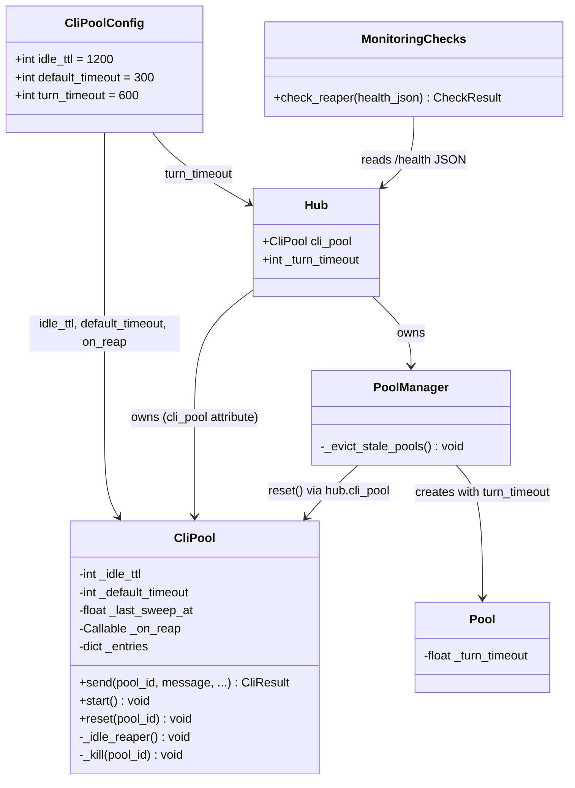

## Context

Promoted from [frame #317](../frames/317-harden-timeout-reaper-frame.mdx). The CLI pool timeout/reaper subsystem has 6 hardening gaps: hardcoded timeouts with no config exposure, disabled turn timeout, silent evictions, orphaned processes on pool eviction, no reaper health monitoring, and lingering dead-process entries.

## Goal

Make the timeout/reaper system configurable, observable, and self-healing — so operators can tune behavior without code changes, users get notified on eviction, and orphaned/stuck processes are cleaned up promptly.

## Users

- **Primary:** Lyra operators — gain config knobs, monitoring, and clean process lifecycle
- **Secondary:** End users — get notified on idle eviction instead of silent context loss

## Expected Behavior

### 1. Configurable idle_ttl / default_timeout

Operators add a `[cli_pool]` section to `config.toml`:

```toml
[cli_pool]
idle_ttl = 1200        # seconds, default unchanged
default_timeout = 300  # seconds, default unchanged
```

`bootstrap/config.py` reads these values via a new `_load_cli_pool_config()` function. The values are passed to `CliPool.__init__()` in `multibot.py` where the CliPool is constructed. `Hub` gains an optional `cli_pool: CliPool | None` attribute (set during bootstrap) so that `PoolManager` and the health endpoint can reach it. Missing keys fall back to current hardcoded defaults.

### 2. Default turn_timeout as safety net

A new `turn_timeout` key in `[cli_pool]`:

```toml
[cli_pool]
turn_timeout = 600  # seconds, hard upper bound per turn
```

Propagation path: `bootstrap/config.py` reads the value → passed to `Hub.__init__()` as a new `turn_timeout` parameter → `PoolManager.get_or_create_pool()` passes it to `Pool.__init__()` as the default when no agent override is given. `CliPool` is not involved in turn timeout propagation (it and `Pool` are separate objects with no runtime reference).

**Ceiling enforcement:** In `Pool.__init__()`, if both a per-agent `turn_timeout` and the global ceiling are provided, clamp silently: `self._turn_timeout = min(agent_value, global_ceiling)`. Log a warning when clamping occurs. If no agent override, use the global ceiling as default.

### 3. User notification on idle eviction

When the reaper kills an idle process, the user receives a notification. Delivery mechanism: add an `on_reap` async callback to `CliPool.__init__()`, wired by `Hub` at construction. The callback receives `(pool_id, reason)`.

**Dispatch path:** `Hub` cannot use `dispatch_response()` (requires `InboundMessage`). Instead, `on_reap` constructs a synthetic `OutboundMessage` using the pool's binding info (`platform`, `bot_id`, `user_id` from `hub.bindings`) and routes it directly through the registered `OutboundDispatcher`. If no binding/dispatcher can be resolved for the pool, the notification is silently skipped (logged at warning level).

**Message text:** Managed via `messages.toml` under a new key `[notifications.idle_eviction]`, consistent with existing message localization. Default: "Session timed out after inactivity."

**Failure isolation:** The `on_reap` callback is fire-and-forget. Exceptions in the callback must not crash the reaper loop — wrap in try/except with error logging, consistent with `PoolObserver._fire_and_forget()` pattern.

### 4. Pool eviction kills CLI process

`PoolManager._evict_stale_pools()` currently removes the Pool object and flushes the session but leaves the CLI subprocess alive. After eviction, it must also call `cli_pool.reset(pool_id)` to terminate the orphaned process immediately.

**Wiring:** `PoolManager` reaches `CliPool` via `self._hub.cli_pool` (the new `Hub` attribute added in evo 1). The call is guarded: `if self._hub.cli_pool is not None` (SDK-only agents have no CliPool).

### 5. Reaper health in monitoring

`CliPool` tracks `_last_sweep_at` (monotonic timestamp) updated each reaper loop iteration. `bootstrap/health.py` exposes it in the `/health` response as age-in-seconds (consistent with existing pattern for `last_processed_age`): `"reaper_alive": true, "reaper_last_sweep_age": <float>`. Before the first sweep, `reaper_alive` is `false` and `reaper_last_sweep_age` is `null`.

`monitoring/checks.py` adds a `check_reaper(health_json)` function (receives parsed `/health` JSON dict, consistent with existing `check_queue_depth`, `check_idle`, etc.) that warns if `reaper_last_sweep_age > 2 × sweep_interval` (120s). Called inside `run_checks()` only when the HTTP health check succeeds.

### 6. Eager entry cleanup on dead process

`cli_pool.send()` currently only calls `_kill()` when `"Timeout" in result.error`. Expand the condition to also trigger on `"terminated" in result.error` so dead-process entries are cleaned up immediately rather than waiting up to 60s for the reaper.

## Data Model & Consumers

### Data Structure



### Consumer Map

```mermaid
flowchart LR
    TOML["config.toml<br/>[cli_pool]"] -->|load| Bootstrap["bootstrap/config.py"]
    Bootstrap -->|idle_ttl,<br/>default_timeout| Multibot["multibot.py"]
    Bootstrap -->|turn_timeout| Hub
    Multibot -->|constructor args +<br/>on_reap callback| CliPool
    Multibot -->|cli_pool ref| Hub
    Hub -->|turn_timeout| PM["PoolManager"]
    PM -->|turn_timeout<br/>(ceiling)| Pool["Pool.__init__()"]
    Pool -->|_turn_timeout| PP["pool_processor.py<br/>_guarded_process_one()"]
    CliPool -->|_last_sweep_at| Health["bootstrap/health.py<br/>/health endpoint"]
    Health -->|reaper_alive,<br/>reaper_last_sweep_age| MonChecks["monitoring/checks.py<br/>check_reaper(health_json)"]
    CliPool -->|on_reap(pool_id, reason)| Hub
    Hub -->|synthetic OutboundMessage| Dispatcher["OutboundDispatcher"]
    PM -->|reset(pool_id)<br/>via hub.cli_pool| CliPool
```

### Consumer Summary

| Consumer | Fields consumed | When | Status |
|----------|----------------|------|--------|
| `CliPool.__init__` | idle_ttl, default_timeout, on_reap | Construction (multibot.py) | This issue |
| `Hub.__init__` | turn_timeout, cli_pool | Construction (multibot.py) | This issue |
| `PoolManager.get_or_create_pool` | hub._turn_timeout → Pool.__init__ | Every inbound message | This issue |
| `Pool.__init__` | turn_timeout (clamped to ceiling) | Pool creation | This issue |
| `pool_processor.py` | pool._turn_timeout | Each turn | Existing (unchanged) |
| `bootstrap/health.py` | hub.cli_pool._last_sweep_at | Health check request | This issue |
| `monitoring/checks.py` | health_json["reaper_alive"], health_json["reaper_last_sweep_age"] | Monitoring sweep | This issue |
| `PoolManager._evict_stale_pools` | hub.cli_pool.reset() | Every get_or_create_pool (throttled) | This issue |
| Hub (on_reap callback) | pool_id, reason → synthetic OutboundMessage | Idle reap event | This issue |
| `messages.toml` | notifications.idle_eviction | on_reap dispatch | This issue |

## Breadboard

### Affordances

| ID | Element | Location |
|----|---------|----------|
| U1 | `[cli_pool]` TOML section | config.toml |
| U2 | `/health` reaper fields | bootstrap/health.py |
| U3 | `[notifications.idle_eviction]` message | messages.toml |

### Handlers

| ID | Handler | Triggered by |
|----|---------|-------------|
| N1 | `_load_cli_pool_config()` | Bootstrap, reads U1 |
| N2 | `CliPool.__init__(idle_ttl, default_timeout, on_reap)` | multibot.py construction |
| N3 | `Hub.__init__(turn_timeout, cli_pool)` | multibot.py construction |
| N4 | `Pool.__init__(turn_timeout)` with ceiling clamp | PoolManager.get_or_create_pool() |
| N5 | `_idle_reaper()` enhanced — calls on_reap, updates _last_sweep_at | Sleep loop |
| N6 | `send()` enhanced — eager cleanup on "terminated" | Each message |
| N7 | `_evict_stale_pools()` enhanced — calls hub.cli_pool.reset() | Every get_or_create_pool (throttled) |
| N8 | `check_reaper(health_json)` | Monitoring sweep (inside run_checks) |

### Data / Side Effects

| ID | What | Where |
|----|------|-------|
| S1 | `_last_sweep_at` timestamp | CliPool instance |
| S2 | User notification (synthetic OutboundMessage) | OutboundDispatcher (fire-and-forget) |
| S3 | Orphaned process killed | OS process table |

### Wiring

| From | To | Notes |
|------|-----|-------|
| U1 → N1 | TOML → config loader | New `_load_cli_pool_config()` function |
| N1 → N2 | idle_ttl, default_timeout → CliPool | Via multibot.py |
| N1 → N3 | turn_timeout → Hub; cli_pool ref → Hub | Via multibot.py |
| N3 → N4 | Hub._turn_timeout → PoolManager → Pool.__init__ | Ceiling passed at pool creation |
| N5 → S1 | Reaper loop → timestamp update | Each sweep iteration |
| N5 → S2 | Reaper idle kill → on_reap → Hub → OutboundDispatcher | Fire-and-forget, failure-isolated |
| U3 → S2 | Message text from messages.toml | Loaded by Hub at dispatch time |
| N6 → S3 | send() error check → _kill() | Immediate cleanup on "terminated" |
| N7 → S3 | Pool eviction → hub.cli_pool.reset() | Kill orphaned process |
| S1 → U2 | Timestamp → age-in-seconds in /health JSON | On health request |
| U2 → N8 | Health JSON → check_reaper() | Each monitoring sweep (when HTTP check OK) |

## Slices

| # | Slice | Scope | Demo |
|---|-------|-------|------|
| 1 | Config wiring | Evo 1 + 2: Add `[cli_pool]` section, wire idle_ttl/default_timeout/turn_timeout through bootstrap → Hub → CliPool → Pool | Set `turn_timeout = 60` in config, verify stuck process is killed after 60s |
| 2 | Eager cleanup + eviction fix | Evo 4 + 6: Pool eviction kills CLI process; send() cleans up on "terminated" | Kill a CLI process manually, verify entry is cleaned immediately on next send() |
| 3 | Reaper notification + monitoring | Evo 3 + 5: on_reap callback, _last_sweep_at, /health fields, check_reaper() | Wait for idle eviction, verify user receives notification and /health shows reaper data |

## Success Criteria

- [ ] `config.toml` `[cli_pool]` section is read at startup; missing keys fall back to current defaults
- [ ] `idle_ttl` from config controls reaper idle threshold (verified by setting a short value and observing reap)
- [ ] `default_timeout` from config controls per-message timeout in `cli_pool.send()`
- [ ] `turn_timeout` from config sets a non-None default in `Pool.__init__()` when no agent override is given
- [ ] Per-agent `turn_timeout` that exceeds the global ceiling is silently clamped to the ceiling (with warning log)
- [ ] Idle reap triggers user-facing notification via `on_reap` callback → synthetic OutboundMessage → OutboundDispatcher
- [ ] `on_reap` callback failure (e.g., dispatcher down) does not crash the reaper loop (fire-and-forget with error logging)
- [ ] Notification text is loaded from `messages.toml` `[notifications.idle_eviction]`
- [ ] `_evict_stale_pools()` calls `hub.cli_pool.reset(pool_id)` to kill orphaned CLI process (guarded for None)
- [ ] `cli_pool.send()` calls `_kill()` on `"terminated"` errors, not just `"Timeout"`
- [ ] `/health` endpoint includes `reaper_alive` (bool) and `reaper_last_sweep_age` (float seconds, null before first sweep)
- [ ] `monitoring/checks.py` `check_reaper(health_json)` warns if `reaper_last_sweep_age > 120s`
- [ ] No breaking changes: omitting `[cli_pool]` from config preserves all current behavior
