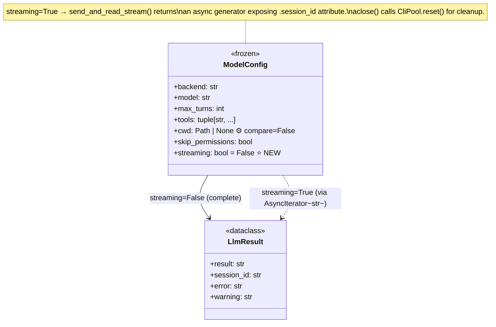

## Context

Promoted from [analysis](../analyses/320-token-level-streaming-analysis.mdx). Shape 1 (parallel streaming path) selected per ADR-028. The downstream plumbing (`dispatch_streaming`, `send_streaming` on both adapters, `enqueue_streaming` on the outbound dispatcher) is already implemented. This spec covers the missing upstream path: CLI protocol parsing → pool → driver → agent.

## Goal

Enable per-agent opt-in token-level streaming so users see responses appear progressively via edit-in-place instead of waiting for the full buffered response.

## Users

- **Primary:** End users on Telegram and Discord — progressive text delivery for long-form responses
- **Secondary:** Agent developers — `streaming` config flag in `[model]` TOML section

## Expected Behavior

1. Agent developer sets `streaming = true` in the agent's `[model]` TOML section (or edits via `lyra agent edit`)
2. After `lyra agent init --force` + restart, the agent's CLI subprocess is spawned with `--include-partial-messages`
3. User sends a message on Telegram or Discord
4. The CLI subprocess emits `stream_event/content_block_delta` NDJSON lines with incremental text chunks
5. `cli_protocol.send_and_read_stream()` yields each `text_delta` chunk as it arrives
6. The async iterator propagates through `CliPool.send_streaming()` → `ClaudeCliDriver.stream()` → `SimpleAgent.process()`
7. `pool_processor._process_one()` detects the `AsyncIterator` return and routes to `dispatch_streaming()` (existing code)
8. The adapter edits the message in-place with debounced updates (existing adapter behavior, not changed by this issue)
9. When the `result` event arrives, the generator closes and session_id is captured. Final message delivery is handled by the existing adapter streaming path
10. If `streaming = false` (default), the existing non-streaming path is used — zero behavior change

## Data Model & Consumers

```mermaid
flowchart LR
    subgraph "CLI Protocol Layer"
        A[send_and_read_stream] -->|yields text_delta| B[StreamingIterator]
    end
    subgraph "Pool Layer"
        B -->|AsyncIterator| C[CliPool.send_streaming]
    end
    subgraph "Driver Layer"
        C -->|AsyncIterator| D[ClaudeCliDriver.stream]
    end
    subgraph "Agent Layer"
        D -->|AsyncIterator| E[SimpleAgent.process]
    end
    subgraph "Dispatch Layer (existing)"
        E -->|AsyncIterator| F[pool_processor._process_one]
        F -->|AsyncIterator| G[dispatch_streaming]
    end
    subgraph "Adapter Layer (existing)"
        G --> H[telegram send_streaming]
        G --> I[discord send_streaming]
    end

    style A fill:#4CAF50,color:#fff
    style B fill:#4CAF50,color:#fff
    style C fill:#4CAF50,color:#fff
    style D fill:#4CAF50,color:#fff
    style E fill:#4CAF50,color:#fff
    style F fill:#90CAF9
    style G fill:#90CAF9
    style H fill:#90CAF9
    style I fill:#90CAF9
```

### Consumer summary

| Consumer | Fields consumed | When | Status |
|----------|----------------|------|--------|
| `_build_cmd()` | `ModelConfig.streaming` | Subprocess spawn | This issue |
| `CliPool.send()` | `ModelConfig.__eq__` (includes streaming) | Config mismatch check | This issue |
| `CliPool.send_streaming()` | `ModelConfig` (full) | Streaming send | This issue |
| `ClaudeCliDriver.stream()` | `ModelConfig` (full) | Streaming complete | This issue |
| `SimpleAgent.process()` | `ModelConfig.streaming` | Method dispatch | This issue |
| `AgentBase.process()` | Return type annotation | Protocol contract | This issue |
| `pool_processor._process_one()` | `AsyncIterator` type check | Dispatch routing | Existing |
| `dispatch_streaming()` | `AsyncIterator[str]` | Hub outbound | Existing |
| `send_streaming()` (adapters) | `AsyncIterator[str]` | Platform delivery | Existing |

## Breadboard

### Affordances

| ID | Element | Location |
|----|---------|----------|
| U1 | `streaming = true` in `[model]` TOML section | Agent TOML file |
| U2 | `streaming` column in agents DB | `agent_schema.py` |
| U3 | `--include-partial-messages` CLI flag | Subprocess spawn command |
| U4 | `capabilities["streaming"]` on `ClaudeCliDriver` | `LlmProvider` protocol |

### Handlers

| ID | Handler | Triggered by |
|----|---------|-------------|
| N1 | `_build_cmd()` adds `--include-partial-messages` | `ModelConfig.streaming == True` |
| N2 | `send_and_read_stream()` async generator | `CliPool.send_streaming()` call |
| N3 | `CliPool.send_streaming()` — spawn if needed, acquire `entry._lock`, write stdin, release lock, return iterator. Lock is released before yielding the first chunk. `aclose()` is safe to call at any point after lock release. | `ClaudeCliDriver.stream()` call |
| N4 | `ClaudeCliDriver.stream()` — delegates to pool | `SimpleAgent.process()` call |
| N5 | `SimpleAgent.process()` returns `AsyncIterator` | `ModelConfig.streaming == True` |
| N6 | Generator `aclose()` → `CliPool.reset()` via `finally` block in async generator closure (captures `pool` and `pool_id` references) | Cancel-in-flight or generator exhaustion |
| N7 | `LlmProvider` protocol gets optional `stream()` method | `ClaudeCliDriver.stream()` implementation |

### Data flow

| ID | From | To | Data |
|----|------|----|------|
| S1 | CLI subprocess stdout | `send_and_read_stream()` | NDJSON `stream_event/content_block_delta` lines |
| S2 | `send_and_read_stream()` | Consumer (pool_processor) | `str` chunks (text_delta only) |
| S3 | `send_and_read_stream()` | Generator `.session_id` attribute | Session ID captured from `system/init` event (primary), updated on `result` event if present |

## Slices

| # | Slice | Affordances | Handlers | Demo |
|---|-------|-------------|----------|------|
| 1 | Config plumbing | U1, U2 | — | `ModelConfig(streaming=True)` loads from TOML/DB; `__eq__` detects change |
| 2 | CLI protocol streaming generator | U3 | N1, N2 | Unit test: mock subprocess emitting stream_events → generator yields text chunks |
| 3 | Pool + driver streaming methods | U4 | N3, N4, N6, N7 | Integration test: `CliPool.send_streaming()` returns iterator, `aclose()` kills process |
| 4 | Agent integration | — | N5 | E2E: `SimpleAgent.process()` returns `AsyncIterator` → `pool_processor` routes to `dispatch_streaming` |

## Implementation Notes

**Streaming iterator pattern:** `send_and_read_stream()` is an async generator function (`async def` with `yield`). The `pool` and `pool_id` references are captured via closure. A `finally` block in the generator calls `await pool.reset(pool_id)` on cancellation/exhaustion. The `session_id` attribute is stored on the generator object via `gen.session_id = value` (Python generator objects accept arbitrary attributes). The caller (`CliPool.send_streaming()`) sets `gen.session_id = None` before returning, and the generator updates it internally when `system/init` or `result` events are parsed.

**AgentBase contract change:** `AgentBase.process()` return type broadens from `Response` to `Response | AsyncIterator[str]`. Other concrete agents continue returning `Response`, satisfying the supertype. `pool_processor._process_one()` already handles both types (line 220: `isinstance(result, AsyncIterator)`).

## Out of Scope

- Adapter debounce tuning (Telegram 500ms, Discord 1s are already shipped)
- Multi-turn intermediate streaming (intermediate turns use `on_intermediate` callback — orthogonal)
- Voice modality changes (`hub_outbound.py` already buffers streaming for TTS)
- Discord/Telegram message threading (existing adapter behavior)
- Streaming for non-CLI backends (Ollama, Anthropic SDK — future work)

## Edge Cases

| Case | Handling |
|------|----------|
| Cancel-in-flight mid-stream | Generator `aclose()` calls `CliPool.reset(pool_id)` to kill subprocess. Prevents pipe buffer deadlock. |
| Process death mid-stream | Generator detects EOF (`not raw`) or `not entry.is_alive()`, raises `StopAsyncIteration`. Pool processor's existing error handling applies. |
| Tool-use `content_block_delta` | Filter by `delta.type == "text_delta"` — only yield text, silently skip `input_json_delta`. |
| `streaming` toggled on live process | `ModelConfig.__eq__` includes `streaming` → `CliPool.send()` detects mismatch → respawns with correct flags. |
| Session ID on cancellation | Generator `.session_id` remains `None` if `result` event never consumed. `pool_processor._process_one()` session_id capture handles `None` gracefully. |
| Voice modality + streaming | `hub_outbound.py:149` already buffers streaming for TTS — no change needed. |
| Non-streaming agent | `streaming = false` (default) → entire streaming path is bypassed. Zero behavior change. |
| Multi-turn with streaming | Streaming applies to the final turn's text output. Intermediate turns still use `on_intermediate` callback (orthogonal). |
| Empty stream (no text deltas) | Generator yields nothing → adapter `send_streaming` handles empty iterator gracefully (existing behavior). |

## Success Criteria

- [ ] `ModelConfig(streaming=True)` loads correctly from agent TOML `[model]` section and from SQLite DB
- [ ] `ModelConfig.__eq__` detects `streaming` field changes (not `compare=False`)
- [ ] `_build_cmd()` includes `--include-partial-messages` when `ModelConfig.streaming == True`
- [ ] `_build_cmd()` omits `--include-partial-messages` when `ModelConfig.streaming == False`
- [ ] `send_and_read_stream()` yields only `text_delta` text from `content_block_delta` events
- [ ] `send_and_read_stream()` skips `input_json_delta` events (tool-use blocks)
- [ ] `send_and_read_stream()` captures `session_id` from `system/init` event (primary source, updated on `result` if present)
- [ ] `send_and_read_stream()` stops iteration on `result` event
- [ ] Generator exposes `session_id` attribute set to a non-None string after `result` event is consumed
- [ ] Generator exposes `session_id` as `None` when generator is closed before `result` event
- [ ] Generator `aclose()` calls pool reset to kill subprocess cleanly
- [ ] `CliPool.send_streaming()` spawns process if needed, writes stdin, returns `AsyncIterator[str]`
- [ ] `ClaudeCliDriver.stream()` delegates to `CliPool.send_streaming()` and returns `AsyncIterator[str]`
- [ ] `ClaudeCliDriver.capabilities["streaming"]` is `True`
- [ ] `SimpleAgent.process()` returns `AsyncIterator[str]` when `model_config.streaming == True`
- [ ] `SimpleAgent.process()` returns `Response` when `model_config.streaming == False` (existing behavior preserved)
- [ ] `LlmProvider` protocol has optional `stream()` method signature
- [ ] `AgentBase.process()` return type annotation broadened to `Response | AsyncIterator[str]`
- [ ] `CliPool.send_streaming()` releases `entry._lock` before yielding the first chunk (concurrent `reset()` must not deadlock)
- [ ] When `streaming` is toggled on a running agent, `CliPool.send()` detects the config mismatch and respawns the subprocess
- [ ] `ModelConfig(streaming=False)` agents complete the full existing `send()` → `CliResult` path with no new code paths entered
