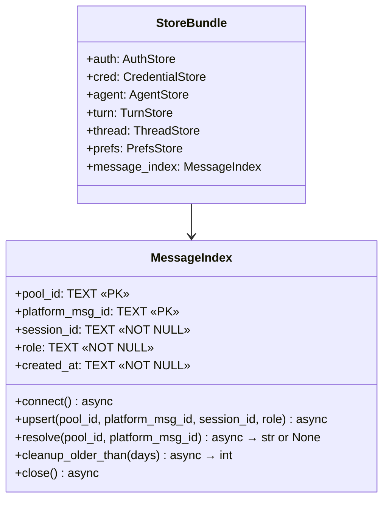
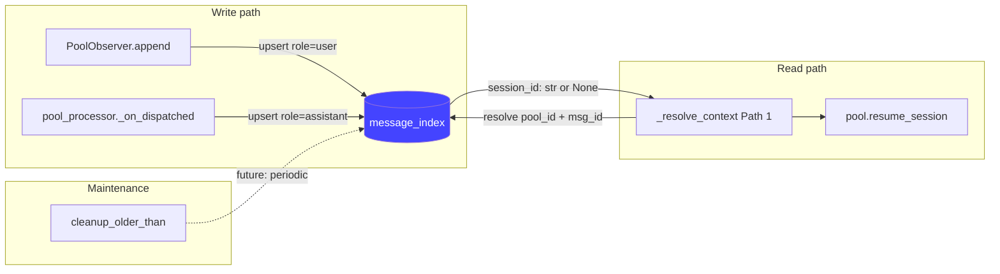

## Context

Session resumption via reply-to is broken: `ContextResolver` was dead code (never wired in bootstrap), `conversation_turns.reply_message_id` is the wrong data model for routing (no index, no scope, assistant-only), and the streaming session_id race corrupted stored UUIDs. Staging fixes activate the wiring and fix the race, but the underlying data model remains fragile. See [analysis](../analyses/341-message-index-architecture.md) and [frame](../frames/341-message-index-session-routing-frame.mdx).

## Goal

A user who replies to any previous message in a conversation — whether a bot response or their own message — reliably resumes the correct Claude session. This is achieved by replacing the implicit `conversation_turns.reply_message_id` lookup with a dedicated `message_index` table that maps `(pool_id, platform_msg_id) → session_id` for both user and assistant messages, enabling O(1) reply-to session resolution.

## Users

- **Primary:** Mickael — sole Lyra user across Telegram and Discord. Reply-to is the natural UX for resuming a conversation thread.

## Out of Scope

- **Streaming session_id race fix** — already resolved in staging (`pool_processor.py`). This spec assumes the fix is merged.
- **ContextResolver bootstrap wiring** — staging activates it, but this spec replaces it entirely. The interim fix is superseded.
- **Cleanup scheduling** — `cleanup_older_than()` interface ships now; periodic invocation is deferred.
- **Group chat per-user filtering** — requires `user_id` in schema (Phase 2).
- **Claude CLI session file lifetime** — external system, not addressable by `message_index`.
- **SDK backend resume** — `AnthropicSdkDriver` has no session mechanism; `message_index` is populated but resume is a no-op.
- **Backfill from `conversation_turns`** — data quality too poor; start fresh.

## Expected Behavior

1. User sends a message on Telegram/Discord. The adapter normalizes it into an `InboundMessage` with `platform_meta["message_id"]`.
2. `PoolObserver.append()` indexes the user turn: `(pool_id, platform_msg_id, session_id, role="user")`.
3. The agent processes the message. The response is dispatched via `OutboundDispatcher`.
4. The `_on_dispatched` callback fires. If `reply_message_id` is not None, the assistant turn is indexed: `(pool_id, reply_message_id, session_id, role="assistant")`.
5. Later, the user replies to any previously indexed message (user or assistant).
6. `_resolve_context` calls `MessageIndex.resolve(pool_id, reply_to_id)` — O(1) PK lookup.
7. If found and pool is idle, `pool.resume_session(session_id)` resumes the Claude CLI session.
8. `_session_persisted` is reset so the resumed session_id is persisted on the next turn.

**Circuit-breaker path:** When circuit-breaker is open, `reply_message_id` is None. Assistant turn is NOT indexed. User turn was already indexed at step 2. Path 3 (`get_last_session`) covers.

**Cold start:** Empty table on first deploy. All reply-to falls through to Path 3 until traffic populates the index. Not a regression.

## Data Model & Consumers

### Data structure



### Consumer map



### Consumer summary

| Consumer | Fields | When | Status |
|----------|--------|------|--------|
| `PoolObserver.append()` | pool_id, platform_msg_id, session_id, role=user | Every inbound message | This issue |
| `pool_processor._on_dispatched` | pool_id, platform_msg_id, session_id, role=assistant | Every dispatched response (if reply_message_id not None) | This issue |
| `_resolve_context` Path 1 | pool_id, platform_msg_id → session_id | Every reply-to message | This issue |
| `cleanup_older_than()` | created_at | Periodic maintenance | Future (interface shipped now) |

## Breadboard

### Affordances

| ID | Element | Location | Type |
|----|---------|----------|------|
| S1 | `MessageIndex` store | `core/message_index.py` | New module |
| S2 | `StoreBundle.message_index` field | `bootstrap/multibot_stores.py` | Field addition |
| S3 | `Hub.set_message_index()` | `core/hub.py` | New method |
| S4 | `PoolObserver.register_message_index()` | `core/pool_observer.py` | New method |
| N1 | User turn upsert | `core/pool_observer.py` `append()` | Call addition |
| N2 | Assistant turn upsert (non-streaming) | `core/pool_processor.py` `_log_turn` | Call addition |
| N3 | Assistant turn upsert (streaming) | `core/pool_processor.py` `_log_streaming_turn` | Call addition |
| N4 | `_resolve_context` Path 1 rewrite (remove cross-pool guard — now structurally dead with pool-scoped PK) | `core/message_pipeline.py` | Logic replacement |
| N5 | `_session_persisted` reset | `core/pool.py` `resume_session()` | 1-line addition |
| U1 | Delete `context_resolver.py` | `core/context_resolver.py` | File deletion |
| U2 | Remove ContextResolver from Hub constructor | `core/hub.py`, `bootstrap/multibot.py` | Parameter removal |
| S5 | Late-pool registration in `PoolManager.get_or_create_pool()` | `core/pool_manager.py` | Call addition |

### Wiring

```
S1 → S2 (MessageIndex added to StoreBundle, opened in open_stores)
S2 → S3 (multibot.py calls hub.set_message_index(stores.message_index))
S3 → S4 (Hub.set_message_index iterates pools, calls observer.register_message_index)
S3 → S5 (PoolManager.get_or_create_pool registers message_index on late-created pools, mirroring turn_store pattern)
S4 → N1 (PoolObserver.append uses registered MessageIndex for user turns)
S4 → N2, N3 (pool_processor callbacks use pool._observer._message_index for assistant turns)
N4 replaces ContextResolver.resolve with MessageIndex.resolve; removes cross-pool guard (structurally dead with pool-scoped PK)
N4 → U1, U2 (ContextResolver deleted, removed from Hub + multibot)
N5 standalone fix in Pool.resume_session
```

## Slices

| # | Slice | Affordances | Demo |
|---|-------|-------------|------|
| 1 | **Store + Wiring** — MessageIndex store, StoreBundle integration, Hub/PoolObserver registration, late-pool wiring | S1, S2, S3, S4, S5 | `message_index.db` created on startup, `MessageIndex` registered in all pools (including late-created) |
| 2 | **Integration** — Population (user + assistant turns), lookup replacement, ContextResolver removal, _session_persisted fix | N1, N2, N3, N4, N5, U1, U2 | Reply to a bot message → correct session resumed; reply to a user message → correct session resumed |

## Success Criteria

- [ ] `message_index` table created with schema `(pool_id TEXT, platform_msg_id TEXT, session_id TEXT, role TEXT, created_at TEXT, PRIMARY KEY (pool_id, platform_msg_id))` and index on `(pool_id, created_at)`
- [ ] `MessageIndex` store has `connect()`, `upsert()`, `resolve()`, `cleanup_older_than()`, `close()` methods
- [ ] `upsert()` normalizes `platform_msg_id` to `str()` and uses `INSERT OR IGNORE`
- [ ] `upsert()` skips write when `platform_msg_id` is None (circuit-breaker guard)
- [ ] `MessageIndex` added to `StoreBundle` and opened/closed in `open_stores` lifecycle
- [ ] `Hub.set_message_index()` registers MessageIndex with all existing pools via `PoolObserver.register_message_index()`
- [ ] User turns indexed in `PoolObserver.append()` with `pool_id`, `str(msg.platform_meta["message_id"])`, `session_id`, `role="user"`
- [ ] Assistant turns indexed in `_on_dispatched` callbacks (both streaming and non-streaming) with `pool_id`, `str(reply_message_id)`, `pool.session_id` (post-update), `role="assistant"`
- [ ] `_resolve_context` Path 1 calls `MessageIndex.resolve(pool_id, reply_to_id)` instead of `ContextResolver.resolve()`
- [ ] `context_resolver.py` deleted; `ContextResolver` removed from Hub constructor and `multibot.py`
- [ ] `Pool.resume_session()` calls `self.reset_session_persisted()` after resume
- [ ] `PoolManager.get_or_create_pool()` registers `message_index` on late-created pools (mirrors turn_store pattern)
- [ ] `_resolve_context` Path 1 cross-pool guard (`resolved.pool_id != pool_id`) removed — structurally dead with pool-scoped PK lookup
- [ ] `resolve()` returns `str | None` (session_id directly), not a `ResolvedSession` dataclass — `pool_id` is redundant since lookup is already pool-scoped
- [ ] Existing tests updated; new tests for `MessageIndex.upsert()`, `MessageIndex.resolve()`, and `_resolve_context` Path 1

### Behavioral (end-to-end)

- [ ] Reply to a bot message in DM → correct Claude session resumed (verified via `--resume` argument)
- [ ] Reply to a user's own message in DM → correct Claude session resumed
- [ ] Reply to a message with no index entry (cold start) → falls through to Path 3 (`get_last_session`) without error
- [ ] Circuit-breaker open → assistant turn not indexed, subsequent reply-to falls through to Path 3
