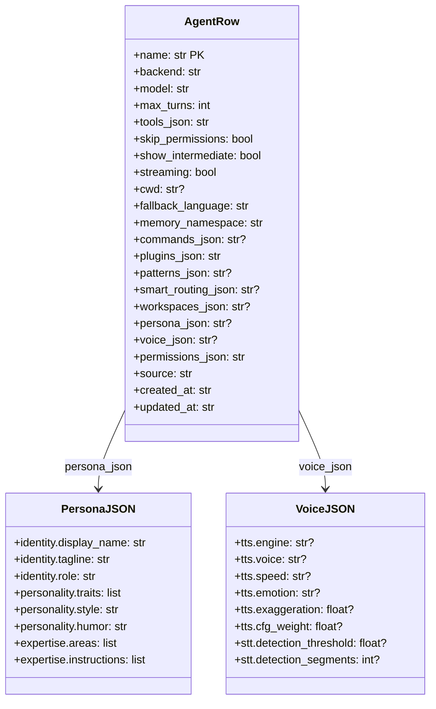
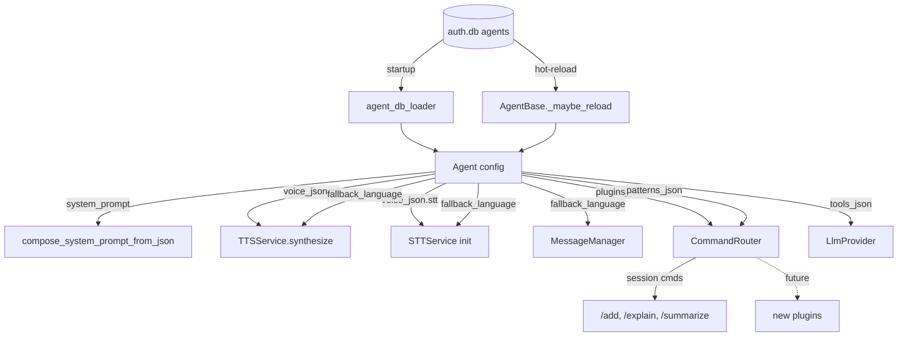

## Context

Promoted from analysis #343. Shape 2 (Layered Migration, 3 PRs) selected. PR1 is the minimum shippable unit — unblocks `/add` on deployed bots. PR2 and PR3 are scope-variable within the 2-week cycle.

## Goal

Make the DB the single source of truth for agent config, fix session command registration for `SimpleAgent`, and clean up the naming taxonomy (tools / commands / plugins / patterns).

## Users

- **Primary:** Mickael — sole operator, directly hit by `/add` not working and config drift
- **Secondary:** Future agents/personas — simpler config model for adding new agents

## Expected Behavior

### After PR1 (Schema + Hot-reload + Session fix)

1. User sends a bare URL in Telegram/Discord → Lyra rewrites to `/add <url>` → scrapes, summarizes, saves to vault. Works on both bots (claude-cli backend).
2. User runs `lyra agent edit lyra_default` → changes model to `claude-opus-4-6` → next message picks up the change via DB `updated_at` polling (no daemon restart).
3. Agent persona is stored inline as `persona_json` in the DB — no `.persona.toml` file lookup.
4. TTS/STT config lives in a single `voice_json` column — no separate `tts_json`/`stt_json`.
5. `fallback_language` replaces `i18n_language` — TTS, STT, and message templates all read from this single field.

### After PR2 (Taxonomy rename)

6. `src/lyra/plugins/` directory renamed to `src/lyra/commands/`. `PluginLoader` → `CommandLoader`. `plugins_enabled` → `commands_enabled`.
7. `patterns_json` in agent config controls which rewrite rules are active per agent (e.g. `{"bare_url": true}`).
8. `/help` output reflects new taxonomy: commands section lists `/svc`, `/echo`, etc.; plugins section lists `/add`, `/search`, etc.

### After PR3 (Cleanup)

9. Old DB columns (`persona`, `tts_json`, `stt_json`, `i18n_language`) removed via table rebuild.
10. TOML seed files (`src/lyra/agents/*.toml`) and persona files (`~/.roxabi-vault/personas/*.persona.toml`) deleted.
11. `load_agent_config()` (TOML path) removed — only `agent_row_to_config()` (DB path) remains.
12. Tests use `AgentRow`/direct `Agent()` construction — no TOML fixture dependency.

## Data Model & Consumers

### Agent Config (after PR1)



### Consumer Map



### Consumer Summary

| Consumer | Fields | When | Status |
|----------|--------|------|--------|
| `agent_db_loader` | all columns | startup + hot-reload | PR1 |
| `compose_system_prompt_from_json` | `persona_json` | agent load | PR1 |
| `TTSService.synthesize` | `voice_json.tts.*`, `fallback_language` | voice response | PR1 |
| `STTService` init | `voice_json.stt.*`, `fallback_language` | startup | PR1 |
| `MessageManager` | `fallback_language` | startup | PR1 |
| `CommandRouter` | `plugins_json`, `patterns_json` | router build | PR1 (plugins), PR2 (patterns) |
| `AgentBase._maybe_reload` | `updated_at` | per-message | PR1 |
| `SimpleAgent._register_session_commands` | (implicit) | router build | PR1 |
| `LlmProvider` | `tools_json`, `model`, `backend` | LLM call | unchanged |

## Breadboard

### PR1 — Schema + Hot-reload + Session fix

| ID | Affordance | Handler | Data |
|----|-----------|---------|------|
| S1a | `AgentStore.connect()` adds columns | `_MIGRATE_AGENTS` | ALTER TABLE ADD COLUMN × 4: `persona_json`, `voice_json`, `fallback_language`, `patterns_json` |
| S1b | `AgentStore.connect()` populates new columns | `_populate_343()` | Read old columns → `load_persona(name)` → serialize to `persona_json`; merge `tts_json`+`stt_json` → `voice_json`; copy `i18n_language` → `fallback_language`. Skip if `persona_json` already non-NULL. If persona file missing → set `persona_json` to `{"identity":{"display_name": agent_name}}` (minimal fallback). |
| S1c | `AgentRow` + `from_db_row` + `_AGENT_COLUMNS` + `_UPSERT_AGENT` updated | add 4 new fields to dataclass, tuple unpack (26 cols), column list, upsert SET clause | Must be coordinated — column count invariant is load-bearing |
| S2 | `agent_db_loader.agent_row_to_config()` reads new columns | dual-read: new first, old fallback | `persona_json`, `voice_json`, `fallback_language`, `patterns_json` |
| S3 | `compose_system_prompt_from_json(persona_dict)` | new function in `persona.py` | `persona_json` → system prompt string |
| S4 | `AgentBase.__init__` accepts `agent_store` | optional injection | `AgentStore` ref for hot-reload |
| S5 | `AgentBase._maybe_reload()` polls DB | compare `updated_at` vs cached | `AgentStore.get(name).updated_at` |
| S6 | `SimpleAgent._register_session_commands()` | override hook, use `self._provider` as session driver | registers `/add`, `/explain`, `/summarize` |
| S7 | `SimpleAgent._build_router_kwargs()` adds `session_driver` | pass `self._provider` | `CommandRouter` receives driver |
| S8 | `AgentVoiceConfig` dataclass (new wrapper around existing typed configs) | parsed from `voice_json` | `tts: AgentTTSConfig`, `stt: AgentSTTConfig` |
| S9 | `voice_overlay.py` reads `VoiceConfig` | `apply_agent_voice_overlay()` | `agent.voice.tts`, `agent.voice.stt` |
| S10 | `tts/__init__.py` reads `fallback_language` | merge into `_build_generate_kwargs()` | replaces `agent_tts.language` |

### PR2 — Taxonomy rename

| ID | Affordance | Handler | Data |
|----|-----------|---------|------|
| T1 | `PluginLoader` → `CommandLoader` | class + file rename | `command_loader.py` |
| T2 | `PluginReloadManager` → `CommandReloadManager` | class + file rename | `command_manager.py` |
| T3 | `src/lyra/plugins/` → `src/lyra/commands/` | directory rename | all plugin dirs |
| T4 | `plugins_enabled` → `commands_enabled` in `Agent` | field rename | `agent_config.py` |
| T5 | `patterns_json` wired into `CommandRouter.prepare()` | configurable rewrite rules | `{"bare_url": true}` |
| T6 | `/help` output updated | new sections: Commands, Plugins | `builtin_commands.py` |

### PR3 — Cleanup

| ID | Affordance | Handler | Data |
|----|-----------|---------|------|
| U1 | 12-step table rebuild | drop `persona`, `tts_json`, `stt_json`, `i18n_language` | `agent_schema.py` |
| U2 | Delete TOML files | remove `src/lyra/agents/*.toml`, vault personas | filesystem |
| U3 | Delete `load_agent_config()` | remove TOML loading path | `agent_loader.py` |
| U4 | Delete `AgentTTSConfig`, `AgentSTTConfig` | replaced by `VoiceConfig` | `agent_config.py` |
| U5 | Rewrite TOML-dependent tests | use `AgentRow`/`Agent()` directly | 21 test files |

## Slices

| Slice | Affordances | Demo |
|-------|------------|------|
| **1. DB schema migration** | S1 | `lyra` starts, new columns exist, old data migrated |
| **2. DB hot-reload** | S4, S5 | Edit agent in DB → next message uses new config (no restart) |
| **3. Session command fix** | S6, S7 | `/add <url>` works on Telegram with claude-cli backend |
| **4. Persona inline** | S2, S3 | System prompt composed from `persona_json`, no file lookup |
| **5. Voice merge** | S2, S8, S9, S10 | TTS uses `voice_json` + `fallback_language`, no `tts_json`/`stt_json` |
| **6. Taxonomy rename** | T1-T6 | `src/lyra/commands/` exists, `/help` shows new sections |
| **7. Cleanup** | U1-U5 | Old columns gone, TOML files deleted, tests pass |

## Design Decisions

### D1: `connect()` operation order (architect review finding)

Migration operations in `AgentStore.connect()` must execute in strict order:
1. `CREATE TABLE IF NOT EXISTS` (existing)
2. `ALTER TABLE ADD COLUMN` migrations (existing + new)
3. **Data migration** (new: populate `persona_json`, `voice_json`, `fallback_language` from old columns)
4. `_warm_cache()` (existing)

Step 3 runs only if new columns are NULL (idempotent). After step 4, the cache reflects migrated data.

### D2: Rollback path for PR1 (product review finding)

Data migration is **idempotent and non-destructive**: old columns are never modified. If PR1 has a bug:
- Revert the code → old columns still intact → `agent_db_loader` reads old columns as before
- New columns contain migrated data but are ignored by old code (unknown columns are harmless in SQLite)

No explicit rollback migration needed.

### D3: `lyra agent init --force` during transition (product review finding)

Between PR1 and PR3, `lyra agent init --force` re-seeds from TOML and could overwrite new DB columns with stale TOML values. Mitigation: the upsert SQL uses `COALESCE(excluded.persona_json, agents.persona_json)` for the new columns — if the seeder constructs an `AgentRow` with `persona_json=None` (because the seeder doesn't know about the new field yet), the existing non-NULL value is preserved. This is a DB-level guard, not application-level, so it works regardless of seeder code changes.

### D4: `SimpleAgent` session command registration (architect review finding)

`SimpleAgent._register_session_commands()` is identical to `AnthropicAgent`'s implementation. Both agents have a `self._provider` (set in `__init__` from the injected `LlmProvider` instance — `ClaudeCliDriver` for SimpleAgent, `AnthropicSdkDriver` for AnthropicAgent). The session command handlers only call `driver.complete()` — no SDK-specific features. `SimpleAgent` passes `session_driver=self._provider` in `_build_router_kwargs()`.

**Init-order constraint:** `SimpleAgent` must assign `self._provider = provider` **before** calling `super().__init__()`, because `AgentBase.__init__` calls `_rebuild_command_router()` → `_register_session_commands()` which reads `self._provider`. This mirrors `AnthropicAgent`'s init order (line 59 before line 60).

### D5: `_update_persona_tracking()` and `_maybe_reload()` switch to DB path (architect review finding)

PR1 replaces `_update_persona_tracking()` with a no-op (persona is now inline JSON, no file to watch). Hot-reload for persona changes goes through DB `updated_at` — edit persona via `lyra agent edit`, `updated_at` bumps, `_maybe_reload()` picks it up.

**Critical:** `_maybe_reload()` must fully switch from TOML path (`load_agent_config()`) to DB path (`agent_row_to_config(store.get(self.name))`). It cannot fall back to TOML loading — the DB is the only source of truth after PR1. The TOML mtime check, `_config_path`, and `_last_mtime` fields are all replaced by `_last_db_updated_at` string comparison.

### D6: `AgentVoiceConfig` wraps existing typed configs (architect review finding)

New wrapper dataclass in `agent_config.py` (named `AgentVoiceConfig` to avoid collision with the existing persona `VoiceConfig`):
```python
@dataclass(frozen=True)
class AgentVoiceConfig:
    tts: AgentTTSConfig = field(default_factory=AgentTTSConfig)
    stt: AgentSTTConfig = field(default_factory=AgentSTTConfig)
```

This preserves type safety and the existing unknown-key warning logic in `agent_db_loader.py`. `Agent.tts` and `Agent.stt` are replaced by `Agent.voice: AgentVoiceConfig | None`. All consumers (`tts/__init__.py`, `voice_overlay.py`, `audio_pipeline.py`, `hub_outbound.py`) updated in PR1 to read from `agent.voice.tts` / `agent.voice.stt`. The old persona `VoiceConfig` (speaking_style, pace, warmth) is deleted in PR3 along with `PersonaConfig`.

`voice_json` serialization: `{"tts": {typed fields}, "stt": {typed fields}}` → deserialized via existing `_build_tts_from_dict()` and `_build_stt_from_dict()` builders.

### D7: PR ordering constraint (architect review finding)

PR2 must branch from merged PR1 (not from `staging`). `agent.py` and `agent_config.py` are touched in both PR1 and PR2. PR2 must also add `agent.py` to its file impact (it imports `PluginLoader` which gets renamed).

### D8: Bare URL rewrite — PR1 vs PR2 split

PR1 keeps the existing hardcoded bare URL → `/add` rewrite in `CommandRouter.prepare()` (unchanged behavior). PR2 makes it configurable via `patterns_json` — the `_BARE_URL_RE` check becomes gated on `patterns.get("bare_url", True)`. The `patterns_json` column is added in PR1 (schema) but not read until PR2 (wiring).

## Success Criteria

### PR1 — Schema + Hot-reload + Session fix

- [ ] `/add <url>` returns a summary on Telegram with `backend = "claude-cli"`
- [ ] `/explain <url>` and `/summarize <url>` work on both Telegram and Discord
- [ ] `lyra agent edit` changes take effect on next message without daemon restart
- [ ] `persona_json` column populated from existing persona files during migration
- [ ] `voice_json` column populated from existing `tts_json` + `stt_json` during migration
- [ ] `fallback_language` column populated from `i18n_language` during migration
- [ ] TTS voice response uses `fallback_language` field when Whisper returns no detected language (verified: `_build_generate_kwargs` receives `fallback_language` value)
- [ ] STT `language_fallback` config reads from `fallback_language` column (verified: `apply_agent_stt_overlay` uses it)
- [ ] Agent with `voice_json = NULL` (fresh install) falls back to global TTS/STT defaults without error
- [ ] `lyra agent init --force` preserves existing `persona_json` (COALESCE guard in upsert SQL)
- [ ] DB unavailable during `_maybe_reload()` → agent continues with cached config (no crash)
- [ ] Migration handles missing persona file → sets minimal `persona_json` fallback

### PR2 — Taxonomy rename

- [ ] `PluginLoader` renamed to `CommandLoader` — no import of old name anywhere in codebase
- [ ] `src/lyra/commands/` directory exists with echo, search, svc, pairing
- [ ] `patterns_json` controls bare URL rewrite per agent (disabled = bare URLs pass through)
- [ ] `/help` output shows "Commands" section (builtins) and "Plugins" section (functional modules)

### PR3 — Cleanup

- [ ] Old DB columns (`persona`, `tts_json`, `stt_json`, `i18n_language`) absent from schema
- [ ] No `.toml` files in `src/lyra/agents/`
- [ ] No `.persona.toml` files in vault
- [ ] Agent config tests use `AgentRow`/`Agent()` construction — no `load_agent_config()` calls
