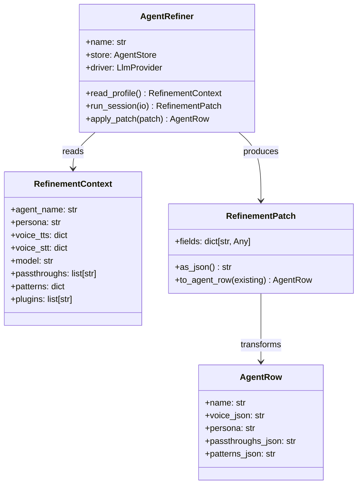
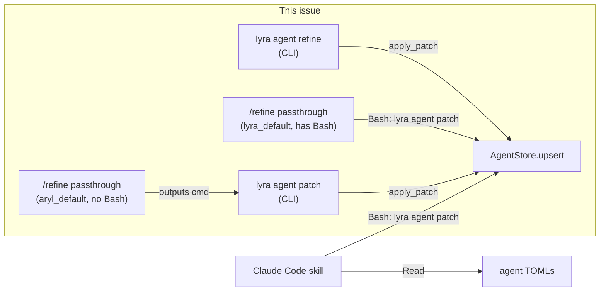

## Context

Promoted from `artifacts/frames/352-agent-profile-refiner-frame.mdx`.

Agent config (persona, voice, passthroughs, patterns, model) is editable only
via `lyra agent edit` — a field-by-field terminal prompt with no context or
guidance. No bot-side refinement, no design-time tool.

## Goal

Deliver interactive agent profile refinement across three surfaces: CLI
(conversational Q&A → DB write), bot passthrough (in-chat refinement → patch
command output), and Claude Code skill (design-time config suggestions).

## Users

- **Primary:** Mickael (operator) — tuning Lyra and Aryl from terminal, Telegram/Discord,
  or Claude Code
- **Secondary:** Future multi-machine operators

## Expected Behavior

### Surface 1 — CLI: `lyra agent refine <name>`

1. Operator runs `lyra agent refine lyra_default`
2. CLI reads full agent profile from DB: persona, voice (tts/stt), model,
   passthroughs, patterns, plugins
3. LLM (via `AgentRefiner`) presents the current profile in plain language and
   asks "what would you like to change?"
4. Conversational back-and-forth: operator describes desired changes, LLM
   proposes specific field updates, operator confirms
5. On confirmation, `AgentRefiner.apply_patch()` calls `AgentStore.upsert()`
   with the updated `AgentRow`
6. CLI prints a diff of changed fields and prompts for restart if needed

### Surface 2 — Bot: `/refine` passthrough

1. Operator sends `/refine` in Telegram or Discord
2. Message is forwarded to Claude (passthrough — no Python handler)
3. Claude reads its own config using `Read` tool on TOML + persona files
4. Guides operator through refinement conversation
5. At the end, runs `lyra agent patch <name> --json '<patch>'` via `Bash` to
   persist changes directly (`lyra_default` has `Bash` + `skip_permissions=true`)

> **Note:** `aryl_default` does not have `Bash` in its tools. For Aryl, the bot
> surface outputs a `lyra agent patch` command for the operator to run manually.

### Surface 3 — Claude Code skill: `/refine-agent`

1. Developer invokes `/refine-agent` in Claude Code
2. Skill reads agent TOMLs (`src/lyra/agents/`) and persona files (`~/.roxabi-vault/personas/`)
3. Presents current profile and asks what to improve (persona text, voice settings, etc.)
4. Conversational refinement session — proposes specific field changes
5. Applies changes via `lyra agent patch <name> --json '<patch>'` using `Bash` (full Claude Code context — no prompt injection risk)

## Data Model & Consumers

| Consumer | Fields used | When | Status |
|----------|-------------|------|--------|
| CLI `refine` | all RefinementContext fields | interactive session | this issue |
| Bot `/refine` | persona, voice, passthroughs, patterns | in-chat guidance | this issue |
| `lyra agent patch` | any AgentRow field as JSON | patch application | this issue |
| Skill `/refine-agent` | TOML + persona files + DB via patch | design-time, full write | this issue |
| Bot direct write | all | future (needs tool scoping) | future |

## Breadboard

### B1 — `AgentRefiner` core

| Affordance | Handler | Data |
|-----------|---------|------|
| `AgentRefiner(name, store, driver)` | `__init__` | validates agent ∃ in store |
| `read_profile()` | reads DB row → `RefinementContext` | all mutable profile fields |
| `run_session(io)` | LLM conversation loop | `RefinementContext` → `RefinementPatch` |
| `apply_patch(patch)` | `store.upsert(patch.to_agent_row(existing))` | `RefinementPatch` → DB |

### B2 — CLI `lyra agent refine <name>`

| Affordance | Handler | Data |
|-----------|---------|------|
| `lyra agent refine <name>` | `refine()` in `cli_agent_crud.py` | name arg |
| connect store | `_connect_store()` | `~/.lyra/auth.db` |
| start session | `AgentRefiner.run_session(TerminalIO)` | stdin/stdout |
| apply on confirm | `AgentRefiner.apply_patch()` | `RefinementPatch` |
| print diff | field comparison before/after | old vs new `AgentRow` |

### B3 — CLI `lyra agent patch <name> --json <patch>`

| Affordance | Handler | Data |
|-----------|---------|------|
| `lyra agent patch <name> --json '{...}'` | `patch_agent()` in `cli_agent_crud.py` | name + JSON string |
| parse patch | `json.loads(patch_json)` → `RefinementPatch` | JSON → patch dict |
| apply | `AgentRefiner.apply_patch()` | patch → DB |
| print result | changed fields summary | stdout |

### B4 — Bot `/refine` passthrough

| Affordance | Handler | Data |
|-----------|---------|------|
| `/refine` in chat | `register_passthrough("refine")` | routed to Claude |
| Claude reads config | `Read` tool on TOML + persona files | agent files |
| refinement conversation | LLM session in bot thread | user messages |
| output patch command | `lyra agent patch <name> --json '<patch>'` | stdout to user |

### B5 — Claude Code skill

| Affordance | Handler | Data |
|-----------|---------|------|
| `/refine-agent` | skill entry point | prompts for agent name |
| read TOMLs | `Read` tool | `src/lyra/agents/*.toml` |
| read personas | `Read` tool | `~/.roxabi-vault/personas/*.toml` |
| refinement conversation | LLM session | proposes specific field changes |
| apply changes | `Bash: lyra agent patch <name> --json '<patch>'` | writes to DB |

## Slices

| # | Slice | Surfaces | Demo |
|---|-------|----------|------|
| 1 | `AgentRefiner` core + `lyra agent patch` CLI | core + B3 | `lyra agent patch lyra_default --json '{"voice_json": "..."}'` applies |
| 2 | `lyra agent refine` CLI | B2 | `lyra agent refine lyra_default` starts session, changes persona |
| 3 | Bot `/refine` passthrough | B4 | `/refine` in Telegram starts conversation, outputs patch command |
| 4 | Claude Code skill | B5 | `/refine-agent` in Claude Code refines profile and applies via `lyra agent patch` |

## Success Criteria

- [ ] `lyra agent patch <name> --json '<json>'` applies a partial AgentRow update to DB
- [ ] `lyra agent refine <name>` starts an interactive LLM session, reads current profile,
      and writes changes to DB on operator confirmation
- [ ] `lyra agent refine <name>` prints a before/after diff of changed fields
- [ ] `/refine` is registered as a passthrough in `lyra_default` and `aryl_default`
      (via `passthroughs_json` DB column, not hardcoded)
- [ ] `/refine` in Telegram/Discord produces a ready-to-run `lyra agent patch` command
- [ ] Claude Code skill reads agent TOMLs + persona files, refines conversationally, and applies changes via `lyra agent patch`
- [ ] All tests pass (`uv run pytest`)
- [ ] `lyra agent patch` with invalid JSON returns a clear error (non-zero exit)
- [ ] `lyra agent refine` on unknown agent name returns a clear error
