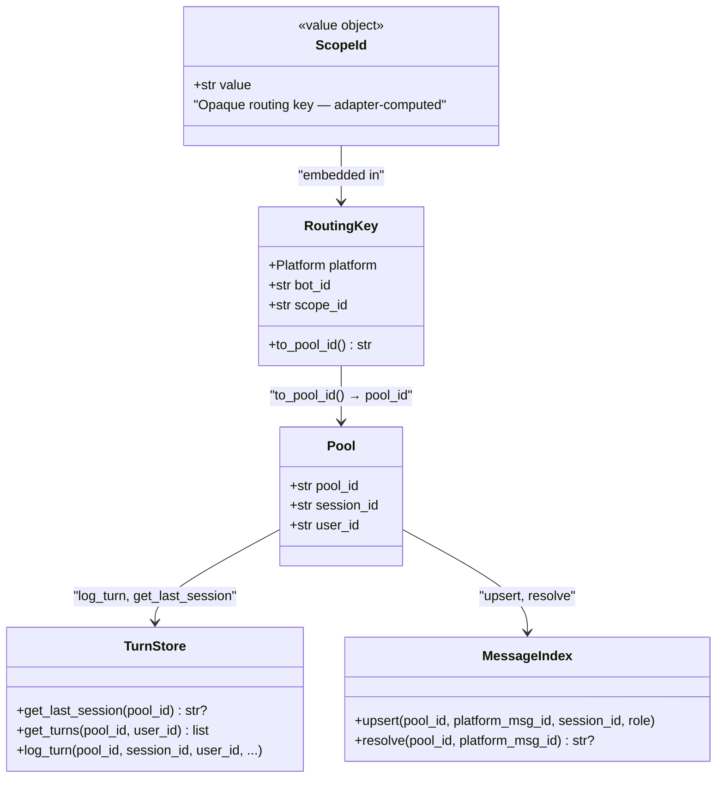

## Context

Issue #356 identifies a cross-user session leaking risk in shared conversation spaces (Telegram groups, Discord channels). The root cause traces back to #112 (conversation-scoped sessions), which deliberately chose chat-level `scope_id` for groups. That decision means all users in a shared space share one `pool_id`, and session resumption logic can serve one user's history to another.

Current mitigations: `is_group` guards block resume Paths 1 and 3 for Telegram groups (`message_pipeline.py:305-309`, `353-354`). However:

1. **Discord has no equivalent guard on any path** — `guild_id` is set in `platform_meta` but `is_group` is never set by the Discord adapter. Both Path 1 (reply-to-resume via `MessageIndex`) and Path 3 (`get_last_session`) can resume Alice's session for Bob in a Discord guild channel.
2. **Guards are defensive patches, not structural safety** — any new resume path must remember to add the guard, or the vulnerability resurfaces.
3. **`Pool.user_id`** is set from the first message and never updated (`pool.py:253-256`), making it incorrect for multi-user pools.

## Goal

Eliminate cross-user session leaking by making `scope_id` user-scoped in shared spaces at the adapter layer, so that each user gets their own pool by construction — no guards needed.

## Users

- **Primary:** All users interacting with Lyra in Telegram groups or Discord guild channels
- **Secondary:** Future adapters (Slack, etc.) — the pattern established here becomes the reference implementation

## Expected Behavior

**Before:** In a Telegram group or Discord channel, Alice and Bob share `pool_id = "telegram:main:chat:42"`. Session resume can serve Alice's history to Bob (guarded in Telegram, unguarded in Discord).

**After:** Alice gets `pool_id = "telegram:main:chat:42:user:tg:user:alice"`, Bob gets `pool_id = "telegram:main:chat:42:user:tg:user:bob"`. Each has their own pool, session, and history. Resume works correctly for both — same as DMs.

**User-visible behavior change:** Existing group users will see a "fresh start" after deploy — no session continuity from prior group conversations. This is acceptable because groups had no resume before (blocked by guards). No user loses functionality they previously had. Worth a changelog entry.

### Scope extraction rules (updated from #112)

| Platform | Context | scope_id (before) | scope_id (after) |
|----------|---------|-------------------|------------------|
| Telegram DM | private chat | `chat:{chat_id}` | `chat:{chat_id}` (unchanged) |
| Telegram group | group chat | `chat:{chat_id}` | `chat:{chat_id}:user:{user_id}` |
| Telegram forum | topic in supergroup | `chat:{chat_id}:topic:{topic_id}` | `chat:{chat_id}:topic:{topic_id}:user:{user_id}` |
| Discord DM | DM channel | `channel:{channel_id}` | `channel:{channel_id}` (unchanged) |
| Discord channel | guild text channel | `channel:{channel_id}` | `channel:{channel_id}:user:{user_id}` |
| Discord thread | thread (any type) | `thread:{thread_id}` | `thread:{thread_id}` (unchanged) |

**DMs and threads are unchanged** — they are already single-user or have thread-session-resume (Path 2).

**Discord threads are left as-is** because they already have `thread_session_id` resume (Path 2) and are typically short-lived conversations where the thread creator "owns" the session.

### Shared helper

A utility function in core provides the `:user:{user_id}` suffix so adapters don't each reinvent it:

```python
# src/lyra/core/scope.py
def user_scoped(scope_id: str, user_id: str) -> str:
    """Append user identity to a scope_id for shared-space isolation."""
    return f"{scope_id}:user:{user_id}"
```

**Why in `core/` and not `adapters/`:** `scope_id` is adapter-computed and opaque to `RoutingKey` — `RoutingKey.to_pool_id()` concatenates it as a string without interpreting its structure. The helper lives in `core/` because it is a shared utility called by multiple adapters; it does not violate the dependency rule because it produces a value that flows *into* core, not *out of* it. Adapters import the helper; core never calls it.

### `is_group` in `platform_meta` — preserved

`is_group` remains in Telegram's `platform_meta`. It serves two distinct purposes:

1. **Admission control** (`telegram_inbound.py:72`) — gates whether non-mention group messages are pushed to the hub at all. This is a routing filter unrelated to session safety. **Preserved.**
2. **Session resume guards** (`message_pipeline.py:305-309`, `353-354`) — block resume in groups to prevent cross-user leaking. **Removed in V3** (redundant after V1+V2 make scope_id user-scoped).

The Discord adapter does not set `is_group` in `platform_meta` — it uses `guild_id` instead. This asymmetry is acceptable because after V2, Discord guild channels are user-scoped by construction and need no guards.

## Data Model & Consumers

### scope_id flow



### Consumer summary

| Consumer | Fields consumed | When | Status |
|----------|----------------|------|--------|
| `PoolManager.get_or_create_pool` | `pool_id` (from scope_id) | Every inbound message | This issue (pool_id now user-scoped in shared spaces) |
| `TurnStore.get_last_session` | `pool_id` | Path 3 resume | This issue (automatically correct — pool_id is user-scoped) |
| `TurnStore.get_turns` | `pool_id`, `user_id` | History retrieval | Already safe (double-filters) |
| `MessageIndex.resolve` | `pool_id`, `platform_msg_id` | Path 1 resume | This issue (pool_id now user-scoped) |
| `message_pipeline._resolve_context` | `is_group` guard | Path 1, 3 | This issue (session guards removed — redundant) |
| `Pool.append` | `user_id` (lazy-init) | First message | This issue (now always correct — one user per pool) |
| `telegram_inbound.py:72` | `is_group` (admission control) | Before hub push | Preserved — not a session guard |
| `Hub.register_binding` | `pool_id` uniqueness | Explicit bindings only | Unaffected — wildcard-derived pools bypass this check |
| `CliPool` | `pool_id` as process key | CLI agent spawn | Unaffected — CLI pools are always single-user |

## Breadboard

This is a backend-only refactor. No UI affordances change. The wiring below shows **target state after V1+V2**:

| Input | Handler | Data (after change) |
|-------|---------|------|
| Raw Telegram message | `telegram_normalize._make_scope_id()` | `chat_id`, `topic_id`, `user_id`, `is_group` (signature expanded in V1) |
| Raw Discord message | `discord_normalize.normalize()` | `channel_id`, `thread_id`, `user_id`, `guild_id` (scope_id call added in V2) |
| scope_id (opaque) | `RoutingKey.to_pool_id()` | `platform`, `bot_id`, `scope_id` (unchanged) |
| pool_id (opaque) | `PoolManager.get_or_create_pool()` | `pool_id` → Pool instance (unchanged) |
| InboundMessage | `_resolve_context()` | `msg`, `pool`, `pool_id` → resume decision (guards removed in V3) |

## Slices

| Slice | Description | Files | Independently testable | Deploy constraint |
|-------|-------------|-------|----------------------|-------------------|
| V1 | Core helper + Telegram adapter | `core/scope.py`, `telegram_normalize.py`, tests | Yes — Telegram groups get per-user pools | Can ship independently |
| V2 | Discord adapter | `discord_normalize.py`, tests | Yes — Discord channels get per-user pools | Can ship independently |
| V3 | Remove `is_group` session guards | `message_pipeline.py`, tests | Yes — guards are now redundant | **Must not deploy until V1+V2 are both in production** |

**V3 deployment constraint:** The `is_group` guards in `message_pipeline.py` are load-bearing until both adapters produce user-scoped `scope_id`. Deploying V3 before V2 would re-open the Discord vulnerability. Ship V1+V2 first, confirm in production, then V3.

## Success Criteria

- [ ] **SC-1:** New `user_scoped()` helper exists in `src/lyra/core/scope.py` with unit test
- [ ] **SC-2:** Telegram groups produce `scope_id = "chat:{chat_id}:user:{user_id}"` (verified by unit test on `_make_scope_id`)
- [ ] **SC-3:** Telegram forum topics produce `scope_id = "chat:{chat_id}:topic:{topic_id}:user:{user_id}"` (verified by unit test)
- [ ] **SC-4:** Telegram DMs produce unchanged `scope_id = "chat:{chat_id}"` (regression test)
- [ ] **SC-5:** Discord guild channels produce `scope_id = "channel:{channel_id}:user:{user_id}"` (verified by unit test on `normalize()`)
- [ ] **SC-6:** Discord DMs produce unchanged `scope_id = "channel:{channel_id}"` (regression test)
- [ ] **SC-7:** Discord threads produce unchanged `scope_id = "thread:{thread_id}"` (regression test)
- [ ] **SC-8:** Two different users in the same Telegram group get distinct `pool_id` values (unit test: two `_make_scope_id` calls with different `user_id` → different results → different `RoutingKey.to_pool_id()`)
- [ ] **SC-9:** Two different users in the same Discord channel get distinct `pool_id` values (unit test: two `normalize()` calls with different authors → different `scope_id`)
- [ ] **SC-10:** Session resume (Path 3) works correctly for users in shared spaces — each user resumes their own session. Test setup: configure `TurnStore`, log turns for two users with different pool_ids in the same chat, verify each user's `get_last_session` returns only their own session_id.
- [ ] **SC-11:** `is_group` session guards in `message_pipeline.py` (lines 305-309, 353-354) are removed. The `is_group` admission gate in `telegram_inbound.py:72` is preserved.
- [ ] **SC-12:** All existing tests pass (no regressions in DM or thread behavior)
- [ ] **SC-13:** Reply-to-resume (Path 1) correctly resolves to the replying user's own session in shared spaces — a reply in a group triggers `MessageIndex.resolve` with the user-scoped `pool_id` and returns the correct session (unit test)

## Edge Cases

| Case | Handling |
|------|----------|
| User sends in both DM and group | Different scope_ids → different pools → independent sessions (correct) |
| Bot added to new group, first message | New per-user pool created, no prior session to resume (correct) |
| Existing TurnStore data with old pool_id format | Old sessions won't be found by new pool_id format — fresh start in groups (acceptable: groups had no resume before due to guards) |
| Existing MessageIndex data with old pool_id format | Reply-to-resume for old messages will return `None` (silent skip) — no stale data served, user sees fresh session. Same rationale: old group messages were never resumable. |
| Discord voice channels | Excluded — voice uses `VoiceSessionManager`, not pool routing |
| Future adapter (Slack) | Follows the pattern: call `user_scoped()` when detecting a shared space |
| Active group with many users | Each user gets their own pool (and CliPool process if applicable). Proportional resource usage is acceptable — groups are bounded by platform limits. |
| Discord thread without `thread_session_id` | If `thread_session_id` is missing from `platform_meta`, Path 2 is skipped and Path 3 uses the thread-scoped (not user-scoped) pool_id. Two users could share a thread pool. Acceptable for now — threads are short-lived and this is a rare edge case. |

## Out of Scope

- **Shared group context** (all users seeing the same conversation) — different product requirement
- **Migration of historical turn data** to new pool_id format — old group sessions were never resumed anyway
- **General Telegram group support** (group-aware responses, group commands) — this spec addresses session isolation only; broader group features are a separate concern
- **Multi-user Discord forum threads** — in long-lived forum threads with multiple contributors, the thread creator's session may be resumed for all users via Path 2. This is a known limitation, acceptable for this issue's scope.
- **ADR-035** — this spec establishes "user-scoped scope_id" as the isolation primitive replacing defensive guards. The ADR should be written alongside or after implementation to document this architectural decision.
