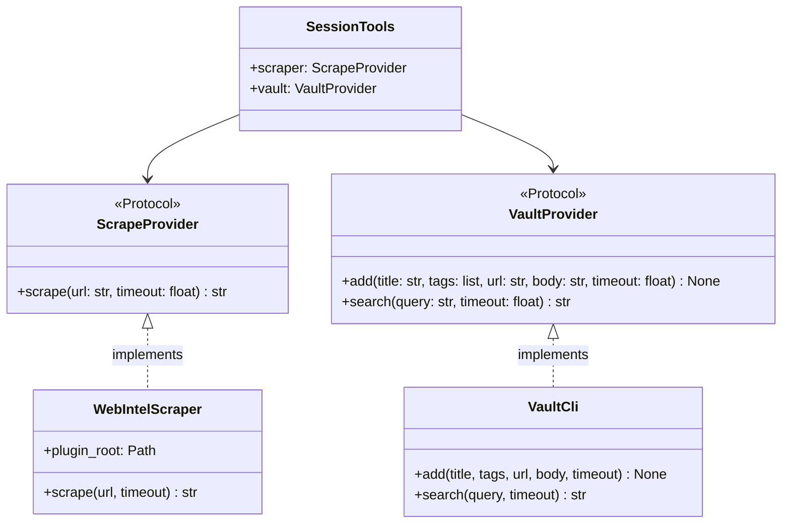
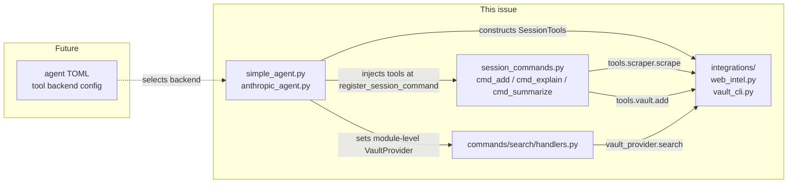

## Context

Promoted from GitHub issue #360. No prior analysis artifact — sourced directly from issue
description and architecture review session (2026-03-18).

Current state: `src/lyra/core/session_helpers.py` hardcodes subprocess invocation for two
external tools (web-intel plugin, vault CLI) inside Lyra's core layer. This is a layer
violation — core should define abstractions, not encode external tool internals.

Reference pattern: `src/lyra/llm/base.py` (`LlmProvider` Protocol, ADR-016) + `src/lyra/llm/drivers/`
(implementations) — the exact pattern to replicate. See also ADR-030 for binding design decisions.

## Goal

Decouple session commands from external tool implementation details by introducing
`ScrapeProvider` and `VaultProvider` Protocols, with subprocess implementations in a new
`src/lyra/integrations/` module. `session_helpers.py` is deleted entirely.

## Users

- **Maintainer** — can swap or add scraper/vault backends without touching session command
  logic or core
- **Agent config** *(future)* — agents will declare which tool backends to use via TOML;
  out of scope for this issue but `SessionTools` design must not preclude it

End-users see no behaviour change.

## Expected Behavior

When a session command runs:

1. It calls `tools.scraper.scrape(url, timeout)` — unaware of whether web-intel, a remote
   API, or anything else backs it
2. It calls `tools.vault.add(title, tags, url, body, timeout)` — unaware of backend
3. If a provider is unavailable, it raises `ScrapeFailed` or `VaultWriteFailed` (imported
   from `lyra.integrations.base`) — consumer behaviour unchanged
4. `_scrape_with_fallback` in `session_commands.py` is updated to call
   `tools.scraper.scrape(url, timeout)` instead of the deleted `scrape_url` import
5. Provider implementations live in `src/lyra/integrations/` and are constructed by the
   agent at init time, then injected as a required `SessionTools` into session command
   registration
6. The search plugin command (`commands/search/handlers.py`) receives a `VaultProvider`
   via a module-level injectable set by the agent at startup — separate from session
   command dispatch

## Data Model & Consumers

| Consumer | Fields/methods used | When | Status |
|----------|--------------------|----|--------|
| `cmd_add` | `scraper.scrape`, `vault.add` | on `/vault-add <url>` | this issue |
| `cmd_explain` | `scraper.scrape` | on `/explain <url>` | this issue |
| `cmd_summarize` | `scraper.scrape` | on `/summarize <url>` | this issue |
| `commands/search/handlers.py` | `vault.search` | on search command | this issue |
| Agent TOML backend selection | provider type | future | future |

## Breadboard

### Protocols + exceptions (`src/lyra/integrations/base.py`)

| Affordance | Handler | Data |
|-----------|---------|------|
| `ScrapeProvider.scrape(url, timeout)` async | raises `ScrapeFailed(reason)` on failure | returns `str` |
| `VaultProvider.add(title, tags, url, body, timeout)` async | raises `VaultWriteFailed(reason)` on failure | — |
| `VaultProvider.search(query, timeout)` async | **swallows all errors**, returns graceful `str` | returns `str` |
| `ScrapeFailed(reason: str)` | moved from `session_helpers` | `.reason` attribute |
| `VaultWriteFailed(reason: str)` | moved from `session_helpers` | — |
| `SessionTools(scraper, vault)` | dataclass, both fields required | holds Protocol instances |

> Note: `search` intentionally does not raise — search failure is non-fatal. `add` raises because
> a write failure is actionable. This asymmetry is by design (ADR-030).

### `SessionCommandHandler` Protocol (`src/lyra/core/command_router.py`)

| Affordance | Handler | Data |
|-----------|---------|------|
| `SessionCommandHandler.__call__(msg, driver, tools, args, timeout)` | Protocol updated — `tools: SessionTools` added after `driver` | positional change, atomic with dispatch site |
| `SessionCommandEntry.tools: SessionTools` | new required field | stored at registration |
| `register_session_command(name, handler, tools, description, timeout)` | `tools` is required (not Optional) | stored in `SessionCommandEntry` |
| `_dispatch_session(name, args, msg, pool)` | calls `entry.handler(msg, session_driver, entry.tools, args, entry.timeout)` | `tools` injected positionally |

### WebIntelScraper (`src/lyra/integrations/web_intel.py`)

| Affordance | Handler | Data |
|-----------|---------|------|
| `__init__(plugin_root=None)` | resolves `LYRA_WEB_INTEL_PATH` env var | `Path` |
| `scrape(url, timeout)` async | `uv run python scripts/scraper.py url` in plugin dir | JSON → `data.text` |

### VaultCli (`src/lyra/integrations/vault_cli.py`)

| Affordance | Handler | Data |
|-----------|---------|------|
| `add(title, tags, url, body, timeout)` async | `vault put <body> --title --category references --metadata <json>` | — |
| `search(query, timeout)` async | `vault search <query>` → stdout str; all errors → graceful str | — |

### `_scrape_with_fallback` (`src/lyra/core/session_commands.py`)

| Affordance | Handler | Data |
|-----------|---------|------|
| `_scrape_with_fallback(tools, url, timeout)` async | calls `tools.scraper.scrape(url, timeout)`; catches `ScrapeFailed` variants → placeholder str | unchanged fallback logic |

### Session command handlers (`src/lyra/core/session_commands.py`)

| Affordance | Handler | Data |
|-----------|---------|------|
| `cmd_add(msg, driver, tools, args, timeout)` async | `_scrape_with_fallback(tools,…)` → LLM → `tools.vault.add(…)` | unchanged logic |
| `cmd_explain(msg, driver, tools, args, timeout)` async | `_scrape_with_fallback(tools,…)` → LLM | unchanged logic |
| `cmd_summarize(msg, driver, tools, args, timeout)` async | `_scrape_with_fallback(tools,…)` → LLM | unchanged logic |

### Agent registration (`simple_agent.py`, `anthropic_agent.py`)

| Affordance | Handler | Data |
|-----------|---------|------|
| `_register_session_commands()` | constructs `SessionTools(WebIntelScraper(), VaultCli())`; passes as required `tools=` arg | `SessionTools` |

### Search plugin handler (`src/lyra/commands/search/handlers.py`)

| Affordance | Handler | Data |
|-----------|---------|------|
| `_vault_provider: VaultProvider \| None` | module-level variable, default `None` | set by agent at startup |
| `set_vault_provider(vp: VaultProvider)` | setter called by agent after `SessionTools` construction | replaces `import session_helpers as _helpers` |
| `cmd_search` handler | uses `_vault_provider.search(…)` instead of `_helpers.vault_search(…)` | graceful if `None` |

## Slices

| # | Slice | Files | Demo | Atomic? |
|---|-------|-------|------|---------|
| 1 | Protocols + exceptions + SessionTools | `integrations/__init__.py`, `integrations/base.py` | Import, instantiate, type-check | — |
| 2 | WebIntelScraper implementation | `integrations/web_intel.py` | Unit tests with mocked subprocess | — |
| 3 | VaultCli implementation | `integrations/vault_cli.py` | Unit tests with mocked subprocess | — |
| 4+5 | Wire: Protocol + dispatch + handlers + agents (atomic) | `core/command_router.py`, `core/session_commands.py`, `agents/simple_agent.py`, `agents/anthropic_agent.py`, delete `core/session_helpers.py` | Full suite passes, session_helpers.py gone | ✓ must land together |
| 6 | Search plugin migration | `commands/search/handlers.py` | `/search` tests pass | — |
| 7 | Migrate tests | `tests/integrations/test_web_intel.py`, `tests/integrations/test_vault_cli.py`, delete `tests/core/test_session_helpers.py` | All tests green | — |

> Slices 4+5 are atomic: updating `session_commands.py` handler signatures while agents still
> use the old registration path leaves `tools` landing in the `args` position at dispatch.

## Success Criteria

- [ ] `src/lyra/integrations/base.py` exports `ScrapeProvider`, `VaultProvider` (async Protocols), `SessionTools` dataclass, `ScrapeFailed`, and `VaultWriteFailed`
- [ ] `src/lyra/integrations/web_intel.py` implements `ScrapeProvider` — all existing `scrape_url` behaviour preserved (including `LYRA_WEB_INTEL_PATH` env var)
- [ ] `src/lyra/integrations/vault_cli.py` implements `VaultProvider` — all existing `vault_add`/`vault_search` behaviour preserved
- [ ] `SessionCommandHandler` Protocol in `command_router.py` updated to `(msg, driver, tools, args, timeout) -> Response`
- [ ] `SessionCommandEntry` gains a required `tools: SessionTools` field
- [ ] `CommandRouter.register_session_command` accepts required `tools: SessionTools`
- [ ] `CommandRouter._dispatch_session` passes `entry.tools` when calling handler
- [ ] `session_commands.py` handler signatures updated; `_scrape_with_fallback` updated to accept and use `tools`; no imports from `session_helpers`
- [ ] `simple_agent.py` and `anthropic_agent.py` construct `SessionTools` and pass it at registration
- [ ] `src/lyra/core/session_helpers.py` is deleted
- [ ] `commands/search/handlers.py` updated to use module-level `VaultProvider` injectable; agent sets it at startup
- [ ] `session_commands.py` imports `ScrapeFailed`/`VaultWriteFailed` from `lyra.integrations.base`
- [ ] `tests/core/test_session_helpers.py` deleted; replaced by `tests/integrations/test_web_intel.py` and `tests/integrations/test_vault_cli.py`
- [ ] All existing tests pass — no behaviour change
