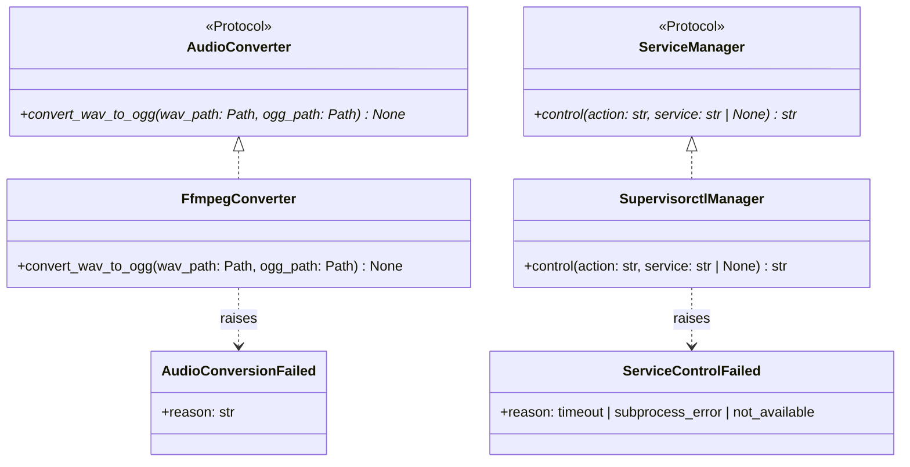
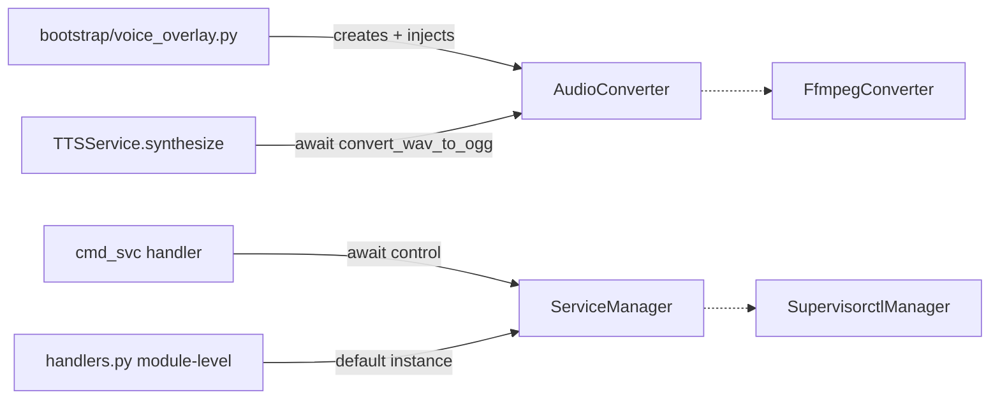

## Context

Promoted from [frame](../frames/362-wrap-ffmpeg-supervisorctl-frame.mdx). PR #361 established the `lyra.integrations` layer with `ScrapeProvider` and `VaultProvider` protocols. Two external tool calls remain outside this layer: `ffmpeg` in `tts/__init__.py` and `supervisorctl.sh` in `commands/svc/handlers.py`.

## Goal

Wrap the two remaining direct external tool calls (`ffmpeg`, `supervisorctl.sh`) behind `Protocol` classes in `lyra.integrations`, matching the pattern from PR #361.

## Users

- **Primary:** Developers — consistent integration layer makes all external tool boundaries predictable and testable.
- **Secondary:** Contributors — protocol boundaries serve as documentation for external dependencies.

## Expected Behavior

### AudioConverter

`TTSService.synthesize()` currently calls the module-level `_wav_to_ogg(wav_path)` function which uses blocking `subprocess.run` to shell out to `ffmpeg`. The function derives `ogg_path` internally via `wav_path.with_suffix(".ogg")` and returns the `Path`.

After this change, `TTSService` receives an `AudioConverter` provider at construction time (default: `FfmpegConverter()`). The protocol method is `async` — `FfmpegConverter` uses `asyncio.create_subprocess_exec` instead of blocking `subprocess.run`, which is better for the event loop. The signature changes to take explicit `(wav_path, ogg_path)` and return `None` — the caller (`synthesize()`) constructs `ogg_path` via `merged_wav.with_suffix(".ogg")` and adds it to `extra_paths` for cleanup, matching the existing pattern.

On subprocess failure, `FfmpegConverter` raises `AudioConversionFailed` (following the `ScrapeFailed` / `VaultWriteFailed` pattern). `TTSService.synthesize()` already has a blanket `except Exception` that re-raises, so error propagation is preserved.

### ServiceManager

`cmd_svc()` currently builds a subprocess command from the module-level `_SUPERVISORCTL` path and shells out inline via `asyncio.create_subprocess_exec`, with a 10-second `wait_for` timeout.

After this change, the handler delegates subprocess execution to a `ServiceManager` provider. `SupervisorctlManager` encapsulates the subprocess call, path resolution, and the 10-second timeout. On timeout or subprocess error, it raises `ServiceControlFailed` (matching the typed-exception pattern). The handler catches `ServiceControlFailed` and maps it to user-facing responses — validation logic (allowed services, actions, aliases) stays in the handler.

**Injection mechanism:** Plugin command handlers have a fixed signature `(msg, pool, args)` — there is no constructor DI available. `ServiceManager` is exposed as a module-level default in `handlers.py` (`_service_manager: ServiceManager = SupervisorctlManager()`), overridable for tests. This differs from the `SessionTools` pattern but matches how `_SUPERVISORCTL` is already used as a module-level constant.

## Data Model & Consumers

| Consumer | Provider | Method | When | Injection |
|----------|----------|--------|------|-----------|
| `TTSService` | `AudioConverter` | `convert_wav_to_ogg` | After WAV merge, before reading OGG bytes | Constructor param (wired in `bootstrap/voice_overlay.py`) |
| `cmd_svc` handler | `ServiceManager` | `control` | On `/svc <action> [service]` command | Module-level default in `handlers.py` |

## Breadboard

### Slice 1: AudioConverter

| Affordance | Handler | Data |
|-----------|---------|------|
| U1: TTS synthesize call | TTSService.synthesize | WAV path → constructs OGG path |
| N1: AudioConverter protocol | integrations/base.py | Protocol + AudioConversionFailed |
| N2: FfmpegConverter impl | integrations/audio.py | async subprocess, raises AudioConversionFailed |
| S1: TTSService constructor | tts/__init__.py | Accepts AudioConverter, defaults to FfmpegConverter() |
| B1: Bootstrap wiring | bootstrap/voice_overlay.py | Creates FfmpegConverter, passes to TTSService |

Wiring: B1 → S1 (injected converter) → U1 → N1 → N2 → OGG file on disk

### Slice 2: ServiceManager

| Affordance | Handler | Data |
|-----------|---------|------|
| U2: /svc command | cmd_svc | action, service name |
| N3: ServiceManager protocol | integrations/base.py | Protocol + ServiceControlFailed |
| N4: SupervisorctlManager impl | integrations/supervisor.py | async subprocess, 10s timeout, raises ServiceControlFailed |
| S2: Module-level default | commands/svc/handlers.py | `_service_manager = SupervisorctlManager()` |

Wiring: U2 → S2 (validated action+service) → N3 → N4 → stdout string (or ServiceControlFailed)

**Note:** `service: str | None` — `None` means "all services" (valid only for `status` action). The handler validates this before calling the provider.

## Slices

| # | Slice | Files | Demo |
|---|-------|-------|------|
| 1 | AudioConverter protocol + FfmpegConverter + TTSService injection | `integrations/base.py`, `integrations/audio.py`, `tts/__init__.py`, `bootstrap/voice_overlay.py` | TTS synthesis still produces OGG audio |
| 2 | ServiceManager protocol + SupervisorctlManager + svc handler injection | `integrations/base.py`, `integrations/supervisor.py`, `commands/svc/handlers.py` | `/svc status` still returns supervisor output |

Slices are independent — no ordering dependency. Both add to `integrations/base.py` in separate sections; coordinate if worked in parallel.

## Success Criteria

- [ ] `AudioConverter` protocol defined in `integrations/base.py` with `async convert_wav_to_ogg(wav_path: Path, ogg_path: Path) -> None`
- [ ] `AudioConversionFailed` exception defined in `integrations/base.py` (matches `ScrapeFailed` pattern)
- [ ] `FfmpegConverter` implementation in `integrations/audio.py` uses `asyncio.create_subprocess_exec` and raises `AudioConversionFailed` on failure
- [ ] `TTSService.__init__` accepts `converter: AudioConverter` (default `FfmpegConverter()`); `synthesize()` constructs `ogg_path` and calls `await self._converter.convert_wav_to_ogg(wav_path, ogg_path)`
- [ ] `FfmpegConverter` wired in `bootstrap/voice_overlay.py` where `TTSService` is instantiated
- [ ] `ServiceManager` protocol defined in `integrations/base.py` with `async control(action: str, service: str | None) -> str`
- [ ] `ServiceControlFailed` exception defined in `integrations/base.py` with `reason` field (timeout | subprocess_error | not_available)
- [ ] `SupervisorctlManager` implementation in `integrations/supervisor.py` encapsulates subprocess call + 10s timeout, raises `ServiceControlFailed`
- [ ] `cmd_svc` handler uses module-level `_service_manager: ServiceManager` default, catches `ServiceControlFailed` for user-facing error messages
- [ ] A test stub satisfying each protocol can be instantiated (`isinstance(stub, AudioConverter)` and `isinstance(stub, ServiceManager)` both `True`)
- [ ] All existing behavior preserved — TTS produces identical OGG output, `/svc` returns identical responses (including timeout and error messages)
