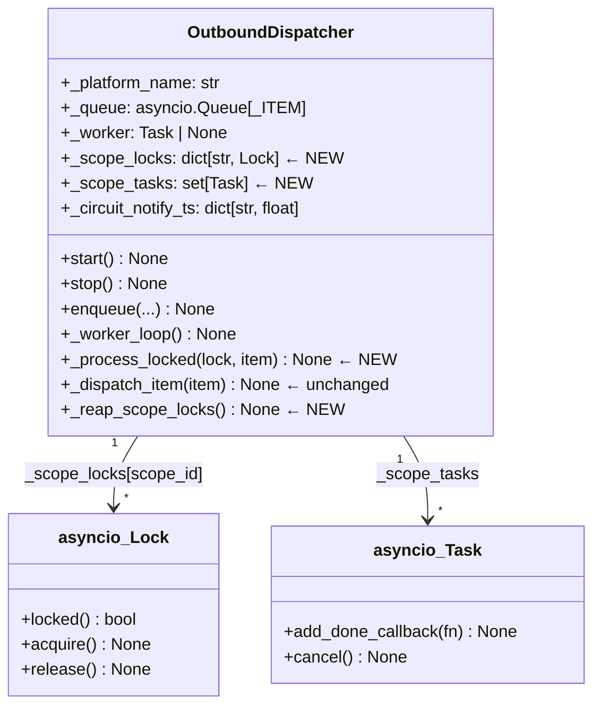
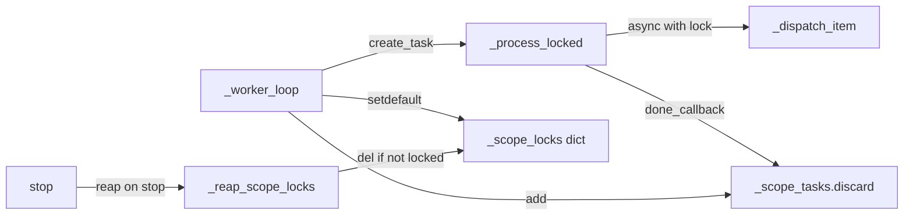

## Context

Promu depuis le frame #364. Analyse skippée (F-lite, solution déjà spécifiée dans l'issue).

Source : [`artifacts/frames/364-concurrent-outbound-dispatching-frame.mdx`](../frames/364-concurrent-outbound-dispatching-frame.mdx)

---

## Goal

Permettre à `OutboundDispatcher` de traiter des messages de **scopes différents en parallèle** tout en garantissant l'**ordre FIFO au sein d'un même scope**, sans modifier `_dispatch_item`.

---

## Users

- **Primary :** Utilisateurs sur Discord/Telegram dont les messages sont bloqués derrière une réponse lente dans un autre thread/canal.
- **Secondary :** Le dispatcher lui-même — croissance mémoire unbounded via `_scope_locks`.

---

## Expected Behavior

### Avant (comportement actuel)

```
Queue: [scope:A msg1 (90s)] [scope:B msg1] [scope:A msg2]
       ↓ worker déqueue
       scope:A msg1 → 90s de traitement
       ↓ seulement après
       scope:B msg1 → traitement
       ↓ seulement après
       scope:A msg2 → traitement
```

Résultat : scope:B attend 90s+ alors qu'il est totalement indépendant.

### Après (comportement cible)

```
Queue: [scope:A msg1 (90s)] [scope:B msg1] [scope:A msg2]
       ↓ worker déqueue scope:A msg1
       asyncio.create_task(_process_locked(lock_A, item)) → démarre immédiatement
       task_done()  ← libère le worker tout de suite
       ↓ worker déqueue scope:B msg1
       asyncio.create_task(_process_locked(lock_B, item)) → démarre immédiatement
       task_done()
       ↓ worker déqueue scope:A msg2
       asyncio.create_task(_process_locked(lock_A, item)) → attend lock_A
       task_done()
```

Résultat : scope:B est traité immédiatement. scope:A msg2 attend que msg1 se termine (ordre garanti).

### Détail du cycle de vie d'une task

1. `_worker_loop` déqueue un item → lit `msg.scope_id`
2. Récupère ou crée `asyncio.Lock` pour ce scope depuis `_scope_locks`
3. `asyncio.create_task(_process_locked(lock, item))` → task enregistrée dans `_scope_tasks`
4. `self._queue.task_done()` → appelé immédiatement dans le bloc `finally` wrappant `create_task` (couvre aussi les chemins `continue` : unknown kind, routing mismatch, circuit open)
5. Task s'exécute indépendamment : `async with lock: await self._dispatch_item(item)`
6. `done_callback(lambda t: self._scope_tasks.discard(t))` retire la task de `_scope_tasks` (évite GC prématuré)

**Important :** Le `finally: self._queue.task_done()` existant (ligne 297-298) est déplacé pour wrapper l'appel `create_task`, pas la logique de dispatch. Tous les chemins de sortie (`continue` pour unknown kind, routing mismatch, circuit open) appellent toujours `task_done()` exactement une fois.

### `stop()` — drain complet

```python
async def stop(self) -> None:
    # 1. Stopper le worker (arrête de dépiler de nouveaux items)
    if self._worker is not None:
        self._worker.cancel()
        await asyncio.gather(self._worker, return_exceptions=True)
        self._worker = None
    # 2. Attendre les tasks en vol (le worker est le seul producteur → garantit la borne)
    if self._scope_tasks:
        await asyncio.gather(*self._scope_tasks, return_exceptions=True)
    # 3. Reaper (locks inactifs)
    self._reap_scope_locks()
```

L'ordre est critique : annuler `_worker` en premier garantit qu'aucune nouvelle task n'est ajoutée à `_scope_tasks` pendant le gather.

### Reaper `_scope_locks` (stop() uniquement)

Appelé uniquement dans `stop()` — reaper périodique explicitement **out-of-scope** pour cette issue.
- Supprimer les entrées où `not lock.locked()` — lock inactif, aucune task en attente.

---

## Data Model & Consumers





| Consumer | Fields | Quand | Statut |
|----------|--------|-------|--------|
| `_worker_loop` | `_scope_locks`, `_scope_tasks` | Chaque item dépilé | **Cette issue** |
| `_process_locked` | lock (Lock), item (_ITEM) | Chaque task | **Cette issue** |
| `stop()` | `_scope_tasks` (cancel), `_scope_locks` (reap) | Shutdown | **Cette issue** |
| `qsize()` | `_queue` | Health endpoint | Existant, inchangé |

---

## Breadboard

### Composants

| ID | Composant | Rôle |
|----|-----------|------|
| W | `_worker_loop` | Boucle principale : déqueue, fan-out |
| Q | `asyncio.Queue` | File d'attente des items outbound |
| SL | `_scope_locks` dict | Registre des locks par scope_id |
| ST | `_scope_tasks` set | Références aux tasks en vol (anti-GC) |
| PL | `_process_locked` | Exécute `_dispatch_item` sous lock |
| DI | `_dispatch_item` | Logique de send existante (inchangée) |
| R | `_reap_scope_locks` | Nettoyage des locks inutilisés |

### Wiring

```
Q --[item]--> W
W --[scope_id = msg.scope_id]--> SL --[lock]--> W
W --[create_task(PL(lock, item))]--> ST
W --[task_done()]--> Q
ST --[done_callback discard]--> ST
PL --[async with lock]--> DI
stop() --[cancel _scope_tasks, reap SL]--> R
```

---

## Slices

| # | Nom | Composants | Livrable |
|---|-----|-----------|---------|
| S0 | Extraction `_dispatch_item` | W, DI | Extraire le corps inline de `_worker_loop` (lignes 149-298) en `_dispatch_item(item)`. `_worker_loop` devient une boucle thin : `await self._dispatch_item(item)` + `task_done()`. Tous les tests existants passent. |
| S1+S2 | Fan-out + task tracking | W, SL, ST, PL | `_worker_loop` délègue à `_process_locked` via `create_task`. `_scope_tasks` set + `done_callback` (anti-GC). `task_done()` immédiat dans `finally`. **S1 et S2 sont inséparables** : créer une task sans la tracker = GC risk immédiat. |
| S3 | `stop()` drain + lock reaper | R | `stop()` attend `_scope_tasks` avant de retourner. `_reap_scope_locks()` appelée dans `stop()` uniquement (reaper périodique out-of-scope). |
| S4 | Tests concurrence | — | Test scopes différents → concurrent (`< 150ms` pour 2×100ms mocks) ; test même scope → ordonné (capture call order). |

---

## Success Criteria

- [ ] **S0** `_dispatch_item(item)` existe comme méthode séparée — le corps inline de `_worker_loop` est extrait sans modification de logique (send/circuit-breaker/retry/callbacks)
- [ ] **S0** Tous les tests existants de `test_outbound_dispatcher_queue.py` et `test_outbound_dispatcher_media.py` passent après extraction
- [ ] **S1+S2** Deux items pour des scopes différents (A et B) avec 100ms de délai chacun se terminent en `< 150ms` total (pas ~200ms) — seuil concret pour éviter la flakiness
- [ ] **S1+S2** L'ordre des messages au sein d'un même scope est garanti : msg1 avant msg2 (même si msg2 arrive pendant le traitement de msg1)
- [ ] **S1+S2** `task_done()` est appelé immédiatement après `create_task` (dans le `finally` du `_worker_loop`), pas après la fin du dispatch
- [ ] **S1+S2** Les tasks créées via `create_task` sont trackées dans `_scope_tasks` + retirées via `done_callback(lambda t: self._scope_tasks.discard(t))`
- [ ] **S3** `stop()` annule `_worker` puis attend `asyncio.gather(*_scope_tasks)` avant de retourner (pas de sends vers adapter fermé)
- [ ] **S3** `_scope_locks` ne croît pas au-delà du nombre de scopes actifs — `_reap_scope_locks()` appelée dans `stop()` supprime les entrées `not lock.locked()`
- [ ] **General** Aucun worker persistant supplémentaire ajouté (seul `_worker` existe comme task longue-durée)
