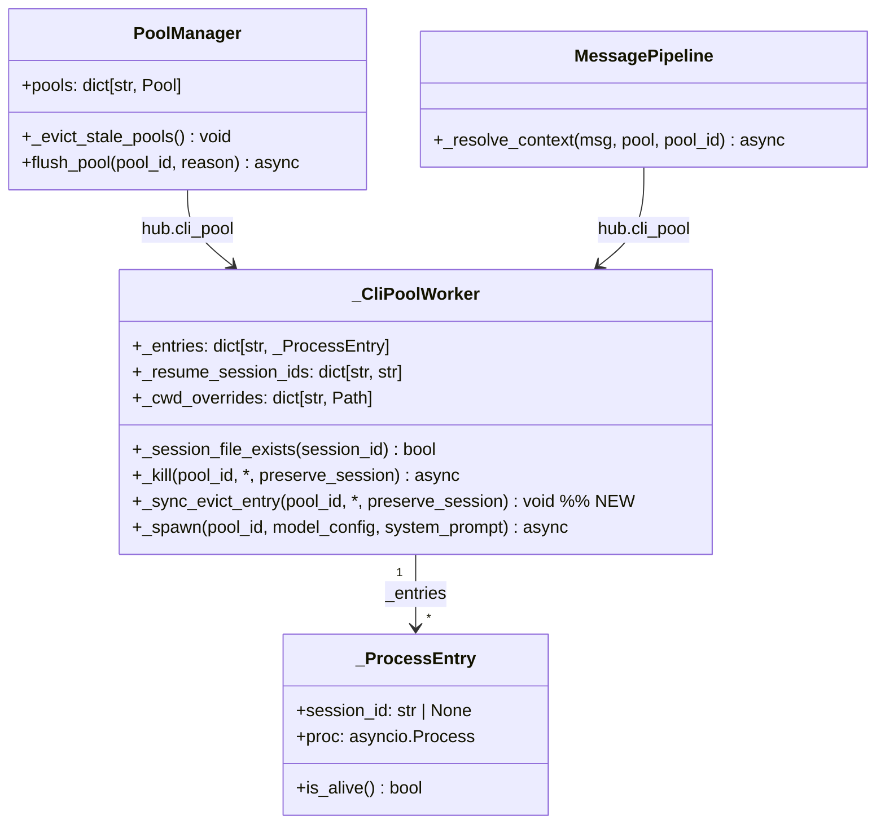
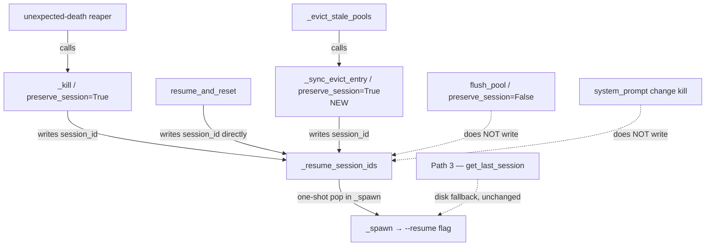

## Context

Promoted from frame: `artifacts/frames/370-pool-ttl-eviction-session-resume-frame.mdx`

Two prior commits established Lyra's auto-resume machinery for pool entries:
- `bfe2e9f` — `_CliPoolWorker._kill(preserve_session=True)` populates `_resume_session_ids[pool_id]`
- `0e75f01` — `_spawn()` one-shot pops `_resume_session_ids[pool_id]` to pass `--resume <sid>` to the CLI

The TTL eviction path (`PoolManager._evict_stale_pools`) bypasses `_kill()` entirely, doing raw `.pop()` on `_entries` and `_cwd_overrides`. This leaves `_resume_session_ids` unpopulated, so the next `_spawn()` for that pool starts fresh instead of resuming.

**Why not call `_kill(preserve_session=True)` directly?**
`_kill` is `async`; `_evict_stale_pools` is a sync method called from `get_or_create_pool` (also sync — called on every incoming message). Making `_evict_stale_pools` async would require propagating `await` up through `get_or_create_pool` and all callers — a disproportionate refactor. Using `asyncio.create_task(_kill(...))` is unsafe: the entry would remain in `_entries` until the task runs, allowing a concurrent `_spawn` to claim the old entry before it is evicted. The correct fix is a new sync helper, `_sync_evict_entry`, that pops the entry immediately and preserves the session_id — all within a single synchronous frame, with no event-loop yield.

**Orphaned process lifecycle:**
`_sync_evict_entry` does not terminate the CLI process. The existing behaviour in `_evict_stale_pools` already leaves the process to idle-timeout naturally; this fix preserves that. After `_sync_evict_entry` removes the entry from `_entries`, the idle reaper (`_idle_reaper`) will eventually call `_kill(pool_id)` on its next sweep — but it will find `_entries[pool_id]` already absent and return immediately with no conflict.

## Goal

After TTL eviction, the next spawn for an evicted pool must transparently resume the previous session — identical to the behaviour already provided by unexpected-death eviction (`_kill(preserve_session=True)`).

## Users

- **Primary:** Users who return to a Lyra conversation after the pool has been idle long enough to expire — they silently lose session continuity today.
- **Secondary:** Pool/session infrastructure maintainers — the eviction path currently diverges from the established `_kill()` contract.

## Expected Behavior

1. A user sends a message. A pool entry is created; a CLI process is spawned for `pool_id`.
2. The user goes idle. After the pool TTL expires, `_evict_stale_pools` removes `pool_id` from `PoolManager.pools`.
3. The CLI process entry is removed from `cli_pool._entries`. **Before removal** (via `_sync_evict_entry`), the session_id is saved to `cli_pool._resume_session_ids[pool_id]` — if `entry.session_id` is set and the session file exists on disk.
4. The user sends a new message. `get_or_create_pool` creates a fresh `Pool` for `pool_id`.
5. `send()` calls `_spawn()`. `_spawn()` pops `_resume_session_ids[pool_id]` → passes `--resume <sid>` to the CLI.
6. The user's session is resumed transparently. No "FRESH start" notification fires.

**Contrast — intentional flush:**
`flush_pool` (called on explicit disconnect) does **not** call `_sync_evict_entry`. This path remains unchanged — the session is discarded on explicit disconnect.

**Contrast — Path 3 fallback:**
`_resolve_context` Path 3 (`get_last_session` via turn_store) remains the fallback when `_resume_session_ids` is empty. This handles cases where the session file is deleted from disk. Path 3 is not affected by this fix.

## Data Model & Consumers

| Consumer | Field(s) consumed | When | Status |
|----------|-------------------|------|--------|
| `_spawn()` | `_resume_session_ids[pool_id]` (pop) | On every new spawn | **This issue** |
| `_evict_stale_pools` | `_entries[pid]`, `_cwd_overrides[pid]` → now via `_sync_evict_entry` | On TTL expiry | **This issue** |
| `_kill(preserve_session=True)` | `_entries[pool_id].session_id` → writes `_resume_session_ids` | Unexpected death | Existing |
| `resume_and_reset` | writes `_resume_session_ids[pool_id]` directly (bypasses `_kill`) | Explicit resume request | Existing |
| Path 3 (`_resolve_context`) | `turn_store.get_last_session(pool_id)` | Fallback when `_resume_session_ids` empty | Existing (not changed) |

## Assumptions

- `_session_file_exists(session_id)` is a sync method on `_CliPoolWorker` (confirmed: `cli_pool_worker.py:170`). It is already used inside `_kill` and is safe to call from `_sync_evict_entry` without awaiting.
- The session file is still on disk at the time `_evict_stale_pools` runs (the CLI process is still alive and holds the file open), so `_session_file_exists` returns `True` for any live entry with a valid session_id.

## Breadboard

### N1 — `_CliPoolWorker._sync_evict_entry(pool_id, *, preserve_session)`

| Element | Handler | Data |
|---------|---------|------|
| `pool_id: str` — entry exists | Look up `_entries[pool_id]` | `_ProcessEntry.session_id` |
| `pool_id: str` — entry absent | Silent no-op (`_entries.get` returns None; pops are no-ops) | — |
| `preserve_session: bool` + `entry.session_id` truthy + file exists | Write `_resume_session_ids[pool_id] = session_id` | `_resume_session_ids: dict[str, str]` |
| preserve=False **or** session_id falsy **or** file absent | Do not write `_resume_session_ids` | — |
| `_entries.pop(pool_id, None)` | Always — remove entry immediately, within sync frame | `_entries` dict |
| `_cwd_overrides.pop(pool_id, None)` | Always — within same sync frame | `_cwd_overrides` dict |

**Ordering guarantee:** `_resume_session_ids` write and both `.pop()` calls happen within a single synchronous function — no `await`, no event-loop yield. There is no window in which `_spawn` can run between the write and the pop.

**Orphaned process:** `_sync_evict_entry` does not terminate the process. The idle reaper (`_idle_reaper`) will call `_kill(pool_id)` on its next sweep; at that point `_entries[pool_id]` is already absent, so `_kill` returns immediately with no side effects.

### N2 — `PoolManager._evict_stale_pools` (modified)

| Element | Before | After |
|---------|--------|-------|
| `_entries.pop(pid, None)` | raw pop, no preserve | removed — handled by `_sync_evict_entry` |
| `_cwd_overrides.pop(pid, None)` | raw pop | removed — handled by `_sync_evict_entry` |
| _(new)_ `cli_pool._sync_evict_entry(pid, preserve_session=True)` | absent | replaces both raw pops |

### N3 — `_spawn()` (unchanged, for reference)

| Element | Handler | Data |
|---------|---------|------|
| `_resume_session_ids.pop(pool_id, None)` | One-shot pop | session_id or None |
| `_build_cmd(session_id=resume_session_id)` | Passes `--resume <sid>` if set | CLI argv |

## Slices

| # | Slice | Files | Demo |
|---|-------|-------|------|
| S1 | Add `_sync_evict_entry(pool_id, *, preserve_session)` to `_CliPoolWorker` | `src/lyra/core/cli_pool_worker.py` | Unit: call with preserve=True + live entry → `_resume_session_ids` populated, entry removed; with preserve=False → not populated |
| S2 | Update `_evict_stale_pools` to call `_sync_evict_entry(pid, preserve_session=True)` | `src/lyra/core/pool_manager.py` | Unit: stale pool evicted → `_resume_session_ids[pool_id]` set |
| S3 | Test: TTL eviction → new message → session auto-resumed (no FRESH notification) | `src/lyra/core/`, `tests/core/` | Integration: mock TTL expiry + new send → assert `--resume <sid>` in spawn cmd and FRESH notification not emitted |

## Success Criteria

- [ ] `_CliPoolWorker._sync_evict_entry(pool_id, *, preserve_session=True)` exists and populates `_resume_session_ids[pool_id]` iff all three conditions hold: `preserve_session=True` **and** `entry.session_id` is truthy **and** `_session_file_exists(entry.session_id)` returns True
- [ ] `_sync_evict_entry` always pops `_entries[pool_id]` and `_cwd_overrides[pool_id]` within the same sync call — both removals and the session_id write occur with no event-loop yield between them
- [ ] `_evict_stale_pools` calls `_sync_evict_entry(pid, preserve_session=True)` instead of raw `_entries.pop` + `_cwd_overrides.pop`
- [ ] The next `_spawn()` for an evicted pool receives `resume_session_id` (not None) and passes `--resume <session_id>` to the CLI
- [ ] A user who sends a message after TTL eviction gets their session resumed — no "FRESH start" notification is emitted
- [ ] `flush_pool` (intentional disconnect) still results in no entry in `_resume_session_ids` — session discarded, behaviour unchanged
- [ ] `_sync_evict_entry(preserve_session=False)` does NOT populate `_resume_session_ids` (for future callers that need discard semantics)
- [ ] Existing tests pass without modification
- [ ] New test: pool evicted by TTL → next message → `_spawn` receives `resume_session_id` (not None) and no FRESH notification fires
