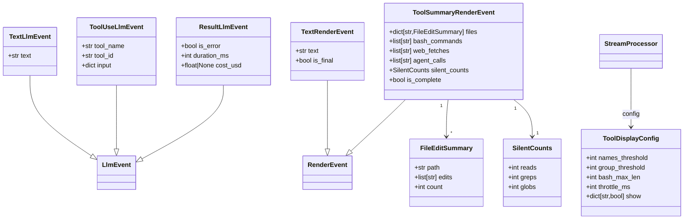
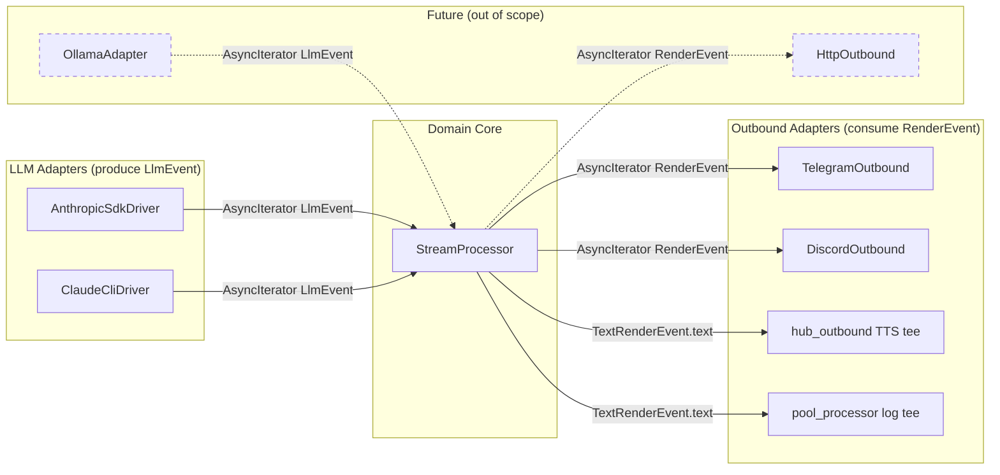

## Context

Promoted from: `artifacts/analyses/371-arch-stream-processor-render-event-analysis.mdx`
Shape selected: **Shape 1 — Full hexagonal replacement**
ADR: `docs/architecture/adr/032-llmevent-streamprocessor-renderevent-hexagonal-streaming.mdx`

Reference architecture: `docs/architecture/target-architecture.md`

## Goal

Wire `LlmEvent → StreamProcessor → RenderEvent → ChannelAdapter` end-to-end so that tool calls
are visible to Telegram and Discord users in real time during streaming responses.

## Users

- **Primary:** Lyra engine internals — the LLM → Core → Adapter pipeline
- **Secondary:** Telegram and Discord users who see tool call progress as it happens

## Expected Behavior

A user sends a message to Lyra that triggers multi-tool processing (e.g. editing 3 files and
running a bash command).

**Phase 1 & 2 — Types + Driver stream:**
`SimpleAgent.process()` detects that the provider has `stream()` and calls it. The driver yields
`LlmEvent` objects one by one as Claude processes:

```
TextLlmEvent(text="I'll refactor this...")
ToolUseLlmEvent(tool_name="Edit", tool_id="t1", input={})    ← input empty at emit time (SDK)
ToolUseLlmEvent(tool_name="Edit", tool_id="t2", input={})
ToolUseLlmEvent(tool_name="Bash", tool_id="t3", input={"command": "uv run pytest tests/"})
TextLlmEvent(text="Done. Tests pass.")
ResultLlmEvent(is_error=False, duration_ms=4200, cost_usd=0.018)
```

**Phase 3 — StreamProcessor:**
`StreamProcessor.process(events)` accumulates state and emits events. Text is **not** emitted
incrementally in V1 — all text accumulates and emits as a single `TextRenderEvent(is_final=True)`
at the end. Tool events emit a throttled `ToolSummaryRenderEvent` snapshot on each tool call.

```
→ ToolUseLlmEvent(Edit t1)    emits ToolSummaryRenderEvent(files={"src/foo.py":…}, is_complete=False)
→ ToolUseLlmEvent(Edit t2)    emits ToolSummaryRenderEvent(files={"src/foo.py":…, "src/bar.py":…}, …)
→ ToolUseLlmEvent(Bash t3)    emits ToolSummaryRenderEvent(…, bash_commands=["uv run pytest…"], …)
→ ResultLlmEvent              emits ToolSummaryRenderEvent(…, is_complete=True)
                              emits TextRenderEvent(text="I'll refactor…\nDone. Tests pass.", is_final=True)
```

**Text-only turn (no tool calls):** If `ResultLlmEvent` arrives with all accumulators empty (no
tools called), `StreamProcessor` skips the `ToolSummaryRenderEvent` and emits only
`TextRenderEvent(is_final=True)`. No empty tool summary card is shown.

**Phase 4 — Telegram:**
- Placeholder `…` sent on first event
- Each `ToolSummaryRenderEvent` → renders tool summary formatted text, edits placeholder in-place (throttled at `throttle_ms`)
- `ToolSummaryRenderEvent(is_complete=True)` → final edit with completion marker (e.g. ✅)
- `TextRenderEvent(is_final=True)` → sends response text as a new message
- All existing error paths preserved: placeholder send failure → fallback to non-streaming; overflow chunks sent as follow-up messages

**Phase 4 — Discord:**
- Same flow: placeholder → embed update on `ToolSummaryRenderEvent` → new message on `TextRenderEvent(is_final=True)`

**complete() path:**
Unchanged. Agents without `stream()` or with `streaming=False` in `model_cfg` continue to use
`LlmProvider.complete() → LlmResult → str`. Zero regression.

## Data Model & Consumers





**Consumer summary:**

| Consumer | Fields consumed | When | Status |
|----------|----------------|------|--------|
| `TelegramOutbound.send_streaming()` | `ToolSummaryRenderEvent.*`; `TextRenderEvent.text`, `.is_final` | Every event | This issue |
| `DiscordOutbound.send_streaming()` | Same as Telegram | Every event | This issue |
| `hub_outbound` TTS tee | `TextRenderEvent.text` only | `is_final=True` + all text for voice | This issue |
| `pool_processor` log tee | `TextRenderEvent.text` only | On `is_final=True` (turn log) | This issue |
| `OllamaAdapter` (future) | Produces `LlmEvent` | — | Future |
| `HttpOutbound` (future) | Consumes `RenderEvent` | — | Future |

## Breadboard

### N1 — LlmProvider protocol extension

```
llm/base.py

LlmProvider (Protocol):
  complete(pool_id, text, model_cfg, system_prompt, *, messages, on_intermediate) → LlmResult
  stream(pool_id, text, model_cfg, system_prompt, *, messages) → AsyncIterator[LlmEvent]
  is_alive(pool_id) → bool

Notes:
  - stream() is duck-typed optional — no breaking change for existing providers
  - on_intermediate is NOT part of stream() — the iterator IS the streaming output
  - stream() is single-turn only — multi-turn tool-use (SDK loop) stays in complete()
```

### N2 — AnthropicSdkDriver.stream()

```
llm/drivers/sdk.py

Uses Anthropic SDK low-level event iteration (async for event in stream),
NOT the high-level stream.text_stream.

stream(pool_id, text, model_cfg, system_prompt, *, messages=None):
  async with self._client.messages.stream(...) as stream:
    async for event in stream:  # raw StreamEvent objects
      ContentBlockStartEvent (content_block.type == "tool_use"):
        → yield ToolUseLlmEvent(tool_name=event.content_block.name,
                                tool_id=event.content_block.id,
                                input={})
        Note: input is EMPTY at ContentBlockStart — populated via InputJsonDelta
              V1 emits early for real-time tool name visibility; full input is not tracked
      ContentBlockDeltaEvent (delta.type == "text_delta"):
        → yield TextLlmEvent(text=event.delta.text)
      MessageStopEvent:
        → yield ResultLlmEvent(is_error=False,
                               duration_ms=<calculated from message start>,
                               cost_usd=<from usage if available>)

Single-turn only. multi-turn tool-use loop stays in complete().
```

### N3 — ClaudeCliDriver.stream()

```
llm/drivers/cli.py  +  core/cli_protocol.py

ClaudeCliDriver.stream() calls CliPool to get a raw NDJSON event stream.
cli_protocol.py StreamingIterator currently only yields on content_block_delta
(text_delta) and silently filters out content_block_start (tool_use) events.

Fix required in cli_protocol.py:
  Add handling for stream_event type == "content_block_start" where
  event_data["content_block"]["type"] == "tool_use":
    → Surface the tool_name, tool_id, input to the caller

ClaudeCliDriver.stream() maps:
  tool_use content block  → yield ToolUseLlmEvent(tool_name, tool_id, input=block["input"])
  text content block      → yield TextLlmEvent(text)
  result event            → yield ResultLlmEvent(is_error, duration_ms, cost_usd=None)
                            Note: cost_usd is ALWAYS None for CLI driver
                                  (not present in NDJSON result envelope)

CliPool.send_streaming() is unchanged for the on_intermediate / complete() path.
```

### N4 — StreamProcessor

```
core/stream_processor.py

class StreamProcessor:
    _config: ToolDisplayConfig
    _files: dict[str, FileEditSummary]   # accumulated file edits
    _bash: list[str]                     # bash commands (truncated to bash_max_len)
    _web_fetches: list[str]              # WebFetch/WebSearch domains
    _agent_calls: list[str]              # Agent call identifiers
    _silent: SilentCounts                # reads/greps/globs filtered out
    _last_tool_emit: float | None        # monotonic time of last ToolSummaryRenderEvent
    _pending_text: str                   # accumulated text, held until ResultLlmEvent

    async def process(events: AsyncIterator[LlmEvent]) → AsyncIterator[RenderEvent]:
        async for event in events:
            match event:
                TextLlmEvent:
                    _pending_text += text
                    # NOT emitted incrementally in V1 — text held until ResultLlmEvent

                ToolUseLlmEvent:
                    _accumulate(event)          # update internal state
                    if _should_emit():          # throttle check
                        yield _snapshot()       # ToolSummaryRenderEvent

                ResultLlmEvent:
                    if _has_any_tool_events():  # any non-empty accumulator
                        yield _snapshot(is_complete=True)
                    yield TextRenderEvent(text=_pending_text, is_final=True)

Accumulation rules (tool_name case-insensitive match against show keys):
  edit/write              → _files[path].edits.append(fn_name); count++
                            if count > names_threshold → count mode (edits cleared)
                            if len(_files) >= group_threshold → grouped mode
  bash                    → _bash.append(command[:bash_max_len])
  read/grep/glob          → _silent.{reads|greps|globs}++   (always silent)
  web_fetch/web_search    → _web_fetches.append(domain)     (if show["web_fetch"])
  agent                   → _agent_calls.append(agent_name) (if show["agent"])
  other, show=False       → _silent counts or ignored

Throttle: _should_emit() = True when:
  _last_tool_emit is None  OR  monotonic() - _last_tool_emit >= throttle_ms / 1000
  → On ResultLlmEvent, _should_emit() is always bypassed (always emits final snapshot)

_has_any_tool_events(): True if any of _files, _bash, _web_fetches, _agent_calls is
  non-empty OR if any silent counter > 0.

Show key canonical names (case-insensitive): "edit", "write", "bash", "read", "grep",
"glob", "web_fetch", "web_search", "agent". Matching normalizes tool_name to lowercase.
```

### N5 — ToolDisplayConfig

```
Dataclass loaded by bootstrap from [tool_display] in config.toml.

  names_threshold: int = 3    # edits before switching to count mode per file
  group_threshold: int = 3    # files before switching to grouped display
  bash_max_len:    int = 60   # max chars per bash command
  throttle_ms:     int = 2000 # min ms between ToolSummaryRenderEvent emits

  show: dict[str, bool] = {
    "edit": True, "write": True, "bash": True,
    "web_fetch": True, "web_search": True, "agent": True,
    "read": False, "grep": False, "glob": False,
  }

ToolDisplayConfig has a class method ToolDisplayConfig.defaults() → ToolDisplayConfig.
Loaded once at bootstrap; injected into SimpleAgent at construction.
During S4 integration (before S5 is merged), SimpleAgent uses ToolDisplayConfig.defaults().
```

### N6 — ChannelAdapter.send_streaming() signature update

```
core/hub_protocol.py

  Before: send_streaming(original_msg, chunks: AsyncIterator[str], outbound=None) → None
  After:  send_streaming(original_msg, events: AsyncIterator[RenderEvent], outbound=None) → None
```

### N7 — hub_outbound.dispatch_streaming() TTS tee update

```
core/hub_outbound.py

  _tee() async generator:
    Before: async for chunk in _raw: voice_parts.append(chunk); yield chunk
    After:  async for event in _raw:
              if isinstance(event, TextRenderEvent):
                  voice_parts.append(event.text)
              # ToolSummaryRenderEvent: NOT added to voice_parts (not synthesized as speech)
              yield event   # all events forwarded to downstream adapter
```

### N8 — pool_processor.py turn-logging tee update

```
core/pool_processor.py

  _capture() async generator (lines ~294–306):
    Before: async for chunk in _result_iter_for_sid:
                _content_parts.append(chunk)    # str
                yield chunk
    After:  async for event in _result_iter_for_sid:
                if isinstance(event, TextRenderEvent):
                    _content_parts.append(event.text)
                # ToolSummaryRenderEvent: yielded but not logged as text content
                yield event

  "".join(_content_parts) at line ~332 continues to work correctly
  (only str values from TextRenderEvent.text are appended).

  Return type annotation AsyncGenerator[str, None] → AsyncGenerator[RenderEvent, None]
```

### N9 — outbound_dispatcher.py annotation update

```
core/outbound_dispatcher.py

  enqueue_streaming() parameter:
    Before: chunks: AsyncIterator[str]
    After:  chunks: AsyncIterator[RenderEvent]

  No behavioral change — annotation and _ITEM union type update only.
```

### N10 — SimpleAgent.process() wiring

```
agents/simple_agent.py

  Streaming path (model_cfg.streaming AND hasattr(provider, "stream")):
    stream_iter = await provider.stream(pool_id, text, model_cfg, system_prompt)
    processor = StreamProcessor(config=self._tool_display_config)
    return processor.process(stream_iter)   # AsyncIterator[RenderEvent]

  Return type updated: Response | AsyncIterator[RenderEvent]

  Constructor gains: _tool_display_config: ToolDisplayConfig
    (injected by bootstrap, defaults to ToolDisplayConfig.defaults() if not provided)
```

### Circuit-breaker asymmetry (⚠ known, carry to implementation)

`RetryDecorator` and `CircuitBreakerDecorator` wrap `complete()` only. `stream()` is accessed via
`getattr(self._provider, "stream", None)` in `SimpleAgent`, bypassing the decorator stack.
**This asymmetry exists today and carries forward unchanged.** Streaming has no CB protection.
Implementor must NOT assume parity. A future issue may address this.

## Slices

| # | Slice | Phase | Files | Demo |
|---|-------|-------|-------|------|
| S1 | Type system | P1 | `llm/events.py`, `core/render_events.py` | `from lyra.llm.events import TextLlmEvent; repr(TextLlmEvent(text="hi"))` |
| S2 | LLM driver streaming | P2 | `llm/base.py`, `llm/drivers/sdk.py`, `llm/drivers/cli.py`, `core/cli_protocol.py` | `async for e in driver.stream(...)` yields at least one `ToolUseLlmEvent` and one `ResultLlmEvent` for a tool-using prompt |
| S3 | StreamProcessor | P3 | `core/stream_processor.py`, `tests/core/test_stream_processor.py` | All ≥15 unit tests pass, no network |
| S4 | Outbound wiring | P4 | `agents/simple_agent.py`, `core/hub_protocol.py`, `core/hub_outbound.py`, `core/outbound_dispatcher.py`, `core/pool_processor.py`, `adapters/telegram_outbound.py`, `adapters/discord_outbound.py` | Tool call renders as formatted message in Telegram/Discord; complete() path passes all existing tests |
| S5 | Config + wiring | P5 | `config.toml.example`, `bootstrap/config.py` | `ToolDisplayConfig` loaded from TOML; `ToolDisplayConfig.defaults()` applies when section absent |

Dependency order: S1 → S2 → S3 → S4 (sequential). S5 independent (merges before S4 reaches
production; S4 integration uses `ToolDisplayConfig.defaults()` as interim).

## Success Criteria

### Type system (S1)

- [ ] `llm/events.py` defines `TextLlmEvent(text: str)`, `ToolUseLlmEvent(tool_name, tool_id, input)`, `ResultLlmEvent(is_error, duration_ms, cost_usd)` as `@dataclass(frozen=True)`
- [ ] `core/render_events.py` defines `TextRenderEvent(text, is_final)`, `ToolSummaryRenderEvent(files, bash_commands, web_fetches, agent_calls, silent_counts, is_complete)`, `FileEditSummary(path, edits, count)`, `SilentCounts(reads, greps, globs)` as `@dataclass(frozen=True)`
- [ ] `LlmEvent = TextLlmEvent | ToolUseLlmEvent | ResultLlmEvent` union exported from `llm/events.py`
- [ ] `RenderEvent = TextRenderEvent | ToolSummaryRenderEvent` union exported from `core/render_events.py`
- [ ] `grep -r "import aiogram\|import discord\|import anthropic" src/lyra/core/ src/lyra/llm/` returns zero matches (hexagonal boundary enforced)

### LLM driver streaming (S2)

- [ ] `LlmProvider` protocol in `llm/base.py` declares `stream()` returning `AsyncIterator[LlmEvent]` (duck-typed optional)
- [ ] `AnthropicSdkDriver.stream()` yields at least one `ToolUseLlmEvent` for a prompt known to trigger tool use
- [ ] `AnthropicSdkDriver.stream()` yields `ResultLlmEvent` as the final event in every call
- [ ] `ClaudeCliDriver.stream()` return type annotation is `AsyncIterator[LlmEvent]` (not `str`)
- [ ] `ClaudeCliDriver.stream()` yields `ToolUseLlmEvent` for `tool_use` blocks in the NDJSON stream
- [ ] `core/cli_protocol.py` `StreamingIterator` surfaces `content_block_start` tool_use events to the caller
- [ ] `ResultLlmEvent.cost_usd` is `None` for all `ClaudeCliDriver.stream()` calls (not present in NDJSON)
- [ ] All pre-existing `LlmProvider.complete()` tests pass (zero regression)

### StreamProcessor (S3)

- [ ] `StreamProcessor.process()` emits `ToolSummaryRenderEvent` after each `ToolUseLlmEvent` (subject to throttle)
- [ ] `StreamProcessor.process()` emits `TextRenderEvent(is_final=True)` as the last event after `ResultLlmEvent`
- [ ] Text-only turn (no tool calls): only `TextRenderEvent(is_final=True)` emitted — no empty `ToolSummaryRenderEvent`
- [ ] When `edits > names_threshold` on one file: `FileEditSummary.edits == []` and `.count` reflects total (count mode threshold boundary: exactly at threshold + 1)
- [ ] When `len(_files) >= group_threshold`: grouped display (threshold boundary: 2 files = no group, 3 files = group)
- [ ] Bash commands truncated to `bash_max_len` characters
- [ ] Tools with `show[tool_name] = False` (Read, Grep, Glob) increment `silent_counts`; not in `files` or `bash_commands`
- [ ] `ToolSummaryRenderEvent` emitted at most once per `throttle_ms` window (except on `ResultLlmEvent` which always emits)
- [ ] `WebFetch`/`WebSearch` events with `show=True` accumulate in `web_fetches` list
- [ ] `Agent` events with `show=True` accumulate in `agent_calls` list
- [ ] `≥15` unit test cases in `tests/core/test_stream_processor.py` covering: 1 edit, 5 edits (at threshold), 6 edits (over → count mode), 2 files (no group), 3 files (group mode), 80 tools multi-file, text-only (no tools), bash truncation, silent Read/Grep/Glob, web_fetch visible, ResultLlmEvent final, throttle suppression, throttle pass-through
- [ ] All `StreamProcessor` unit tests pass with no network calls (no external dependencies)

### Outbound wiring (S4)

- [ ] `ChannelAdapter.send_streaming()` in `hub_protocol.py` parameter type is `AsyncIterator[RenderEvent]`
- [ ] `hub_outbound.dispatch_streaming()` TTS tee appends `event.text` for `TextRenderEvent` and does NOT append `ToolSummaryRenderEvent` to voice parts
- [ ] `pool_processor.py` `_capture()` tee appends `event.text` for `TextRenderEvent` only; `ToolSummaryRenderEvent` forwarded but not logged as text; `"".join(_content_parts)` produces valid turn log string
- [ ] `outbound_dispatcher.py` `enqueue_streaming()` parameter annotation updated to `AsyncIterator[RenderEvent]`
- [ ] `TelegramAdapter.send_streaming()` renders `ToolSummaryRenderEvent` via `editMessage` (throttled per `throttle_ms`)
- [ ] `DiscordAdapter.send_streaming()` renders `ToolSummaryRenderEvent` via embed update
- [ ] Telegram `send_streaming()` placeholder-send-failure fallback path preserved (verified by existing test coverage or new test)
- [ ] Telegram `send_streaming()` overflow chunk path preserved (multi-chunk text sent as follow-up messages)
- [ ] Discord `send_streaming()` fallback to non-streaming (when placeholder send fails) preserved
- [ ] All pre-existing `send_streaming` tests in `tests/adapters/test_streaming.py` pass

### Config (S5)

- [ ] `config.toml.example` contains `[tool_display]` section with `names_threshold`, `group_threshold`, `bash_max_len`, `throttle_ms` and `[tool_display.show]` subsection with all 9 tool keys
- [ ] `bootstrap/config.py` has `_load_tool_display_config(raw: dict) → ToolDisplayConfig` following existing `_load_*` pattern
- [ ] `ToolDisplayConfig.defaults()` class method returns a valid config with hardcoded default values
- [ ] When `[tool_display]` section is absent from `config.toml`, `_load_tool_display_config({})` returns `ToolDisplayConfig.defaults()` without error
