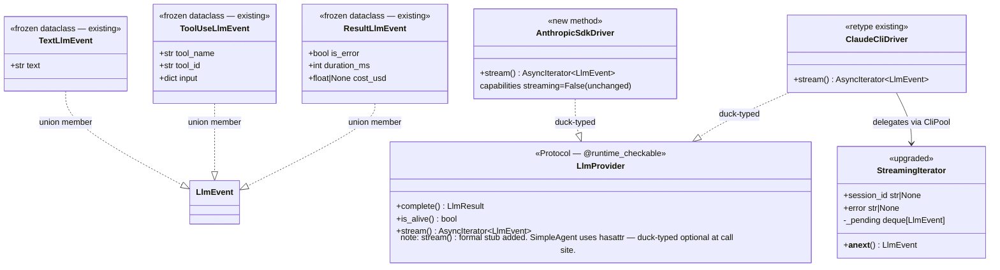

## Context

Promoted from: `artifacts/frames/384-llmprovider-stream-driver-impl-frame.mdx`
Parent spec: `artifacts/specs/371-arch-stream-processor-render-event-spec.mdx` — Slice S2
Parent issue: #371 (Phase 2 of 5)

Dependency: #383 (LlmEvent type system) — **already shipped** to `src/lyra/llm/events.py`.
`TextLlmEvent`, `ToolUseLlmEvent`, `ResultLlmEvent`, and the `LlmEvent` union are all live.

**Parent spec breadboard cross-reference:**
This issue implements breadboard nodes N1 (`LlmProvider`), N2 (`AnthropicSdkDriver.stream()`),
and N3 (`ClaudeCliDriver.stream()`) from the parent spec exactly. It also includes **S2 bridge
changes** to N8 (`pool_processor._capture`) and N10 (`SimpleAgent.process()`) — these bridges
maintain existing outbound compatibility by yielding `str` until S4 rewires the full pipeline
through `StreamProcessor` and replaces them with `RenderEvent`-aware versions.

## Goal

Wire `stream() → AsyncIterator[LlmEvent]` into both LLM drivers so that `SimpleAgent.process()`
can iterate typed events as they arrive from Claude, unblocking the `StreamProcessor` pipeline
(Phase 3, #385).

## Users

- **Primary:** `SimpleAgent.process()` — calls `provider.stream()` and iterates `LlmEvent` objects
- **Secondary:** Lyra developers — typed contract between driver layer and core domain

## Expected Behavior

A caller with a reference to either driver calls `stream()` and receives a typed async iterator.
`ResultLlmEvent` is **always** the final yielded event; the iterator terminates on the next call.

```python
async for event in provider.stream(pool_id, text, model_cfg, system_prompt):
    match event:
        case TextLlmEvent(text=chunk):
            ...   # accumulate text
        case ToolUseLlmEvent(tool_name=name, tool_id=tid):
            ...   # track tool call (input={} at emit time for SDK)
        case ResultLlmEvent(is_error=err):
            break  # turn complete — always the last event
```

**SDK driver — tool-calling turn:**
```
TextLlmEvent(text="I'll edit these files...")
ToolUseLlmEvent(tool_name="Edit", tool_id="toolu_01", input={})   ← input={} at ContentBlockStart
ToolUseLlmEvent(tool_name="Bash", tool_id="toolu_02", input={})
TextLlmEvent(text="Done. Tests pass.")
ResultLlmEvent(is_error=False, duration_ms=1842, cost_usd=0.0124) ← from usage if available, else None
```

**CLI driver — same turn via NDJSON:**
```
ToolUseLlmEvent(tool_name="Edit", tool_id="toolu_01", input={...}) ← from assistant block
ToolUseLlmEvent(tool_name="Bash", tool_id="toolu_02", input={...}) ← from assistant block
TextLlmEvent(text="Done. Tests pass.")                             ← from stream_event text_delta
ResultLlmEvent(is_error=False, duration_ms=2100, cost_usd=None)   ← always None
```

**Text-only turn (no tools):**
```
TextLlmEvent(text="Hello! How can I help?")
ResultLlmEvent(is_error=False, duration_ms=312, cost_usd=None)
```

**Error turn (SDK exception):**
```
ResultLlmEvent(is_error=True, duration_ms=0, cost_usd=None)
```

**CLI timeout/EOF:** existing `StopAsyncIteration` behavior preserved — no `ResultLlmEvent` is
yielded on subprocess death or idle timeout (same as today). The iterator stops silently.
This is a known gap; Phase 3 can address it when `StreamProcessor` needs error propagation.

`complete()` path: **unchanged**. Zero regression. All existing `LlmProvider.complete()` tests pass.

## Out of Scope

- `cost_usd` for SDK driver: populate from `stream.get_final_message().usage` if the SDK
  provides it; `None` as fallback if unavailable. Full cost-table pricing deferred.
  CLI driver: always `None` (not present in NDJSON envelope).
- `StreamProcessor` / `RenderEvent` / channel adapter wiring (Phase 3–4)
- Circuit-breaker / retry wrapping of `stream()`
- Multi-turn tool-use loop in `stream()` (stays in `complete()`)
- `ResultLlmEvent` on CLI timeout/EOF (no behavioral change from current implementation)

## Data Model & Consumers



```mermaid
flowchart LR
    subgraph P2["Phase 2 — This Issue"]
        SDK[AnthropicSdkDriver.stream]
        CLI[ClaudeCliDriver.stream]
        SI[StreamingIterator.__anext__]
    end
    subgraph Bridge["pool_processor._capture (bridge)"]
        CAP["_capture: yields str\nextract TextLlmEvent.text\nskip ToolUseLlmEvent\nstop at ResultLlmEvent"]
    end
    subgraph Agent["SimpleAgent"]
        SA[process — drops on_intermediate from stream() call]
    end
    subgraph P3["Phase 3 — Future"]
        SP[StreamProcessor]:::future
    end

    SDK -->|"AsyncIterator[LlmEvent]"| SA
    CLI -->|delegates| SI
    SI -->|"AsyncIterator[LlmEvent]"| SA
    SA --> CAP
    CAP -->|"AsyncIterator[str] (compat)"| P3
    SA -.->|"future: direct LlmEvent feed"| SP

    classDef future stroke-dasharray:5 5
```

| Consumer | Fields consumed | When | Status |
|---|---|---|---|
| `SimpleAgent.process()` | all `LlmEvent` variants | during `stream()` call | **this issue** — iterates and passes to `_capture` |
| `pool_processor._capture` | `TextLlmEvent.text` (yields); `ToolUseLlmEvent` (skip); `ResultLlmEvent` (stop) | wraps iterator for turn logging | **this issue** — bridge to existing outbound dispatch |
| `StreamProcessor` | all `LlmEvent` variants | `async for event in events` | future — Phase 3, #385 |

## Breadboard

### Wiring

| Affordance | File | Change | In → Out |
|---|---|---|---|
| `LlmProvider.stream()` Protocol stub | `llm/base.py` | New Protocol method | Add formal `stream(pool_id, text, model_cfg, system_prompt, *, messages=None) → AsyncIterator[LlmEvent]` stub. Update comment: "duck-typed optional at call site — SimpleAgent uses hasattr, not isinstance." (parent spec N1) |
| `AnthropicSdkDriver.stream()` | `llm/drivers/sdk.py` | New method | `(pool_id, text, model_cfg, system_prompt, *, messages=None)` → `AsyncIterator[LlmEvent]`. Uses `async for event in stream` (raw, NOT `stream.text_stream`). (parent spec N2) |
| `AnthropicSdkDriver.capabilities` | `llm/drivers/sdk.py` | No change | Stays `{"streaming": False}` — flag describes `complete()` buffering, not `stream()` presence |
| `ClaudeCliDriver.stream()` | `llm/drivers/cli.py` | Retype + signature | Remove `on_intermediate`; return `AsyncIterator[str]` → `AsyncIterator[LlmEvent]`. `CliPool.send_streaming()` is **unchanged** per parent spec N3. |
| `SimpleAgent.process()` streaming call | `agents/simple_agent.py` | S2 bridge (partial) | Drop `on_intermediate=cb` from `_stream_fn(...)` call at line 244–249. Full StreamProcessor wiring deferred to S4 per parent spec N10. |
| `StreamingIterator.__init__` | `core/cli_protocol.py` | Deprecate param | `on_intermediate` → deprecated no-op; add `DeprecationWarning` log; do NOT remove (keeps `send_and_read_stream` callers working) |
| `StreamingIterator._pending` | `core/cli_protocol.py` | New field | `deque[LlmEvent]` — buffer for multi-tool assistant blocks |
| `StreamingIterator.__anext__` | `core/cli_protocol.py` | Logic + retype | NDJSON dispatch → `LlmEvent` (return type: `str` → `LlmEvent`) |
| `send_and_read_stream` | `core/cli_protocol.py` | Comment | Return type comment: yields `LlmEvent` (class not made generic — comment only) |
| `pool_processor._capture` | `core/pool_processor.py` | S2 bridge (temporary) | `async for chunk in iter` → unpack `LlmEvent`; yield `TextLlmEvent.text` as `str`; skip `ToolUseLlmEvent`; break on `ResultLlmEvent`; `_content_parts: list[str]` stays `str`. **S4 will replace this bridge** — final state yields `RenderEvent` per parent spec N8. |

### SDK stream event mapping

| SDK event type | Condition | LlmEvent yielded |
|---|---|---|
| `ContentBlockStartEvent` | `content_block.type == "tool_use"` | `ToolUseLlmEvent(tool_name=content_block.name, tool_id=content_block.id, input={})` |
| `TextDeltaEvent` | — | `TextLlmEvent(text=delta.text)` |
| Post-loop / `MessageStopEvent` | always | `ResultLlmEvent(is_error=False, duration_ms=elapsed_ms, cost_usd=<from usage or None>)` |
| Exception raised inside `async with stream` | any | `ResultLlmEvent(is_error=True, duration_ms=0, cost_usd=None)` then re-raise |

Notes:
- `duration_ms`: record `time.monotonic()` before `async with self._client.messages.stream(...)`, compute elapsed at post-loop.
- `cost_usd`: `None` in V1 (see Out of Scope).
- Single-turn only — no tool-use loop.
- SDK import: use raw stream iteration (`async for event in stream`, NOT `stream.text_stream`) to receive all event types including `ContentBlockStartEvent`.

### CLI NDJSON event mapping (`StreamingIterator.__anext__`)

| NDJSON `msg_type` | Condition | Action |
|---|---|---|
| `stream_event.content_block_start` | `content_block.type == "tool_use"` | Push `ToolUseLlmEvent(tool_name, tool_id, input={})` to `_pending` |
| `stream_event.content_block_delta` | `delta.type == "text_delta"` | Return `TextLlmEvent(text=delta.text)` immediately |
| `assistant` message | has `tool_use` content blocks | Push `ToolUseLlmEvent` for each block to `_pending` |
| `result` | always | Set `self._done = True`; return `ResultLlmEvent(is_error, duration_ms, cost_usd=None)` — next call raises `StopAsyncIteration` |
| `system/init`, `stream_event.content_block_stop`, etc. | — | No event yielded; continue loop |
| `_pending` non-empty at `__anext__` entry | — | `return self._pending.popleft()` before reading next line |

**Multi-event buffering:** `assistant` blocks may contain N `tool_use` entries. A `deque[LlmEvent]` buffer is drained one item per `__anext__` call before the next `readline()`, ensuring callers always get exactly one `LlmEvent` per iteration step.

**`ResultLlmEvent` behavior change:** Current code raises `StopAsyncIteration` directly on `result`. After this change, `ResultLlmEvent` is returned first; `StopAsyncIteration` is raised on the subsequent call. This is a deliberate contract change — `pool_processor._capture` must handle `ResultLlmEvent` as a stop sentinel (see wiring table).

## Slices

| # | Name | Files | Demo |
|---|---|---|---|
| S1 | SDK driver `stream()` | `llm/drivers/sdk.py`, `llm/base.py` | `AnthropicSdkDriver.stream()` yields `ToolUseLlmEvent` + `TextLlmEvent` + `ResultLlmEvent` for a tool-calling prompt. **Requires live API key** — cannot be validated offline; unit mock test should also be provided. |
| S2 | CLI retype + `StreamingIterator` upgrade + bridge fixes | `llm/drivers/cli.py`, `core/cli_protocol.py`, `agents/simple_agent.py`, `core/pool_processor.py` | `ClaudeCliDriver.stream()` → typed `AsyncIterator[LlmEvent]`; `StreamingIterator.__anext__` yields `LlmEvent`; `_capture` unpacks to `str`; `simple_agent` no longer passes `on_intermediate` to `stream()`. Unit tests with mock NDJSON pass. |

S1 and S2 are independent — S1 can ship first. Both require `src/lyra/llm/events.py` (already live).

## Success Criteria

- [ ] `LlmProvider` Protocol in `base.py` has a formal `stream()` method stub returning `AsyncIterator[LlmEvent]`; comment clarifies it is duck-typed optional at the call site (SimpleAgent uses `hasattr`, not `isinstance`)
- [ ] `AnthropicSdkDriver.stream()` method exists and is typed `async def stream(...) -> AsyncIterator[LlmEvent]`
- [ ] `AnthropicSdkDriver.stream()` uses raw SDK event iteration (`async for event in stream`, not `stream.text_stream`)
- [ ] `AnthropicSdkDriver.stream()` yields `ToolUseLlmEvent` at `ContentBlockStartEvent` with `input={}`
- [ ] `AnthropicSdkDriver.stream()` yields `TextLlmEvent` for each `TextDeltaEvent`
- [ ] `AnthropicSdkDriver.stream()` yields `ResultLlmEvent(is_error=False)` as the final event on a successful call
- [ ] `AnthropicSdkDriver.stream()` yields `ResultLlmEvent(is_error=True)` on exception
- [ ] `AnthropicSdkDriver.stream()` sets `ResultLlmEvent.cost_usd` from `stream.get_final_message().usage` if available, else `None`
- [ ] `ClaudeCliDriver.stream()` return type annotation is `AsyncIterator[LlmEvent]`
- [ ] `ClaudeCliDriver.stream()` signature does not include `on_intermediate` parameter
- [ ] `StreamingIterator.__anext__` return type annotation is `LlmEvent`
- [ ] `StreamingIterator` has `_pending: deque[LlmEvent]` buffer; drains one event per `__anext__` call when non-empty
- [ ] `StreamingIterator` yields `ToolUseLlmEvent` for `tool_use` blocks in `stream_event.content_block_start`
- [ ] `StreamingIterator` yields `ToolUseLlmEvent` for `tool_use` blocks in `assistant` message content (buffered via `_pending`)
- [ ] `StreamingIterator` yields `TextLlmEvent` (not raw `str`) for `text_delta` events
- [ ] `StreamingIterator` yields `ResultLlmEvent` as the final event, then raises `StopAsyncIteration` on next call
- [ ] `StreamingIterator.__init__` still accepts `on_intermediate` (deprecated no-op — logs warning, does not use)
- [ ] `ResultLlmEvent.cost_usd` is `None` for all `ClaudeCliDriver.stream()` calls
- [ ] `SimpleAgent.process()` no longer passes `on_intermediate=cb` to `_stream_fn(...)` call
- [ ] `pool_processor._capture` unpacks `LlmEvent`: yields `TextLlmEvent.text` as `str`, skips `ToolUseLlmEvent`, stops on `ResultLlmEvent`
- [ ] `pool_processor._content_parts: list[str]` remains `str`-typed (no type change)
- [ ] All pre-existing `LlmProvider.complete()` tests pass (zero regression)
