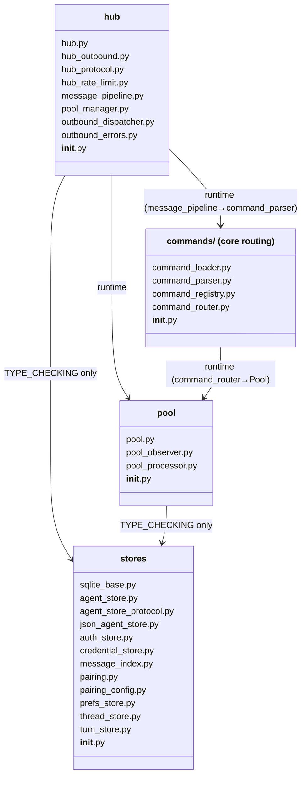
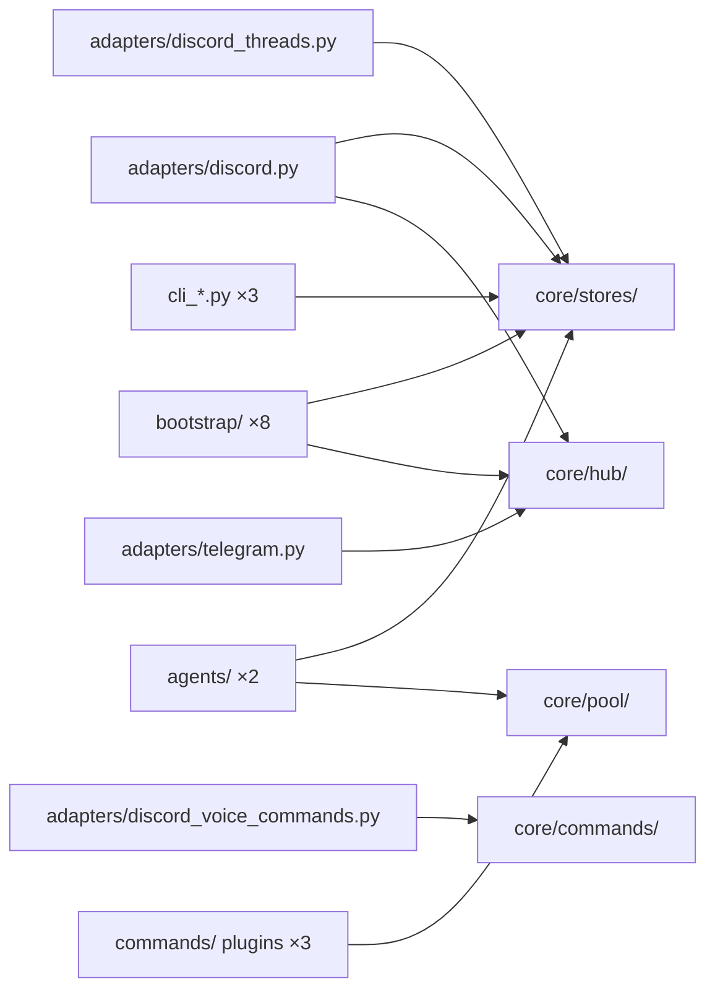

## Context

Promoted from: `artifacts/analyses/395-split-core-subdirectories-analysis.mdx`

This spec covers **one branch, three issues**: #395 (structural split), #396 (file-size hook),
#397 (pyright strict). All three land in a single PR targeting `staging`.

Shape selected: **Shape 1 — full move + all-import updates** (no stub shims, Pyright is the
completeness oracle). During S1–S2 Pyright runs in its current `basic` mode. Mode is upgraded
to `standard` then `strict` in S5 (#397).

## Goal

Move 27 files from `src/lyra/core/` flat into four named subdirectories (`stores/`, `hub/`,
`pool/`, `commands/`), update all import sites (absolute + relative depth), lower the
file-size pre-commit threshold from 500 → 300 lines (#396), and switch Pyright from `basic`
→ `strict` (#397) — all verified green before the PR opens.

## Users

- **AI coding agents** — primary beneficiary. `core/` flat drops from 68 → 41 files; four
  named subdirs give instant structural orientation without a full directory scan.
- **Human developers** — smaller `git diff` scope, cleaner `grep` results, faster PR reviews.

## Expected Behavior

After this change:

1. `src/lyra/core/` contains four subdirectories (`stores/`, `hub/`, `pool/`, `commands/`)
   plus 41 flat files (agent cluster, memory cluster, shared primitives).

2. All imports use new paths. Example:
   - Before: `from lyra.core.agent_store import AgentStore`
   - After:  `from lyra.core.stores.agent_store import AgentStore`
   `core/__init__.py` re-exports the same **25 symbols** as before (source paths updated,
   exported interface unchanged).

3. A new pre-commit hook rejects commits adding files over 300 lines. The 16 existing
   violators are listed in an explicit allowlist; each is tracked as a follow-up refactor
   per the ROADMAP cadence.

4. Pyright runs in `strict` mode. All type errors are fixed before the PR opens.
   `LlmProvider` has one canonical definition in `llm/base.py`.

## Data Model & Consumers

### Package structure after split

### Consumer map

### Consumer summary

| Consumer | Imports from | Update needed |
|----------|-------------|---------------|
| `adapters/discord.py` | stores, hub | ✅ this issue |
| `adapters/discord_threads.py` | stores | ✅ this issue |
| `adapters/discord_voice_commands.py` | commands | ✅ this issue |
| `adapters/telegram.py` | hub | ✅ this issue |
| `bootstrap/` ×8 | stores, hub | ✅ this issue |
| `agents/` ×2 | stores, pool | ✅ this issue |
| `commands/` plugins ×3 | pool | ✅ this issue |
| `cli_*.py` ×3 | stores | ✅ this issue |
| `core/` internal ~31 files | all groups | ✅ this issue |
| `llm/` and `tts/` | flat-only modules | ✗ out of scope (no moved-group imports) |
| `core/__init__.py` | hub, pool → subdirs | ✅ this issue (U3) |

## Breadboard

Two categories of import updates must happen for every moved file:

- **U1a (absolute):** `from lyra.core.X import Y` → `from lyra.core.<subdir>.X import Y` in
  external and internal consumers.
- **U1b (relative depth):** relative imports inside moved files change depth.
  - Same-subdir: `from .hub_outbound import …` → unchanged (sibling stays sibling).
  - Cross-subdir or flat: `from .pool import Pool` → `from ..pool import Pool` (one level up
    from hub/ to core/, then into pool/).
  - Flat-remaining: `from .message import …` → `from ..message import …` (from inside
    stores/, hub/, pool/, or commands/ back up to flat core/).

| ID | Operation | Files | Gate |
|----|-----------|-------|------|
| M1 | `git mv` stores group | 12 files → `core/stores/` | — |
| I1 | Write `core/stores/__init__.py` | exports key store symbols | — |
| U1a | Absolute imports for stores consumers | ~31 core/ + 14 external files | — |
| U1b | Relative depth fixes inside stores files | all 12 moved files | pyright basic green |
| M2 | `git mv` pool group | 3 files → `core/pool/` | — |
| M3 | `git mv` commands group | 4 files → `core/commands/` | — |
| M4 | `git mv` hub group | 8 files → `core/hub/` | — |
| I2–I4 | Write `__init__.py` for pool/, commands/, hub/ | 3 files | — |
| U2a | Absolute imports for pool/commands/hub consumers | all remaining external files | — |
| U2b | Relative depth fixes inside pool/commands/hub files | all 15 moved files | — |
| U3 | Update `core/__init__.py` | re-export 25 symbols via new subdir paths | pyright basic green |
| V1 | `uv run pyright` (basic mode) | full codebase | 0 errors |
| V2 | `uv run pytest` | full suite | 0 regressions |
| D1 | Update `core/CLAUDE.md` | describe 4-subdir layout | — |
| D2 | Add `CLAUDE.md` per new subdir | 4 files | — |
| E1 | Lower file-size hook threshold 500 → 300 lines | `.pre-commit-config.yaml` / hook config | — |
| E2 | Add 16 existing violators to allowlist | hook config | hook passes |
| E3 | Add D3 entry to `CONTRIBUTING.md` | 300-line rule + allowlist process | — |
| E4 | Upgrade pyright `basic` → `standard` | `pyproject.toml` | 0 errors standard |
| E5 | Deduplicate `LlmProvider` | `agent_refiner.py` → import from `llm/base.py` | — |
| E6 | Upgrade pyright `standard` → `strict` | `pyproject.toml` | 0 errors strict |
| E7 | Add pyright to pre-commit hook chain | `.pre-commit-config.yaml` | — |
| V3 | `pre-commit run --all-files` | full codebase, all hooks | exit 0 |

## Slices

**Note on S1/S2 split:** `stores/` is safe to move independently (import-leaf, no circular
risk). `pool/`, `commands/`, and `hub/` must move together in one slice — hub files
(`hub.py`, `pool_manager.py`, `message_pipeline.py`) use `from .pool import Pool` at runtime;
splitting them across slices creates an intermediate pyright-red state.

| # | Slice | Operations | Closes |
|---|-------|-----------|--------|
| S1 | Move `stores/` | M1, I1, U1a, U1b → pyright basic + pytest green | partial #395 |
| S2 | Move `pool/` + `commands/` + `hub/` | M2–M4, I2–I4, U2a, U2b, U3 → pyright basic + pytest green | #395 structurally done |
| S3 | Docs | D1, D2 | #395 fully done |
| S4 | File-size hook | E1, E2, E3 → `pre-commit run --all-files` exit 0 | #396 |
| S5 | Pyright strict | E4, E5, E6, E7, V3 | #397 |

## Success Criteria

### #395 — core/ split

- [ ] `src/lyra/core/stores/` contains exactly 12 `.py` files + `__init__.py`
- [ ] `src/lyra/core/hub/` contains exactly 8 `.py` files + `__init__.py`
- [ ] `src/lyra/core/pool/` contains exactly 3 `.py` files + `__init__.py`
- [ ] `src/lyra/core/commands/` contains exactly 4 `.py` files + `__init__.py` (distinct from top-level `src/lyra/commands/`)
- [ ] None of the 27 moved files exist at their original flat `src/lyra/core/{name}.py` path
- [ ] `core/__init__.py` exports the same 25 symbols as before (`Action`, `Agent`, `AgentBase`, `Attachment`, `Button`, `ChannelAdapter`, `CodeBlock`, `ContentPart`, `FileEditSummary`, `Hub`, `InboundMessage`, `MediaPart`, `MessagePipeline`, `OutboundAttachment`, `OutboundMessage`, `PipelineResult`, `Platform`, `Pool`, `RenderEvent`, `Response`, `RoutingContext`, `RoutingKey`, `SilentCounts`, `TextRenderEvent`, `ToolSummaryRenderEvent`) — no additions or removals
- [ ] `uv run pyright` reports 0 errors (in basic mode, before S5 upgrades it)
- [ ] `uv run pytest` passes with 0 regressions (all tests that existed at branch-cut pass)
- [ ] `uv run ruff check .` clean
- [ ] `src/lyra/core/CLAUDE.md` updated to describe the 4-subdir layout with file maps per subdir
- [ ] Each new subdir has a `CLAUDE.md` summarising its files and purpose

### #396 — file-size hook

- [ ] File-size pre-commit hook threshold is 300 lines (lowered from existing 500-line hook)
- [ ] Hook config contains an explicit named allowlist of the 16 current violators
- [ ] `pre-commit run --all-files` exits 0 on branch HEAD
- [ ] `CONTRIBUTING.md` has a section documenting the 300-line rule and how to add a file to the allowlist when a refactor is deferred

### #397 — pyright strict

- [ ] `typeCheckingMode` is `"strict"` in `pyproject.toml` (upgraded from `"basic"`)
- [ ] `uv run pyright` reports 0 errors in strict mode
- [ ] `LlmProvider` has one canonical definition in `llm/base.py`; `agent_refiner.py` imports it rather than redefining it
- [ ] Pyright is in the pre-commit hook chain and `pre-commit run --all-files` exits 0
