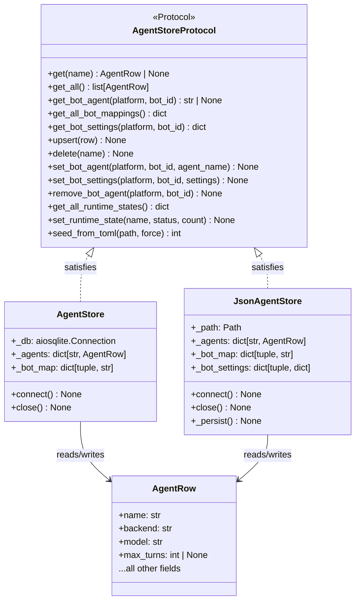
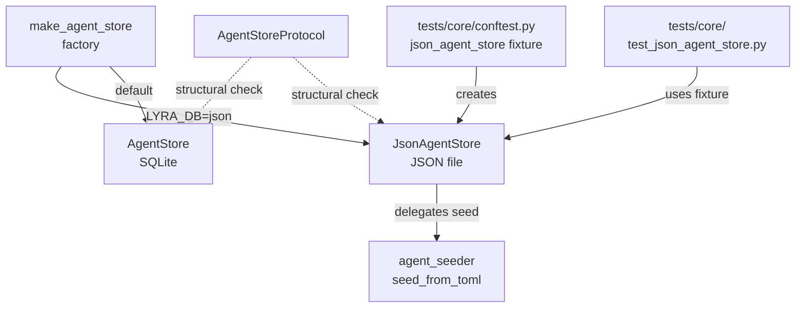

## Context

Promoted from frame `artifacts/frames/398-json-agent-store-stub-frame.mdx`.

All agent-related tests currently require a live SQLite `auth.db`. The
`AgentStoreProtocol` structural interface already exists (narrowly, in
`agent_seeder.py`). This spec defines a `JsonAgentStore` that satisfies a
fuller protocol, a factory function for env-var-driven store selection, and
updated test fixtures.

## Goal

Provide a `JsonAgentStore` that satisfies the `AgentStoreProtocol` so all
agent-related tests can run without a SQLite file or connection lifecycle.

## Users

- **Primary:** contributors writing or running agent-related tests; no `auth.db`
  required in CI or local dev.
- **Secondary:** CI pipelines — no database bootstrap step before test runs.

## Expected Behavior

### JsonAgentStore

`JsonAgentStore` is constructed with a `Path` to a JSON file (defaulting to a
temp path in tests). It holds all state in memory during the test session and
serializes to the file on write operations.

- `connect()` — loads the JSON file if it exists; creates an empty store if
  not. Always synchronous internally (no aiosqlite). Idempotent (second
  `connect()` is a no-op).
- `close()` — clears in-memory state. Idempotent.
- `get(name)` — returns `AgentRow | None` from in-memory dict.
- `get_all()` — returns `list[AgentRow]` from in-memory dict.
- `get_bot_agent(platform, bot_id)` — returns `str | None` from bot map.
- `get_all_bot_mappings()` — returns snapshot dict.
- `get_bot_settings(platform, bot_id)` — returns settings dict or `{}`.
- `upsert(row)` — writes to in-memory dict; persists to JSON file.
- `delete(name)` — raises `ValueError` if a bot is still assigned (mirrors
  `AgentStore`); removes from dict; persists.
- `set_bot_agent(platform, bot_id, agent_name, *, settings=None)` — upserts
  bot map; persists.
- `set_bot_settings(platform, bot_id, settings)` — raises `ValueError` if
  mapping doesn't exist (mirrors `AgentStore`); persists.
- `remove_bot_agent(platform, bot_id)` — removes mapping; no-op if absent;
  persists.
- `get_all_runtime_states()` — returns `{}` always (runtime state is
  session-specific, not needed in tests).
- `set_runtime_state(agent_name, status, pool_count)` — validates status;
  no-ops (no persistence needed for tests).
- `seed_from_toml(path, *, force=False)` — delegates to the existing
  `agent_seeder.seed_from_toml` helper, same as `AgentStore`.

### Protocol Expansion

The existing `AgentStoreProtocol` in `agent_seeder.py` only covers `get` +
`upsert`. A broader `AgentStoreProtocol` covering all methods used by callers
(`get`, `get_all`, `get_bot_agent`, `get_all_bot_mappings`, `get_bot_settings`,
`upsert`, `delete`, `set_bot_agent`, `set_bot_settings`, `remove_bot_agent`,
`get_all_runtime_states`, `set_runtime_state`, `seed_from_toml`) will be
defined in a new module `src/lyra/core/agent_store_protocol.py`. The narrow
protocol in `agent_seeder.py` is retained for backward compatibility.

### Factory Function (`make_agent_store`)

A factory `make_agent_store(db_path: Path | None = None) -> AgentStore |
JsonAgentStore` is added to `src/lyra/core/agent_store_protocol.py`. It reads
the `LYRA_DB` env var:

- `LYRA_DB=json` → returns `JsonAgentStore` using `LYRA_AGENT_STORE_PATH` if
  set, else `~/.lyra/agents_test.json`.
- Any other value (or unset) → returns `AgentStore(db_path=db_path or default)`.

`cli_agent.py:_connect_store` and `bootstrap/multibot_stores.py` are **not**
changed in this issue — the factory is intended for test use only at this stage.
The env-var mechanism exists so tests can activate it without monkeypatching.

### Test Fixtures

`tests/core/conftest.py` gains a new `json_agent_store` pytest fixture:

```python
@pytest.fixture
async def json_agent_store(tmp_path: Path):
    """JsonAgentStore fixture backed by a tmp JSON file — no SQLite needed."""
    from lyra.core.json_agent_store import JsonAgentStore
    store = JsonAgentStore(path=tmp_path / "agents_test.json")
    await store.connect()
    try:
        yield store
    finally:
        await store.close()
```

The existing `agent_store` fixture (SQLite) is **not** replaced — it continues
to serve tests that specifically test the SQLite implementation.

A new test file `tests/core/test_json_agent_store.py` verifies the
`JsonAgentStore` behavior against the same test matrix as
`test_agent_store_crud.py`, using `json_agent_store` fixture throughout.

## Data Model & Consumers





| Consumer | Fields / methods consumed | When | Status |
|---|---|---|---|
| `tests/core/test_json_agent_store.py` | All protocol methods | Test execution | This issue |
| `tests/core/conftest.py` | `connect`, `close`, `upsert`, `get`, `get_bot_agent` | Fixture yield | This issue |
| `make_agent_store` factory | Constructor only | Bootstrap / CLI | This issue (factory defined; callers not updated) |
| `cli_agent._connect_store` | Constructor + `connect` | CLI commands | Future (out of scope) |
| `bootstrap/multibot_stores.py` | All runtime methods | App startup | Future (out of scope) |

## Breadboard

| ID | Affordance | Handler | Data in | Data out |
|----|-----------|---------|---------|---------|
| U1 | `JsonAgentStore(path)` | `__init__` | `Path` | instance |
| U2 | `await store.connect()` | `connect()` | JSON file (optional) | populated `_agents`, `_bot_map` |
| U3 | `store.get(name)` | `get()` | agent name | `AgentRow \| None` |
| U4 | `store.get_all()` | `get_all()` | — | `list[AgentRow]` |
| U5 | `await store.upsert(row)` | `upsert()` | `AgentRow` | updated cache + persisted JSON |
| U6 | `await store.delete(name)` | `delete()` | agent name | removed from cache + persisted |
| U7 | `store.get_bot_agent(platform, bot_id)` | `get_bot_agent()` | platform, bot_id | `str \| None` |
| U8 | `await store.set_bot_agent(...)` | `set_bot_agent()` | platform, bot_id, agent_name | updated map + persisted |
| U9 | `store.get_bot_settings(platform, bot_id)` | `get_bot_settings()` | platform, bot_id | `dict` |
| U10 | `await store.set_bot_settings(...)` | `set_bot_settings()` | settings dict | updated + persisted |
| U11 | `await store.remove_bot_agent(...)` | `remove_bot_agent()` | platform, bot_id | removed + persisted |
| U12 | `make_agent_store(db_path)` | factory | `LYRA_DB` env, optional path | `AgentStore \| JsonAgentStore` |
| N1 | `LYRA_DB=json` env var | factory dispatch | env | selects `JsonAgentStore` |
| N2 | `LYRA_AGENT_STORE_PATH` env var | factory | env | overrides default JSON path |
| S1 | `json_agent_store` pytest fixture | conftest | `tmp_path` | ready `JsonAgentStore` |

## Slices

| # | Slice | Affordances | Deliverable |
|---|-------|-------------|-------------|
| 1 | `JsonAgentStore` core | U1–U11 | New file `src/lyra/core/json_agent_store.py` |
| 2 | Protocol + factory | U12, N1, N2 | New file `src/lyra/core/agent_store_protocol.py` |
| 3 | Test fixtures + tests | S1 + test matrix | Updated `conftest.py` + new `test_json_agent_store.py` |

## Success Criteria

- [ ] `JsonAgentStore` exists at `src/lyra/core/json_agent_store.py` and imports cleanly.
- [ ] `JsonAgentStore` satisfies `AgentStoreProtocol` (no runtime `isinstance` check needed — structural).
- [ ] `connect()` with a non-existent file starts with an empty store (no error).
- [ ] `connect()` with an existing JSON file populates `_agents` and `_bot_map` in memory.
- [ ] `connect()` is idempotent (second call is a no-op).
- [ ] `upsert()` + `get()` round-trip returns the same `AgentRow`.
- [ ] `delete()` raises `ValueError` when a bot is still assigned.
- [ ] `delete()` removes the agent when no bot is assigned.
- [ ] `get_bot_agent()` returns `None` for unknown platform/bot_id.
- [ ] `set_bot_settings()` raises `ValueError` when no mapping row exists.
- [ ] `remove_bot_agent()` is a no-op for unknown platform/bot_id.
- [ ] `get_all_runtime_states()` always returns `{}`.
- [ ] `set_runtime_state()` raises `ValueError` for invalid status; no-ops otherwise.
- [ ] `make_agent_store()` with `LYRA_DB=json` returns a `JsonAgentStore`.
- [ ] `make_agent_store()` without `LYRA_DB=json` returns an `AgentStore`.
- [ ] `json_agent_store` pytest fixture connects and tears down cleanly.
- [ ] `tests/core/test_json_agent_store.py` covers the same CRUD + bot-map matrix as `test_agent_store_crud.py`.
- [ ] All existing tests pass unchanged (no regressions).
- [ ] `ruff check` and `pyright` pass with no new errors.
