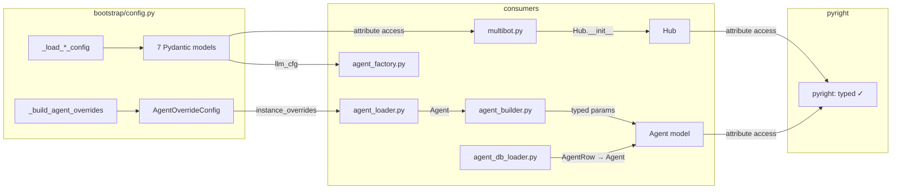

## Context

Promoted from [analysis](../analyses/411-typeddict-annotation-sprint-analysis.mdx).
Shape 2 (per-section Pydantic models, incremental) selected. All open questions resolved:
Agent migrates now, `AgentOverrideConfig` model for overrides, no in-flight blockers.

## Goal

Replace all bare `dict` config returns and config dataclasses with Pydantic v2 `BaseModel`,
then re-enable the 7 suppressed pyright strict rules with 0 errors across src + tests.

## Users

- **Primary:** Developers — type-safe config access catches real bugs before runtime
- **Secondary:** CI pipeline — pyright strict gate becomes meaningful for Unknown-type family

## Expected Behavior

After this change, the config loading pipeline produces fully typed Pydantic models at
every boundary. A developer writing `hub_cfg.pool_ttl` gets autocomplete and type checking,
whereas today `hub_cfg["pool_ttl"]` is `Unknown`. When any of the 7 previously-suppressed
pyright rules is violated, CI fails immediately instead of silently passing.

The migration is transparent to runtime behavior — all config values, defaults, and
validation logic remain identical. Pydantic `model_validate()` replaces manual
`dict.get()` with default patterns. Existing `__post_init__` validation moves to
`@field_validator` or `@model_validator`.

## Data Model & Consumers

### Data structure diagram

```mermaid
classDiagram
    direction TB

    class CliPoolConfig {
        <<frozen>>
        +idle_ttl: int = 1200
        +default_timeout: int = 1200
        +turn_timeout: float | None = None
        +reaper_interval: int = 60
        +kill_timeout: float = 5.0
        +read_buffer_bytes: int = 1048576
        +stdin_drain_timeout: float = 10.0
        +max_idle_retries: int = 3
        +intermediate_timeout: float = 5.0
    }

    class HubConfig {
        <<frozen>>
        +pool_ttl: float = 604800.0
        +rate_limit: int = 20
        +rate_window: int = 60
    }

    class PoolConfig {
        <<frozen>>
        +max_sdk_history: int = 50
        +safe_dispatch_timeout: float = 10.0
    }

    class LlmConfig {
        <<frozen>>
        +max_retries: int = 3
        +backoff_base: float = 1.0
    }

    class InboundBusConfig {
        <<frozen>>
        +queue_depth_threshold: int = 100
        +staging_maxsize: int = 500
        +platform_queue_maxsize: int = 100
    }

    class DebouncerConfig {
        <<frozen>>
        +default_debounce_ms: int = 300
        +max_merged_chars: int = 4096
    }

    class AgentOverrideConfig {
        <<frozen>>
        +cwd: Path | None = None
        +persona: str | None = None
        +workspaces: dict~str, str~ = {}
    }

    class ModelConfig {
        <<frozen>>
        +backend: str = "claude-cli"
        +model: str = "claude-sonnet-4-5"
        +max_turns: int | None = None
        +tools: tuple~str~ = ()
        +cwd: Path | None = None
        +skip_permissions: bool = False
        +streaming: bool = False
        __eq__/__hash__ exclude cwd
    }

    class SmartRoutingConfig {
        <<frozen>>
        +enabled: bool = False
        +routing_table: dict~Complexity, str~
        +history_size: int = 50
        +high_complexity_commands: tuple~str~ = ()
        needs @field_serializer for Enum keys
    }

    class Agent {
        <<mutable>>
        +name: str
        +system_prompt: str
        +memory_namespace: str
        +llm_config: ModelConfig
        +permissions: tuple~str~ = ()
        +commands: dict~str, CommandConfig~
        +commands_enabled: tuple~str~ = ()
        +persona: PersonaConfig | None
        +i18n_language: str = "en"
        +smart_routing: SmartRoutingConfig | None
        +show_intermediate: bool = False
        +show_tool_recap: bool = True
        +workspaces: dict~str, Path~
        +voice: AgentVoiceConfig | None
        +patterns: dict~str, bool~
        +passthroughs: tuple~str~ = ()
        RENAMED: model_config → llm_config
    }

    class PersonaConfig {
        <<frozen>>
        +identity: IdentityConfig
        +personality: PersonalityConfig
        +expertise: ExpertiseConfig
        +voice: VoiceConfig
    }

    Agent --> ModelConfig
    Agent --> PersonaConfig
    Agent --> SmartRoutingConfig
    Agent --> AgentVoiceConfig
    PersonaConfig --> IdentityConfig
    PersonaConfig --> PersonalityConfig
    PersonaConfig --> ExpertiseConfig
    PersonaConfig --> VoiceConfig
    AgentVoiceConfig --> AgentTTSConfig
    AgentVoiceConfig --> AgentSTTConfig
```

### Consumer map



### Consumer summary

| Consumer | Fields consumed | When | Status |
|----------|----------------|------|--------|
| `multibot.py` | All 7 section configs (cli_pool, hub, pool, llm, inbound_bus, debouncer fields) | Bootstrap startup | This issue |
| `agent_factory.py` | `LlmConfig.max_retries`, `LlmConfig.backoff_base` | Provider registry build | This issue |
| `agent_loader.py` | `AgentOverrideConfig.cwd`, `.persona`, `.workspaces` | Agent TOML loading | This issue |
| `agent_builder.py` | SmartRoutingConfig, AgentTTSConfig, AgentSTTConfig, CommandConfig (via `_build_*_from_dict`) | Agent assembly | This issue |
| `agent_db_loader.py` | AgentRow → Agent (full config) | DB-first agent loading | This issue |
| `Hub.__init__()` | pool_ttl, rate_limit, rate_window, staging_maxsize, etc. | Hub construction | This issue |
| `CliPool.send()` | `ModelConfig.__eq__` (excludes cwd) | Backend mismatch detection | This issue |
| `set_param()` | `dataclasses.replace()` → `model_copy(update=...)` | `/config set` command | This issue |
| `RuntimeConfig.reset()` | `dataclasses.replace()` → `model_copy(update=...)` | `/config reset` command | This issue |
| `RuntimeConfigHolder` | `RuntimeConfig.model_copy(update=...)` | `/config` command | This issue |
| `StreamProcessor` | `ToolDisplayConfig.show` (MappingProxyType) | Streaming tool summary | This issue |
| `AgentStore` | `SmartRoutingConfig.routing_table` JSON serialization (Enum keys) | Agent DB persistence | This issue |

## Breadboard

### N1: New section models (bootstrap/config.py)

| Affordance | Handler | Data |
|-----------|---------|------|
| `_load_cli_pool_config(raw)` | `CliPoolConfig.model_validate(raw.get("cli_pool", {}))` | CliPoolConfig |
| `_load_hub_config(raw)` | `HubConfig.model_validate(raw.get("hub", {}))` | HubConfig |
| `_load_pool_config(raw)` | `PoolConfig.model_validate(raw.get("pool", {}))` | PoolConfig |
| `_load_llm_config(raw)` | `LlmConfig.model_validate(raw.get("llm", {}))` | LlmConfig |
| `_load_inbound_bus_config(raw)` | `InboundBusConfig.model_validate(raw.get("inbound_bus", {}))` | InboundBusConfig |
| `_load_debouncer_config(raw)` | `DebouncerConfig.model_validate(raw.get("debouncer", {}))` | DebouncerConfig |
| `_build_agent_overrides(raw, name)` | Merge logic preserved, `AgentOverrideConfig.model_validate(merged)` | AgentOverrideConfig |

### N2: Consumer updates (multibot.py, __main__.py)

| Affordance | Before | After |
|-----------|--------|-------|
| `Hub.__init__()` | `debouncer_cfg["default_debounce_ms"]` | `debouncer_cfg.default_debounce_ms` |
| `Hub.__init__()` | `cli_pool_cfg["turn_timeout"]` | `cli_pool_cfg.turn_timeout` |
| `Hub.__init__()` | `hub_cfg["pool_ttl"]` | `hub_cfg.pool_ttl` |
| `agent_loader` | `overrides["cwd"]` | `overrides.cwd` |
| `agent_factory` | `llm_cfg["max_retries"]` | `llm_cfg.max_retries` |
| `agent.model_config` (8+ sites) | `agent.model_config.model` | `agent.llm_config.model` (rename: `model_config` is reserved by Pydantic for `ConfigDict`) |
| `_build_smart_routing_from_dict(d)` | Accepts bare `dict`, returns `SmartRoutingConfig` | Accepts typed params or `dict[str, Any]` with `model_validate` |
| `_build_tts_from_dict(d)` | Accepts bare `dict`, returns `AgentTTSConfig` | Accepts typed params or `dict[str, Any]` with `model_validate` |
| `_build_stt_from_dict(d)` | Accepts bare `dict`, returns `AgentSTTConfig` | Accepts typed params or `dict[str, Any]` with `model_validate` |
| `_build_commands_from_dict(d)` | Accepts bare `dict`, returns `dict[str, CommandConfig]` | Accepts `dict[str, Any]`, returns typed `dict[str, CommandConfig]` |
| `set_param(rc, key, value)` | `dataclasses.replace(rc, **{key: parsed})` | `rc.model_copy(update={key: parsed})` |
| `RuntimeConfig.reset()` | `replace(instance, **{key: _DEFAULTS[key]})` | `instance.model_copy(update={key: cls.model_fields[key].default})` — `_DEFAULTS` dict removed, derive from `model_fields` |

### N3: Dataclass → Pydantic migration patterns

| Pattern | Before (dataclass) | After (Pydantic) |
|---------|-------------------|-----------------|
| Frozen config | `@dataclass(frozen=True)` | `model_config = ConfigDict(frozen=True)` |
| Mutable config (Agent) | `@dataclass` | `model_config = ConfigDict(frozen=False)` |
| Instance copy | `dataclasses.replace(rc, **{k: v})` | `rc.model_copy(update={k: v})` |
| `compare=False` (ModelConfig.cwd) | `field(default=None, compare=False)` | Custom `__eq__`/`__hash__` excluding `cwd` |
| `__post_init__` validation | `def __post_init__(self)` | `@field_validator` with constraints or `@model_validator(mode='after')` |
| `MappingProxyType` field (ToolDisplayConfig.show) | `field(default_factory=lambda: MappingProxyType(...))` + manual `_DEFAULT_SHOW` merge in `from_dict()` | `@field_validator("show", mode="before")` that merges `_DEFAULT_SHOW` with incoming dict THEN wraps in `MappingProxyType`. Merge logic from `from_dict()` moves into the validator. |
| `__post_init__` validation (ToolDisplayConfig) | 4 numeric range checks in `__post_init__` | `@field_validator` with `ge=1` / `ge=0` constraints per field. Pydantic raises `ValidationError` (subclass of `ValueError` in v2). |
| `from_dict()` classmethod | `cls(**{k:v for k,v in data.items() if k in known})` | `cls.model_validate(data)` with `model_config = ConfigDict(extra="ignore")` |
| Default factory | `field(default_factory=dict)` | `dict[str, X] = {}` (Pydantic handles mutable defaults) |
| Enum dict keys (SmartRouting) | `dict[Complexity, str]` | Same type + `@field_serializer("routing_table")` that maps keys to `.value` for JSON. Use `model_dump(mode="json")` for AgentStore. On deserialization, `@field_validator("routing_table", mode="before")` converts string keys back to `Complexity` enum. |
| Reserved field name (`Agent.model_config`) | `model_config: ModelConfig` | Rename to `llm_config: ModelConfig` — `model_config` is reserved by Pydantic for `ConfigDict`. Update all 8+ call sites across `agent.py`, `agent_builder.py`, `runtime_config.py`, `cli_pool_worker.py`, `agent_db_loader.py`. |
| Nested frozen models as fields | `field(default_factory=PersonalityConfig)` | Nested models must also be `BaseModel` (not raw dataclass) for `model_validate` to recursively coerce from dicts. Migrate inner models first. |
| Positional construction (tests) | `Agent("lyra", "prompt", "ns")` | `Agent(name="lyra", system_prompt="prompt", memory_namespace="ns")` |
| `_DEFAULTS` parallel source of truth | `_DEFAULTS: dict[str, object]` used in `.save()` and `.reset()` | Remove `_DEFAULTS` dict. Derive defaults from `RuntimeConfig.model_fields[k].default` instead. |

### N4: Pyright rule re-enablement

| Affordance | Handler | Gate |
|-----------|---------|------|
| Re-enable rule | Remove `= "none"` line from pyproject.toml | `uv run pyright` returns 0 errors |
| Order | Lowest hit-count first (1→7 per analysis table) | Each rule independently validated |
| `_load_raw_config()` bare dict | Annotate return as `dict[str, Any]` (explicit type arg) | Fixes `reportMissingTypeArgument` |
| `section: dict` locals | Annotate as `dict[str, Any]` where they survive after migration | Fixes `reportMissingTypeArgument` |

## Slices

| # | Slice | Files | Demo |
|---|-------|-------|------|
| S1 | **Bootstrap config models** — 7 new Pydantic section models + AgentOverrideConfig, update multibot.py/main.py/agent_factory consumers from dict to attribute access | `bootstrap/config.py`, `bootstrap/multibot.py`, `bootstrap/agent_factory.py`, `__main__.py`, tests | `uv run pyright` passes. `hub_cfg.pool_ttl` autocompletes. All existing tests pass. |
| S2 | **Agent + adapter config migration** — Rename `Agent.model_config` → `Agent.llm_config` (reserved name). Migrate 11 agent_config.py classes (including Agent with `ConfigDict(frozen=False)`, ModelConfig with custom `__eq__`), 4 config.py classes, 2 adapter configs, 2 TTS/STT configs. Update agent_loader, agent_builder (`_build_*_from_dict` typed params), agent_db_loader. SmartRoutingConfig enum serializer for AgentStore. | `core/agent_config.py`, `config.py`, `adapters/telegram.py`, `adapters/discord_config.py`, `tts/__init__.py`, `stt/__init__.py`, `core/agent_loader.py`, `core/agent_builder.py`, `core/agent_db_loader.py`, `core/agent.py`, `core/cli_pool_worker.py`, tests | `uv run pyright` passes. `agent.llm_config.model` is typed. AgentStore can serialize/deserialize a SmartRouting agent without data loss. All agent tests pass with keyword-arg construction. |
| S3 | **Utility configs + rule re-enablement** — Migrate RuntimeConfig + EffectiveConfig (model_copy, remove `_DEFAULTS`), ToolDisplayConfig (MappingProxyType merge validator, numeric validators), PairingConfig, MonitoringConfig. Re-enable all 7 pyright rules. Fix remaining errors. | `core/runtime_config.py`, `core/tool_display_config.py`, `core/stores/pairing_config.py`, `monitoring/config.py`, `pyproject.toml`, tests | `uv run pyright` passes with ALL 7 rules re-enabled and 0 errors. Suppression block removed from pyproject.toml. |

Slice dependencies: S1 → S2 → S3 (each builds on previous typed models).

## Success Criteria

- [ ] All 7 `_load_*_config()` functions in `bootstrap/config.py` return Pydantic `BaseModel` instances (not `dict`)
- [ ] `_build_agent_overrides()` returns `AgentOverrideConfig` Pydantic model
- [ ] All config dataclasses listed in the analysis table (25 classes, 12 files) converted to Pydantic `BaseModel`
- [ ] `Agent.model_config` renamed to `Agent.llm_config` (Pydantic reserved name) and all call sites updated
- [ ] `ModelConfig.__eq__` excludes `cwd` field (preserving `compare=False` semantics for `CliPool.send()`)
- [ ] `ToolDisplayConfig.show` field remains `MappingProxyType[str, bool]` with `@field_validator` that merges `_DEFAULT_SHOW` before wrapping
- [ ] `ToolDisplayConfig` numeric validation migrated from `__post_init__` to `@field_validator` constraints
- [ ] `RuntimeConfig.set_param()` and `.reset()` use `model_copy(update=...)` instead of `dataclasses.replace()`; `_DEFAULTS` dict removed in favor of `model_fields` defaults
- [ ] `MonitoringConfig` validation migrated from `__post_init__` to Pydantic validators
- [ ] `SmartRoutingConfig.routing_table` round-trips correctly through AgentStore JSON serialization (Enum keys preserved)
- [ ] All 7 pyright rules re-enabled in `pyproject.toml` (suppression block removed)
- [ ] `uv run pyright` returns 0 errors, 0 warnings with all rules active
- [ ] All existing tests pass after migrating fixture construction from positional to keyword args
- [ ] No bare `dict[str, Any]` or unparameterized `dict` at config loading return types (except `_load_raw_config()` which returns `dict[str, Any]` by design — consumed only by section loaders)
