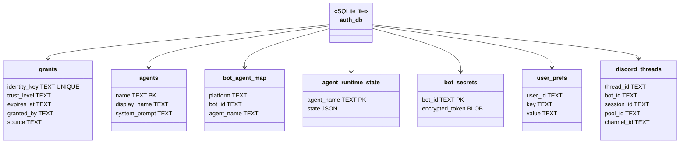
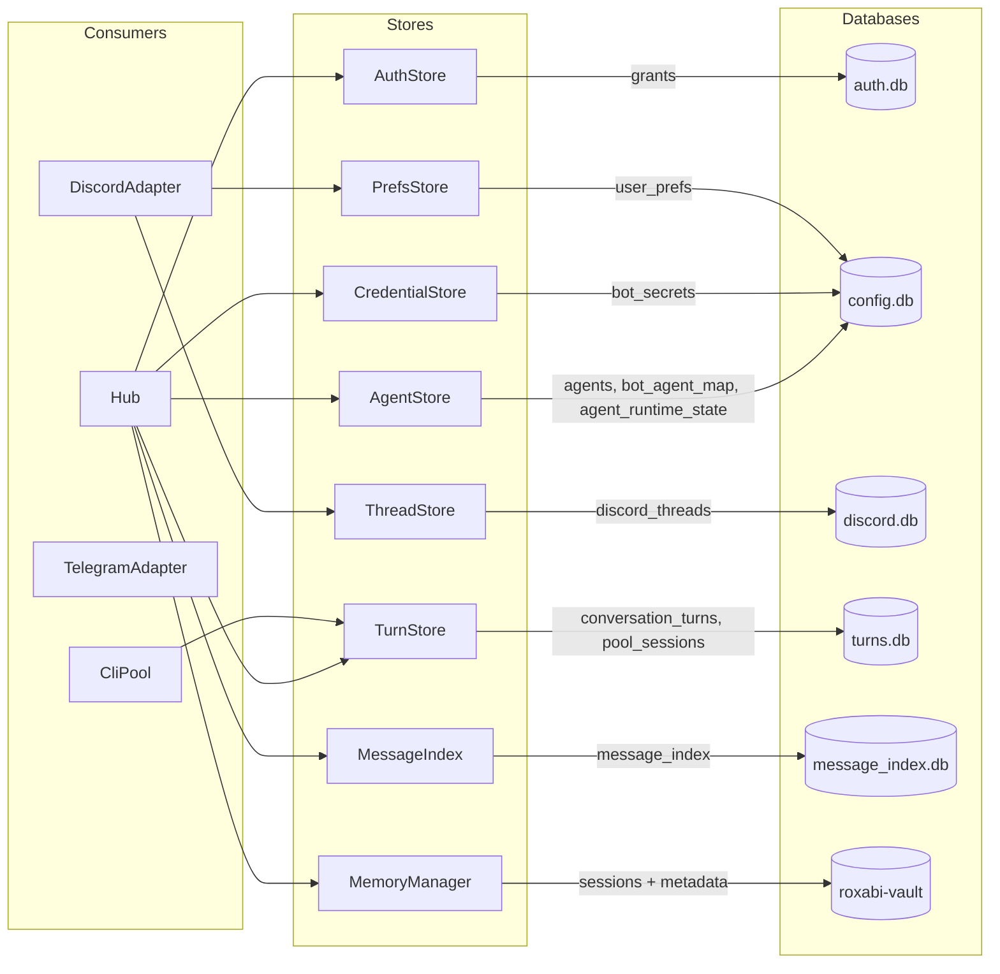

## Context

Issue #417 surfaced 10 architectural findings in Lyra's persistence layer. 5 are fixed (1, 3, 10, D, E). This spec covers the 5 remaining findings: auth.db domain overload (B), implicit sessions (F), ThreadStore placement (G), memory session_id gap (H), and message_index pruning (I). Shape 1 (parallel PRs with sub-issues) was selected in analysis.

### Out of scope

- **Finding 1** (dead `agents.db` file) — fixed, references removed
- **Finding 3** (deprecated `paired_sessions` DDL) — fixed, DDL cleaned up
- **Finding 10** (Path 3 guard bug) — fixed, group chat guard added
- **Finding D** (`_resume_session_ids` in-memory loss) — fixed in bd3d739/118bb83 via `cli_sessions.json` disk persistence
- **Finding E** (`_session_file_exists()` timing bug) — fixed in f5cb07e, guard removed entirely
- Switching away from SQLite
- Rewriting the CLI subprocess model

## Goal

Decompose Lyra's monolithic `auth.db` into domain-specific databases, make sessions first-class entities, and close hygiene gaps — each finding shipping as an independent, backward-compatible PR.

## Users

- **End users** (Telegram, Discord) — benefit from session lifecycle tracking (F) and reduced risk of schema migration breakage (B)
- **Operators** (single production instance, 24/7) — benefit from bounded disk growth (I) and clean database separation (B, G)
- **Developers** — benefit from domain isolation (B, G), explicit session semantics (F), and memory traceability (H)

## Expected Behavior

### Finding B: auth.db split

Today `open_stores()` in `multibot_stores.py` connects 5 stores to `auth.db`. After this change:

1. `auth.db` contains only the `grants` table (AuthStore)
2. A new `config.db` contains `agents`, `bot_agent_map`, `agent_runtime_state` (AgentStore), `bot_secrets` (CredentialStore), and `user_prefs` (PrefsStore)
3. Migration runs at startup (inside `open_stores()`), before any adapters connect or requests are served. If `config.db` is absent, the migration copies tables from `auth.db` to a temporary file, then atomically renames it to `config.db` (prevents partial migration on crash/kill). A warning is logged.
4. If a partial `config.db` exists (no sentinel `_migration_complete` flag row), it is deleted and re-created from `auth.db`
5. `config.db` lives in the same `vault_dir` as `auth.db` (preserves `keyring.key` path for CredentialStore)
6. After migration, old tables remain in `auth.db` as tombstones — sufficient for rollback by reverting the code change and restarting
7. A test runs `_populate_343()` and `_rebuild_346()` twice on the migrated `config.db` and asserts row counts are unchanged (verifies idempotency on copied database)

### Finding F: explicit sessions table

Today sessions are inferred from `conversation_turns` rows via index scans. After this change:

1. A new `pool_sessions` table exists in `turns.db`:
   ```sql
   CREATE TABLE IF NOT EXISTS pool_sessions (
       session_id    TEXT PRIMARY KEY,
       pool_id       TEXT NOT NULL,
       started_at    TEXT NOT NULL,
       last_active_at TEXT NOT NULL,
       ended_at      TEXT,
       resume_count  INTEGER DEFAULT 0,
       metadata      TEXT DEFAULT '{}'
   );
   CREATE INDEX IF NOT EXISTS idx_pool_sessions_pool
       ON pool_sessions(pool_id, last_active_at);
   ```
2. `start_session()` uses INSERT OR IGNORE — safe to call on restarts without duplicate key errors
3. `last_active_at` is updated on each turn logged via `log_turn()`. If no matching session row exists (e.g., corrupt data), the UPDATE affects 0 rows without error
4. `get_last_session(pool_id)` queries `pool_sessions` instead of scanning `conversation_turns`. **Behavioral change:** returns a session as soon as `start_session()` is called (today it returns only after an assistant turn). This is intentional — sessions exist from creation, not from first reply
5. Backfill migration derives sessions from `conversation_turns` grouped by `(pool_id, session_id)`: `started_at = MIN(timestamp)`, `last_active_at = MAX(timestamp)`, `resume_count = 0` (acknowledged approximation — pre-backfill resume counts are lost). Rows with empty `session_id` are skipped. Running `_backfill_sessions()` twice produces no duplicate rows (INSERT OR IGNORE).

### Finding G: ThreadStore to discord.db

Today `discord_threads` lives in `auth.db`. After this change:

1. Discord adapter owns a `discord.db` file in `vault_dir`
2. `ThreadStore` connects to `discord.db` instead of `auth.db`
3. On first startup, migration copies `discord_threads` rows from `auth.db` to `discord.db` (atomic rename pattern, same as B)
4. `StoreBundle` no longer holds `ThreadStore` — the Discord adapter creates and manages its own store
5. `wire_discord_adapters()` no longer accepts a `thread_store` parameter — each adapter constructs its own `ThreadStore(discord.db)` and closes it in `adapter.close()`
6. The Discord adapter queries its own `ThreadStore` directly for `is_owned()` and session restore. Thread context is passed to Hub via `platform_meta` keys: `thread_id`, `session_id`, `pool_id`, `channel_id`
7. The `_session_update_fn` closure in `platform_meta` references the adapter-owned `ThreadStore` instance
8. Multiple Discord adapters open independent connections to the same `discord.db` — safe under WAL mode (enabled by `SqliteStore._open_db`)

### Finding I: message_index pruning

Today `cleanup_older_than()` exists but is never called. After this change:

1. After `open_stores()` yields, `multibot.py` calls `message_index.cleanup_older_than(days)` before starting adapters
2. Retention window is configurable via `config.toml` key `[message_index] retention_days = 90`
3. Startup log reports number of pruned entries

### Finding H: memory session_id metadata

Today `upsert_session()` passes `session_id` as the record identifier but not as queryable metadata. After this change:

1. `upsert_session()` includes `session_id` in the metadata dict passed to roxabi-vault
2. Vault recall queries can filter by `session_id`

H is the lowest-stakes finding — primarily a debugging aid, not a user-facing improvement. Safe to defer if the push runs long.

## Data Model & Consumers

### Current state: all stores in auth.db



### Target state: domain-specific databases

```mermaid
classDiagram
    class auth_db {
        <<grants only>>
    }
    class config_db {
        <<agents + creds + prefs>>
    }
    class discord_db {
        <<adapter-owned>>
    }
    class turns_db {
        <<turns + sessions>>
    }
    class message_index_db {
        <<self-pruning>>
    }

    class grants {
        identity_key TEXT UNIQUE
        trust_level TEXT
    }
    class agents {
        name TEXT PK
    }
    class bot_agent_map {
        platform TEXT
        bot_id TEXT
        agent_name TEXT
    }
    class agent_runtime_state {
        agent_name TEXT PK
        state JSON
    }
    class bot_secrets {
        bot_id TEXT PK
    }
    class user_prefs {
        user_id TEXT
        key TEXT
    }
    class discord_threads {
        thread_id TEXT
        bot_id TEXT
    }
    class pool_sessions {
        session_id TEXT PK
        pool_id TEXT
        last_active_at TEXT
        resume_count INT
    }
    class conversation_turns {
        session_id TEXT
        pool_id TEXT
    }
    class message_index {
        pool_id TEXT
        platform_msg_id TEXT
        created_at TEXT
    }

    auth_db --> grants
    config_db --> agents
    config_db --> bot_agent_map
    config_db --> agent_runtime_state
    config_db --> bot_secrets
    config_db --> user_prefs
    discord_db --> discord_threads
    turns_db --> pool_sessions
    turns_db --> conversation_turns
    message_index_db --> message_index
```



### Consumer map



### Consumer summary

| Consumer | Store | Fields consumed | When | Status |
|----------|-------|-----------------|------|--------|
| Hub | AuthStore | `trust_level` | Every inbound message (guard chain) | This issue (B) |
| Hub | AgentStore | `name`, `system_prompt`, config | Pool creation, agent lookup | This issue (B) |
| Hub | CredentialStore | `encrypted_token` | Bot startup | This issue (B) |
| Hub | TurnStore | `session_id`, `pool_id`, turns | Turn logging, session queries | This issue (F) |
| Hub | MessageIndex | `session_id` | Reply-to resolution | This issue (I) |
| Hub | MemoryManager | `session_id`, summary | Session end | This issue (H) |
| DiscordAdapter | ThreadStore | `thread_id`, `session_id`, `pool_id` | Thread claim, session restore, `is_owned()` | This issue (G) |
| CliPool | TurnStore | `pool_sessions.last_active_at` | Session resume | This issue (F) |

## Breadboard

### B: auth.db split

| Affordance | Handler | Data |
|------------|---------|------|
| B1: Startup migration guard | `open_stores()` | Checks `config.db` exists + has `_migration_complete` sentinel |
| B2: Table copy (atomic) | `_migrate_to_config_db()` | Copies agents, bot_agent_map, agent_runtime_state, bot_secrets, user_prefs to temp file; atomic rename |
| B3: Partial migration recovery | `open_stores()` | If `config.db` exists without sentinel → delete and re-migrate |
| B4: Connection path update | `open_stores()` | AgentStore, CredentialStore, PrefsStore → `config.db` |
| B5: Idempotency verification | `AgentStore.connect()` | `_populate_343()`, `_rebuild_346()` run in order on copied DB |
| B6: Normal startup (post-migration) | `open_stores()` | `config.db` exists + sentinel present → skip migration, connect stores |

### F: explicit sessions

| Affordance | Handler | Data |
|------------|---------|------|
| F1: DDL + index | `TurnStore.connect()` | `pool_sessions` table + `idx_pool_sessions_pool` |
| F2: Session creation (idempotent) | `TurnStore.start_session()` | INSERT OR IGNORE — safe on restart |
| F3: Activity update (tolerant) | `TurnStore.log_turn()` | UPDATE `pool_sessions SET last_active_at` — 0-row update OK if session absent |
| F4: Session query | `TurnStore.get_last_session()` | `SELECT ... FROM pool_sessions WHERE pool_id ORDER BY last_active_at DESC LIMIT 1` |
| F5: Backfill migration (idempotent) | `TurnStore._backfill_sessions()` | INSERT OR IGNORE from `conversation_turns` grouped by `(pool_id, session_id)`; skip empty `session_id` |

### G: ThreadStore to discord.db

| Affordance | Handler | Data |
|------------|---------|------|
| G1: Adapter-owned store | `wire_discord_adapters()` | Creates `ThreadStore(discord.db)` — no `thread_store` param |
| G2: Migration from auth.db | `_migrate_threads_to_discord_db()` | Copies `discord_threads` rows; atomic rename |
| G3: StoreBundle removal | `StoreBundle` | Remove `thread` field |
| G4: Direct adapter queries | `DiscordAdapter` | `is_owned()`, session restore via adapter-owned store |
| G5: Platform meta to Hub | `InboundMessage.platform_meta` | Keys: `thread_id`, `session_id`, `pool_id`, `channel_id` |
| G6: Adapter shutdown | `DiscordAdapter.close()` | `await self._thread_store.close()` |

### I: message_index pruning

| Affordance | Handler | Data |
|------------|---------|------|
| I1: Startup prune call | `multibot.py` after `open_stores()` yield | `message_index.cleanup_older_than(retention_days)` |
| I2: Config key | `config.toml` | `[message_index] retention_days = 90` |

### H: memory session_id

| Affordance | Handler | Data |
|------------|---------|------|
| H1: Metadata addition (write) | `MemoryManagerUpserts.upsert_session()` | `session_id=snap.session_id` in kwargs |
| H2: Metadata query (read) | `MemoryManager.recall()` or test | Filter vault entries by `session_id` metadata field |

## Slices

Each slice maps to a sub-issue of #417 and ships as an independent PR.

| Slice | Finding | Scope | Dependencies | Wave |
|-------|---------|-------|-------------|------|
| S1 | I: message_index pruning | I1, I2 | None | 1 |
| S2 | F: explicit sessions | F1–F5 | None (S2 and S3 share no database file) | 1 |
| S3 | B: auth.db split | B1–B6 | None | 1 |
| S4 | G: ThreadStore → discord.db | G1–G6 | S3 (adapter decoupling ships after config separation is stable) | 2 |
| S5 | H: memory session_id | H1–H2 | None (safe to defer — debugging aid only) | 3 |

## Success Criteria

### S1 — message_index pruning (I)
- [ ] `cleanup_older_than(days)` is called during startup in `multibot.py`
- [ ] `config.toml` has `[message_index] retention_days` with 90-day default
- [ ] Startup log includes count of pruned entries (observable: `grep pruned` in logs shows count)
- [ ] Existing tests for `cleanup_older_than()` still pass

### S2 — explicit sessions (F)
- [ ] `pool_sessions` table exists in `turns.db` DDL with index on `(pool_id, last_active_at)`
- [ ] `start_session()` uses INSERT OR IGNORE — calling twice with same `session_id` does not error
- [ ] `last_active_at` is updated on each `log_turn()` call; absent session row produces 0-row UPDATE without error
- [ ] `get_last_session(pool_id)` queries `pool_sessions` (not `conversation_turns` scan); returns session from creation, not first reply (intentional behavioral change)
- [ ] Backfill produces one session row per distinct `(pool_id, session_id)` pair in `conversation_turns`; empty `session_id` rows are skipped; `resume_count` defaults to 0
- [ ] Running `_backfill_sessions()` twice produces no duplicate `pool_sessions` rows
- [ ] **Observable:** `get_last_session()` returns in O(1) via index lookup (not full-table scan)

### S3 — auth.db split (B)
- [ ] `config.db` contains tables: `agents`, `bot_agent_map`, `agent_runtime_state`, `bot_secrets`, `user_prefs`
- [ ] `auth.db` contains only `grants` (plus tombstone tables from migration — sufficient for rollback)
- [ ] AgentStore, CredentialStore, PrefsStore connect to `config.db`; AuthStore connects to `auth.db` (unchanged)
- [ ] Migration uses atomic rename: writes to temp file, renames to `config.db` only after all tables copied + sentinel written
- [ ] Partial `config.db` (exists but no sentinel) is deleted and re-created on next startup
- [ ] `config.db` is in the same `vault_dir` as `auth.db`
- [ ] A test runs `_populate_343()` and `_rebuild_346()` in order on migrated `config.db` and asserts post-#346 schema with unchanged row counts
- [ ] All existing store tests pass against the new database layout
- [ ] **Observable:** After migration, Lyra starts cleanly and all agent commands (`lyra agent list`, `lyra agent show`) return correct data from `config.db`

### S4 — ThreadStore to discord.db (G)
- [ ] `discord_threads` table lives in `discord.db`, not `auth.db`
- [ ] Discord adapter creates and owns its `ThreadStore` connection; `wire_discord_adapters()` does not accept a `thread_store` parameter
- [ ] `StoreBundle` no longer holds `ThreadStore`
- [ ] Migration copies rows from `auth.db` to `discord.db` (atomic rename) on first startup
- [ ] `grep -r ThreadStore src/lyra/hub/` returns no results (Hub does not import or query ThreadStore)
- [ ] Discord adapter queries its own `ThreadStore` for `is_owned()` and session restore
- [ ] `_session_update_fn` closure in `platform_meta` references the adapter-owned `ThreadStore` instance
- [ ] On adapter shutdown, `discord.db` connection is closed cleanly (`adapter.close()` calls `thread_store.close()`)
- [ ] **Observable:** Ongoing Discord thread conversations retain session context after migration
