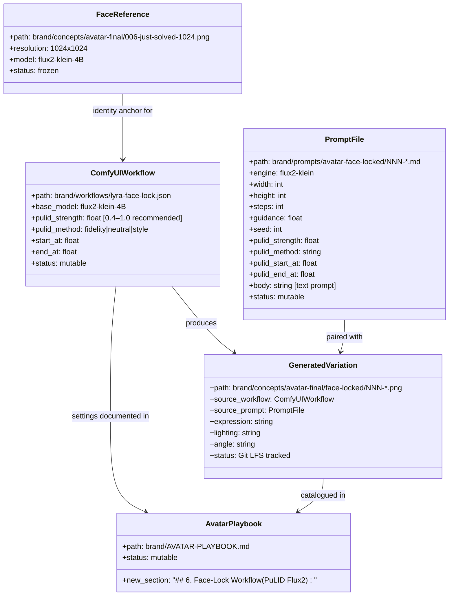
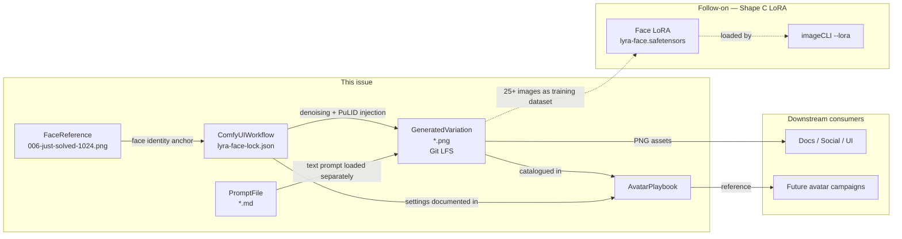

## Context

Promoted from: `artifacts/analyses/419-pulid-flux2-face-locking-analysis.mdx`

**Recommended shape: Shape A** — ComfyUI + `iFayens/ComfyUI-PuLID-Flux2` on Machine 2 (Pop!_OS,
RTX 5070 Ti, 16 GB GDDR7).

**Shape C** (face LoRA training) is a follow-on issue, sequenced after this one has produced
≥25 diverse face-locked images to serve as the training dataset.

**Shape B** (imageCLI engine extension) is deferred indefinitely — no standalone Python PuLID
API exists for Flux2-klein.

**Constraints:** No code changes to `imageCLI` or `lyra`. This is a brand asset workflow issue.
imageCLI and ComfyUI must never run concurrently on Machine 2 (shared 16 GB VRAM).

## Goal

Install and validate a face-locked avatar generation workflow on Machine 2 that uses
`006-just-solved-1024.png` as the identity anchor, produces recognizably consistent Lyra
variations across expressions/lighting/contexts, and documents the workflow + prompt patterns
for repeatable future runs.

## Users

- **Primary:** Mickael — generates and curates Lyra brand assets on Machine 2.
- **Secondary (future):** Any process consuming Lyra brand PNGs (docs, social, UI mockups)
  that depends on visual identity consistency.

## Expected Behavior

### Phase 1 — Environment Setup (~0.5 day)

Mickael installs ComfyUI on Machine 2 (Pop!_OS). RTX 5070 Ti uses CUDA sm_120 — PyTorch
nightly cu128 is required (not stable PyTorch); xformers must not be installed. The exact
PyTorch wheel URL used is recorded in the README for reproducibility.

The `flux2-klein-4B` checkpoint is symlinked or copied from the existing imageCLI model cache
into `~/ComfyUI/models/checkpoints/`. The `iFayens/ComfyUI-PuLID-Flux2` custom node is
installed via ComfyUI Manager, pulling InsightFace/AntelopeV2 and EVA02-CLIP-L.

**AntelopeV2 requires manual download** — it is not auto-fetched by ComfyUI Manager:
```bash
pip install huggingface_hub
python -c "
from huggingface_hub import snapshot_download
snapshot_download('deepinsight/insightface', repo_type='model',
                  local_dir='~/.insightface/models/antelopev2')
"
# Verify: ls ~/.insightface/models/antelopev2/
# If the node uses ComfyUI's path instead: ~/ComfyUI/models/insightface/antelopev2/
```

After install, a **smoke-test generation** is run (any simple prompt, no PuLID) to trigger
Blackwell PTX JIT compilation. This takes **30–45 minutes on first run** — this is normal,
not a hang. Subsequent runs are fast.

ComfyUI is confirmed ready when: `localhost:8188` is accessible, flux2-klein-4B loads, and the
smoke-test image generates without OOM.

### Phase 2 — Workflow Build + Quality Evaluation (~0.5 day)

Mickael builds the face-lock workflow in ComfyUI's node editor using the Flux2-native node chain
(not the SDXL `KSampler` — Flux2-klein requires the advanced sampler path):

- `DualCLIPLoader` → `CLIPTextEncodeFlux` (T5-XXL + CLIP-L dual encoder)
- `CheckpointLoaderSimple` → flux2-klein-4B
- `LoadImage` → `006-just-solved-1024.png`
- `ApplyPulidFlux2` (strength 0.6, method `fidelity`, start_at 0.0, end_at 1.0)
- `FluxGuidance` + `BasicScheduler` + `SamplerCustomAdvanced` (8 steps, Klein Base)
- `SaveImage` → `brand/concepts/avatar-final/face-locked/`

A quality gate is applied across ≥5 test outputs: do ≥4 of them look like the same person as
the reference? If not, tune:
- Reduce `end_at` to 0.6 → more pose freedom
- Switch method to `neutral` → better prompt adherence
- Adjust strength between 0.4–0.8

Note: FP8/GGUF Klein weights may not be compatible with PuLID attention injection hooks —
**verify before using** as a VRAM mitigation; prefer `--lowvram` mode first.

The validated workflow JSON is saved to `brand/workflows/lyra-face-lock.json`. A
`brand/workflows/lyra-face-lock-README.md` documents:
- Node chain (Flux2-native, not SDXL-style)
- Exact PyTorch nightly wheel URL used
- Tuning table: strength × method × end_at trade-offs (see analysis Shape A)
- VRAM budget notes + OOM mitigations
- AntelopeV2 install path + verification command
- GPU mutex: **ComfyUI and imageCLI cannot run concurrently on Machine 2**

### Phase 3 — Variation Generation + Documentation (~1 day)

With a validated workflow, Mickael runs a generation campaign producing ≥20 diverse variations.
Generated images go to `brand/concepts/avatar-final/face-locked/` and are **tracked via Git LFS**
(not gitignored, to enable Shape C training dataset access from the repo).

Each image has a paired prompt `.md` file in `brand/prompts/avatar-face-locked/` using the
extended face-lock frontmatter format (see Breadboard S3).

| Dimension | Targets |
|-----------|---------|
| Expressions | calm/neutral, subtle smile, full smile, focused/"just solved" |
| Lighting | soft studio, warm Forge Orange rim, natural window, low-key |
| Angles | full front, ¾ left, slight right turn |
| Distances | portrait (head+shoulders), a few medium (waist up) |

`brand/AVATAR-PLAYBOOK.md` receives a new section **`## 6. Face-Lock Workflow (PuLID Flux2)`**
containing:
- Prerequisites (ComfyUI installed, flux2-klein available, GPU mutex awareness)
- Step-by-step workflow execution guide
- Tuning reference table (strength × method × end_at)
- VRAM notes (14–16 GB ceiling, OOM mitigations, Machine 1 not viable)
- Shape C trigger: "When ≥25 face-locked images exist, see #[FOLLOW-ON] for LoRA training"

---

## Data Model & Consumers

### Core artifacts



### Consumer map



### Consumer summary

| Consumer | Artifacts | Fields used | Status |
|----------|-----------|-------------|--------|
| ComfyUI workflow | FaceReference | path | This issue |
| ComfyUI workflow | PromptFile | body (text prompt), dimensions | This issue |
| AvatarPlaybook | ComfyUIWorkflow | strength, method, start/end_at | This issue |
| AvatarPlaybook | GeneratedVariation | expression, lighting, angle | This issue |
| ai-toolkit (future) | GeneratedVariation | path (training dataset) | Follow-on |
| imageCLI (future) | LoRA safetensors | path, strength | Follow-on |
| Docs/Social/UI | GeneratedVariation | path (PNG) | This issue + ongoing |

---

## Breadboard

### S1 — ComfyUI + PuLID environment

| Element | Action | Data / Output |
|---------|--------|---------------|
| PyTorch nightly install | `pip install --pre torch --index-url https://download.pytorch.org/whl/nightly/cu128` — record exact URL | cu128, sm_120 compatible |
| ComfyUI clone | `git clone https://github.com/comfyanonymous/ComfyUI ~/ComfyUI` | `~/ComfyUI/` |
| ComfyUI Manager | Install via node drag-and-drop; do NOT install xformers | `custom_nodes/ComfyUI-Manager/` |
| flux2-klein-4B | Symlink or copy from imageCLI cache | `~/ComfyUI/models/checkpoints/` |
| PuLID Flux2 node | ComfyUI Manager → install `iFayens/ComfyUI-PuLID-Flux2` | `custom_nodes/ComfyUI-PuLID-Flux2/` |
| AntelopeV2 (manual) | `huggingface_hub` snapshot download → `~/.insightface/models/antelopev2/` | Verify path matches node expectation |
| EVA02-CLIP-L | Auto-downloaded on first node execution | `~/.cache/huggingface/` |
| Smoke-test generation | Run one simple generation (no PuLID) — **expect 30–45 min JIT on first run** | Output image, no OOM |

### S2 — Face-lock workflow (Flux2-native nodes)

| Element | Action | Data / Output |
|---------|--------|---------------|
| `CheckpointLoaderSimple` | Load flux2-klein-4B | model, clip, vae |
| `DualCLIPLoader` + `CLIPTextEncodeFlux` | Dual-encoder text encode (T5-XXL + CLIP-L) | conditioning |
| `LoadImage` (face ref) | Load `006-just-solved-1024.png` | face reference tensor |
| `ApplyPulidFlux2` | Inject identity: strength 0.6, method `fidelity`, start_at 0.0, end_at 1.0 | conditioned latent |
| `FluxGuidance` + `BasicScheduler` + `SamplerCustomAdvanced` | 8-step Klein Base inference | latent image |
| `VAEDecode` + `SaveImage` | Decode + write | `brand/concepts/avatar-final/face-locked/` |
| Quality gate (≥5 outputs) | ≥4/5 human-pass: same eye spacing, jaw, nose bridge as reference | pass/fail |
| Tuning loop | Adjust end_at → 0.6; switch method; adjust strength 0.4–0.8 | updated workflow JSON |
| Commit workflow | Save `lyra-face-lock.json` + `lyra-face-lock-README.md` | `brand/workflows/` |

### S3 — Variation campaign + documentation

| Element | Action | Data / Output |
|---------|--------|---------------|
| Prompt `.md` files (extended frontmatter) | Write ≥5 files with PuLID fields (see template below) | `brand/prompts/avatar-face-locked/` |
| Batch run | Execute workflow for each prompt variant | ≥20 output PNGs |
| Git LFS setup | `git lfs track "brand/concepts/avatar-final/face-locked/*.png"` | `.gitattributes` updated |
| Face check (human) | ≥16/20 images pass: same eye spacing, jaw, nose bridge | pass/fail per image |
| AVATAR-PLAYBOOK.md | Add `## 6. Face-Lock Workflow (PuLID Flux2)` section | `brand/AVATAR-PLAYBOOK.md` |

**Extended face-lock prompt frontmatter template:**

```yaml
---
engine: flux2-klein
width: 1024
height: 1024
steps: 8
guidance: 1.0
seed: 42
pulid_strength: 0.6
pulid_method: fidelity
pulid_start_at: 0.0
pulid_end_at: 1.0
---

Editorial portrait photograph. [describe everything EXCEPT face structure].
Expression: [expression anchor].
[Lighting description]. [Background].
Photorealistic, natural skin.
```

> Note: `steps: 8` and `guidance: 1.0` are Klein Base defaults. Describe expression, lighting,
> hair color, clothing, background — do NOT describe facial features (eye shape, jaw, bone
> structure). Face identity is captured by PuLID from the reference image, not the text prompt.

---

## Slices

| # | Slice | Deliverable | Demo-able? |
|---|-------|-------------|-----------|
| 1 | **Environment** — ComfyUI + PuLID on Machine 2, smoke-test passes | `localhost:8188` loads flux2-klein + PuLID node, smoke-test image generated (JIT warm) | ✅ ComfyUI UI accessible, model loaded |
| 2 | **Workflow** — face-lock workflow built, quality-gated, committed | `lyra-face-lock.json` + README, ≥4/5 test outputs pass face identity check | ✅ Show 5 samples beside reference |
| 3 | **Campaign** — ≥20 variations generated, prompt files + playbook written | ≥5 `.md` files, ≥20 PNGs in Git LFS, AVATAR-PLAYBOOK.md § 6 written | ✅ Gallery of diverse Lyra variations |

---

## Success Criteria

- [ ] ComfyUI starts on Pop!_OS (Machine 2) with `flux2-klein-4B` + `iFayens/ComfyUI-PuLID-Flux2` node loaded at `localhost:8188` without OOM at 1024×1024
- [ ] Face-lock workflow using Flux2-native node chain (DualCLIPLoader + CLIPTextEncodeFlux + SamplerCustomAdvanced) produces outputs where ≥16/20 campaign images pass human face identity check (same eye spacing, jaw line, nose bridge as `006-just-solved-1024.png`)
- [ ] ≥20 diverse variations generated covering ≥4 distinct expressions, ≥3 lighting setups, ≥2 head angles
- [ ] `brand/workflows/lyra-face-lock.json` and `brand/workflows/lyra-face-lock-README.md` committed — README includes PyTorch nightly wheel URL, node chain documentation, tuning table, AntelopeV2 install path, VRAM notes, and GPU mutex warning
- [ ] ≥5 prompt `.md` files committed to `brand/prompts/avatar-face-locked/` with extended PuLID frontmatter (`pulid_strength`, `pulid_method`, `pulid_start_at`, `pulid_end_at`, `seed`)
- [ ] Generated PNGs committed to Git LFS under `brand/concepts/avatar-final/face-locked/` — `.gitattributes` updated
- [ ] `brand/AVATAR-PLAYBOOK.md` updated with new section `## 6. Face-Lock Workflow (PuLID Flux2)` covering setup prerequisites, step-by-step execution, tuning reference table, VRAM budget, and Shape C trigger note
