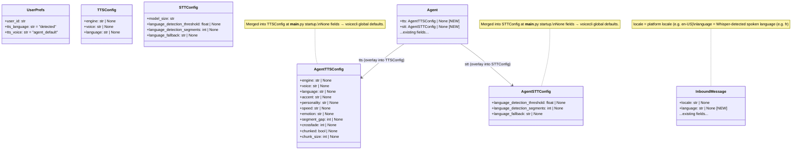
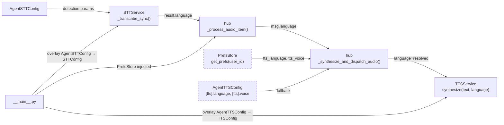

## Context

Promoted from frame: `artifacts/frames/42-user-agent-preference-layer-frame.mdx`

Five concrete gaps in the STT → hub → TTS pipeline must be closed to introduce per-user language preferences and per-agent voice/STT defaults.

## Goal

Users receive TTS replies in the language they spoke (or in an explicitly configured language), and each agent can define its own voice, TTS engine, and STT detection parameters independently of the global voicecli config.

## Users

- **Primary:** Lyra users on Telegram and Discord who speak French or switch languages mid-session — they currently always receive TTS in the globally fixed language.
- **Secondary:** Agent authors — each `agents/<agent>.toml` can now define `[tts]` and `[stt]` sections to control per-agent voice behavior without editing global env vars.

## Expected Behavior

**Voice message flow (detected mode — default):**
1. User sends a voice note in French.
2. STT transcribes it; `result.language = "fr"`.
3. `hub._process_audio_item()` propagates `language="fr"` onto the new `InboundMessage.language` field.
4. `hub._synthesize_and_dispatch_audio()` reads `msg.language`, checks `UserPrefs.tts_language`.
5. Since `tts_language == "detected"` and `msg.language = "fr"`, it passes `language="fr"` to `TTSService.synthesize()`.
6. TTS speaks the reply in French.

**Voice message flow (explicit user pref):**
1. User has set `tts_language = "en"` via a `/setpref` command (see Out of Scope note below).
2. User sends a voice note in French.
3. STT detects French; hub propagates it.
4. Pref resolution: explicit overrides detected → `language="en"` passed to TTS.
5. TTS speaks the reply in English.

**Voice message flow (no language detected):**
1. User sends very short audio; Whisper returns `language = None`.
2. `tts_language == "detected"` but `msg.language is None` → fall through to agent `[tts].language`.
3. If agent `[tts].language` is also absent → fall through to `TTS_LANGUAGE` env var → voicecli global.

**Agent TOML [tts]/[stt]:**
1. `agents/lyra_default.toml` gains optional `[tts]` and `[stt]` sections.
2. Missing fields fall back to voicecli global config — additive, not replacing.
3. Agent-level `[tts].voice` is used unless the user has set an explicit voice pref.

**STT detection params:**
1. Agent `[stt].language_detection_threshold = 0.90` is loaded and passed to `_transcribe()`.
2. Previously these params were silently ignored (voicecli defaults used implicitly).

---

## Data Model & Consumers





| Consumer | Fields consumed | When | Status |
|----------|----------------|------|--------|
| `hub._process_audio_item()` | `result.language` → `InboundMessage.language` | STT transcription | This issue |
| `hub._synthesize_and_dispatch_audio()` | `msg.language`, `UserPrefs.tts_language`, `UserPrefs.tts_voice`, `AgentTTSConfig.language` | Before TTS call | This issue |
| `TTSService.synthesize()` | `language` override param | Per-call synthesis | This issue |
| `STTService._transcribe_sync()` | `STTConfig.language_detection_*` | Per transcription | This issue |
| LLM i18n context | `InboundMessage.language` | Before LLM call | Future |
| Text-input langdetect | `InboundMessage.language` | Text messages | Future |

---

## Breadboard

### Affordances

| ID | Element | Handler | Data in → out |
|----|---------|---------|---------------|
| N1 | `InboundMessage` + `hub._process_audio_item()` | Add `language: str \| None` field to `InboundMessage` (alongside existing `locale`); pass `language=result.language` in constructor call at hub.py:757 | `TranscriptionResult.language` → `InboundMessage.language` |
| N2 | `TTSService.synthesize(text, language=None)` | Add optional `language` param; if not `None`, overrides `self._language` for this call only; `None` falls back to `self._language` | `language: str \| None` forwarded to `generate_async()` |
| N3 | `hub._synthesize_and_dispatch_audio()` | Resolve language + voice from PrefsStore, fall through to agent config, then to TTSService init values | `msg.language`, `UserPrefs.*`, `AgentTTSConfig.*` → `language`, `voice` kwargs for N2 |
| N4 | `Agent` dataclass + `load_from_toml()` | Add `tts: AgentTTSConfig \| None` and `stt: AgentSTTConfig \| None` fields; parse `[tts]`/`[stt]` TOML sections into them | TOML dict → `AgentTTSConfig \| None`, `AgentSTTConfig \| None` |
| N5 | `STTConfig` + `STTService._transcribe_sync()` | Add detection fields to `STTConfig`; pass them as kwargs to `_transcribe()` when non-`None` | `STTConfig.language_detection_*` → `_transcribe()` kwargs |
| N6 | `PrefsStore.get_prefs(user_id)` | Read user prefs from DB (async, aiosqlite); return defaults for unknown users | `user_id: str` → `UserPrefs` |
| N7 | `PrefsStore.set_pref(user_id, key, value)` | Write user pref; upsert semantics | `key, value` → DB row |

### Wiring

```
Startup (__main__.py):
  1. Load agent TOML → Agent.tts: AgentTTSConfig | None, Agent.stt: AgentSTTConfig | None  (N4)
  2. Merge AgentTTSConfig into TTSConfig (None fields left as-is → voicecli global at call time)
  3. Construct TTSService(merged_tts_config)
  4. Merge AgentSTTConfig fields into STTConfig (None fields left as-is)
  5. Construct STTService(merged_stt_config)
  6. Construct PrefsStore(db_path=auth_db_path)  → await prefs_store.connect()
  7. Inject into Hub: Hub(..., prefs_store=prefs_store)

STT pipeline:
  AgentSTTConfig → STTConfig → STTService._transcribe_sync()
    → _transcribe(path, model=..., initial_prompt=...,
                  language_detection_threshold=...,   # if non-None
                  language_detection_segments=...,    # if non-None
                  language_fallback=...)              # if non-None

Voice → TTS pipeline:
  InboundAudio → STT → result.language
  → InboundMessage(language=result.language, ...)     (N1: Gap 1)
  → hub._synthesize_and_dispatch_audio(msg, text)
      prefs = await self._prefs_store.get_prefs(msg.user_id)   (N6)

      # Language resolution (priority: explicit > detected > agent > global)
      if prefs.tts_language != "detected":
          lang = prefs.tts_language                 # e.g. "en", "fr"
      elif msg.language is not None:
          lang = msg.language                       # Whisper-detected
      else:
          lang = None  # falls back to agent_tts_config.language → TTSService self._language

      # Voice resolution (priority: explicit > agent_default)
      if prefs.tts_voice != "agent_default":
          voice = prefs.tts_voice
      else:
          voice = None  # falls back to TTSService self._voice (agent or global)

      await self._tts.synthesize(text, language=lang, voice=voice)   (N2, N3)
```

### DI contract

`Hub.__init__` gains `prefs_store: PrefsStore | None = None`. When `None`, preference resolution is skipped and defaults apply (detected language, agent_default voice). `PrefsStore` uses `aiosqlite` (same pattern as `AuthStore`) and may share the same `auth.db` file — each opens its own connection handle, which is safe under WAL mode.

### Sentinel values

`"detected"` and `"agent_default"` are internal sentinels that must never be forwarded to `TTSService.synthesize()`. The resolution logic in N3 must consume them and resolve to a concrete value or `None` before passing.

---

## Slices

| # | Name | Scope | Demo | Dependencies |
|---|------|-------|------|-------------|
| S1 | Language propagation | Add `language: str \| None` to `InboundMessage`; wire `result.language` in `_process_audio_item()`; add `language` param to `TTSService.synthesize()`; hub passes `msg.language` when detected | Speak French, receive French TTS reply | — |
| S2 | Agent TOML [tts]/[stt] | `Agent` dataclass gains `tts: AgentTTSConfig \| None`, `stt: AgentSTTConfig \| None`; `load_from_toml()` parses sections; `__main__.py` merges into TTSConfig/STTConfig before service construction | TOML with `[tts]` section loads without error; agent uses custom voice/engine | — |
| S3 | STT detection params | `STTConfig` gains detection fields; `STTService._transcribe_sync()` passes them to `_transcribe()` when non-`None` | Set `language_detection_threshold = 0.90` in TOML; verify it reaches voicecli | S2 |
| S4 | user_prefs table + PrefsStore | `PrefsStore` class (aiosqlite, same `auth.db`); `user_prefs` table schema; `get_prefs()` / `set_pref()`; `Hub.__init__` gains `prefs_store` param | Unit tests: get returns defaults for unknown user; set round-trips across reconnect | — |
| S5 | Preference resolution | `hub._synthesize_and_dispatch_audio()` queries `PrefsStore`; full resolution chain (explicit > detected > agent > global); sentinel handling; None-language fallback | Set `tts_language=en`, speak French, get English TTS; set back to `detected`, language follows speech | S1 + S4 |

**Note on user-facing write path:** `PrefsStore.set_pref()` is implemented in S4 but has no bot command in this issue. Direct DB writes (dev-only) are the only write path. A `/setpref` command is explicitly deferred as a follow-up.

---

## Out of Scope (updated)

- Text-input language detection via `langdetect` — future follow-up.
- Voice style hot-swap via chat command — future follow-up.
- Per-user TTS engine selection (engine is agent-level only).
- `/setpref` or any bot command for users to change their preferences — deferred follow-up; `PrefsStore.set_pref()` is implemented but only callable from code/tests in this issue.

---

## Success Criteria

- [ ] `InboundMessage` gains a `language: str | None` field (distinct from `locale`); set from `TranscriptionResult.language` in `hub._process_audio_item()`.
- [ ] `TTSService.synthesize(text, language=None)` accepts an optional `language` parameter; when non-`None` it overrides `self._language` for that call; `None` falls back to `self._language`.
- [ ] When `UserPrefs.tts_language == "detected"` and `msg.language` is non-`None`, `_synthesize_and_dispatch_audio()` calls `TTSService.synthesize()` with `language=msg.language`.
- [ ] When `UserPrefs.tts_language == "detected"` and `msg.language is None`, language resolves to `AgentTTSConfig.language` (if set) then to `TTSService.self._language` (voicecli global).
- [ ] Agent TOML `[tts]` section parses into `AgentTTSConfig`; all fields optional; missing fields do not raise errors; loaded into `Agent.tts`.
- [ ] Agent TOML `[stt]` section parses into `AgentSTTConfig`; all fields optional; loaded into `Agent.stt`.
- [ ] `__main__.py` merges `AgentTTSConfig` into `TTSConfig` before constructing `TTSService`; `None` fields leave voicecli defaults unchanged.
- [ ] `__main__.py` merges `AgentSTTConfig` fields into `STTConfig` before constructing `STTService`; `None` fields leave voicecli defaults unchanged.
- [ ] `STTService._transcribe_sync()` passes `language_detection_threshold`, `language_detection_segments`, `language_fallback` to `_transcribe()` when non-`None`.
- [ ] `user_prefs` table is created in `auth.db` on first `PrefsStore.connect()`.
- [ ] `PrefsStore.get_prefs(user_id)` returns `UserPrefs(tts_language="detected", tts_voice="agent_default")` for unknown users.
- [ ] `PrefsStore.set_pref(user_id, key, value)` persists across `disconnect()` + `connect()` cycles.
- [ ] `Hub.__init__` accepts `prefs_store: PrefsStore | None`; when `None`, resolution uses defaults (no crash).
- [ ] Sentinel values `"detected"` and `"agent_default"` are never forwarded to `TTSService.synthesize()`.
- [ ] All existing tests pass (no regression in STT/TTS/hub behaviour).
