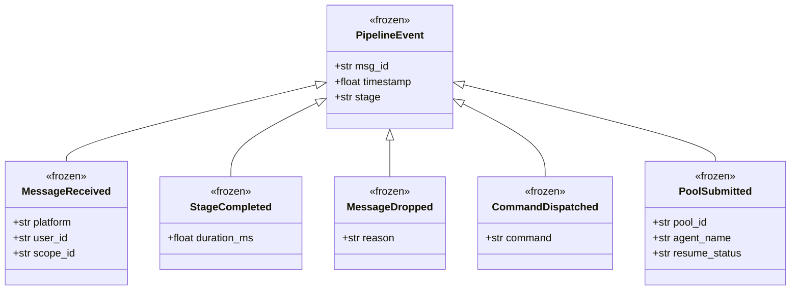
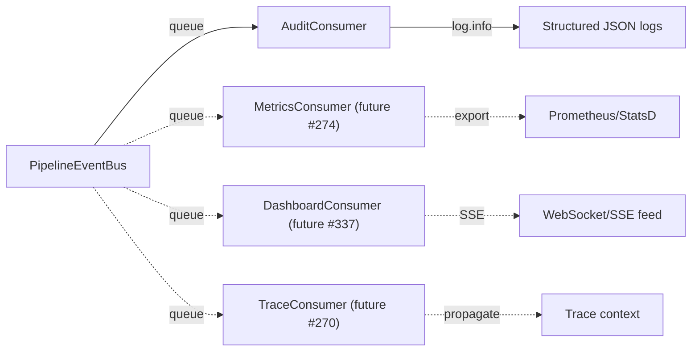

## Context

Promoted from analysis (#432). The middleware pipeline (#431) has 6 sequential stages with well-defined seams but no structured observability. ADR-025 F-10 removed the prior EventBus singleton and set the reintroduction condition: "a real consumer with DI." This spec implements Shape 1 (typed EventBus with per-subscriber queues) from the analysis.

**Prerequisite:** Issue #431 (middleware pipeline) must be closed and merged before implementation begins.

## Goal

Add a fire-and-forget `PipelineEventBus` that emits typed events at middleware seams, with `AuditConsumer` as the first subscriber producing structured JSON audit trails — without changing message processing behaviour.

## Users

- **Primary:** Developers debugging message routing — structured audit trail replaces grepping raw logs.
- **Secondary:** Plugin authors subscribing to pipeline events; future consumers (#274 metrics, #337 dashboard, #270 traces).

## Expected Behavior

1. When a message enters the pipeline, a `MessageReceived` event is emitted with platform, user_id, and scope_id. Emitted by the **runner** (`_run`) before the first middleware.
2. As each middleware stage completes (calls `next()` or returns), a `StageCompleted` event is emitted with the stage name and `duration_ms`. Emitted by the **runner** (`_run`) wrapping each middleware call. `duration_ms` is **subtree-inclusive** — it measures the stage's total latency contribution including downstream stages called via `next()`. This is the meaningful metric for identifying bottleneck positions in the chain.
3. When a middleware drops a message, a `MessageDropped` event is emitted with the reason string. Emitted by the **middleware stage itself** via `ctx.event_bus.emit()` — the stage knows the reason; the runner does not.
4. When a command is dispatched, a `CommandDispatched` event is emitted with the command name. Emitted by `CommandMiddleware` via `ctx.event_bus`.
5. When a message is submitted to a pool, a `PoolSubmitted` event is emitted with pool_id, agent_name, and resume_status. Emitted by `SubmitToPoolMiddleware` via `ctx.event_bus`.
6. The `AuditConsumer` receives all events and logs them as structured JSON via `log.info("pipeline.%s", event.stage, extra={"event": asdict(event)})`.
7. If a subscriber's queue is full, the event is dropped for that subscriber only. The bus logs a rate-limited warning (at most once per 60s per subscriber).
8. If no bus is configured (bus is `None`), all emission is a no-op with zero overhead. `PipelineContext` provides a `ctx.emit(event)` helper that guards on `None`.
9. If the `AuditConsumer` task crashes, the `_log_task_failure` callback logs the error. The bus continues emitting to remaining subscribers.
10. On shutdown (task cancellation), remaining events in subscriber queues are dropped — audit events are best-effort, not durable.

### Emission responsibility split

| Emitter | Events | Why |
|---------|--------|-----|
| **Runner** (`_run` in `MiddlewarePipeline`) | `MessageReceived`, `StageCompleted` | Runner wraps each stage with timing; has start/end visibility |
| **Individual stages** (via `ctx.event_bus`) | `MessageDropped`, `CommandDispatched`, `PoolSubmitted` | Stages have domain context (reason, command name, pool details) the runner cannot see |

### `stage` vocabulary

| Event type | `stage` value | Example |
|-----------|---------------|---------|
| `MessageReceived` | `"inbound"` | `pipeline.inbound` |
| `StageCompleted` | `type(mw).__name__` | `pipeline.ValidatePlatformMiddleware` |
| `MessageDropped` | `type(self).__name__` | `pipeline.RateLimitMiddleware` |
| `CommandDispatched` | `"CommandMiddleware"` | `pipeline.CommandMiddleware` |
| `PoolSubmitted` | `"SubmitToPoolMiddleware"` | `pipeline.SubmitToPoolMiddleware` |

### Out of scope (from frame)

- **`ResponseReady` event** — response completion happens in the pool/agent layer, not the middleware pipeline. Deferred to a future issue when pool-layer telemetry is added.
- **Control-flow event bus** — no migration of routing decisions to events.
- **Persistent event storage** — events are in-memory, fire-and-forget.
- **Plugin registration API / SDK** — this issue provides `subscribe()`; discovery is future work.
- **Metrics export** — Prometheus/StatsD export tracked under #274.

## Data Model & Consumers

### Event hierarchy

### Consumer map

### Consumer summary

| Consumer | Events consumed | When | Status |
|----------|----------------|------|--------|
| `AuditConsumer` | All `PipelineEvent` subtypes | Every pipeline run | This issue |
| `MetricsConsumer` | `StageCompleted`, `MessageDropped` | Per-stage | Future (#274) |
| `DashboardConsumer` | All | Live feed | Future (#337) |
| `TraceConsumer` | All (for trace_id propagation) | Per-message | Future (#270) |

## Breadboard

### Affordances

| ID | Element | Location |
|----|---------|----------|
| U1 | `PipelineEvent` base dataclass | `pipeline_events.py` |
| U2 | 5 event subclasses | `pipeline_events.py` |
| U3 | `PipelineEventBus.subscribe()` | `event_bus.py` |
| U4 | `PipelineEventBus.emit()` | `event_bus.py` |
| U5 | `AuditConsumer.run()` | `audit_consumer.py` |

### Handlers

| ID | Handler | Triggered by |
|----|---------|-------------|
| N1 | `_run()` in `MiddlewarePipeline` wraps each middleware with `time.monotonic()` bookends, emits `MessageReceived` (before first stage) and `StageCompleted` (after each stage) | Each inbound message |
| N2 | Individual middleware stages emit domain events (`MessageDropped`, `CommandDispatched`, `PoolSubmitted`) via `ctx.event_bus` | Stage-specific conditions (drop, command, pool submit) |
| N3 | `PipelineEventBus.emit()` fans out to subscriber queues | N1 or N2 calling `emit()` |
| N4 | `AuditConsumer.run()` drains queue and logs structured JSON | Events arriving in subscribed queue |
| N5 | Drop warning on `QueueFull` in `emit()` (rate-limited: max 1/60s per subscriber) | Subscriber queue full |

### Data stores

| ID | Store | Read by | Written by |
|----|-------|---------|-----------|
| S1 | Per-subscriber `asyncio.Queue[PipelineEvent]` (maxsize from `config.toml [event_bus] queue_maxsize`, default 1000) | N4 (AuditConsumer) | N3 (emit) |

### Wiring

| From | To | Mechanism |
|------|-----|-----------|
| `Hub.__init__` | `event_bus: PipelineEventBus \| None = None` | Injected parameter, stored as `self._event_bus`. Not created internally — callers opt in |
| `Hub.run()` | `build_default_pipeline(self, event_bus=self._event_bus)` | Pass bus to factory |
| `build_default_pipeline()` | `MiddlewarePipeline(..., event_bus=bus)` | Constructor injection |
| `MiddlewarePipeline.__init__` | `PipelineContext(event_bus=bus)` | Bus stored on context, accessible to all stages |
| `_run()` | `bus.emit(MessageReceived/StageCompleted)` | Runner-level emission with timing |
| Middleware stages | `ctx.event_bus.emit(MessageDropped/CommandDispatched/PoolSubmitted)` | Stage-level emission with domain context |
| `run_lifecycle()` | `PipelineEventBus(maxsize=cfg.queue_maxsize)` → `bus.subscribe()` → `AuditConsumer(queue)` | Bus created with TOML-configured maxsize, subscriber wired, task created with `_log_task_failure` callback |
| `run_lifecycle()` | `Hub(event_bus=bus)` | Bus injected into Hub at construction |

## Slices

| # | Slice | Delivers | Depends on |
|---|-------|----------|-----------|
| 1 | **Event types + bus** — `pipeline_events.py` (base + 5 subtypes) + `event_bus.py` (subscribe, emit, drop warning) with unit tests | U1, U2, U3, U4, N3, N5, S1 | — |
| 2 | **Emission wiring** — add `event_bus` to `PipelineContext` + `MiddlewarePipeline`, wrap `_run()` with timing for `StageCompleted`, add `ctx.event_bus.emit()` calls to stages for domain events, thread through `Hub` and `build_default_pipeline()` | N1, N2 | Slice 1 |
| 3 | **Audit consumer + bootstrap** — `AuditConsumer`, wire bus + consumer in `run_lifecycle()`, integration test | U5, N4 | Slice 2 |

## Success Criteria

- [ ] `PipelineEvent` base and 5 subtypes are frozen dataclasses in `pipeline_events.py`
- [ ] `PipelineEventBus` fans out events to N subscribers via per-subscriber `asyncio.Queue`
- [ ] `PipelineEventBus.emit()` uses `put_nowait` — never blocks the pipeline
- [ ] `PipelineEventBus.emit()` logs a rate-limited warning (max 1/60s per subscriber) on `QueueFull` drop
- [ ] `_run()` emits `MessageReceived` before first stage and `StageCompleted` (with subtree-inclusive `duration_ms`) after each stage
- [ ] `StageCompleted.stage` uses `type(mw).__name__` as vocabulary
- [ ] Middleware stages emit `MessageDropped` (with reason), `CommandDispatched`, `PoolSubmitted` via `ctx.event_bus`
- [ ] `PipelineContext` carries `event_bus: PipelineEventBus | None` with a `ctx.emit(event)` guard helper
- [ ] Bus is optional — `event_bus=None` makes all emission a no-op with zero overhead
- [ ] Bus is injected into `Hub.__init__` as a parameter (not a singleton) — per ADR-025 F-10
- [ ] Queue `maxsize` is configurable via `config.toml [event_bus] queue_maxsize` (default 1000)
- [ ] `AuditConsumer` logs every event as structured JSON via stdlib logging
- [ ] `AuditConsumer` task uses `_log_task_failure` callback for crash detection
- [ ] On shutdown (task cancellation), remaining queued events are dropped (best-effort, not durable)
- [ ] External code can subscribe to the bus (test proves plugin-like subscriber works)
- [ ] Zero behaviour change to message processing — existing pipeline tests still pass
- [ ] Unit tests cover `PipelineEventBus.emit()` with 0, 1, and N subscribers
- [ ] Unit tests cover `QueueFull` drop with `maxsize=1` queue, verifying the rate-limited warning fires
- [ ] Unit tests cover `AuditConsumer` structured JSON output format
