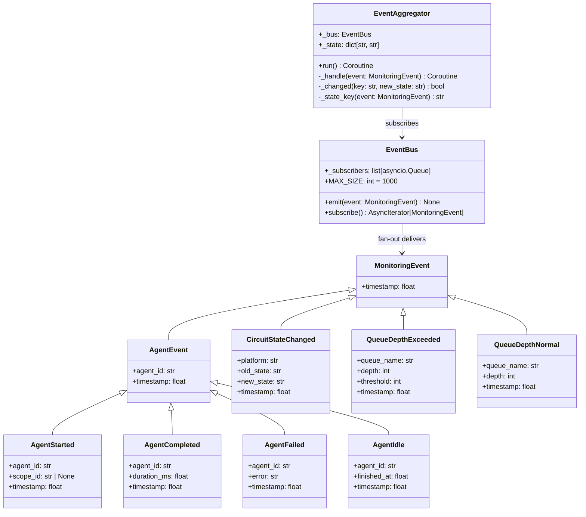
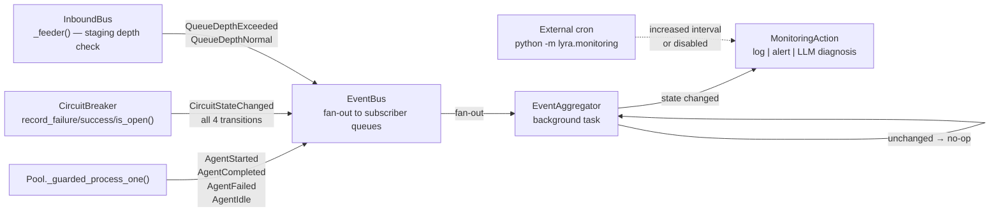

## Context

Promoted from approved frame `artifacts/frames/44-event-driven-agent-monitoring-frame.mdx`.

The current agent monitoring is implemented as an **external cron process**
(`python -m lyra.monitoring`) that periodically polls the hub's `/health` HTTP endpoint.
On every tick it calls `run_checks()` — a synchronous pass over process, HTTP, queue depth,
idle time, circuits, and disk — and on anomaly escalates to an LLM-based diagnosis via the
Anthropic API, sending a Telegram alert.

This creates token waste: the LLM escalation path may fire on every cron tick even during
stable, healthy periods. The reference implementation (`813ffe17`) demonstrates a 2-layer
event-driven architecture that eliminates idle-state LLM calls entirely.

---

## Goal

Replace cron-based polling with an internal 2-layer event system:
**Layer 1** — lightweight, typed events emitted by Pool/CircuitBreaker/InboundBus on actual
state transitions; **Layer 2** — an `EventAggregator` background task that fires monitoring
actions only when state *changes*, eliminating LLM calls during healthy steady-state.

---

## Users

- **Primary:** Lyra system internals — Hub, Pool, CircuitBreaker, InboundBus
- **Secondary:** Operators — fewer noisy alerts, signals only on actual state changes

---

## Expected Behavior

1. When a Pool begins processing a message (in `_guarded_process_one`), it emits `AgentStarted`.
2. On successful completion: emits `AgentCompleted` with `duration_ms`. On exception: `AgentFailed`.
3. In the `finally` block of `_guarded_process_one`, after success or failure, it emits `AgentIdle`
   (the pool is now idle again).
4. When a CircuitBreaker changes state on any of the four real transitions
   (CLOSED→OPEN, OPEN→HALF_OPEN, HALF_OPEN→CLOSED, HALF_OPEN→OPEN), it emits
   `CircuitStateChanged`. HALF_OPEN is treated as a distinct monitored state.
5. When the staging queue depth crosses its threshold upward, `InboundBus` emits
   `QueueDepthExceeded`. When depth drops back below threshold, it emits `QueueDepthNormal`.
   These are edge-triggered (one event per crossing), not level-triggered.
6. The `EventBus` fans out to all registered subscribers via a list of per-subscriber
   `asyncio.Queue` instances. `emit()` calls `put_nowait` on each subscriber queue
   (non-blocking; drops silently if a subscriber queue is full). Default maxsize = 1000.
7. The `EventAggregator` background task subscribes to the `EventBus` and maintains a
   typed state map keyed by composite strings (`f"pool:{agent_id}"`,
   `f"circuit:{platform}"`, `f"queue:{queue_name}"`).
8. On receiving an event, the aggregator checks if the state has actually changed from its
   last known value. If **unchanged** → no-op (zero LLM calls, zero alerting). If
   **changed** → triggers a monitoring action (log, alert, or LLM diagnosis).
9. The aggregator is LLM-provider-agnostic: it calls the same monitoring backend used by
   `lyra.monitoring`, which is provider-independent (Claude direct, OpenRouter, Claude Code
   CLI, or any HTTP-compatible backend). No Anthropic SDK import in `lyra.core.events` or
   `lyra.core.event_bus`.
10. The `EventAggregator` is started as a background `asyncio.Task` during `hub.run()` and
    cancelled cleanly on hub shutdown.
11. Once the aggregator is running, the external cron polling interval is increased (or
    disabled) in the default configuration, since state changes are now surfaced immediately
    on transition.

---

## Data Model & Consumers

**Consumer summary:**

| Consumer | Events consumed | Fields used | Status |
|----------|----------------|-------------|--------|
| `EventAggregator` | All | All event-specific fields | This issue |
| External cron (`lyra.monitoring`) | None (pull-based) | `/health` endpoint | Reduced/disabled (this issue) |
| Future: metrics collector | `AgentStarted`, `AgentCompleted`, `AgentFailed` | `agent_id`, `duration_ms`, `timestamp` | Future (fields must be present) |
| Future: tracing | All | All fields | Future |

---

## Breadboard

### Layer 1 — Event Emission

| Ref | Affordance | Handler | Data |
|-----|------------|---------|------|
| U1 | `Pool._guarded_process_one()` entry | `event_bus.emit(AgentStarted(...))` | `agent_id`, `scope_id`, `timestamp` |
| U2 | `Pool._guarded_process_one()` success | `event_bus.emit(AgentCompleted(...))` | `agent_id`, `duration_ms`, `timestamp` |
| U3 | `Pool._guarded_process_one()` exception | `event_bus.emit(AgentFailed(...))` | `agent_id`, `error`, `timestamp` |
| U4 | `Pool._guarded_process_one()` finally | `event_bus.emit(AgentIdle(...))` | `agent_id`, `finished_at`, `timestamp` |
| U5 | `CircuitBreaker.record_failure()` → OPEN | `event_bus.emit(CircuitStateChanged(...))` | `platform`, `old=CLOSED\|HALF_OPEN`, `new=OPEN`, `timestamp` |
| U6 | `CircuitBreaker.record_success()` → CLOSED | `event_bus.emit(CircuitStateChanged(...))` | `platform`, `old=HALF_OPEN`, `new=CLOSED`, `timestamp` |
| U7 | `CircuitBreaker.is_open()` → HALF_OPEN | `event_bus.emit(CircuitStateChanged(...))` | `platform`, `old=OPEN`, `new=HALF_OPEN`, `timestamp` |
| U8 | `InboundBus._feeder()` staging depth crosses threshold ↑ | `event_bus.emit(QueueDepthExceeded(...))` | `queue_name="staging"`, `depth`, `threshold`, `timestamp` |
| U9 | `InboundBus._feeder()` staging depth drops below threshold ↓ | `event_bus.emit(QueueDepthNormal(...))` | `queue_name="staging"`, `depth`, `timestamp` |

### Layer 2 — Aggregator Wiring

| Ref | Affordance | Handler | Data |
|-----|------------|---------|------|
| N1 | `EventAggregator.run()` | Background task, subscribe to `EventBus` | Async iterator |
| N2 | Receive `MonitoringEvent` | `await _handle(event)` | Dispatch on event type |
| N3 | `_state_key(event)` | `f"pool:{agent_id}"` \| `f"circuit:{platform}"` \| `f"queue:{queue_name}"` | Composite key, no namespace collision |
| N4 | `_changed(key, new_state)` | Compare `_state[key]` vs `new_state` → update `_state[key]` | Returns bool |
| N5 | State unchanged | No-op — no LLM calls, no alerts | Zero action |
| N6 | State changed | Trigger monitoring action (log, alert, or LLM diagnosis) | Same backend as `lyra.monitoring` |

### EventBus Contract

| Ref | Affordance | Handler | Data |
|-----|------------|---------|------|
| B1 | `EventBus.emit(event)` | `put_nowait` on each subscriber queue — non-blocking | Drops silently per subscriber on full queue (maxsize = 1000) |
| B2 | `EventBus.subscribe()` | Append new `asyncio.Queue(maxsize=1000)` to `_subscribers`; yield from it | `AsyncIterator[MonitoringEvent]`; fan-out to N consumers |

---

## Slices

| # | Name | Deliverable | Demo |
|---|------|-------------|------|
| S1 | Core infrastructure | `lyra.core.events` module (all `MonitoringEvent` subtypes); `lyra.core.event_bus` module (`EventBus` with fan-out, `EventAggregator` skeleton) | Unit test: emit → 2 subscribers both receive the event |
| S2 | Emission integration | Wire emit calls (U1–U9) into `Pool._guarded_process_one()`, `CircuitBreaker`, `InboundBus._feeder()` | Run hub, trigger a pool cycle, assert `AgentStarted`+`AgentCompleted`+`AgentIdle` appear in bus subscriber |
| S3 | Aggregator + cron reduction | Full `EventAggregator` dedup state machine wired into hub startup/shutdown; cron interval increased or disabled in default config | Trigger a failure → alert fires; trigger same failure again → no alert |

---

## Edge Cases

| Scenario | Behavior |
|----------|----------|
| Subscriber queue full on `emit()` | Silent drop for that subscriber; other subscribers unaffected; a `dropped_events` counter on `EventBus` is incremented (observable via `/health`) |
| `EventAggregator` background task crashes | Hub logs the exception at ERROR level; the task is **not** auto-restarted (monitoring falls back to cron); a future issue can add restart logic |
| Hub shuts down | `EventAggregator` task is cancelled via `task.cancel()`; CancelledError is caught and suppressed cleanly |
| `QueueDepthExceeded` fires while depth is already "exceeded" | Edge-triggered: second consecutive `QueueDepthExceeded` is suppressed by aggregator dedup (state already `exceeded`) |
| `emit()` called before any subscriber registered | Events are dropped silently (no subscribers to deliver to) — acceptable for early startup |

---

## Success Criteria

- [ ] `lyra.core.events` defines `MonitoringEvent` base, `AgentEvent` subbase, and all 8 event dataclasses; all are importable
- [ ] `lyra.core.event_bus` defines `EventBus` with fan-out: `emit()` delivers to all registered subscribers
- [ ] `EventBus.emit()` is non-blocking (`put_nowait`); never raises; increments `dropped_events` counter silently per full subscriber queue
- [ ] `EventBus.subscribe()` registers a new per-subscriber queue; a second subscriber receives the same events as the first (fan-out verified by test)
- [ ] `Pool._guarded_process_one()` emits `AgentStarted` on entry, `AgentCompleted` (with correct `duration_ms`) on success, `AgentFailed` on exception, and `AgentIdle` in the finally block
- [ ] `CircuitBreaker` emits `CircuitStateChanged` on all four transitions: CLOSED→OPEN, HALF_OPEN→OPEN (probe failed), OPEN→HALF_OPEN (recovery probe), HALF_OPEN→CLOSED (probe success)
- [ ] `InboundBus` emits `QueueDepthExceeded` when staging queue crosses threshold upward, and `QueueDepthNormal` when it drops below threshold (edge-triggered, targeting staging queue)
- [ ] `EventAggregator` fires **no** monitoring action when the same state key receives the same state value twice (dedup — no LLM calls, no alerts)
- [ ] `EventAggregator` fires a monitoring action on each of these state transitions: `AgentFailed` after `AgentCompleted`, `CircuitStateChanged` CLOSED→OPEN, `QueueDepthExceeded` crossing
- [ ] No LLM calls occur in the `EventBus.emit()` path or in the `EventAggregator` dedup/no-op path (both hot paths are synchronous/non-blocking)
- [ ] No Anthropic SDK import in `lyra.core.events` or `lyra.core.event_bus`
- [ ] `EventAggregator` is started as a background `asyncio.Task` during `hub.run()` and cancelled cleanly on hub shutdown (no asyncio warnings or unhandled exceptions)
- [ ] External cron polling interval is increased (or disabled) in the default supervisor/cron config
- [ ] Unit tests cover: `EventBus` fan-out (2 subscribers), `EventBus` drop counter, `EventAggregator` dedup (same state = no-op), `EventAggregator` state change detection, `Pool` emit sequence, composite state key generation
