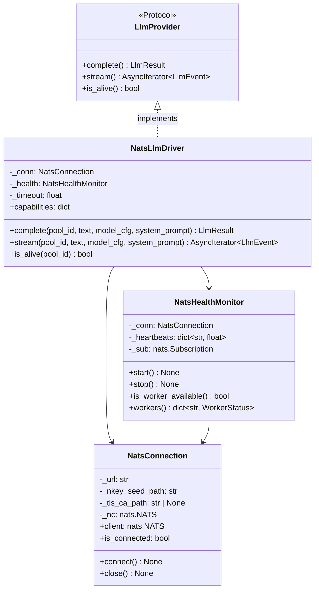

## Context

Promoted from [consolidated review](../analyses/60-nats-epic-consolidated-review.mdx) which merged epics #60, #282, #62 into a unified #445. NATS serves two independent purposes: **distributed compute** (Machine 2 GPU offloading — no topology change) and **Hub IPC** (after Hub process split — topology change). This spec decouples them into sequential slices with explicit deferral gates.

### Deviation from consolidated review

The review placed NatsBus implementation (`Bus[T]` over NATS) in Slice A. This spec **defers NatsBus to Slice C** because:

1. NatsBus is not needed for compute offloading — Slice B uses NATS request-reply directly, independent of `Bus[T]`
2. The cost of implementing NatsBus in Slice C (when Hub extraction needs it) equals the cost today
3. Deferring shrinks Slice A scope and risk surface

### Prerequisites

- Issue #14 (LLM benchmark: Qwen 2.5 14B vs Mistral Small 24B) must close before Slice B — it determines which model to deploy on Machine 2
- Slice B should not run concurrently with #417 (persistence layer overhaul) — solo dev sustainability (product review finding)

## Goal

Enable Machine 2 GPU offloading for LLM inference via NATS, with TLS + nkey auth from day 1, while laying the foundation for future Hub extraction without requiring it now.

## Users

- **End users** (Telegram, Discord) — faster LLM responses via RTX 5070Ti 16GB (vs shared RTX 3080 10GB)
- **Operators** — Machine 2 GPU on-demand; Hub falls back to local provider when Machine 2 is offline
- **Developers** — `Bus[T]` async amendment enables future NatsBus; NATS infrastructure is reusable for TTS/STT offloading

## Architecture Decisions

### AD-1: NATS over Redis / RabbitMQ / ZeroMQ

ADR-021 rejected Redis because it was "an operational dependency for a convenience feature." NATS differs: compute offloading is a **functional requirement** (Machine 2 GPU access), not convenience. NATS provides a single static binary (no runtime deps), built-in TLS + nkey/JWT auth, native request-reply, and subject-based routing for future Hub IPC.

### AD-2: NatsLlmDriver uses nats.py directly (not NatsBus)

LLM offloading is request-reply, not pub-sub message transport. `NatsLlmDriver` wraps `nats.py` and implements `LlmProvider`. `NatsBus` (`Bus[T]` over NATS) is a separate concern for Hub IPC in Slice C.

### AD-3: NatsBus deferred to Slice C

`Bus[T]` protocol amendment (async `put()`) ships in Slice A as a low-risk forward-compatibility change. The concrete `NatsBus` class ships in Slice C when Hub extraction needs it. The amendment is a one-line Protocol change needed regardless.

### AD-4: JSON serialization for NATS payloads

LLM request/response payloads are small (<100KB). JSON is debuggable, schema-evolvable, and adds no binary dependency. msgpack rejected: negligible perf gain at these payload sizes, harder to debug on the wire.

### AD-5: Shared NatsConnection lifecycle

A singleton `NatsConnection` created in bootstrap, injected into consumers. Lifecycle: `connect()` at startup (after NATS is reachable), `close()` on shutdown. Avoids connection proliferation and ensures clean teardown.

### AD-6: NATS request-reply for complete(), ephemeral inbox for stream()

- `complete()`: NATS built-in request-reply (`nc.request()`). One request, one response.
- `stream()`: Hub publishes request with `stream=true`. Worker publishes chunks to the reply inbox. Last chunk carries `done=true`. Hub subscribes and yields `LlmEvent`s.

## Expected Behavior

### Slice A — NATS Foundation + Security Baseline

#### A1: Bus[T] Protocol amendment

1. `Bus[T].put()` signature changes from `def put(platform, item) -> None` to `async def put(platform, item) -> None` in `core/bus.py`
2. `LocalBus.put()` becomes `async def put()` — body unchanged (`put_nowait()`), the async wrapper is for Protocol compatibility. Zero behavioral change.
3. All callers of `bus.put()` add `await`. Primary call site: `push_to_hub_guarded()` in `adapters/_shared.py` (already async). Test call sites updated.
4. All existing tests pass. Pyright clean.

#### A2: Install NATS server on Machine 1

1. `provision.sh` in `lyra-stack` downloads NATS server static binary (pinned version) to `/usr/local/bin/nats-server`
2. A systemd system unit `nats.service` starts NATS with config `/etc/nats/nats.conf`
3. `nats.conf` enables:
   - TLS 1.3 with self-signed CA (certs generated by `provision.sh`, stored in `/etc/nats/certs/`)
   - nkey auth: 3 user nkeys — `hub`, `llm-worker`, `monitor`
   - Monitoring HTTP on `127.0.0.1:8222`
4. UFW rule: `allow from 192.168.1.0/24 to any port 4222 proto tcp`
5. Startup ordering: `nats.service` → `lyra-stack.service` (systemd `Before=`)
6. NATS config, cert generation script, and nkey generation script live in `lyra-stack` repo (infrastructure)
7. nkey seed files stored in `/etc/nats/nkeys/` (mode 0600, root-owned). Application processes read seed path from environment variables.

#### A3: NATS health probe

1. `lyra_monitoring` gains a NATS health check: TCP connect to `localhost:4222` + NATS PING/PONG
2. Health endpoint reports NATS status alongside existing checks
3. If NATS is unreachable, health degrades to `degraded` (not `down` — NATS is not required for core messaging yet)

### Slice B — Distributed Compute (no topology change)

#### B1: NatsLlmDriver

1. New `NatsConnection` class in `src/lyra/nats/connection.py`:
   - `__init__(url, nkey_seed_path, tls_ca_path)` — config only, no I/O
   - `async connect()` — opens NATS connection with TLS + nkey
   - `async close()` — drains and closes connection
   - `client` property — returns the `nats.NATS` instance
   - `is_connected` property
2. New `NatsLlmDriver` in `src/lyra/llm/drivers/nats_driver.py` implementing `LlmProvider`:
   - `capabilities = {"streaming": True, "auth": "nats_nkey"}`
   - `complete()`: serialize request → `nc.request("lyra.llm.request", payload, timeout=cfg_timeout)` → deserialize `LlmResult`
   - `stream()`: publish request with `stream=true` to `lyra.llm.request`, subscribe to reply inbox, yield `LlmEvent`s until `done=true`, unsubscribe
   - `is_alive()`: NATS connected AND last worker heartbeat within 30s
3. Registered in `ProviderRegistry` as `"nats"` backend
4. Wired into the existing decorator stack: `CircuitBreakerDecorator → SmartRoutingDecorator → RetryDecorator → NatsLlmDriver`
5. Agent TOML config: `[agent.llm] backend = "nats"` with optional `fallback_backend = "anthropic-sdk"`
6. `NatsConnection` lifecycle wired in `bootstrap/multibot.py`: connect after NATS server reachable, close on shutdown
7. `nats.py` added to `pyproject.toml` dependencies

#### B2: Machine 2 LLM worker

1. New package `tools/llm-worker/` in the lyra repo (not a separate repo — keeps versioning simple)
2. Connects to NATS on Machine 1 with TLS and scoped `llm-worker` nkey
3. Subscribes to `lyra.llm.request` as queue group `workers` (enables future horizontal scaling)
4. Request handling:
   - Deserialize JSON payload
   - Route to local LLM backend (model from #14 benchmark — Ollama, vLLM, or HuggingFace)
   - Non-streaming: run inference, publish `LlmResult` JSON to reply subject
   - Streaming: publish `LlmEvent` JSON chunks to reply subject, final chunk `done=true`
5. Heartbeat: publishes to `lyra.llm.health.{worker_id}` every 10s with `{"worker_id", "gpu", "model", "uptime_s"}`
6. CLI entry point: `python -m llm_worker` (or `uv run llm-worker`)
7. Config via env: `NATS_URL`, `NATS_NKEY_SEED`, `NATS_TLS_CA`, `LLM_MODEL`, `LLM_BACKEND`
8. Supervisor config template for Machine 2 (WSL2 + supervisord, matching `lyra-stack` pattern)

#### B3: Circuit breaker fallback + health heartbeats

1. Hub-side `NatsHealthMonitor` subscribes to `lyra.llm.health.*`:
   - Tracks last heartbeat per `worker_id`
   - If no heartbeat within 30s → worker marked `offline`
   - Exposes `is_worker_available() -> bool`
2. `NatsLlmDriver.is_alive()` delegates to `NatsHealthMonitor.is_worker_available()`
3. Existing `CircuitBreakerDecorator` opens circuit on repeated `NatsLlmDriver` failures → Hub falls back to `fallback_backend` (e.g., `anthropic-sdk` via API key)
4. When worker heartbeat resumes → circuit closes after cooldown → requests route back to NATS
5. Fallback configured in agent TOML: `[agent.llm] backend = "nats"`, `fallback_backend = "anthropic-sdk"`
6. Fallback routing wired in bootstrap: primary driver is `NatsLlmDriver`, fallback driver resolved from `fallback_backend`

#### B4: Integration test — round-trip LLM offloading

1. Test fixture starts embedded NATS server (nats-server binary on ephemeral port, no TLS for test simplicity)
2. Starts a mock LLM worker echoing requests with a fixed response
3. Hub with `NatsLlmDriver` sends a request through the full decorator stack
4. Asserts: response arrives, content matches, latency within bounds
5. Circuit breaker test: stop mock worker → verify circuit opens → verify fallback provider receives the request
6. Reconnection test: restart mock worker → verify heartbeat resumes → verify requests route back to NATS

### Slice C — Hub Extraction + IPC (deferred)

> **Deferral gate:** Ship when (a) duplicated Hub instances cause measurable resource waste, or (b) cross-platform state sharing is needed (e.g., multi-agent orchestration #63), or (c) a third adapter is added. Hub-per-adapter (ADR-021) works indefinitely.

#### C1: Design artifacts

1. **Streaming chunk protocol**: how `AsyncIterator[RenderEvent]` crosses NATS. One NATS message per chunk with `{stream_id, seq, event_type, payload, done}`. Receiver reassembles into `AsyncIterator[RenderEvent]`.
2. **NATS subject naming convention**: `lyra.inbound.{platform}.{bot_id}`, `lyra.outbound.{platform}.{bot_id}`, `lyra.hub.command.{cmd}`. Document in a dedicated ADR.

#### C2: NatsBus implementation

1. `NatsBus` class in `src/lyra/nats/nats_bus.py` implementing `Bus[T]` Protocol
2. `register(platform)` → subscribe to `lyra.inbound.{platform}.{bot_id}`
3. `put(platform, item)` → serialize + publish to subject
4. `get()` → receive from subscription, deserialize
5. `task_done()` → no-op for core NATS (ack semantics with JetStream in Slice D)
6. Serialization strips non-JSON-serializable values from `platform_meta` (specifically: `_session_update_fn` callable)

#### C3: Trust re-resolution on Hub side

1. `Authenticator.resolve()` moves from adapter-side to Hub-side
2. Adapter sends raw `user_id` + `platform` over NATS; Hub resolves trust level post-deserialization
3. Required because adapter can no longer access the auth store in a separate process

#### C4: Extract Hub into standalone process

1. New entry point: `lyra hub` CLI command starting `lyra_hub` process
2. Hub connects to NATS, subscribes to inbound subjects via `NatsBus`
3. Outbound dispatch publishes to outbound subjects
4. Embedded mode preserved: `--adapter all` uses `LocalBus` for dev, `NatsBus` for prod

#### C5: Rewire adapters as thin NATS clients

1. `TelegramAdapter` publishes to NATS inbound subjects, subscribes to outbound
2. `DiscordAdapter` same
3. Adapters no longer embed a Hub — they are pure I/O translators

#### C6: Ops, ADR-021 update, integration test

1. Makefile: `make hub` target, startup ordering (NATS → Hub → adapters)
2. `deploy.sh`: rolling restart (stop adapters → restart hub → start adapters)
3. Supervisor: `lyra_hub` program entry with `priority` before adapters
4. ADR-021 amendment: document migration from Option A to Option B (hub-as-service via NATS)
5. Integration test: start Hub + adapter via NATS, kill adapter, restart, verify Hub state preserved

### Slice D — Hardening (deferred)

> **Deferral gate:** Ship after Slice C is stable in production. Nkey + TLS is sufficient for a 2-machine LAN.

#### D1: JetStream persistence

1. Enable JetStream on NATS server
2. Streams with `max_age` per subject: inbound 1h, llm 5m, health 5m
3. Worker offline → requests queue in JetStream → delivered when worker reconnects

#### D2: JWT/account auth + ACL audit

1. Replace nkey with JWT/account hierarchy (operator → accounts → users)
2. Per-service accounts with explicit subject pub/sub permissions
3. Documented ACL matrix + verification test

#### D3: NATS Prometheus exporter

1. NATS Prometheus exporter sidecar
2. Grafana dashboard for NATS metrics (connections, messages/s, slow consumers)
3. Alert rules for anomalies

## Data Model

### NATS Subjects (Slice B)

| Subject | Direction | Publisher | Subscriber | Pattern |
|---------|-----------|-----------|------------|---------|
| `lyra.llm.request` | Hub → Worker | NatsLlmDriver | Worker (queue group `workers`) | Request-reply |
| `_INBOX.*` (ephemeral) | Worker → Hub | Worker | NatsLlmDriver (per-request) | Reply / stream |
| `lyra.llm.health.{worker_id}` | Worker → Hub | Worker (every 10s) | NatsHealthMonitor | Heartbeat |

### LLM Request Payload

```json
{
  "request_id": "uuid4",
  "pool_id": "tg:lyra:user:123",
  "text": "user message",
  "model_cfg": {"model": "qwen2.5-14b", "max_tokens": 4096, "temperature": 0.7},
  "system_prompt": "You are Lyra...",
  "messages": [{"role": "user", "content": "..."}],
  "stream": true
}
```

### LLM Response Payload (non-streaming)

```json
{
  "request_id": "uuid4",
  "result": "response text",
  "session_id": "",
  "error": "",
  "retryable": true,
  "duration_ms": 1234
}
```

### LLM Stream Chunk Payload

```json
{
  "request_id": "uuid4",
  "seq": 0,
  "event_type": "text",
  "text": "chunk of text",
  "done": false
}
```

Final chunk:

```json
{
  "request_id": "uuid4",
  "seq": 42,
  "event_type": "result",
  "is_error": false,
  "duration_ms": 1234,
  "done": true
}
```

### Worker Heartbeat Payload

```json
{
  "worker_id": "machine2-gpu",
  "gpu": "RTX 5070Ti",
  "model": "qwen2.5-14b",
  "uptime_s": 3600,
  "ts": "2026-03-30T14:00:00Z"
}
```

### Key Classes



## Security Model

### Slice A — enforced from day 1

| Control | Implementation |
|---------|---------------|
| Transport encryption | TLS 1.3, self-signed CA generated by `provision.sh` |
| Authentication | nkey per process: `hub`, `llm-worker`, `monitor` |
| Network isolation | UFW: port 4222 from `192.168.1.0/24` only |
| Monitoring isolation | HTTP 8222 bound to `127.0.0.1` |

### Slice B — scoped access

| Control | Implementation |
|---------|---------------|
| Worker isolation | `llm-worker` nkey: subscribe `lyra.llm.request`, publish `_INBOX.*` + `lyra.llm.health.*` |
| Hub isolation | `hub` nkey: publish `lyra.llm.request`, subscribe `_INBOX.*` + `lyra.llm.health.*` |

### Threat model

| Threat | Mitigation | Slice |
|--------|------------|-------|
| Unauthenticated NATS injection (LAN device forges LLM requests) | nkey auth required for all connections | A |
| Conversation exfiltration (plaintext sniffing on LAN) | TLS on all NATS connections | A |
| Machine 2 lateral movement (compromised Windows → NATS) | Scoped nkey: `llm-worker` can only access `lyra.llm.*` subjects | B |
| Callable in `platform_meta` crosses process boundary | Strip non-serializable values at NatsBus serialization boundary | C |
| JetStream creates durable PII store without retention | `max_age` on all streams | D |

## Risks

| Risk | Impact | Mitigation |
|------|--------|------------|
| Machine 2 is Windows — deployment model differs | Worker setup friction | WSL2 + supervisord (matches `lyra-stack` pattern) |
| #14 (LLM benchmark) delays Slice B | No compute offloading until model chosen | Slice A is independent — ship A while #14 is open |
| NATS becomes SPOF for LLM offloading | LLM requests fail when NATS is down | Circuit breaker falls back to local provider (B3) |
| Hub extraction (Slice C) harder than estimated | Delays distributed architecture | Slice C is deferred; hub-per-adapter works indefinitely |
| Worker model OOMs on 16GB VRAM | Can't serve chosen model | Benchmark (#14) must include VRAM profiling |

## Out of Scope

- Switching away from SQLite for persistence
- Multi-region or multi-node NATS clusters (single LAN)
- NATS for TTS/STT offloading (same pattern, separate issue when needed)
- Web dashboard for NATS monitoring (Grafana in Slice D)
- NATS for inter-project communication (Lyra ↔ 2ndBrain)
- NatsBus for inbound message transport (Slice C, not Slice A/B)
