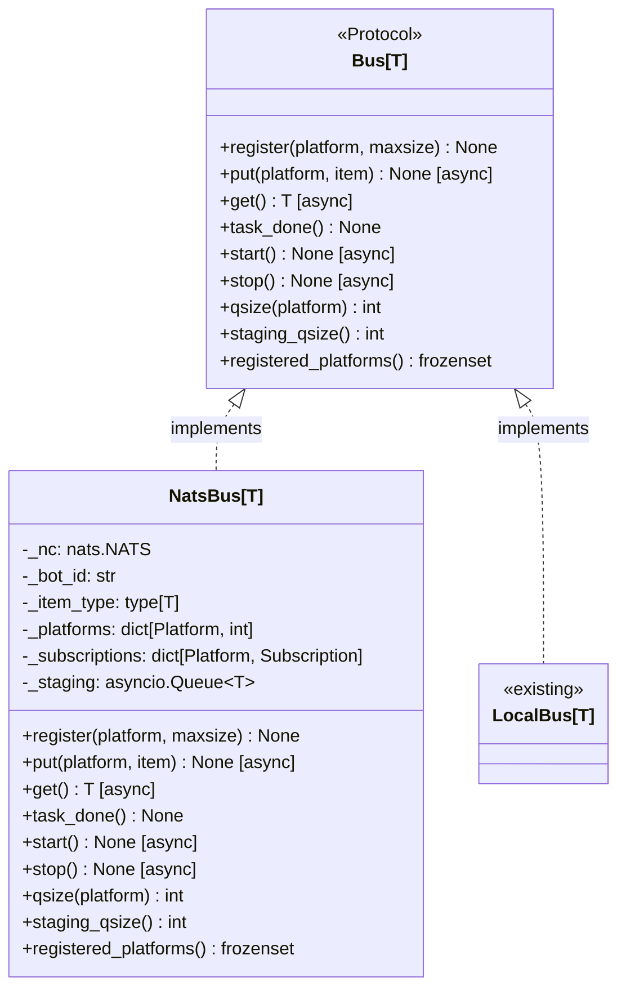
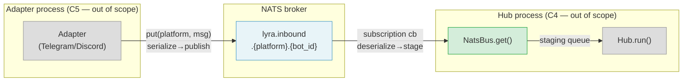

## Context

Slice C2 of #445 (Distributed Lyra — NATS bus, compute offloading & process split). Detailed slice description in `artifacts/specs/445-distributed-lyra-nats-spec.mdx` § Slice C / C2.

**Blockers resolved:**
- #447 — `Bus[T].put()` async amendment: merged. `src/lyra/core/bus.py` already has `async def put()`.
- #454 — Design artifacts (streaming chunk protocol + NATS subject naming): closed.

**Slice B (#450 NatsLlmDriver) is still open** — `NatsConnection` does not exist yet. NatsBus accepts a `nats.NATS` client directly via constructor injection (see AD-1 below).

## Goal

Implement `NatsBus[T]` — a concrete `Bus[T]` Protocol class backed by NATS pub-sub — so Hub and adapters can exchange inbound messages across separate OS processes without touching Hub internals.

## Users

- **Hub process (C4)** — calls `register()`, `start()`, `get()`, `task_done()` to receive messages via NATS subscriptions
- **Adapter process (C5)** — calls `put()` to publish messages to NATS subjects
- **Developer (local dev)** — uses `LocalBus` unchanged; NatsBus is only injected in distributed mode

## Architecture Decisions

### AD-1: Accept `nats.NATS` directly, not `NatsConnection`

`NatsConnection` (AD-5 of #445 spec) is defined in Slice B (#450). Since Slice B is still open, NatsBus takes a **connected** `nats.NATS` instance via constructor. Connection lifecycle (connect/close) is the caller's responsibility. The `nats.NATS` instance passed to `NatsBus.__init__` must already be connected — NatsBus does not call `connect()`. When Slice B ships, callers swap `nc` for `conn.client` — NatsBus API is unchanged.

### AD-2: Dual-mode — publish (adapter side) and subscribe (hub side)

One `NatsBus[T]` class supports both `put()` (publish to NATS) and `get()` (receive from NATS subscription). In distributed mode these roles are exercised in separate processes; in tests both roles are exercised by separate instances on the same embedded NATS server.

### AD-3: Staging queue backed by asyncio.Queue

NATS subscription callback pushes received + deserialized messages into an internal `asyncio.Queue` (maxsize=500). `get()` pops from this queue. Hub's single-consumer pattern (same as LocalBus) is preserved. If the staging queue is full when a NATS message arrives, the message is dropped and a `WARNING` is logged — NatsBus uses at-most-once delivery at this tier (JetStream ack semantics deferred to Slice D).

### AD-4: QueueFull contract relaxed — Bus[T] Protocol docstring updated in this slice

`LocalBus.put()` raises `asyncio.QueueFull` when a per-platform queue is full. NatsBus publishes to NATS directly — there is no local per-platform queue. `NatsBus.put()` does not raise `QueueFull`. This slice also updates the `put()` docstring in `src/lyra/core/bus.py` from "Must raise QueueFull" to "May raise QueueFull if the implementation uses local queuing (e.g. LocalBus); network-backed implementations (e.g. NatsBus) do not raise — callers must not assume backpressure." C5 adapter callers must not rely on `QueueFull` for backpressure when using NatsBus — NATS publish errors are the substitute (deferred to C5 scope).

`qsize(platform)` always returns `0` (no local per-platform queue).

### AD-5: JSON serialization with type-aware encoding

`dataclasses.asdict()` is used with a custom encoder that handles:
- **Enums** → `.value` (e.g. `TrustLevel.TRUSTED` → `"trusted"`)
- **`datetime`** → ISO 8601 string (`isoformat()`)
- **`bytes`** → base64-encoded string
- **Callables** in `platform_meta` → stripped (specifically `_session_update_fn`; all callables stripped)

`RoutingContext.platform_meta` applies the same callable-stripping rule as `InboundMessage.platform_meta`. `CommandContext` is a dataclass — recursed into by `asdict()` normally. Deserialization reconstructs types in reverse: enum values via `EnumClass(value)`, ISO strings via `datetime.fromisoformat()`, base64 strings via `base64.b64decode()`.

### AD-6: `item_type` stored at construction for generic deserialization

`NatsBus[T]` is generic but Python erases generics at runtime. To deserialize NATS payloads back to `T`, the concrete type must be passed at construction: `NatsBus(nc, bot_id, item_type=InboundMessage)`. The subscription callback uses `item_type` to reconstruct the dataclass. The `item_type` must be a dataclass type.

### AD-7: `stop()` preserves registered platforms; restart requires no re-registration

`stop()` cancels subscriptions and clears `_subscriptions`, but does NOT clear `_platforms`. After `stop()`, calling `start()` again re-subscribes to all previously registered platforms without requiring another `register()` call. This matches common lifecycle usage (pause/resume transport without reconfiguring platforms).

## Expected Behavior

### put() — adapter publishes a message

1. Adapter calls `await bus.put(Platform.TELEGRAM, msg)`
2. NatsBus checks platform is registered — raises `KeyError` if not
3. Serializes `msg` to JSON bytes using the type-aware encoder (AD-5): enums → value, datetime → ISO 8601, bytes → base64, callables in `platform_meta` stripped
4. Publishes JSON bytes to subject `lyra.inbound.{platform.value}.{bot_id}` (e.g. `lyra.inbound.telegram.main`)
5. Returns immediately — NATS at-most-once delivery; callers must not expect backpressure signal from NatsBus

### get() — hub receives a message

1. NATS delivers a message to the subscription for `lyra.inbound.{platform.value}.{bot_id}`
2. Subscription callback deserializes JSON bytes to `T` using `item_type` (AD-6); reconstructs enums, datetimes, bytes
3. Attempts `staging_queue.put_nowait(item)` — if staging queue is full, drops the message and logs `WARNING` (AD-3)
4. Hub calls `await bus.get()` — returns next item from staging queue (blocks until available)
5. Hub calls `bus.task_done()` — returns immediately (no-op)

### register() / start() / stop()

1. `register(platform, maxsize=100)` — records platform; `maxsize` accepted for Protocol conformance but unused (no per-platform queue in NatsBus). Raises `RuntimeError` if called after `start()`.
2. `start()` — creates one NATS subscription per registered platform on subject `lyra.inbound.{platform.value}.{bot_id}`. No-op (succeeds silently) if no platforms are registered. Raises `RuntimeError` if called while subscriptions are already active.
3. `stop()` — unsubscribes all, clears `_subscriptions`, preserves `_platforms`. After `stop()`, `start()` can be called again without re-registering.

### qsize / staging_qsize / registered_platforms

- `qsize(platform)` → `0` always (no local per-platform queue; AD-4)
- `staging_qsize()` → current depth of the internal staging `asyncio.Queue`
- `registered_platforms()` → frozenset of platforms passed to `register()`

## Data Model & Consumers





| Consumer | Fields consumed | When | Status |
|----------|----------------|------|--------|
| Hub.run() | all fields via `get()` | each inbound message | this issue |
| message_pipeline.py | `platform_meta._session_update_fn` | session bootstrap | stripped at NatsBus — re-attached C3 (#456) |
| Adapter (C5) | `put()` only — publishes entire message | each inbound event | out of scope |

## Breadboard

### Module layout

| ID | Element | Handler | Notes |
|----|---------|---------|-------|
| M1 | `src/lyra/nats/__init__.py` | package init | exports `NatsBus` |
| M2 | `src/lyra/nats/nats_bus.py` | `NatsBus[T]` class | full Protocol implementation |
| M3 | `src/lyra/nats/_serialize.py` | `serialize()` / `deserialize()` | type-aware encoder; callable strip |
| M4 | `tests/nats/test_nats_bus.py` | unit tests | embedded NATS server via pytest fixture |

### API surface

| ID | Affordance | Handler | Raises |
|----|-----------|---------|--------|
| U1 | `NatsBus(nc, bot_id, item_type)` | `__init__`; `nc` must already be connected | — |
| U2 | `register(platform, maxsize=100)` | record platform; `maxsize` accepted, unused | `RuntimeError` if called after `start()` |
| U3 | `await start()` | subscribe to all registered platforms | `RuntimeError` if already started |
| U4 | `await stop()` | unsubscribe all; preserve `_platforms` | — |
| U5 | `await put(platform, item)` | serialize → publish to `lyra.inbound.{platform.value}.{bot_id}` | `KeyError` if platform not registered |
| U6 | `await get()` | pop from staging queue (blocks) | — |
| U7 | `task_done()` | no-op | — |
| U8 | `qsize(platform)` | return `0` | — |
| U9 | `staging_qsize()` | return staging queue depth | — |
| U10 | `registered_platforms()` | return frozenset | — |
| S1 | `serialize(item)` | `dataclasses.asdict()` + callable strip + type encoding (enum→value, datetime→ISO, bytes→base64) | `TypeError` on unhandled type |
| S2 | `deserialize(data, item_type)` | reconstruct dataclass from dict; enum, datetime, bytes reconstruction | `KeyError` on missing required fields |

### Wiring

```
bootstrap / C4 Hub process
  → nats.connect(url, ...)  (or NatsConnection.client when Slice B ships)
  → NatsBus(nc=conn, bot_id="main", item_type=InboundMessage)
  → bus.register(Platform.TELEGRAM)
  → bus.register(Platform.DISCORD)
  → await bus.start()           # creates NATS subscriptions
  → Hub(inbound_bus=bus)
  → await hub.run()             # consumes bus.get()

adapter process / C5
  → NatsBus(nc=conn, bot_id="main", item_type=InboundMessage)
  → await bus.put(Platform.TELEGRAM, msg)
  # Note: adapter-side NatsBus only calls put(); does not call start()/get()
```

## Slices

| # | Name | Files | Demonstrates |
|---|------|-------|-------------|
| 1 | Core NatsBus + serialization | `nats/__init__.py`, `nats/nats_bus.py`, `nats/_serialize.py`; update `bus.py` put() docstring | All Protocol methods; callable stripping; type-aware encode/decode; subject routing; backpressure contract update |
| 2 | Unit tests | `tests/nats/test_nats_bus.py`; `tests/nats/conftest.py` (embedded NATS fixture) | Publish/subscribe round-trip; callable stripping; enum/datetime/bytes serialization; lifecycle (start/stop/restart); staging queue full drop; unregistered platform raises |

### Test infrastructure note (Slice 2)

Tests use a real embedded NATS server, not mock `nats.NATS` calls. Preferred approach: `pytest-asyncio` + `nats-server` binary spawned via a `conftest.py` fixture (subprocess, ephemeral port, auto-terminate on teardown). This validates actual subscription wiring and message delivery, not just the serialization wrapper. `nats-server` binary is expected to be available in PATH on CI (same binary as Machine 1 production server).

## Success Criteria

- [ ] `src/lyra/nats/__init__.py` exists and exports `NatsBus`
- [ ] `NatsBus[T]` fully satisfies `Bus[T]` Protocol — Pyright reports no type errors on `bus: Bus[InboundMessage] = NatsBus(...)`
- [ ] `Bus[T].put()` docstring in `src/lyra/core/bus.py` updated to reflect relaxed QueueFull contract (AD-4)
- [ ] `register(platform)` before `start()` succeeds; calling after `start()` raises `RuntimeError`
- [ ] `start()` creates one NATS subscription per registered platform with subject `lyra.inbound.{platform.value}.{bot_id}`
- [ ] `start()` with no registered platforms succeeds (no-op)
- [ ] `await put(platform, item)` serializes and publishes to the correct NATS subject
- [ ] All callable values in `platform_meta` are stripped during serialization (`_session_update_fn` and any other callable values)
- [ ] Non-callable `platform_meta` values, enum fields (`TrustLevel`), `datetime` fields, and `str` fields survive serialize → deserialize round-trip unchanged
- [ ] `bytes` fields (`Attachment.url_or_path_or_bytes`, `InboundAudio.audio_bytes`) survive serialize → deserialize round-trip as bytes
- [ ] `await get()` returns the next deserialized message from the staging queue (blocks until available)
- [ ] `task_done()` returns immediately without error
- [ ] Staging queue full: subscription callback drops the message and logs `WARNING`; does not raise; subsequent messages continue to be delivered
- [ ] `stop()` unsubscribes all subscriptions; `_platforms` is preserved; `start()` can be called again after `stop()` without re-registering
- [ ] `put(unregistered_platform, item)` raises `KeyError`
- [ ] `nats` Python library added to `pyproject.toml` dependencies
- [ ] Unit tests pass: embedded NATS server fixture; publish/subscribe round-trip; callable stripping; type round-trips; lifecycle (start/stop/restart); staging-full drop; unregistered platform error
