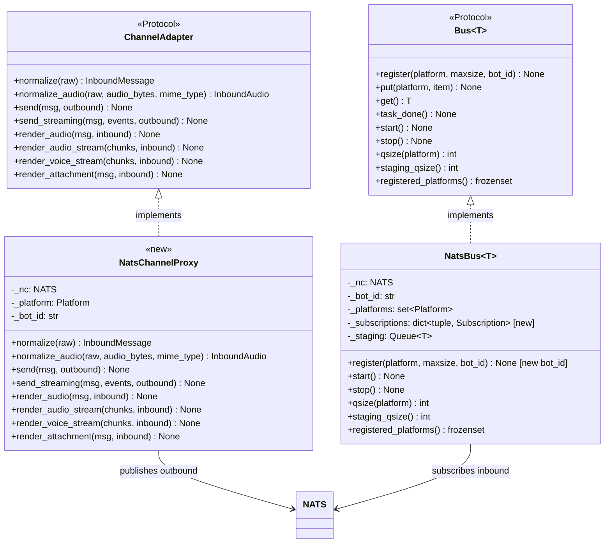
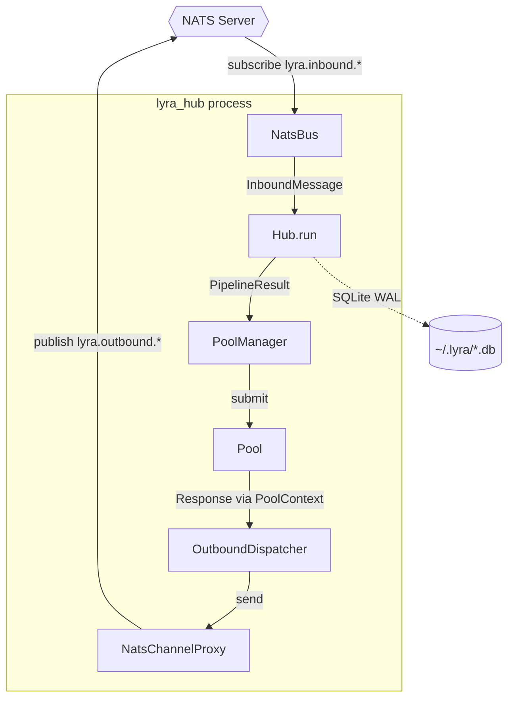

## Context

Promoted from [analysis](../analyses/457-extract-hub-standalone-process-analysis.mdx) which evaluated three shapes and recommended **Shape 1: Bus Injection + NatsChannelProxy**. Part of epic #445 (Distributed Lyra), Slice C4. Blockers #455 (NatsBus) and #456 (trust re-resolution) are merged.

> **C4 delivers the Hub-side foundation.** Operator value (conversations surviving adapter restarts) is latent until C5 (#458) rewires adapters to use the standalone Hub. C4 is independently testable but not deployed in production until C5 merges.

### Deviation from analysis

1. **Bus Protocol gains optional `bot_id`:** `Bus[T].register()` Protocol signature adds `bot_id: str | None = None`. `LocalBus` ignores it (no-op). `NatsBus` uses it to key subscriptions by `(platform, bot_id)`. This is a Protocol-level change not mentioned in the analysis, required because `Hub.register_adapter()` calls `self.inbound_bus.register(platform)` and must pass `bot_id` for multi-bot NatsBus support.

## Goal

Extract Hub into a standalone process (`lyra hub`) that communicates with adapters via NatsBus, while preserving the existing embedded mode for development.

## Users

- **Primary:** Mickael (operator) — adapter restarts no longer kill Hub state; conversations survive adapter reloads (realized after C5)
- **Secondary:** End users on Telegram/Discord — conversation continuity across adapter restarts (realized after C5)
- **Tertiary:** Developers — `lyra hub` enables testing Hub behavior independently of platform adapters

## Architecture Decisions

### AD-1: Bus injection over mode enum

Hub accepts optional `inbound_bus` / `inbound_audio_bus` constructor params. When not provided, creates `LocalBus` internally (backward compat). Hub is mode-agnostic — the bootstrap path determines which bus is injected. Rejected alternative: `HubMode` enum — adds conditional logic to Hub for no benefit.

### AD-2: NatsChannelProxy over OutboundBus

Outbound messages go through a `NatsChannelProxy` that implements `ChannelAdapter` Protocol, registered on Hub via `register_adapter()`. Existing `OutboundDispatcher` works unchanged — its retry, circuit breaker, and scope locking logic is preserved. Rejected alternative: `OutboundBus` abstraction — bypasses `OutboundDispatcher`, losing battle-tested retry/CB logic.

### AD-3: Multi-bot NatsBus via Bus Protocol `bot_id` extension

`Bus[T].register()` Protocol gains optional `bot_id: str | None = None`. `NatsBus` uses it to key subscriptions by `(platform, bot_id)`. `LocalBus` accepts and ignores it. `Hub.register_adapter()` passes `bot_id` to `self.inbound_bus.register()`. This allows a single `NatsBus` instance to serve multiple bots with one shared staging queue.

### AD-4: InboundAudio bus stays LocalBus in C4

No audio publisher exists on NATS yet. `inbound_audio_bus` in standalone mode is a `LocalBus` with no registered platforms — it idles harmlessly. Audio-over-NATS is a C5 concern.

### AD-5: Attachments in-scope, audio stubbed

`render_attachment()` is fully implemented because attachments are serializable dataclasses (same pattern as `OutboundMessage`). Audio methods are stubbed because they require binary streaming over NATS — a different protocol not needed until C5.

### AD-6: `_on_dispatched` callback fires on NATS publish, not platform delivery

In standalone mode, `OutboundDispatcher` fires `_on_dispatched` after `NatsChannelProxy.send()` returns (NATS publish success), not after actual platform delivery. This means `reply_message_id` is written back on Hub-side publish. Acceptable for C4 — C5 must implement a callback-over-NATS mechanism for correct reply-threading.

## Expected Behavior

### Standalone mode (`lyra hub`)

1. Operator runs `lyra hub` (requires `NATS_URL` environment variable; exits with clear error if absent or unreachable)
2. Bootstrap creates a NATS connection, `NatsBus[InboundMessage]` for inbound, and one `NatsChannelProxy` per (platform, bot_id) pair from config.toml
3. Hub opens stores (same vault_dir, SQLite WAL), loads agents, registers bindings — identical to embedded mode
4. Hub subscribes to `lyra.inbound.{platform}.{bot_id}` for each registered bot
5. Hub processes inbound messages through the existing pipeline (trust re-resolution, rate limiting, command routing, pool dispatch)
6. Outbound messages are published to `lyra.outbound.{platform}.{bot_id}` via NatsChannelProxy
7. Streaming responses are published as individual chunks to `lyra.outbound.stream.{platform}.{bot_id}.{msg_id}`
8. Audio dispatch methods log a warning and return (no audio-over-NATS in C4). Attachments are serialized and published.
9. Health endpoint reports `"adapters": <count>` — shows 0 when no NATS consumers are connected (C4-C5 window), helping operators distinguish "Hub running, no adapters" from "Hub broken"
10. On SIGINT/SIGTERM: drain buses, flush pools, close stores, close NATS connection

### Embedded mode (`lyra start --adapter all`)

Unchanged. Hub creates `LocalBus` internally (no bus injection). Real adapters registered. Zero regression.

### Startup guard

Hub writes a lockfile (`~/.lyra/hub.lock`) on startup, removes on clean shutdown. If lockfile exists and the PID is alive, `lyra hub` refuses to start: "Another Hub process (PID {pid}) is running on this vault. Stop it first or use a different LYRA_VAULT_DIR."

## Data Model & Consumers

### Core types (changes marked `[new]`)



### NATS subject map

| Subject | Direction | Publisher | Subscriber | Pattern |
|---------|-----------|-----------|------------|---------|
| `lyra.inbound.{platform}.{bot_id}` | Adapter → Hub | Adapter (C5) | NatsBus (C4) | Pub/sub |
| `lyra.outbound.{platform}.{bot_id}` | Hub → Adapter | NatsChannelProxy (C4) | Adapter (C5) | Pub/sub |
| `lyra.outbound.stream.{platform}.{bot_id}.{msg_id}` | Hub → Adapter | NatsChannelProxy (C4) | Adapter (C5) | Pub/sub, multi-msg |

### Outbound message envelope (non-streaming)

```json
{
  "type": "outbound",
  "msg_id": "original-inbound-msg-id",
  "outbound": { "...serialized OutboundMessage..." }
}
```

### Attachment envelope

```json
{
  "type": "attachment",
  "msg_id": "original-inbound-msg-id",
  "attachment": { "...serialized OutboundAttachment..." }
}
```

### Streaming chunk envelope

```json
{
  "type": "stream_chunk",
  "msg_id": "original-inbound-msg-id",
  "seq": 0,
  "event_type": "text | tool_summary",
  "payload": { "...serialized RenderEvent..." },
  "done": false
}
```

Final chunk has `"done": true`. Receiver reassembles into `AsyncIterator[RenderEvent]` by subscribing to the stream subject and yielding payloads in `seq` order until `done`.

### Consumer summary

| Consumer | Fields consumed | When | Status |
|----------|----------------|------|--------|
| Hub.run() | NatsBus.get() → InboundMessage | Every inbound message | This issue |
| OutboundDispatcher | NatsChannelProxy.send() / send_streaming() | Every outbound message | This issue |
| Future adapter (C5) | lyra.outbound.{platform}.{bot_id} | Every outbound message | C5 (#458) |
| Health endpoint | adapter_registry length | /health/detail | This issue |

### Data flow (C4)



## Breadboard

### Affordances

| ID | Affordance | Location |
|----|-----------|----------|
| U1 | `lyra hub` CLI command | `cli.py` |
| U2 | `NATS_URL` environment variable (required for standalone) | bootstrap |
| U3 | `~/.lyra/hub.lock` lockfile (startup guard) | bootstrap |
| U4 | Health endpoint `"adapters"` field | `health.py` |

### Handlers

| ID | Handler | Triggered by | Action |
|----|---------|-------------|--------|
| N1 | Hub bus injection | Bootstrap creates Hub with NatsBus | Hub uses injected bus instead of LocalBus |
| N2 | Bus Protocol `bot_id` extension | `hub.register_adapter()` passes `bot_id` | NatsBus subscribes per (platform, bot_id); LocalBus ignores |
| N3 | NatsChannelProxy.send() | OutboundDispatcher dispatch | Serialize OutboundMessage → publish to NATS outbound subject |
| N4 | NatsChannelProxy.send_streaming() | OutboundDispatcher streaming dispatch | Publish RenderEvent chunks → individual NATS messages |
| N5 | Standalone bootstrap | `lyra hub` command | Wire NatsBus + proxies + stores + agents → run lifecycle |
| N6 | Lifecycle helpers | Startup / shutdown | Signal handling, watchdog, teardown — shared with embedded mode |
| N7 | Lockfile guard | `lyra hub` startup | Check PID lockfile, refuse if another Hub is running |
| N8 | Health adapter count | GET /health/detail | Report `len(hub.adapter_registry)` |
| N9 | NATS_URL guard | `lyra hub` startup | Exit with clear error if NATS_URL absent or NATS unreachable |

### Data stores

| ID | Store | Used by |
|----|-------|---------|
| S1 | `~/.lyra/auth.db` | AuthStore (grants) |
| S2 | `~/.lyra/config.db` | AgentStore, CredentialStore, PrefsStore |
| S3 | `~/.lyra/turns.db` | TurnStore |
| S4 | `~/.lyra/message_index.db` | MessageIndex |

## Slices

| Slice | Name | Handlers | Independently testable? |
|-------|------|----------|------------------------|
| S1 | Hub bus injection + Bus Protocol extension + lifecycle extraction | N1, N2, N6 | Yes — existing tests pass with default LocalBus; lifecycle helpers tested via embedded path |
| S2 | NatsChannelProxy + multi-bot NatsBus | N3, N4 | Yes — unit tests with mock NATS; NatsBus extension backward-compat tested; OutboundMessage/RenderEvent serialization verified |
| S3 | Standalone bootstrap + CLI + ops | N5, N7, N8, N9, U1–U4 | Yes — integration test with real nats-server (reuses `tests/nats/conftest.py` fixture from #455) |

### Slice S1: Hub bus injection + Bus Protocol extension + lifecycle extraction

**Commit 1: Lifecycle extraction** (must leave all tests green before commit 2)

1. Extract from `multibot_lifecycle.py` into a new `bootstrap/lifecycle_helpers.py`:
   - `setup_signal_handlers(stop: asyncio.Event) -> None` — SIGINT/SIGTERM handler setup (currently lines 46-49)
   - `run_watchdog(tasks: list[asyncio.Task], stop: asyncio.Event) -> None` — task watchdog loop (currently delegated to `bootstrap.utils.watchdog`)
   - `teardown_buses(inbound_bus, inbound_audio_bus) -> None` — bus stop (lines 96-97)
   - `teardown_dispatchers(dispatchers: list) -> None` — dispatcher stop (lines 98-101)
2. `multibot_lifecycle.py` calls the extracted helpers — `run_lifecycle()` becomes a thin orchestrator. Behavior unchanged.
3. All existing tests pass.

**Commit 2: Hub bus injection + Bus Protocol extension**

1. `Bus[T].register()` in `bus.py` gains `bot_id: str | None = None` parameter.
2. `LocalBus.register()` in `inbound_bus.py` accepts `bot_id` and ignores it (no-op).
3. `hub.py` constructor gains optional `inbound_bus: Bus[InboundMessage] | None = None` and `inbound_audio_bus: Bus[InboundAudio] | None = None`. When `None`, creates `LocalBus` (current behavior).
4. `hub.py` `register_adapter()` passes `bot_id` to `self.inbound_bus.register(platform, maxsize=..., bot_id=bot_id)`.
5. All existing tests pass. Pyright clean. No existing call sites need changes (default `None` = LocalBus = current behavior; `bot_id` defaults to `None` = ignored by LocalBus).

### Slice S2: NatsChannelProxy + multi-bot NatsBus

1. `NatsBus.register()` gains optional `bot_id: str | None = None`. When provided, subscription subject uses the per-registration `bot_id`. Subscriptions keyed by `(platform, bot_id)` internally (change `_subscriptions` from `dict[Platform, Subscription]` to `dict[tuple[Platform, str], Subscription]`). Backward compat: omitting `bot_id` uses the constructor's value.
2. Verify `_serialize.py` handles `OutboundMessage` and `RenderEvent` (`TextRenderEvent`, `ToolSummaryRenderEvent`) round-trip correctly. Add serialization tests if missing.
3. New `nats/nats_channel_proxy.py`:
   - `__init__(nc: NATS, platform: Platform, bot_id: str)` — no I/O in constructor
   - `normalize(raw)` → raises `NotImplementedError("NatsChannelProxy does not normalize inbound messages")`
   - `normalize_audio(raw, audio_bytes, mime_type, *, trust_level)` → raises `NotImplementedError`
   - `send(msg, outbound)` → serialize `OutboundMessage` via `_serialize.serialize()` → publish to `lyra.outbound.{platform.value}.{bot_id}` with `type: "outbound"` envelope
   - `send_streaming(msg, events, outbound)` → iterate `events`, serialize each `RenderEvent` with envelope `{type, msg_id, seq, event_type, payload, done}`, publish to `lyra.outbound.stream.{platform.value}.{bot_id}.{msg.id}`. On NATS publish failure: drain remaining iterator, log error, return.
   - `render_audio(msg, inbound)` → `log.warning("audio-over-NATS not implemented (C5)")`, return
   - `render_audio_stream(chunks, inbound)` → drain iterator, log warning, return
   - `render_voice_stream(chunks, inbound)` → drain iterator, log warning, return
   - `render_attachment(msg, inbound)` → serialize attachment → publish to `lyra.outbound.{platform.value}.{bot_id}` with `type: "attachment"` envelope
4. Unit tests: NatsChannelProxy with mock NATS verifying correct subjects, payloads, and iterator drain on failure. NatsBus multi-bot extension backward-compat tests.

### Slice S3: Standalone bootstrap + CLI + ops

1. New `bootstrap/hub_standalone.py`:
   - `async _bootstrap_hub_standalone(raw_config, *, _stop=None) -> None`
   - Guard: if `NATS_URL` not in env → `sys.exit("NATS_URL is required for standalone Hub mode. Set it to your NATS server URL (e.g. nats://localhost:4222).")`
   - Connects to NATS via `nats.connect(os.environ["NATS_URL"])`. Connection failure → `sys.exit("Failed to connect to NATS at {url}: {error}")`
   - Creates `NatsBus[InboundMessage](nc, bot_id="hub", item_type=InboundMessage)`
   - Opens stores via `open_stores(vault_dir)` (same as embedded)
   - Loads agents, builds authenticators, registers bindings (reuses `_resolve_agents`, `_build_bot_auths`, `_resolve_bot_agent_map`)
   - For each (platform, bot_id): creates `NatsChannelProxy`, registers on Hub via `register_adapter()` (which calls `bus.register(platform, bot_id=bot_id)`), creates `OutboundDispatcher` with proxy, registers on Hub
   - Registers authenticators on Hub (same as embedded — C3 trust re-resolution)
   - All `register_adapter()` calls complete before `bus.start()` (register-before-start constraint)
   - Runs lifecycle via extracted helpers from S1
   - On shutdown: `bus.stop()`, `nc.drain()`, `nc.close()`, remove lockfile
2. Lockfile guard:
   - On startup: write `~/.lyra/hub.lock` with PID
   - If lockfile exists: read PID, check if alive (`os.kill(pid, 0)`). Alive → exit with error. Dead → overwrite.
   - On clean shutdown / `atexit`: remove lockfile
3. `cli.py`: add `lyra hub` command (Typer default command on `hub_app` subgroup) invoking `_bootstrap_hub_standalone`.
4. Health endpoint: add `"adapters": len(hub.adapter_registry)` to `/health/detail` response.
5. Integration test (reuses `tests/nats/conftest.py` fixtures from #455 — `nats_server_url`, `nc`):
   - Start standalone Hub with test config, mock agent
   - Publish `InboundMessage` to `lyra.inbound.telegram.test_bot`
   - Assert `OutboundMessage` appears on `lyra.outbound.telegram.test_bot`
   - Verify streaming chunks appear on stream subject with correct envelope
   - Verify trust re-resolution is invoked (mock `Authenticator.resolve()`, assert called)

## Success Criteria

- [ ] `lyra hub` starts a standalone Hub process when `NATS_URL` is set
- [ ] `lyra hub` exits with a clear error message when `NATS_URL` is absent or NATS server is unreachable
- [ ] Hub subscribes to `lyra.inbound.{platform}.{bot_id}` for each configured bot via NatsBus
- [ ] Trust re-resolution (`Authenticator.resolve()`) is invoked on each inbound message in standalone mode (verified via unit test with mock authenticator)
- [ ] Outbound `send()` responses are published to `lyra.outbound.{platform}.{bot_id}` with `type: "outbound"` envelope
- [ ] Outbound `send_streaming()` responses are published as individual chunks to `lyra.outbound.stream.{platform}.{bot_id}.{msg_id}` with `{seq, event_type, payload, done}` envelope
- [ ] Audio dispatch methods (`render_audio`, `render_audio_stream`, `render_voice_stream`) log a warning and return without error
- [ ] `render_attachment()` serializes and publishes to the outbound subject with `type: "attachment"` envelope
- [ ] `_on_dispatched` callback fires after `NatsChannelProxy.send()` returns (NATS publish), not after platform delivery — known C4 limitation, documented
- [ ] Existing embedded mode (`lyra start --adapter all`) works identically — all existing tests pass
- [ ] Hub constructor backward-compatible — no existing call sites need changes
- [ ] `Bus[T].register()` Protocol gains `bot_id` param — `LocalBus` ignores it, `NatsBus` uses it; existing single-bot usage unchanged
- [ ] Lockfile prevents two Hub processes from running on the same vault_dir
- [ ] Health endpoint `/health/detail` includes `"adapters"` count (both modes)
- [ ] Lifecycle helpers extracted from `multibot_lifecycle.py` — embedded mode uses them, standalone mode uses them
- [ ] `OutboundMessage` and `RenderEvent` serialize/deserialize correctly via `_serialize.py` (round-trip tests)
- [ ] Integration test: publish InboundMessage to NATS → standalone Hub processes → OutboundMessage appears on NATS outbound subject (uses real nats-server fixture from #455)

### Definition of done

- Pyright clean
- All existing tests pass
- New tests cover NatsChannelProxy, NatsBus multi-bot, standalone bootstrap integration
