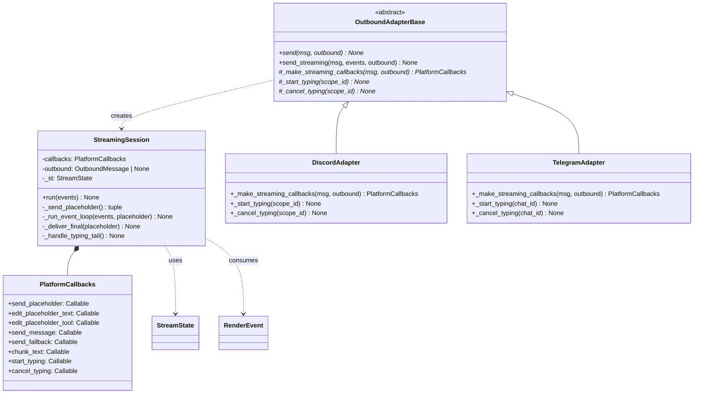
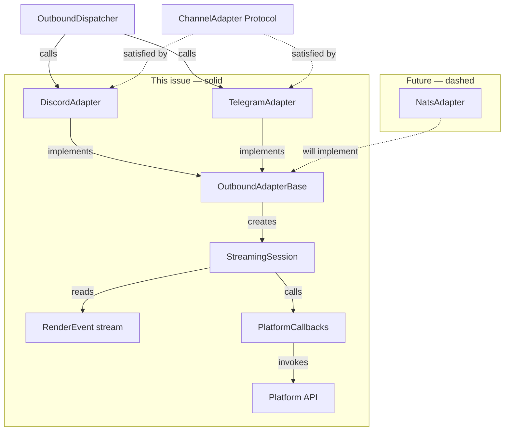

## Context

Promoted from approved frame `468-centralize-streaming-adapters-frame.mdx`.
Analysis was skipped (F-full promoted directly from frame — solution fully pre-specified in issue body).

The problem: `send_streaming()` in `discord_outbound.py` and `telegram_outbound.py` are ~160 lines each of near-identical logic. Any change to the streaming flow requires two parallel edits with no enforcement of consistency. Several smaller patterns are also duplicated across the normalize and outbound modules.

## Goal

Formalize the outbound adapter contract with a shared `OutboundAdapterBase` ABC and a `StreamingSession` class that owns the streaming algorithm. Discord and Telegram migrate to inherit the base and provide only platform-specific callbacks. Future adapters (NATS, phase:2) implement the same contract.

## Users

- **Primary:** developers maintaining outbound adapters — any future streaming flow change touches one place
- **Secondary:** future platform adapters that implement `OutboundAdapterBase` instead of discovering the pattern from scratch

## Expected Behavior

### Before

Each adapter's `send_streaming()` function is ~160 lines:

```
1. Resolve channel/chat_id
2. Send placeholder
3. [Fallback block if placeholder fails — ~15 lines each, identical structure]
4. StreamState() boilerplate
5. Event loop: ToolSummaryRenderEvent debounce + TextRenderEvent intermediate — ~40 lines
6. Final delivery: had_tool_events / elif final_chunks / elif stream_error — ~40 lines
7. Typing tail: if outbound.intermediate → _start_typing else _cancel_typing
8. Re-raise stream_error
```

Steps 3–8 are structurally identical across both adapters.

### After

**`_shared_streaming.py` — `StreamingSession`** owns steps 3–8:

```python
@dataclass
class PlatformCallbacks:
    send_placeholder: Callable[[], Awaitable[tuple[Any, int | None]]]
    # returns (placeholder_obj, initial_reply_message_id).
    # StreamingSession stores placeholder_obj and passes it as first arg to edit_* callbacks.
    # placeholder_obj is opaque to StreamingSession — Discord: Message; Telegram: Message.

    edit_placeholder_text: Callable[[Any, str], Awaitable[None]]
    # args: (placeholder_obj, raw_accumulated_text).
    # Each callback is responsible for its own size/render constraint:
    #   Discord:  display = text[-DISCORD_MAX_LENGTH:]  (trailing slice, not first chunk)
    #   Telegram: rendered = _render_text(text)[0]
    # StreamingSession passes raw accumulated text — NOT pre-chunked via chunk_text.
    # chunk_text is for final delivery only.

    edit_placeholder_tool: Callable[[Any, ToolSummaryRenderEvent, str], Awaitable[None]]
    # args: (placeholder_obj, event, display_text).
    # display_text = istate.display() pre-computed by StreamingSession — avoids passing
    # live mutable state into callbacks.
    # Discord: ignores display_text, builds Embed from event (but ONLY if not
    #   _st.istate.has_intermediate_text — this guard is applied by StreamingSession
    #   before calling the callback, so Discord callback is always called correctly).
    # Telegram: uses display_text directly via _render_text().

    send_message: Callable[[str], Awaitable[int | None]]
    # Send a new message. Returns new platform message_id or None on failure.
    # StreamingSession uses return value to update outbound.metadata["reply_message_id"]
    # for the LAST chunk in had_tool_events branch. This call must NOT use send_with_retry
    # (swallow-on-exhaust is unacceptable when updating reply_message_id for pool routing).

    send_fallback: Callable[[str], Awaitable[int | None]]
    # Placeholder send failed — deliver accumulated text without streaming.
    # Returns the sent message_id (for reply_message_id propagation) or None.
    # Discord: wraps OutboundMessage.from_text(text) → self.send().
    # Telegram: calls bot.send_message() directly with _render_text(text) — NOT
    #   self.send() — accumulated text is pre-render plain text needing MarkdownV2 escaping.

    chunk_text: Callable[[str], list[str]]
    # Used only for final delivery — splits display_text into platform-sized chunks.

    start_typing: Callable[[], None]   # sync — scope_id already closed over
    cancel_typing: Callable[[], None]  # sync — scope_id already closed over

class StreamingSession:
    def __init__(self, callbacks: PlatformCallbacks, outbound: OutboundMessage | None): ...
    async def run(self, events: AsyncIterator[RenderEvent]) -> None: ...
```

**`_base_outbound.py` — `OutboundAdapterBase`** (ABC):

```python
class OutboundAdapterBase(ABC):
    # --- Non-streaming (passthrough — no shared logic, contract enforcement only) ---

    @abstractmethod
    async def send(
        self, original_msg: InboundMessage, outbound: OutboundMessage
    ) -> None: ...

    # --- Streaming (algorithm provided by base via StreamingSession) ---

    @abstractmethod
    def _make_streaming_callbacks(
        self, original_msg: InboundMessage, outbound: OutboundMessage | None
    ) -> PlatformCallbacks: ...

    async def send_streaming(
        self,
        original_msg: InboundMessage,
        events: AsyncIterator[RenderEvent],
        outbound: OutboundMessage | None = None,
    ) -> None:
        session = StreamingSession(
            self._make_streaming_callbacks(original_msg, outbound), outbound
        )
        await session.run(events)

    # --- Typing lifecycle (abstract — platform-specific task management) ---

    @abstractmethod
    def _start_typing(self, scope_id: int) -> None: ...

    @abstractmethod
    def _cancel_typing(self, scope_id: int) -> None: ...
```

`send()` is abstract — no shared implementation. The base enforces its presence without dictating the body; platform-specific rendering (MarkdownV2, embeds, buttons, attachments) stays in each adapter.

**`__init__` constraint:** `OutboundAdapterBase.__init__` must remain empty (no instance state). `discord.Client.__init__` does NOT call `super().__init__()` — it terminates the cooperative chain. Any instance initialisation added to `OutboundAdapterBase` would be silently skipped for `DiscordAdapter`. Use `__init_subclass__` if base-level setup is ever needed.

**Discord/Telegram after migration:**

```python
class TelegramAdapter(OutboundAdapterBase):
    def _make_streaming_callbacks(self, msg, outbound) -> PlatformCallbacks:
        meta = _validate_inbound(msg, "send_streaming")
        chat_id, _, _ = meta  # extracted once, closed over in all lambdas below
        reply_to = msg.platform_meta.get("message_id")
        placeholder_ref: list[Any] = []  # mutable cell to capture placeholder object

        async def _send_fallback(text: str) -> None:
            # NOT self.send() — accumulated text is pre-render plain text that
            # needs MarkdownV2 escaping before sending. self.send() expects a
            # fully constructed OutboundMessage with pre-rendered content.
            rendered = _render_text(text)
            for chunk in rendered:
                await self.bot.send_message(chat_id=chat_id, text=chunk, parse_mode="MarkdownV2")

        return PlatformCallbacks(
            send_placeholder=lambda: ...,
            edit_placeholder_text=lambda text: ...,
            edit_placeholder_tool=lambda evt, display_text: ...,  # display_text is pre-computed
            send_message=lambda text: ...,
            send_fallback=_send_fallback,
            chunk_text=_render_text,
            start_typing=lambda: self._start_typing(chat_id),
            cancel_typing=lambda: self._cancel_typing(chat_id),
        )

class DiscordAdapter(discord.Client, OutboundAdapterBase):  # MRO: discord.Client first
    def _make_streaming_callbacks(self, msg, outbound) -> PlatformCallbacks:
        # send_to_id must be resolved here (not lazily) — Discord needs channel
        # resolution at callback-build time to close over the correct send_to_id.
        channel_id = msg.platform_meta.get("channel_id")
        thread_id = msg.platform_meta.get("thread_id")
        send_to_id = thread_id if thread_id is not None else channel_id
        # messageable = await self._resolve_channel(send_to_id) — async, handled
        # by send_placeholder itself since channel resolution requires await.
        return PlatformCallbacks(
            ...,
            # Discord callbacks use send_with_retry for intermediate edits.
            # For the final "last chunk" send, callers bypass send_with_retry
            # (same as current discord_outbound.py:304-311) — swallow-on-exhaust
            # is inappropriate when updating reply_message_id.
            start_typing=lambda: self._start_typing(send_to_id),
            cancel_typing=lambda: self._cancel_typing(send_to_id),
        )
```

**`send_with_retry` swallow-vs-reraise policy:**
- `send_with_retry` in `_shared.py` swallows on final-attempt exhaustion (logs exception, returns `None`) — correct for debounced intermediate edits where skipping is acceptable.
- Callbacks that must not silently drop (e.g. final text chunk delivery that needs to update `reply_message_id`) bypass `send_with_retry` with a bare `try/except`, same as the current `discord_outbound.py:304–311` pattern.
- Telegram callbacks do not use `send_with_retry` — Telegram has platform-level retry semantics and uses bare `try/except` with `log.exception`, consistent with current behavior.

**`_shared.py` — trivial extractions:**

- `send_with_retry(coro_fn, label, max_attempts=3)` — renamed from `_discord_send_with_retry`, exported from `_shared.py`, used by Discord callbacks
- `format_tool_summary_header(event)` → `"🔧 Done ✅" if event.is_complete else "🔧 Working…"` — shared across adapters

## Scope Boundaries

**`send()` is abstract on `OutboundAdapterBase`** — no shared implementation, but the contract is enforced. Platform-specific rendering (MarkdownV2, embeds, buttons, attachments) stays in each adapter's `send()` body. The base is the complete outbound contract for both paths.

**Extensibility — Slack, WhatsApp, NATS, any future platform:**

A new adapter that inherits `OutboundAdapterBase` gets a complete contract checklist:

| Must implement | Gets for free |
|---------------|--------------|
| `send(msg, outbound)` — platform-specific body | Enforced by ABC (can't forget it) |
| `_make_streaming_callbacks(msg, outbound) → PlatformCallbacks` | Full `send_streaming()` — placeholder, debounced edits, tool display, delivery branches, overflow, fallback, typing tail |
| `_start_typing(scope_id)` / `_cancel_typing(scope_id)` | Typing lifecycle wired into streaming by base |
| Other `ChannelAdapter` methods (`normalize`, `render_audio`, etc.) — still platform-specific | — |

A new adapter inherits one base, gets the streaming algorithm for free, and is forced to implement the non-streaming surface. No pattern discovery needed.

## Data Model & Consumers





| Consumer | Fields/methods consumed | When | Status |
|----------|------------------------|------|--------|
| `OutboundAdapterBase.send_streaming()` | `PlatformCallbacks` (all fields) | on each streaming turn | this issue |
| `DiscordAdapter` | `PlatformCallbacks` callbacks → Discord API | per `_make_streaming_callbacks` | this issue |
| `TelegramAdapter` | `PlatformCallbacks` callbacks → Telegram Bot API | per `_make_streaming_callbacks` | this issue |
| NATS adapter | `OutboundAdapterBase`, `_make_streaming_callbacks` | phase:2 implementation | future |

## Breadboard

| ID | Affordance | Handler | Data |
|----|-----------|---------|------|
| U1 | `OutboundAdapterBase.send_streaming()` | Creates `StreamingSession`, calls `run()` | `PlatformCallbacks`, `OutboundMessage` |
| U2 | `StreamingSession.run()` | Calls `_send_placeholder()`, then `_run_event_loop()`, then `_deliver_final()`, then `_handle_typing_tail()` | `AsyncIterator[RenderEvent]`, `StreamState` |
| U3 | `_send_placeholder()` | Calls `callbacks.send_placeholder()` → stores `(placeholder_obj, reply_message_id)`. Writes `reply_message_id` to `outbound.metadata["reply_message_id"]` if outbound present. On exception: calls `callbacks.send_fallback(accumulated_text)` → writes returned message_id to `outbound.metadata["reply_message_id"]`, returns early. | `OutboundMessage.metadata["reply_message_id"]` |
| U4 | `_run_event_loop()` | `ToolSummaryRenderEvent`: applies `not _st.istate.has_intermediate_text` guard (Discord-specific behavior, enforced here so Discord callback never needs it); if guard passes and debounce passes → computes `istate.display()` → `callbacks.edit_placeholder_tool(placeholder_obj, event, display_str)`. `TextRenderEvent(is_final=True)` → `_st.on_final_text()`. `TextRenderEvent` → `_st.istate.append()` → debounce → `callbacks.edit_placeholder_text(placeholder_obj, raw_accumulated_text)`. `StreamingSession` owns all `istate` mutations; callbacks receive pre-computed values only. | `StreamState`, `IntermediateTextState` |
| U5 | `_deliver_final()` | `had_tool_events` → `callbacks.send_message(chunk)` per chunk; for the **last** chunk only, writes returned message_id to `outbound.metadata["reply_message_id"]`; last-chunk call must NOT be wrapped in `send_with_retry` (silent failure would corrupt pool routing). `elif final_chunks` → `callbacks.edit_placeholder_text(placeholder_obj, chunks[0])` + overflow via `send_message`. `elif stream_error` → `callbacks.edit_placeholder_text(placeholder_obj, error_text)`. | `StreamState.build_display_text()`, `callbacks.chunk_text()` (for final delivery only) |
| U6 | `_handle_typing_tail()` | `if outbound.intermediate → callbacks.start_typing() else callbacks.cancel_typing()` | `OutboundMessage.intermediate` |
| N1 | `DiscordAdapter._make_streaming_callbacks()` | Resolves channel, builds `PlatformCallbacks` with Discord-specific lambdas using `send_with_retry` | `InboundMessage.platform_meta` |
| N2 | `TelegramAdapter._make_streaming_callbacks()` | Validates inbound, builds `PlatformCallbacks` with Telegram bot API lambdas | `InboundMessage.platform_meta` |
| S1 | `send_with_retry(coro_fn, label)` | Retry loop with exponential backoff (1s, 2s, 4s). Moved from `_discord_send_with_retry` to `_shared.py` | max_attempts=3 |
| S2 | `format_tool_summary_header(event)` | Returns `"🔧 Done ✅"` or `"🔧 Working…"`. Moved to `_shared.py` | `ToolSummaryRenderEvent.is_complete` |

## Slices

| # | Name | Files changed | What it delivers | Done signal | Gate |
|---|------|--------------|-----------------|-------------|------|
| 1 | Extract trivials to `_shared.py` | `_shared.py`, `discord_outbound.py`, `telegram_outbound.py` | `send_with_retry` + `format_tool_summary_header` in shared; Discord imports from there; no behavior change | Both adapters import from `_shared.py`; tests pass | — |
| 2 | Implement `StreamingSession` | `_shared_streaming.py` (new) | Full streaming algorithm with `PlatformCallbacks` contract; not yet wired | **Unit tests pass** covering all 3 delivery branches + fallback with mock callbacks; `outbound.metadata["reply_message_id"]` write verified in each branch (`outbound=None` and `outbound=OutboundMessage(...)` variants) | **Hard gate** — Slices 4 & 5 must not start until Slice 2 tests are complete |
| 3 | Implement `OutboundAdapterBase` | `_base_outbound.py` (new) | ABC with `send_streaming()` delegating to `StreamingSession` + abstract hooks | Class exists, importable, `__init_subclass__` enforces abstract methods | — |
| 4 | Migrate `TelegramAdapter` | `telegram.py`, `telegram_outbound.py` | Telegram inherits base, `_make_streaming_callbacks()` wires Telegram API; `telegram_outbound.send_streaming` deleted | Telegram e2e streaming works | — |
| 5 | Migrate `DiscordAdapter` | `discord.py`, `discord_outbound.py` | Discord inherits base with MRO `(discord.Client, OutboundAdapterBase)`, `_make_streaming_callbacks()` wires Discord API; `discord_outbound.send_streaming` deleted | Discord e2e streaming works; MRO instantiation test passes | — |

## Success Criteria

- [ ] `StreamingSession` exists in `adapters/_shared_streaming.py` with `PlatformCallbacks` dataclass and `run(events)` method
- [ ] `OutboundAdapterBase` exists in `adapters/_base_outbound.py` as an ABC with `send()` (abstract), `send_streaming()` (concrete), `_make_streaming_callbacks()` (abstract), `_start_typing()` (abstract), `_cancel_typing()` (abstract)
- [ ] `TelegramAdapter` inherits `OutboundAdapterBase` and does not define `send_streaming()` directly
- [ ] `DiscordAdapter` inherits `(discord.Client, OutboundAdapterBase)` in that MRO order and does not define `send_streaming()` directly
- [ ] `DiscordAdapter(discord.Client, OutboundAdapterBase)` MRO resolves without conflict — verified by a direct instantiation test (no import error, no `TypeError: Cannot create a consistent method resolution order`)
- [ ] `send_with_retry` is exported from `_shared.py` and `discord_outbound.py` imports it from there (no duplicate definition); Telegram callbacks do not use `send_with_retry` (consistent with current behavior)
- [ ] `format_tool_summary_header` is defined once in `_shared.py` and used by both adapter callback implementations
- [ ] `discord_outbound.send_streaming` standalone function is deleted; `telegram_outbound.send_streaming` standalone function is deleted
- [ ] `StreamingSession` unit tests cover all three final-delivery branches (`had_tool_events`, `elif final_chunks`, `elif stream_error`) and the `send_placeholder` fallback path — using mock `PlatformCallbacks`
- [ ] All existing integration tests pass after migration (behavioral equivalence)
- [ ] `ChannelAdapter` in `core/hub/hub_protocol.py` is unchanged
- [ ] `adapters/CLAUDE.md` updated with: `PlatformCallbacks` field table, `OutboundAdapterBase` abstract methods, MRO pattern for adapters that inherit a third-party client (`discord.Client` first), `__init__` constraint (`discord.Client` breaks cooperative chain — base init must stay empty), and a minimal stub showing how to implement a new adapter
