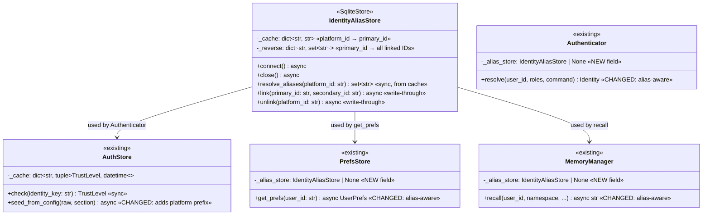
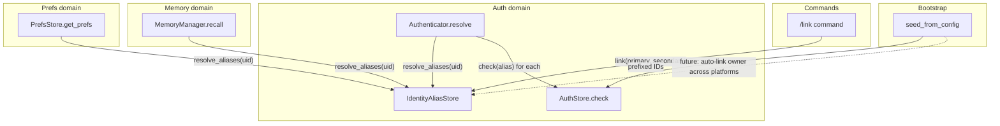

## Context

Promoted from [analysis](../analyses/472-unified-identity-layer-analysis.mdx) (Shape 3 — Prefixed Keys + Alias Table). Addresses two problems:

- **P0 (production broken):** `seed_from_config()` stores bare IDs (`"7377831990"`) but Hub-side resolution receives prefixed IDs (`"tg:user:7377831990"`) after C3 (`96ac94b`). Cache miss → owner falls to default trust.
- **P1 (identity gap):** No concept of "a person." Trust, prefs, and memory are siloed per platform identity.

Delivery: all-in-one pass (single PR, 2-week cycle).

## Goal

Same person recognized as the same user across all platforms — one trust level, one set of prefs, one memory context.

## Users

- **Mickael** — sole operator, uses Telegram and Discord daily. Currently blocked from own bot on production.
- **Future paired users** — anyone using Lyra on multiple platforms via `/join`.

## Expected Behavior

### Seed fix (P0)

On startup, `seed_from_config()` reads `owner_users = [7377831990]` from `[[auth.telegram_bots]]`. It prefixes the ID based on the section: `"telegram"` → `"tg:user:7377831990"`, `"discord"` → `"dc:user:987654321"`. A one-time cleanup deletes stale bare-ID rows from the `grants` table (rows where `identity_key` lacks a `tg:user:` / `dc:user:` prefix).

After seed, `Authenticator.resolve("tg:user:7377831990")` → `AuthStore.check("tg:user:7377831990")` → cache hit → `OWNER`. The C3 regression is fixed.

### Identity linking (P1)

Mickael sends `/link` from Telegram. Lyra generates a challenge code (6-char alphanumeric, 5-min TTL). Mickael sends `/link <code>` from Discord. Lyra matches the code, creates an alias linking both platform IDs to a primary identity (the ID that initiated the challenge). Both identities now resolve to the same trust level, prefs, and memory.

### Trust cascade

When resolving trust for any platform ID, the system:
1. Looks up the alias cache → finds all linked IDs for this person
2. Checks `AuthStore` for each linked ID
3. If **any** linked ID has stored trust `BLOCKED` → returns `BLOCKED` (no escalation)
4. Otherwise returns the highest trust level across all linked IDs (OWNER > TRUSTED > PUBLIC)

Two separate BLOCKED guards:
- **At resolution time:** If any linked ID is BLOCKED, the entire group resolves to BLOCKED. This prevents escalation through aliases even if one platform ID has a higher trust level.
- **At link time:** `/link` is rejected if either identity is currently BLOCKED. This prevents creating aliases that would immediately trigger the resolution-time guard.

### Admin cascade

`is_admin` is true if **any** linked platform ID appears in `[admin].user_ids` or has stored trust `== OWNER`. This ensures admin status follows the person, not the platform.

### Prefs sharing

`PrefsStore.get_prefs(user_id)` resolves aliases first: queries all linked IDs, returns prefs from the first ID that has non-default values. `set_pref()` writes to the requesting platform ID (so each platform can still override independently if desired).

### Memory sharing

`MemoryManager.recall(user_id, ...)` resolves aliases:
- **Sessions:** `json_extract(metadata,'$.user_id') IN (?, ?, ...)` covering all linked IDs
- **Concepts:** queries `f"{namespace}:{alias_id}"` for each linked ID, merges results in Python
- **Preferences (memory-level):** expands `user_id` filter to all linked IDs

Memory writes continue to use `snap.user_id` (the platform ID that sent the message). This means new memories are written under the platform-specific ID, but reads aggregate across all linked IDs.

## Data Model & Consumers

### Data structure



### Identity aliases table schema

```sql
CREATE TABLE IF NOT EXISTS identity_aliases (
    platform_user_id TEXT PRIMARY KEY,   -- "dc:user:987654321"
    primary_id       TEXT NOT NULL,      -- "tg:user:7377831990"
    created_at       TEXT NOT NULL DEFAULT (datetime('now'))
);
-- The primary_id itself is NOT in this table as a row.
-- resolve_aliases() returns {platform_user_id} ∪ {primary_id} ∪ {all rows where primary_id matches}.
```

Flat N:1 structure. Each platform ID maps to exactly one primary. No transitive chains → no cycles by design.

### Link challenge table schema

```sql
CREATE TABLE IF NOT EXISTS link_challenges (
    code_hash    TEXT PRIMARY KEY,
    initiator_id TEXT NOT NULL,       -- platform ID that started the challenge
    platform     TEXT NOT NULL,       -- "telegram" | "discord"
    created_at   TEXT NOT NULL DEFAULT (datetime('now')),
    expires_at   TEXT NOT NULL
);
```

### Consumer map



### Consumer summary

| Consumer | Fields consumed | When | Status |
|----------|----------------|------|--------|
| `Authenticator.resolve()` | `resolve_aliases()` → all linked IDs | Every message (middleware stage 2) | This issue |
| `PrefsStore.get_prefs()` | `resolve_aliases()` → all linked IDs | TTS synthesis, future `/setpref` | This issue |
| `MemoryManager.recall()` | `resolve_aliases()` → all linked IDs | System prompt build (per-pool) | This issue |
| `/link` command | `link()`, `unlink()` | User-initiated | This issue |
| `seed_from_config()` | N/A (writes to AuthStore only) | Bootstrap | This issue (prefix fix) |
| Memory upserts | `resolve_aliases()` → primary ID for writes | Session flush, extraction | Future (writes stay platform-scoped for now) |
| Config auto-linking | `link()` for owner_users across platforms | Bootstrap | Future |

## Breadboard

### U1: Seed prefix fix

| Affordance | Handler | Data |
|------------|---------|------|
| Bootstrap calls `seed_from_config(raw, "telegram")` | `AuthStore.seed_from_config()` | Reads `owner_users`, prefixes with `_PLATFORM_PREFIX[section]`, inserts into `grants` |
| Cleanup bare-ID rows (idempotent) | `AuthStore._cleanup_bare_ids()` | `DELETE FROM grants WHERE identity_key NOT LIKE '%:%'` (no colon = bare ID). Runs on every `connect()` — no-op on fresh installs or after first cleanup. |
| Cache warm after cleanup | `AuthStore._warm_cache()` | Reloads cache from DB |

### U2: Identity alias store

| Affordance | Handler | Data |
|------------|---------|------|
| Store opens DB, creates table, warms cache | `IdentityAliasStore.connect()` | Loads all `identity_aliases` rows into `_cache` and `_reverse` |
| Sync alias lookup | `IdentityAliasStore.resolve_aliases(platform_id)` | **Algorithm:** 1) Check `_cache[platform_id]` → if hit, get `primary_id`, return `{primary_id} ∪ _reverse[primary_id]`. 2) Check `_reverse[platform_id]` → if hit, caller IS the primary, return `{platform_id} ∪ _reverse[platform_id]`. 3) Neither → return `{platform_id}` (no alias). |
| Create link | `IdentityAliasStore.link(primary_id, secondary_id)` | INSERT into DB. Write-through: `_cache[secondary_id] = primary_id`, `_reverse[primary_id].add(secondary_id)` |
| Remove link | `IdentityAliasStore.unlink(platform_id)` | DELETE from DB. Write-through: look up `primary_id = _cache[platform_id]`, delete `_cache[platform_id]`, remove `platform_id` from `_reverse[primary_id]` (if `_reverse[primary_id]` is now empty, delete the key) |

### U3: Alias-aware trust resolution

| Affordance | Handler | Data |
|------------|---------|------|
| Resolve trust for platform ID | `Authenticator.resolve(user_id)` | `aliases = alias_store.resolve_aliases(user_id)` (resolved once, reused for trust + admin). `levels = [store.check(a) for a in aliases]`. If any is BLOCKED → BLOCKED. Else `max(levels)`. |
| Admin check across aliases | `Authenticator.resolve()` | Reuses same `aliases` set: `is_admin = any(a in _admin_user_ids or store.check(a) == OWNER for a in aliases)` |
| BLOCKED any-linked guard | `Authenticator._resolve_trust()` | If `store.check(a) == BLOCKED` for **any** `a` in `aliases` → BLOCKED (no alias escalation) |

### U4: `/link` command

| Affordance | Handler | Data |
|------------|---------|------|
| User sends `/link` (no args) | `LinkCommand.initiate()` | Generate 6-char code, SHA-256 hash, store in `link_challenges` with 5-min TTL. Reply with code. |
| User sends `/link <code>` from another platform | `LinkCommand.complete()` | Validate code, check both IDs are not BLOCKED, call `alias_store.link(initiator_id, completer_id)` |
| Expired/invalid code | `LinkCommand.complete()` | Reply with error, no alias created. Delete expired row from `link_challenges` on check. |
| User sends `/unlink` | `LinkCommand.unlink()` | Call `alias_store.unlink(user_id)`, reply with confirmation |
| Stale challenge cleanup | `LinkCommand.initiate()` | Before inserting new challenge: `DELETE FROM link_challenges WHERE expires_at < datetime('now')` |

### U5: Alias-aware prefs

| Affordance | Handler | Data |
|------------|---------|------|
| Read prefs with alias fallback | `PrefsStore.get_prefs(user_id)` | `aliases = alias_store.resolve_aliases(user_id)` → single `SELECT ... WHERE user_id IN (?, ...)` query. Merge results: for each pref key, use first non-default value found. Returned `UserPrefs.user_id` = the requesting platform ID (not the alias that had the value). |
| Write prefs | `PrefsStore.set_pref(user_id, key, value)` | Unchanged — writes to requesting platform ID |

### U6: Alias-aware memory recall

| Affordance | Handler | Data |
|------------|---------|------|
| Recall sessions | `MemoryManager.recall()` | `aliases = resolve_aliases(user_id)` → build `IN` clause with `", ".join("?" * len(aliases))` dynamic placeholders → `json_extract(metadata,'$.user_id') IN (?, ...)` |
| Recall concepts | `MemoryManager.recall()` | For each alias: search `f"{namespace}:{alias}"` via `self._db.search()`, merge + deduplicate results in Python |
| Recall preferences (memory-level) | `MemoryManager._fetch_preferences()` | Existing method fetches by namespace then filters in Python (`metadata.user_id == user_id`). Change to: `metadata.user_id in aliases` (no SQL change needed) |
| Write sessions/concepts/prefs | `MemoryManagerUpserts` | Unchanged — writes use `snap.user_id` (platform ID) |

## Slices

| # | Slice | Affordances | Demo |
|---|-------|-------------|------|
| S1 | Seed prefix fix + cleanup | U1 | Owner sends message on Telegram → recognized as OWNER (not blocked) |
| S2 | IdentityAliasStore | U2 | Unit test: `link("tg:user:1", "dc:user:2")` → `resolve_aliases("dc:user:2")` returns `{"tg:user:1", "dc:user:2"}` |
| S3 | Alias-aware trust resolution | U3 | `tg:user:1` is OWNER → after linking, `dc:user:2` also resolves as OWNER. BLOCKED ID cannot `/link`. |
| S4 | `/link` command | U4 | Initiate `/link` on Telegram → get code → `/link <code>` on Discord → alias created |
| S5 | Alias-aware prefs | U5 | Set TTS language on Telegram → visible on Discord after linking |
| S6 | Alias-aware memory recall | U6 | Conversation context from Telegram sessions visible when chatting on Discord |

## Success Criteria

- [ ] `seed_from_config()` prefixes IDs: `"telegram"` → `"tg:user:"`, `"discord"` → `"dc:user:"`
- [ ] One-time cleanup deletes bare-ID rows from `grants` (rows without `:` in `identity_key`)
- [ ] After seed + cleanup, `Authenticator.resolve("tg:user:<owner_id>")` returns `OWNER`
- [ ] `IdentityAliasStore` follows async store pattern: `__init__` no I/O, `connect()` opens DB + warms cache, `close()` tears down
- [ ] `resolve_aliases()` is synchronous (reads from in-memory cache, no I/O) — matches `AuthStore.check()` contract
- [ ] `link()` and `unlink()` are async, write-through to both DB and cache
- [ ] `identity_aliases` table is flat N:1 (one `primary_id` per `platform_user_id`) — no transitive chains
- [ ] After `link("tg:user:1", "dc:user:2")`, `resolve_aliases("dc:user:2")` returns `{"tg:user:1", "dc:user:2"}`
- [ ] After `link("tg:user:1", "dc:user:2")`, `resolve_aliases("tg:user:1")` returns `{"tg:user:1", "dc:user:2"}` (primary ID lookup via `_reverse`)
- [ ] `Authenticator.resolve()` with alias store: resolves aliases once, reuses for both trust and admin checks
- [ ] `Authenticator.resolve()`: takes max trust across all linked IDs (OWNER > TRUSTED > PUBLIC)
- [ ] If **any** linked ID has stored trust `BLOCKED`, resolution returns `BLOCKED` regardless of other aliases' trust levels
- [ ] `/link` is rejected if either identity is `BLOCKED`
- [ ] `is_admin` is true if any linked ID is in `_admin_user_ids` or has stored `OWNER`
- [ ] `resolve_aliases()` when called with the primary ID (no row in `_cache`): checks `_reverse`, returns `{primary_id} ∪ _reverse[primary_id]`
- [ ] `/link` initiate: generates code (6-char, 5-min TTL), stores hash in `link_challenges`
- [ ] `/link <code>` from another platform: validates code, creates alias, replies with confirmation
- [ ] `/unlink` removes the alias for the requesting platform ID, updates both `_cache` and `_reverse`
- [ ] Expired `link_challenges` rows cleaned up on each `/link` initiate
- [ ] `PrefsStore.get_prefs()` with alias store: queries all linked IDs, returns first non-default
- [ ] `PrefsStore.set_pref()` unchanged — writes to requesting platform ID
- [ ] `MemoryManager.recall()` with alias store: session query covers all linked user_ids
- [ ] `MemoryManager.recall()` with alias store: concept search covers all linked `{ns}:{user_id}` namespaces
- [ ] `MemoryManager._fetch_preferences()` with alias store: filters across all linked user_ids
- [ ] Memory writes (`upsert_session`, `upsert_concept`, `upsert_preference`) unchanged — use `snap.user_id`
- [ ] All existing tests pass (no regressions)
- [ ] New tests cover: seed prefix, bare-ID cleanup, alias CRUD, trust cascade, BLOCKED exception, admin cascade, prefs alias, memory alias, `/link` flow, `/unlink`
