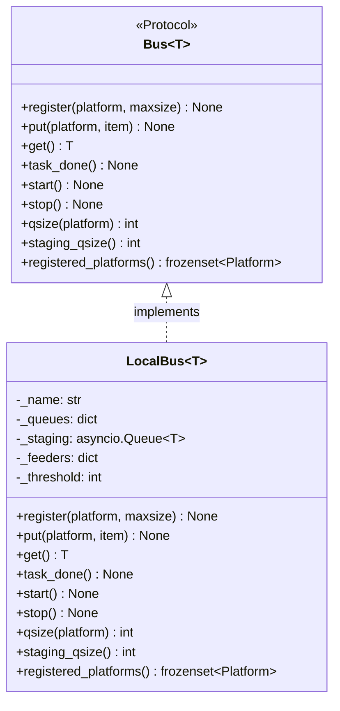
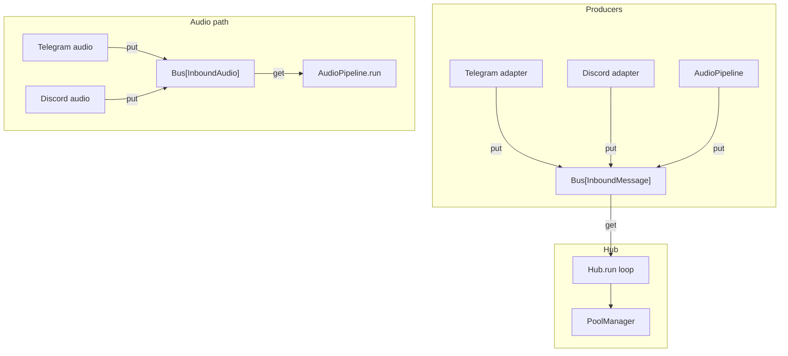

## Context

Promoted from [analysis](../analyses/48-bus-abstraction-analysis.mdx). Shape 1 selected: Protocol[T] thin wrap over existing `InboundBus` API. Part of Phase 2 NATS introduction (#60), blocks #50 (NatsBus).

## Goal

Decouple Hub from its concrete queue implementation by extracting a `Bus[T]` Protocol and renaming `InboundBus` to `LocalBus`, so that inbound message transport can be replaced without modifying Hub internals or adapter call sites.

## Users

- **Hub core** — consumes the Bus interface for message routing
- **Adapter authors** — call `bus.put()` to inject messages
- **Test authors** — inject messages via the Bus interface (currently via leaked `hub.bus`)
- **Future NatsBus consumers** (#50) — implement the Bus Protocol for distributed transport

## Expected Behavior

1. A `Bus[T]` Protocol is defined in `core/bus.py` (new file) with the full surface: `register`, `put`, `get`, `task_done`, `start`, `stop`, `qsize`, `staging_qsize`, `registered_platforms`.
2. `InboundBus` in `core/inbound_bus.py` is renamed to `LocalBus` and continues to work identically.
3. `inbound_audio_bus.py` import updated from `InboundBus` to `LocalBus` (alias unchanged).
4. Hub types its bus attributes as `Bus[InboundMessage]` and `Bus[InboundAudio]` — the concrete `LocalBus` satisfies these structurally.
5. The leaky `hub.bus` property (returning raw `asyncio.Queue`) is removed. All 14 test `hub.bus.put()` calls are migrated to `hub.inbound_bus.put(platform, msg)`. Note: tests currently `await` the sync `put()` — the `await` must be dropped during migration.
6. All 3 `hub.bus.empty()` assertions are replaced with `hub.inbound_bus.staging_qsize() == 0`.
7. `test_hub_init.py:99` `isinstance(hub.bus, asyncio.Queue)` assertion is removed or replaced with a `Bus` Protocol check.
8. `demo.py` `hub.bus.put()` migrated to `hub.inbound_bus.put(platform, msg)`; `hub.bus.join()` replaced with `await hub.inbound_bus._staging.join()` (internal access acceptable in demo — demo is not production code).
9. All existing tests pass without behavioral modification — zero regression.
10. `Bus[T]` is invariant in `T` (both covariant `get() -> T` and contravariant `put(item: T)` positions). Verified clean by Pyright.

## Data Model & Consumers

| Consumer | Fields used | When | Status |
|----------|------------|------|--------|
| Hub.run() | `get()`, `task_done()` | Main loop | This issue |
| Hub.register_adapter() | `register()`, `registered_platforms()` | Startup | This issue |
| push_to_hub_guarded() | `put()` | On inbound message | This issue |
| AudioPipeline | `put()` (re-enqueue after STT) | On transcription | This issue |
| multibot_wiring | `start()`, `stop()` | Lifecycle | This issue |
| health endpoint | `registered_platforms()` | Health check | This issue |
| NatsBus (#50) | Full Protocol surface | Future | Future |

## Breadboard

### Slice 1: Bus Protocol + LocalBus rename

| Affordance | Handler | Data |
|-----------|---------|------|
| `Bus[T]` Protocol definition | New file `core/bus.py` | Protocol with 9 methods, invariant in T |
| `LocalBus[T]` class | Rename in `core/inbound_bus.py` | Existing `InboundBus` implementation unchanged |
| `inbound_audio_bus.py` import update | `from .inbound_bus import LocalBus` | Alias `InboundAudioBus = LocalBus[InboundAudio]` |
| Re-export from `core/__init__.py` | Update imports | `Bus`, `LocalBus` |

### Slice 2: Hub types to Bus Protocol

| Affordance | Handler | Data |
|-----------|---------|------|
| `hub.inbound_bus` typed `Bus[InboundMessage]` | `core/hub/hub.py` | Type annotation only |
| `hub.inbound_audio_bus` typed `Bus[InboundAudio]` | `core/hub/hub.py` | Type annotation only |
| Import updates | `hub.py`, `multibot_wiring.py`, `health.py` | `LocalBus` from new location |

### Slice 3: Remove `hub.bus` leak + migrate tests

| Affordance | Handler | Data |
|-----------|---------|------|
| Remove `Hub.bus` property | `core/hub/hub.py` | Delete property (line 129-130) |
| Migrate `hub.bus.put(msg)` → `hub.inbound_bus.put(platform, msg)` | 10 test files | 14 call sites (drop `await` — `put()` is sync) |
| Migrate `hub.bus.empty()` → `hub.inbound_bus.staging_qsize() == 0` | `test_hub_routing.py` | 3 assertions (lines 121, 175, 213) |
| Remove `isinstance(hub.bus, asyncio.Queue)` assertion | `test_hub_init.py:99` | Delete or replace with Protocol check |
| Migrate `demo.py` `hub.bus.put()` + `.join()` | `demo.py` | `put()` → `inbound_bus.put(platform, msg)`; `.join()` → `inbound_bus._staging.join()` |

## Slices

| # | Slice | Deps | Demo |
|---|-------|------|------|
| 1 | Bus Protocol + LocalBus rename | — | `from lyra.core.bus import Bus, LocalBus` importable, Pyright clean |
| 2 | Hub types to Bus Protocol | 1 | Hub constructs `LocalBus`, typed as `Bus[T]`, Pyright clean |
| 3 | Remove hub.bus + migrate tests | 1, 2 | All tests pass, `hub.bus` no longer exists, no raw queue exposure |

## Success Criteria

- [ ] `Bus[T]` Protocol is defined in `src/lyra/core/bus.py` with all 9 methods
- [ ] `Bus[T]` is invariant in `T` — verified clean by Pyright
- [ ] `InboundBus` is renamed to `LocalBus` in `src/lyra/core/inbound_bus.py`
- [ ] `inbound_audio_bus.py` import updated to `from .inbound_bus import LocalBus`
- [ ] `LocalBus[T]` structurally satisfies `Bus[T]` (Pyright passes with no errors)
- [ ] Hub types `inbound_bus` as `Bus[InboundMessage]` and `inbound_audio_bus` as `Bus[InboundAudio]`
- [ ] `Hub.bus` property is removed (no raw `asyncio.Queue` exposure)
- [ ] All 14 test `hub.bus.put()` calls migrated to `hub.inbound_bus.put(platform, msg)` (with `await` dropped)
- [ ] All 3 `hub.bus.empty()` assertions migrated to `hub.inbound_bus.staging_qsize() == 0`
- [ ] `test_hub_init.py:99` `isinstance` assertion removed or replaced
- [ ] `demo.py` migrated: `put()` → `inbound_bus.put(platform, msg)`, `join()` → `inbound_bus._staging.join()`
- [ ] `pytest -x` exits 0 with no new `skip` or `xfail` markers
- [ ] No NATS dependency introduced
