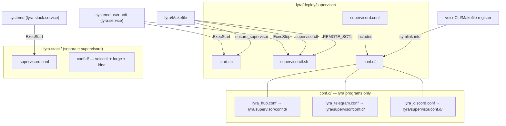

## Context

Promoted from [frame #505](../frames/505-move-supervisor-bootstrap-frame.mdx).

Currently, the supervisord bootstrap lives in `lyra-stack/` — a separate orchestration repo. Lyra already owns the actual program configs (`lyra/supervisor/conf.d/*.conf`) and run scripts (`lyra/supervisor/scripts/`), but the central supervisord.conf, start.sh, and supervisorctl.sh live in lyra-stack. Other projects (voiceCLI, forge) register their configs via symlinks into `lyra-stack/conf.d/`.

This spec moves the bootstrap into `lyra/deploy/supervisor/` so Lyra fully owns its daemon lifecycle.

## Goal

Lyra owns the complete supervisor bootstrap — a single `make lyra` from the lyra repo starts supervisord and all registered services without depending on lyra-stack for bootstrap files.

## Users

- **Primary:** Mickael — deploys and manages services on local and production machines (ROXABITOWER local, roxabituwer production)
- **Secondary:** Future contributors who need to understand the deployment layout

## Expected Behavior

After this change:

1. `lyra/deploy/supervisor/` contains: `supervisord.conf`, `start.sh`, `supervisorctl.sh`, and `conf.d/` (with symlinks to each project's configs).
2. The systemd user unit is renamed to `lyra.service` and points to `lyra/deploy/supervisor/` paths.
3. `make lyra` / `make ps` / `make remote` etc. work from the lyra repo without referencing lyra-stack.
4. `lyra-stack/` keeps its own supervisord for voicecli_tts, voicecli_stt, forge, idna (separate instance, `lyra-stack.service` unchanged).

## Decisions

**Systemd unit name:** Rename from `lyra-stack.service` to `lyra.service` — the bootstrap now lives in lyra, the old name is confusing. Docs in both repos (CLAUDE.md, supervisor-pattern.md) updated in the same slice.

**Two supervisord instances post-migration:** Lyra's supervisord (`lyra.service`) manages lyra_hub, lyra_telegram, lyra_discord only. lyra-stack's supervisord (`lyra-stack.service`) keeps managing voicecli_tts, voicecli_stt, forge, idna — unchanged. Each has its own PID, socket, and conf.d. The current single-instance model splits into two. Ownership principle: each project owns its own daemons.

**Dual supervisord.conf:** `lyra/supervisor/supervisord.conf` (the existing local-testing copy) is NOT used in production. Pre-migration step confirms no second supervisord instance is running from it.

## Data Model & Consumers

### Consumer summary

| Consumer | Uses | When |
|----------|------|------|
| systemd user unit | start.sh, supervisorctl.sh, supervisord.conf | Boot, restart |
| lyra/Makefile (local) | start.sh, supervisorctl.sh | `make lyra`, `make ps`, etc. |
| lyra/Makefile (remote) | REMOTE_SCTL → supervisorctl.sh | `make remote [service] [action]` |
| lyra-stack/supervisord | voicecli + forge + idna (own instance, unchanged) | Always |

## Breadboard

### Affordances

| ID | Element | Location |
|----|---------|----------|
| U1 | `make lyra` | lyra/Makefile |
| U2 | `make ps` | lyra/Makefile |
| U3 | `make register` | lyra/Makefile (self-register lyra configs into deploy/supervisor/conf.d/) |
| U4 | `make lyra` | lyra-stack/Makefile (compat wrapper — optional) |
| U5 | systemctl --user start lyra | systemd |
| U6 | `make remote [service] [action]` | lyra/Makefile (SSH to production) |

### Handlers

| ID | Handler | Action |
|----|---------|--------|
| N1 | ensure_supervisor | Check PID at new path, call start.sh if needed |
| N2 | start.sh | Create log dir (~/.local/state/lyra/logs), start supervisord with new conf path |
| N3 | supervisorctl.sh | Delegate to supervisorctl with new conf path |
| N4 | register (lyra) | Symlink lyra conf.d files into deploy/supervisor/conf.d/ |
| N5 | REMOTE_SCTL | Points to new supervisorctl.sh path for SSH commands |

### Data

| ID | Store | Fields |
|----|-------|--------|
| S1 | supervisord.conf | socket, pidfile, logfile, include path (all via `%(here)s`) |
| S2 | conf.d/*.conf | Program definitions (unchanged content) |
| S3 | systemd unit | ExecStart, ExecStop, PIDFile paths |

### Wiring

| From | → | To |
|------|---|-----|
| U1 | → | N1 → N2 (start) or N3 (control) → S1 |
| U2 | → | N3 → S1 |
| U3 | → | N4 → S2 |
| U4 | → | delegates to U1 |
| U5 | → | N2 → S1 |
| U6 | → | N5 → N3 → S1 |

## Slices

| # | Slice | Scope | Demo |
|---|-------|-------|------|
| 1 | Bootstrap files in lyra | Migrate supervisord.conf + start.sh + supervisorctl.sh from `lyra-stack/` to `lyra/deploy/supervisor/`, adapt `%(here)s`-relative paths. Create conf.d/ with symlinks to lyra's 3 program configs. | `lyra/deploy/supervisor/start.sh` starts supervisord |
| 2 | Lyra Makefile self-contained | Update lyra/Makefile: `SUPERVISORCTL`, `SUPERVISOR_START`, `SUPERVISOR_DIR`, `HUB_PID` vars to `deploy/supervisor/`. Update `ensure_supervisor` macro. Update `register` target. Update `REMOTE_SCTL` to new path. Remove `tts`/`stt` targets (those stay in lyra-stack). | `cd lyra && make lyra` works without lyra-stack |
| 3 | Systemd unit + cutover | **Requires maintenance window** (supervisord stopped). Pre-check: confirm no second supervisord running from `lyra/supervisor/`. Stop supervisord, confirm old PID+socket absent. Create `lyra.service` with new paths. Update docs (CLAUDE.md in lyra, lyra-stack, projects). `systemctl --user daemon-reload`, start both units. | `systemctl --user restart lyra` starts lyra's 3 programs |
| 4 | lyra-stack cleanup | Remove lyra symlinks from `lyra-stack/conf.d/`. lyra-stack keeps its own supervisord + start.sh + supervisorctl.sh for voicecli + forge + idna. Remove lyra-specific targets from lyra-stack Makefile. | `cd lyra-stack && make ps` shows voicecli + forge + idna only |

**Slice dependencies:** 1 → 2 → 3 (must be done together as a maintenance window) → 4.

## Migration Notes

**Cutover procedure (Slices 1-3 combined):**
1. `systemctl --user stop lyra-stack` — all services go down
2. Confirm: `lyra/supervisor/supervisord.pid` absent (no second instance)
3. Confirm: `lyra-stack/supervisord.pid` and `lyra-stack/supervisor.sock` removed
4. Apply Slice 1 (files), Slice 2 (Makefile), Slice 3 (systemd unit)
5. Remove lyra symlinks from `lyra-stack/conf.d/` (voicecli + forge + idna stay)
6. `systemctl --user daemon-reload`
7. `systemctl --user enable --now lyra.service` — lyra's 3 programs come up from new paths
8. `systemctl --user start lyra-stack` — voicecli + forge + idna come up from lyra-stack (smaller instance)
9. Verify: `make ps` from lyra shows lyra_hub/telegram/discord; `make ps` from lyra-stack shows voicecli + forge + idna

**Rollback:** If any step fails, re-add lyra symlinks to `lyra-stack/conf.d/`, revert Makefile vars, remove `lyra.service`, restart `lyra-stack.service`. Bootstrap files remain in lyra-stack until Slice 4 verification passes.

## Success Criteria

- [ ] `lyra/deploy/supervisor/supervisord.conf` exists and supervisord starts from it
- [ ] `lyra/deploy/supervisor/start.sh` creates log dirs and starts supervisord
- [ ] `lyra/deploy/supervisor/supervisorctl.sh` controls the running supervisord
- [ ] `lyra/deploy/supervisor/conf.d/` contains symlinks to lyra_hub, lyra_telegram, lyra_discord configs only
- [ ] `cd ~/projects/lyra && make lyra` starts all three lyra services (no lyra-stack dependency)
- [ ] `cd ~/projects/lyra && make ps` shows lyra_hub, lyra_telegram, lyra_discord
- [ ] `cd ~/projects/lyra && make remote status` returns lyra program status from production via SSH
- [ ] `lyra.service` systemd unit exists, points to new paths, supervisord starts on boot
- [ ] lyra-stack `conf.d/` no longer contains lyra symlinks (voicecli + forge + idna remain)
- [ ] `lyra-stack.service` still runs voicecli_tts, voicecli_stt, forge, idna
- [ ] `cd ~/projects/lyra-stack && make ps` shows voicecli + forge + idna
- [ ] Docs updated (CLAUDE.md in lyra, lyra-stack, projects) to reference `lyra.service` and two-instance model
