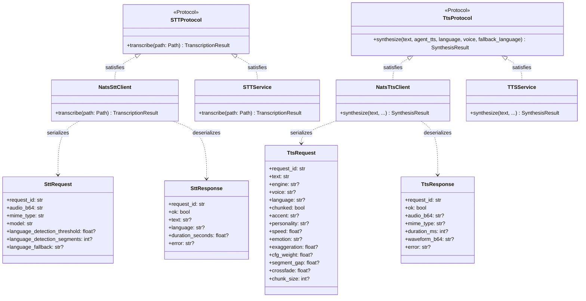
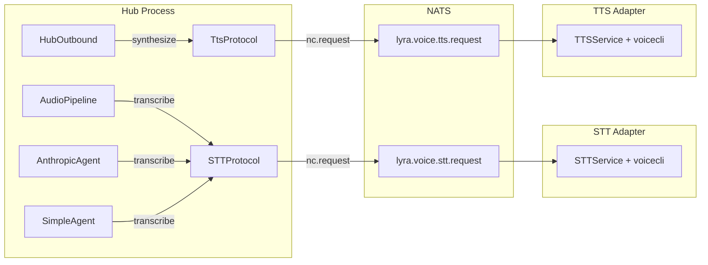

## Context

Promoted from analysis: `artifacts/analyses/518-stt-tts-nats-adapter-decoupling-analysis.mdx`.
ADR: `docs/architecture/adr/039-stt-tts-nats-adapter-decoupling.mdx` (Accepted).

**A single voice message from one user can crash text conversations for every active user
on the hub.** The hub process directly imports voicecli through `STTService` and
`TTSService`. When voicecli daemons are down, in-process model loading (~2 GB) starves
the thread pool, crashes Telegram polling, and takes down the entire hub — text users
included. Additionally, in three-process NATS production mode, `InboundAudio` never
reaches the hub (audio bus is local, not NATS-wired), so voice messages are
non-functional today.

## Goal

Voice messages flow end-to-end in three-process NATS mode, with the hub process never
importing voicecli — voice processing runs in independent STT/TTS adapter processes
that communicate with the hub over NATS request-reply.

## Users

- **End users (Telegram/Discord):** Voice messages are transcribed and answered; failures
  produce a timely, polite error — never silence or a timeout.
- **Operator:** Voice adapters are independently restartable without hub restart. Text
  processing is unaffected by voice infrastructure state.

## Expected Behavior

### Voice message flow (happy path)

1. User sends a voice message on Telegram.
2. Telegram adapter downloads audio, builds `InboundAudio`, publishes to
   `lyra.inbound.audio.telegram.<bot_id>` over NATS.
3. Hub's `NatsBus[InboundAudio]` receives it, places on `inbound_audio_bus` staging queue.
4. `AudioPipeline` picks it up, writes temp file, calls `NatsSttClient.transcribe(tmp)`.
5. `NatsSttClient` reads file bytes, base64-encodes, sends `SttRequest` to
   `lyra.voice.stt.request` via `nc.request()`.
6. `lyra_stt` adapter receives request, decodes audio, calls `STTService.transcribe()`,
   returns `SttResponse` to reply-to inbox.
7. Hub receives transcription, re-enqueues as `InboundMessage` on inbound text bus.
8. Agent processes the text, generates response. If voice modality, hub calls
   `NatsTtsClient.synthesize()`.
9. `NatsTtsClient` serializes `TtsRequest` (flattened from `AgentTTSConfig`), sends to
   `lyra.voice.tts.request` via `nc.request()`.
10. `lyra_tts` adapter synthesizes, returns `TtsResponse` with OGG audio bytes.
11. Hub dispatches `OutboundAudio` back to adapter via existing NATS outbound channel.

### STT adapter down (degradation)

1. User sends voice message → hub receives `InboundAudio` over NATS.
2. `NatsSttClient.transcribe()` sends request → NATS timeout (60s).
3. `STTUnavailableError` raised → `AudioPipeline` catches it.
4. Hub replies with `stt_unavailable` message: "Voice messages are temporarily
   unavailable. Please try again later or send a text message."
5. Text messages continue processing normally — zero impact.

### TTS adapter down (degradation)

1. Agent generates voice response → `NatsTtsClient.synthesize()` times out (30s).
2. `TtsUnavailableError` raised → `synthesize_and_dispatch_audio()` catches it.
3. Hub dispatches text-only response (the generated content) instead of silence.
4. User receives the text reply — degraded but not silent.

### Hub starts without voice adapters

1. Hub starts, constructs `NatsSttClient` / `NatsTtsClient` with the NATS connection.
2. No subscription or health check needed — clients are stateless wrappers around
   `nc.request()`.
3. Text messages process immediately. Voice messages get `stt_unavailable` reply.
4. Voice adapters start later — next voice message succeeds with no hub restart.

### Voice adapter recovers mid-session

1. STT adapter is down — voice messages receive `stt_unavailable` replies.
2. Operator runs `make lyra-stt` (or adapter auto-restarts via supervisor).
3. Next voice message triggers `nc.request()` → STT adapter is now subscribed → responds.
4. User receives transcription and agent response — no hub restart, no manual intervention.
   NATS request-reply is stateless; recovery is automatic.

### STT not configured vs temporarily unavailable

- `stt_unsupported`: Hub was started with `STT_MODEL_SIZE` unset → `Hub._stt` is `None`.
  `AudioPipeline` checks `if self._hub._stt is None` and replies immediately. No NATS
  request is ever made.
- `stt_unavailable`: Hub has a `NatsSttClient` wired (`_stt` is not `None`), but the STT
  adapter is down → `nc.request()` times out → `STTUnavailableError` → caught in
  `AudioPipeline`.

## Data Model & Consumers

### Consumer Summary

| Consumer | Fields consumed | When | Status |
|----------|----------------|------|--------|
| `AudioPipeline._process_audio_item()` | `STTProtocol.transcribe()` → `TranscriptionResult` | Every inbound voice message | This issue |
| `AudioPipeline.synthesize_and_dispatch_audio()` | `TtsProtocol.synthesize()` → `SynthesisResult` | Every voice-mode response | This issue |
| `AnthropicAgent._handle_audio()` | `STTProtocol.transcribe()` → `TranscriptionResult` | Agent processes audio attachment | This issue |
| `SimpleAgent._handle_audio()` | `STTProtocol.transcribe()` → `TranscriptionResult` | Agent processes audio attachment | This issue |
| `Hub._stt` / `Hub._tts` | Protocol-typed references | Hub init | This issue |
| `HubOutboundMixin._tts` | `TtsProtocol` reference for type checking | Outbound dispatch | This issue |

## Breadboard

### Slice 1: InboundAudio over NATS (C5 prerequisite)

| Affordance | Handler | Data |
|------------|---------|------|
| U1: User sends voice on Telegram | Telegram adapter `handle_voice_message()` | `InboundAudio` dataclass |
| N1: Adapter audio bus → NatsBus | `adapter_standalone.py` line 106: change `LocalBus(name="inbound-audio")` → `NatsBus(nc=nc, bot_id=bot_id, item_type=InboundAudio)` + register + start | Same change for Discord at line 233 |
| N2: Audio published to NATS | `NatsBus.put(platform, audio)` using existing `_serialize` | `lyra.inbound.audio.telegram.<bot_id>` subject |
| S1: Hub audio bus → NatsBus | `hub_standalone.py` line 163: change `LocalBus(name="inbound-audio")` → `NatsBus(nc=nc, bot_id="hub", item_type=InboundAudio)` + register all platforms | **Slice 1 only changes this line.** Slice 4 changes the same file for voice_overlay swap (separate hunk). |
| S2: AudioPipeline drains audio bus | `AudioPipeline.run()` — existing loop, no changes | `InboundAudio` from `hub.inbound_audio_bus.get()` |

### Slice 2: Protocol interfaces + NATS clients

| Affordance | Handler | Data |
|------------|---------|------|
| S3: STT protocol defined | `STTProtocol` in `src/lyra/stt/__init__.py` | `transcribe(Path) → TranscriptionResult` |
| S4: TTS protocol defined | `TtsProtocol` in `src/lyra/tts/__init__.py` | `synthesize(text, ...) → SynthesisResult` |
| S5: STT unavailable error | `STTUnavailableError` in `src/lyra/stt/__init__.py` | Raised on NATS timeout |
| S6: TTS unavailable error | `TtsUnavailableError` in `src/lyra/tts/__init__.py` | Raised on NATS timeout |
| S7: Hub-side STT NATS client | `NatsSttClient` in `src/lyra/nats/nats_stt_client.py` | Reads file via `asyncio.to_thread` (avoid blocking event loop) → base64 → `SttRequest` → `nc.request()` → `SttResponse` → `TranscriptionResult` |
| S8: Hub-side TTS NATS client | `NatsTtsClient` in `src/lyra/nats/nats_tts_client.py` | Flattens `AgentTTSConfig` → `TtsRequest` → `nc.request()` → `TtsResponse` → `SynthesisResult` |

### Slice 3: STT/TTS adapter processes

| Affordance | Handler | Data |
|------------|---------|------|
| S9: STT adapter bootstrap | `stt_adapter_standalone.py` | NATS connect → subscribe `lyra.voice.stt.request` (queue: `stt-workers`) → `STTService.transcribe()` → respond |
| S10: TTS adapter bootstrap | `tts_adapter_standalone.py` | NATS connect → subscribe `lyra.voice.tts.request` (queue: `tts-workers`) → deserialize `TtsRequest` flat fields → call `TTSService.synthesize()` with individual kwargs (adapter does NOT import `AgentTTSConfig`; instead passes `agent_tts=None` and explicit `language=`, `voice=`, etc. from the flat request) → respond |
| S11: CLI entry points | `lyra adapter stt` / `lyra adapter tts` | CLI → config load → `_bootstrap_stt_adapter_standalone()` |

### Slice 4: Hub cutover + graceful degradation

| Affordance | Handler | Data |
|------------|---------|------|
| S12: Hub bootstrap swap | `voice_overlay.init_nats_stt()` / `init_nats_tts()` | Construct `NatsSttClient`/`NatsTtsClient` from `nc` |
| S13: Hub standalone wiring | `hub_standalone.py` | Replace `init_stt`/`init_tts` calls; wire `NatsBus[InboundAudio]` |
| S14: Agent type annotations | `agent_factory.py`, `anthropic_agent.py`, `simple_agent.py` | `STTService | None` → `STTProtocol | None`. **Critical:** `agent_factory.py` has **runtime** imports of `STTService`/`TTSService` (lines 23-24) — these must be removed or changed to protocol imports to break the transitive voicecli import chain. Agent files only use TYPE_CHECKING imports (safe). |
| S15: Hub type annotations | `hub.py`, `hub_outbound.py` | Same protocol type change |
| S16: STT degradation | `AudioPipeline._process_audio_item()` | Catch `STTUnavailableError` → reply `stt_unavailable` |
| S17: TTS degradation | `AudioPipeline.synthesize_and_dispatch_audio()` | Catch `TtsUnavailableError` in the existing `except Exception` block → call `self._hub.dispatch_response(msg, Response(content=text))` to send the generated text as a plain message. Log warning "TTS unavailable — sending text fallback for msg id=%s". Current behavior swallows the error silently; new behavior sends text. |
| S18: Distinct error messages | `messages.toml` or equivalent | `stt_unavailable` ("temporarily down") vs existing `stt_unsupported` ("not configured") |

### Slice 5: Supervisor + Makefile

| Affordance | Handler | Data |
|------------|---------|------|
| S19: Supervisor configs | `deploy/supervisor/conf.d/lyra_stt.conf`, `lyra_tts.conf` | `startsecs=5`, `autostart=false`, `autorestart=true` |
| S20: Launch scripts | `supervisor/scripts/run_stt_adapter.sh`, `run_tts_adapter.sh` | Separate files (not reusing `run_adapter.sh` — voice adapters have different venv/env requirements). Pattern: activate lyra venv, exec `lyra adapter stt` / `lyra adapter tts`. Same structure as existing `run_hub.sh`. |
| S21: Makefile targets | `Makefile` | `lyra-stt` / `lyra-tts` targets; `register` target updated |

## Slices

| # | Slice | Files | Depends on | Demo |
|---|-------|-------|-----------|------|
| 1 | InboundAudio over NATS | `adapter_standalone.py`, `hub_standalone.py` | — | Voice message from Telegram reaches hub's AudioPipeline in 3-process mode |
| 2 | Protocol interfaces + NATS clients | `stt/__init__.py`, `tts/__init__.py`, `nats_stt_client.py`, `nats_tts_client.py` | — | Unit tests: `NatsSttClient` satisfies `STTProtocol`, serialization round-trips |
| 3 | STT/TTS adapter processes | `stt_adapter_standalone.py`, `tts_adapter_standalone.py`, CLI wiring | — | `lyra adapter stt` starts, subscribes to NATS, responds to a test request |
| 4 | Hub cutover + degradation | `voice_overlay.py`, `hub_standalone.py`, `agent_factory.py`, agents, `hub.py`, `hub_outbound.py`, `audio_pipeline.py`, messages | 1, 2, 3 | End-to-end: voice message → transcription → response. STT down → polite error. TTS down → text fallback |
| 5 | Supervisor + Makefile | `conf.d/*.conf`, `scripts/*.sh`, `Makefile` | 3 | `make lyra-stt` starts adapter; `make register` includes new programs |

Slices 1, 2, 3 are independent and can be implemented in parallel.
Slice 4 is the cutover — depends on all three.
Slice 5 is infra, depends on slice 3 (needs entry point to exist).

**Deployment sequencing:** Slice 3 (CLI entry points) must be installed on production
before `make register` is run (Slice 5), because supervisord validates the command path
on `reread`/`update`. Deploy order: Slices 1–3 → Slice 4 → Slice 5. Deploying the hub
update (Slice 4) before voice adapters are running is safe — voice degrades gracefully.
Supervisor configs follow `lyra_telegram.conf` pattern (log paths, environment, stopwaitsecs).

## Success Criteria

- [ ] No voicecli imports reachable from hub entry points (verified: trace imports from `hub_standalone.py` and `agent_factory.py` — no transitive path to voicecli. `stt/__init__.py` and `tts/__init__.py` retain voicecli imports but are only loaded by adapter processes, not hub-side code paths)
- [ ] `InboundAudio` crosses from Telegram/Discord adapter to hub over NATS in 3-process mode (audio bus wired as `NatsBus[InboundAudio]` on both adapter and hub sides)
- [ ] `NatsSttClient` implements `STTProtocol` and passes structural type check
- [ ] `NatsTtsClient` implements `TtsProtocol` and passes structural type check
- [ ] `NatsSttClient.transcribe()` reads file bytes via `asyncio.to_thread` (no blocking I/O on event loop)
- [ ] End-to-end voice message: Telegram voice → hub → STT adapter → transcription → agent → TTS adapter → audio response
- [ ] Hub starts and processes text messages with both voice adapters stopped
- [ ] Voice message with STT adapter down → user receives `stt_unavailable` message within 65 seconds (timeout + dispatch)
- [ ] Voice response with TTS adapter down → user receives text-only fallback via `dispatch_response()` (not silence)
- [ ] `stt_unavailable` and `stt_unsupported` are distinct user-facing messages
- [ ] `lyra adapter stt` and `lyra adapter tts` CLI commands start adapter processes
- [ ] Supervisor configs `lyra_stt.conf` / `lyra_tts.conf` present with `startsecs=5`
- [ ] `make lyra-stt` / `make lyra-tts` targets work; `make register` includes new programs
- [ ] No hub restart required when voice adapters come up (verified: start hub → stop adapters → start adapters → send voice message → expect success)
- [ ] `AgentTTSConfig` fields are flattened into `TtsRequest` JSON — adapter process does not import `AgentTTSConfig` or other hub-layer types
- [ ] `agent_factory.py` has no runtime import of `STTService` or `TTSService` (protocol imports only)
