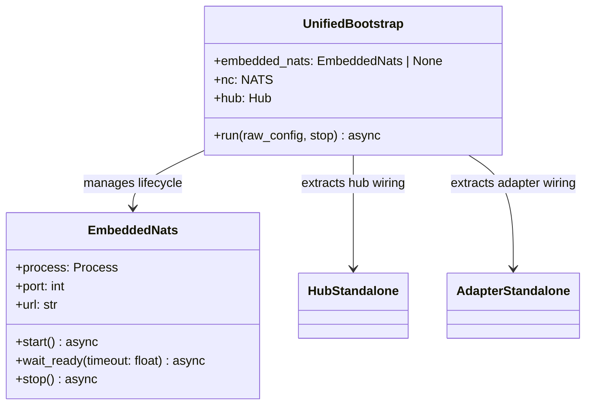
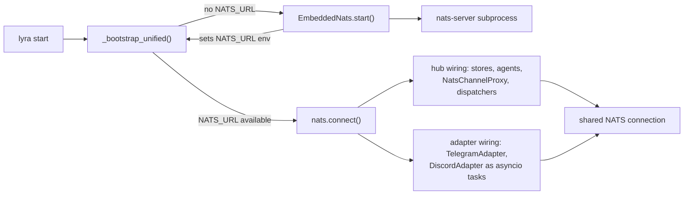

## Context

Lyra has two bootstrap paths: multibot (single-process, no NATS) and NATS three-process mode. Multibot is degrading (#518 broke voice) and diverging. NATS mode requires external infra that newcomers don't have. This spec replaces multibot with embedded NATS — auto-start `nats-server` as a subprocess when `NATS_URL` is not set, then run hub + adapters in one process using the existing NATS code path.

## Goal

One command (`lyra start`) boots Lyra with zero external dependencies beyond `nats-server` binary, using the same NATS-based architecture internally — eliminating the second bootstrap path.

## Users

- **Newcomers:** `lyra start` just works — no NATS install, no 3 processes
- **Production:** `NATS_URL` set → embedded server skipped, three-process mode unchanged
- **Maintainer:** single bootstrap path to maintain

## Expected Behavior

### Newcomer flow (no NATS_URL)

```
$ lyra start
[INFO] NATS_URL not set — starting embedded nats-server on localhost:4222
[INFO] Embedded nats-server ready (PID 12345)
[INFO] Connected to NATS at nats://127.0.0.1:4222
[INFO] Lyra started — adapters: telegram:main, discord:main, health on :8443
```

One process, one terminal. Ctrl+C stops everything including embedded nats-server.

### Single-machine with external NATS (NATS_URL set, `lyra start`)

```
$ export NATS_URL=nats://127.0.0.1:4222
$ lyra start
[INFO] Using external NATS at nats://127.0.0.1:4222
[INFO] Lyra started — adapters: telegram:main, discord:main, health on :8443
```

Same unified single-process mode but connects to the user's NATS instance. No embedded server.

### Production three-process mode (unchanged)

```
$ export NATS_URL=nats://192.168.1.16:4222
$ lyra hub                    # process 1
$ lyra adapter telegram       # process 2
$ lyra adapter discord        # process 3
```

`lyra hub` and `lyra adapter` commands are unaffected.

### Error: nats-server not found (no NATS_URL, no binary)

```
$ lyra start
[ERROR] nats-server binary not found. Install it:
        cd ~/projects/lyra && make nats-install
        Or set NATS_URL to use an external NATS server.
```

### Error: port 4222 in use (embedded mode)

```
$ lyra start
[ERROR] Embedded nats-server failed to start — port 4222 may already be in use.
        Set NATS_URL to connect to an existing NATS server instead.
```

## Data Model & Consumers





| Consumer | What it uses | When | Status |
|----------|-------------|------|--------|
| `lyra start` (unified) | EmbeddedNats, hub+adapter wiring | startup | this issue |
| `lyra hub` | bootstrap_stores, bootstrap_wiring | startup | rename only |
| `lyra adapter` | — (unchanged) | startup | unchanged |

## Breadboard

### Slice 1: Embedded NATS manager

| Affordance | Handler | Data |
|-----------|---------|------|
| `EmbeddedNats.start()` | `shutil.which("nats-server")` → not found raises `FileNotFoundError`. Spawn via `asyncio.create_subprocess_exec` with minimal config (`-a 127.0.0.1 -p 4222 --no_auth`). Register `atexit` handler calling `process.kill()` for orphan protection. | `self.process`, `self.port`, `self.url` |
| `EmbeddedNats.wait_ready(timeout=5.0)` | Poll TCP connect to `127.0.0.1:4222` every 0.1s. On timeout raises `RuntimeError("nats-server not ready within {timeout}s — port 4222 may be in use")`. Caller catches and exits with clear message. | — |
| `EmbeddedNats.stop()` | `process.terminate()`, `await process.wait()` with 3s timeout, then `process.kill()` if still alive. Deregister atexit handler. | — |
| Binary detection | `shutil.which("nats-server")` — returns path or None | path |

### Slice 2: Rename shared modules

| Affordance | Handler | Data |
|-----------|---------|------|
| Rename `multibot_stores.py` → `bootstrap_stores.py` | `git mv` + update imports | — |
| Rename `multibot_wiring.py` → `bootstrap_wiring.py` | `git mv`, keep `_build_bot_auths` only, delete `wire_telegram_adapters` / `wire_discord_adapters` | — |

Import sites to update (from grep):
- `src/lyra/bootstrap/multibot.py` (deleted in Slice 4)
- `src/lyra/bootstrap/hub_standalone.py`
- `tests/conftest.py`
- `tests/test_main_auth.py`
- `tests/test_bootstrap_credential_resolution.py`
- `tests/bootstrap/test_multibot_stores.py` (rename file too)
- `tests/bootstrap/test_multibot_wiring.py` (rename file too)

### Slice 3: Unified bootstrap

| Affordance | Handler | Data |
|-----------|---------|------|
| NATS_URL injection | If no `NATS_URL` in env → start `EmbeddedNats`, set `os.environ["NATS_URL"] = embedded.url`. This must happen before any hub/adapter wiring code that reads `NATS_URL`. | env var |
| Lockfile | Call `_acquire_lockfile()` on entry, `_release_lockfile()` on shutdown (same as hub_standalone). Prevents `lyra start` + `lyra hub` from running simultaneously. | `~/.lyra/hub.lock` |
| NATS connection | Single `nc = await nats.connect(nats_url)` shared by hub and adapters. | `nc` |
| Hub wiring | Reuse hub_standalone pattern: `open_stores()`, load configs, build Hub, register agents, create `NatsChannelProxy` per bot, register dispatchers. Wire `alias_store` into PrefsStore, Hub, and agent MemoryManagers (currently missing from hub_standalone — port from multibot.py lines 190-229). | Hub, stores, dispatchers |
| Adapter wiring | For each platform/bot: create platform adapter (TelegramAdapter/DiscordAdapter), fetch credentials from `CredentialStore`, create `NatsBus` per adapter, run as asyncio task. Close credential store before long-lived polling phase (same pattern as adapter_standalone.py:9). | adapter tasks |
| Shutdown | Signal handler sets `stop` event → cancel all tasks → `teardown_buses` + `teardown_dispatchers` → close PairingManager → drain CliPool → stop EmbeddedNats → close NATS connection → release lockfile. | — |

### Slice 4: Remove multibot + update entry points

| Affordance | Handler | Data |
|-----------|---------|------|
| Delete `multibot.py` | `git rm` | — |
| Delete `multibot_lifecycle.py` | `git rm` | — |
| Rewrite `__main__.py` | Point `_run_server()` at `_bootstrap_unified`. Remove `_bootstrap_multibot` import. Keep `_setup_logging`. | — |
| Update `cli.py` | `_run_server()` calls unified bootstrap | — |
| Tests + docs | New `test_embedded_nats.py`, rename test files, fix imports in conftest.py and test_main_auth.py. Docs updates below. | — |
| Update `docs/GETTING-STARTED.md` | `lyra start` is the default command, NATS setup optional for multi-machine production | — |
| Update `README.md` | Remove "Legacy single-process" label from CLI reference, update `lyra start` description to "start hub + adapters (auto-starts NATS if needed)" | — |
| Update `docs/ARCHITECTURE.md` | Remove legacy single-process references (lines 137, 253, 312), document unified bootstrap as the single-process entry point | — |
| Update `docs/COMMANDS.md` | Remove "replaces `python -m lyra`" phrasing | — |
| Update `CLAUDE.md` | Update "Production entry points" table — add `lyra start` as unified mode, clarify it's no longer "old single-process" | — |
| Update `deploy/provision.sh` | NATS changes from "Optional" to "Recommended" (embedded covers dev, explicit covers production) | — |

## Slices

| # | Slice | Files | Independently testable |
|---|-------|-------|----------------------|
| 1 | Embedded NATS manager | `src/lyra/bootstrap/embedded_nats.py` (new) | Yes — unit test start/stop/timeout/binary-not-found |
| 2 | Rename shared modules | `bootstrap_stores.py`, `bootstrap_wiring.py`, ~7 import sites | Yes — all tests pass after rename |
| 3 | Unified bootstrap | `src/lyra/bootstrap/unified.py` (new), `src/lyra/__main__.py`, `src/lyra/cli.py` | Yes — integration test with embedded NATS |
| 4 | Remove multibot + tests + docs | Delete 2 files, new + updated tests, 6 doc files | Yes — test suite green, docs accurate |

## Success Criteria

- [ ] `lyra start` without `NATS_URL` auto-starts embedded nats-server and runs hub + adapters in one process
- [ ] `lyra start` with `NATS_URL` set connects to external NATS (no embedded server) and runs hub + adapters in one process
- [ ] `lyra hub` and `lyra adapter` commands are unaffected
- [ ] `nats-server` not found → clear error with install instructions
- [ ] Port 4222 in use → clear error suggesting `NATS_URL` as escape hatch
- [ ] Ctrl+C / SIGTERM → nats-server subprocess gone from process table within 3s, all tasks cancelled, lockfile removed
- [ ] `atexit` handler kills nats-server on abnormal parent exit (orphan protection)
- [ ] `alias_store` wired into PrefsStore, Hub, and agent MemoryManagers in unified path
- [ ] New tests cover embedded NATS lifecycle (start, ready, stop, binary-not-found, port conflict)
- [ ] Test suite passes with zero test deletions (only renames + import updates)
- [ ] `GETTING-STARTED.md` updated: `lyra start` is the default getting-started command
- [ ] `README.md`, `ARCHITECTURE.md`, `COMMANDS.md`, `CLAUDE.md` updated: no "legacy single-process" references remain
- [ ] `deploy/provision.sh` updated: NATS listed as recommended (not optional)
