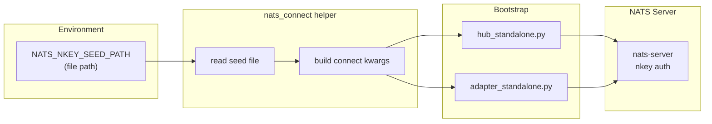

## Context

Promoted from [frame](../frames/523-nats-nkey-auth-frame.mdx). The NATS server config (`nats.conf`) requires nkey auth and TLS, but all Python `nats.connect()` call sites pass no credentials. Production runs on `nats-local.conf` (no auth) as a workaround. This issue wires the existing nkey infrastructure into the Python clients so production can switch to the hardened config.

## Goal

Every Lyra NATS client authenticates with its nkey seed when `NATS_NKEY_SEED_PATH` is set, and connects unauthenticated when it is absent (local dev).

## Users

- **Primary:** Production Lyra deployment (hub + adapters) — must authenticate against `nats.conf`.
- **Secondary:** Developers — local dev stays zero-config (no seed required).

## Expected Behavior

1. Operator runs `gen-nkeys.sh` (already done on Machine 1). Seeds exist at `/etc/nats/nkeys/{hub,llm-worker,monitor}.seed`.
2. Operator sets `NATS_NKEY_SEED_PATH` env var in each process's run script (or `.env`), pointing to the seed file path.
3. On startup, hub/adapter bootstrap reads `NATS_NKEY_SEED_PATH`. If set, reads the file contents and passes the seed string to `nats.connect(nkeys_seed_str=...)`.
4. If `NATS_NKEY_SEED_PATH` is unset, `nats.connect()` is called without nkey args (backward-compatible dev mode).
5. If `NATS_NKEY_SEED_PATH` is set but the file is unreadable/missing, the process exits with a clear error message.

## Data Model & Consumers

| Consumer | Data | When | Status |
|----------|------|------|--------|
| `hub_standalone.py` | seed string via `nkeys_seed_str` | bootstrap connect | This issue |
| `adapter_standalone.py` | seed string via `nkeys_seed_str` | bootstrap connect | This issue |
| `NatsBus` | already-connected `nc` client | after connect | No change (receives `nc`) |
| Test conftest | no seed (test nats-server has no auth) | test setup | No change |
| Future: TLS certs (#461) | `tls` / `tls_hostname` kwargs | bootstrap connect | Future |

## Breadboard

### Affordances

| ID | Element | Location |
|----|---------|----------|
| N1 | `nats_connect()` helper function | `src/lyra/nats/connect.py` (new) |
| N1a | Re-export `nats_connect` | `src/lyra/nats/__init__.py` |
| N2 | `NATS_NKEY_SEED_PATH` env var read | Inside N1 |
| N3 | Seed file read + validation (must be a file, non-empty) | Inside N1 |
| N4 | Hub bootstrap uses N1 | `hub_standalone.py` |
| N5 | Adapter bootstrap uses N1 | `adapter_standalone.py` |
| N6 | Run script env vars | `deploy/supervisor/scripts/run_hub.sh`, `run_adapter.sh` |
| N7 | Deploy docs update | `docs/DEPLOYMENT.md` |

### Wiring

| From | To | Trigger |
|------|----|---------|
| N4, N5 | N1 | `await nats_connect(url)` replaces `await nats.connect(url)` |
| N1 | N2 | On call, reads `os.environ.get("NATS_NKEY_SEED_PATH")` |
| N2 | N3 | If env var set, validates path is a file (not dir), reads contents, validates non-empty |
| N1 | nats.connect | Passes `nkeys_seed_str=seed` if seed exists, else no extra kwargs |
| N6 | N2 | Run scripts export `NATS_NKEY_SEED_PATH=/etc/nats/nkeys/hub.seed` |

## Slices

| # | Slice | Affordances | Demo |
|---|-------|-------------|------|
| 1 | Shared connect helper | N1, N1a, N2, N3 | Unit test: helper reads seed from env+file, returns connected client; without env, connects plain; malformed path → error |
| 2 | Wire into bootstrap | N4, N5 | Hub + adapter start against local nats-server test fixture with nkey auth enabled |
| 3 | Deploy config + docs | N6, N7 | Run scripts set env var; DEPLOYMENT.md updated |

## Success Criteria

- [ ] `nats_connect()` helper exists in `src/lyra/nats/connect.py` and is re-exported from `src/lyra/nats/__init__.py`
- [ ] When `NATS_NKEY_SEED_PATH` is set to a valid seed file path, `nats.connect()` is called with `nkeys_seed_str` containing the file contents
- [ ] When `NATS_NKEY_SEED_PATH` is unset, `nats.connect()` is called without nkey arguments (dev mode)
- [ ] When `NATS_NKEY_SEED_PATH` is set but the path is a directory, unreadable, or empty, the process exits with a clear error (not a cryptic nats-py traceback)
- [ ] `hub_standalone.py` uses `nats_connect()` instead of raw `nats.connect()`
- [ ] `adapter_standalone.py` uses `nats_connect()` instead of raw `nats.connect()`
- [ ] `run_hub.sh` and `run_adapter.sh` export `NATS_NKEY_SEED_PATH` (commented out by default, with instructions)
- [ ] Unit tests cover: seed present → passed, seed absent → plain connect, seed file missing → error, path is directory → error
- [ ] Existing NATS integration tests (`tests/nats/`) still pass (no auth required in test mode)

> **Out of scope:** `lyra-monitor` also has a seed (`monitor.seed`) but does not yet connect to NATS from Python. When it does, it should use the same `nats_connect()` helper.
