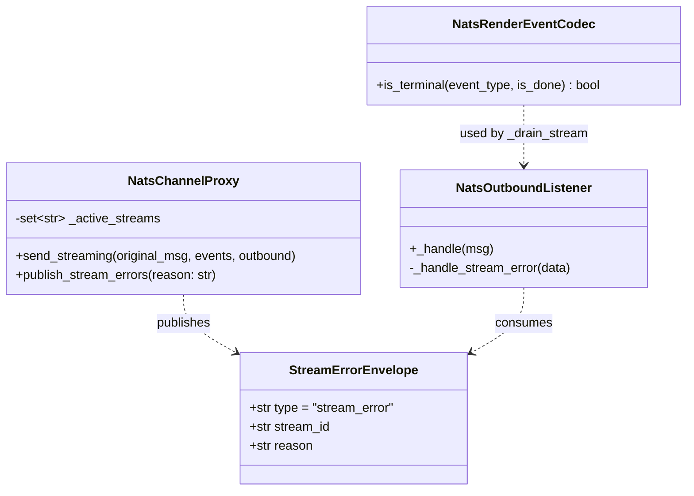
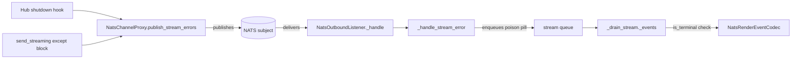

## Context

Promoted from [frame #524](../frames/524-nats-stream-error-recovery-frame.mdx).

When the hub crashes or hits an unhandled exception mid-stream, the adapter's `_drain_stream` blocks on `q.get()` for up to 120 seconds. No error feedback reaches the user, and cache/queue/task entries leak until the timeout fires.

## Goal

Provide an explicit `stream_error` NATS envelope so adapters can immediately terminate a stuck stream, clean up resources, and surface an error to the user — reducing the failure window from 120 seconds to sub-second for graceful shutdowns.

## Users

- **Adapter processes** — receive `stream_error`, break out of `_drain_stream`, clean up state.
- **End users** — see an error message instead of a 2-minute hang.

## Expected Behavior

1. Hub starts streaming via `NatsChannelProxy.send_streaming()`. The proxy records `stream_id` in an internal `_active_streams` set.
2. Streaming completes normally → proxy publishes `stream_end`, removes `stream_id` from `_active_streams`. No change from today.
3. **Exception during streaming** → proxy's existing `except` block now publishes a `stream_error` envelope before draining the iterator. Removes `stream_id` from `_active_streams`.
4. **Hub receives SIGTERM/SIGINT** → shutdown sequence calls `proxy.publish_stream_errors()` for each registered proxy. Proxies are collected into a `proxies: list[NatsChannelProxy]` built alongside the existing `dispatchers` list during bot wiring (hub_standalone.py lines 332–390). This publishes `stream_error` for every `stream_id` still in `_active_streams` (using the stream_id stored in the set), then clears the set. If `publish_stream_errors()` itself fails (e.g. NATS connection degraded), the error is logged and swallowed — the 120s timeout remains as fallback.
5. Adapter's `NatsOutboundListener._handle()` receives `stream_error` → dispatches to `_handle_stream_error()`:
   - **Queue exists** (normal case: error arrives mid-stream) → enqueues a poison-pill chunk `{"event_type": "stream_error", "done": True}` into the stream's queue.
   - **No queue exists** (race: error arrives before first chunk, or after `stream_end` already cleaned up) → removes `stream_id` from `_cache`, `_cache_ts`, `_stream_outbound` directly and logs a warning. This is harmless for the post-`stream_end` case (entries already gone).
6. `_drain_stream._events()` dequeues the poison pill → `NatsRenderEventCodec.is_terminal("stream_error", True)` returns `True` → generator breaks.
7. `send_streaming()` completes with partial content. Adapter shows whatever was accumulated plus an error indicator (platform-specific, out of scope for this issue — existing behavior handles partial streams gracefully).
8. If the hub crashes hard (kill -9, network partition) → no `stream_error` is published. The existing 120s timeout in `_drain_stream` remains as defense-in-depth. No change here.

## Data Model & Consumers

| Consumer | Fields consumed | When | Status |
|----------|----------------|------|--------|
| `NatsOutboundListener._handle` | `type`, `stream_id`, `reason` | On NATS message receipt | This issue |
| `NatsRenderEventCodec.is_terminal` | `event_type` (`"stream_error"`) | During chunk processing in `_drain_stream` | This issue |
| Hub shutdown sequence | calls `proxy.publish_stream_errors()` | SIGTERM/SIGINT | This issue |
| `send_streaming` except block | calls internal error publish | On streaming exception | This issue |

## Breadboard

### Affordances

| ID | Element | Location |
|----|---------|----------|
| U1 | `_active_streams: set[str]` | `NatsChannelProxy` |
| U2 | `publish_stream_errors(reason)` | `NatsChannelProxy` |
| U3 | `_handle_stream_error(data)` | `NatsOutboundListener` |
| U4 | `is_terminal` updated for `"stream_error"` | `NatsRenderEventCodec` |

### Handlers

| ID | Trigger | Action |
|----|---------|--------|
| N1 | `send_streaming` enters streaming loop | Add `stream_id` to `_active_streams` |
| N2 | `send_streaming` publishes `stream_end` | Remove `stream_id` from `_active_streams` |
| N3 | `send_streaming` hits exception | Publish `stream_error` envelope, remove from `_active_streams`, drain iterator |
| N4 | Hub shutdown (after task cancel, before NATS close) | Iterate `proxies: list[NatsChannelProxy]` (built alongside `dispatchers`), call `proxy.publish_stream_errors("hub_shutdown")` for each. Swallow publish failures (log + fallback to 120s timeout). |
| N5 | `_handle` receives `type == "stream_error"` | Dispatch to `_handle_stream_error` |
| N6 | `_handle_stream_error` with queue | Enqueue poison-pill `{"event_type": "stream_error", "done": True}` into existing stream queue |
| N6b | `_handle_stream_error` without queue | Remove `stream_id` from `_cache`, `_cache_ts`, `_stream_outbound` directly + log warning (covers race: error before first chunk, or after stream_end) |
| N7 | `is_terminal("stream_error", _)` | Return `True` |

### Data

| ID | Field | Type | Source |
|----|-------|------|--------|
| S1 | `stream_error.type` | `"stream_error"` literal | Published by proxy |
| S2 | `stream_error.stream_id` | `str` | From `original_msg.id` (exception path) or iterated from `_active_streams` set (shutdown path) |
| S3 | `stream_error.reason` | `str` | `"hub_shutdown"` or `"streaming_exception"` |

## Slices

| # | Slice | Scope | Demo |
|---|-------|-------|------|
| 1 | Envelope + codec | Add `stream_error` envelope to `NatsChannelProxy` (publish on exception), update `NatsRenderEventCodec.is_terminal`, add `_handle_stream_error` to `NatsOutboundListener` | Unit test: inject `stream_error` into queue → `_drain_stream` terminates immediately |
| 2 | Active stream tracking + shutdown hook | Add `_active_streams` set to proxy, wire `publish_stream_errors()` into hub shutdown sequence | Integration test: simulate SIGTERM → verify `stream_error` published for all active streams |

## Success Criteria

- [ ] `NatsChannelProxy.send_streaming()` publishes `stream_error` envelope when an exception occurs during streaming (instead of silently draining)
- [ ] `NatsChannelProxy` tracks active `stream_id`s and exposes `publish_stream_errors(reason)` that publishes `stream_error` for each, then clears the set
- [ ] Hub shutdown sequence (`hub_standalone.py`) calls `publish_stream_errors()` for every registered proxy before closing the NATS connection
- [ ] `NatsOutboundListener._handle()` routes `type == "stream_error"` to `_handle_stream_error()`
- [ ] `_handle_stream_error()` enqueues a poison-pill chunk that causes `_drain_stream` to terminate immediately
- [ ] `NatsRenderEventCodec.is_terminal("stream_error", ...)` returns `True`
- [ ] `_handle_stream_error()` cleans up `_cache`, `_cache_ts`, `_stream_outbound` when no queue exists (race: error before first chunk or after stream_end)
- [ ] `publish_stream_errors()` swallows publish failures with a warning log (NATS degraded during shutdown)
- [ ] Hub shutdown collects proxies into a `proxies` list during bot wiring and iterates them before `nc.close()`
- [ ] Existing 120s timeout in `_drain_stream` is preserved unchanged (defense-in-depth for hard crashes)
- [ ] Existing tests pass — no regression in normal streaming flow
