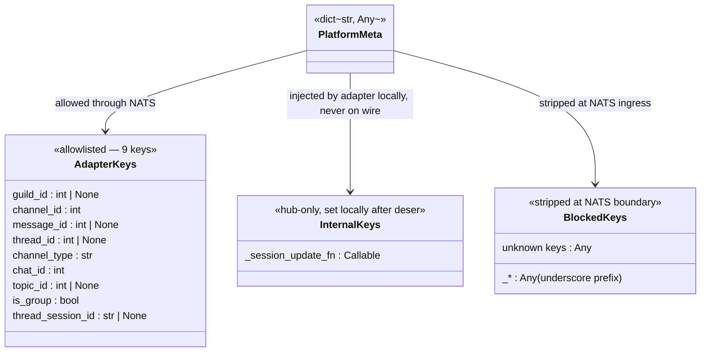
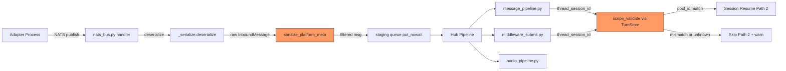

## Context

Promoted from [frame #525](../frames/525-sanitize-platform-meta-nats-frame.mdx).

In NATS three-process mode, `platform_meta` (a `dict[str, Any]` on `InboundMessage`)
crosses a trust boundary between adapter and hub processes. The hub deserializes it
verbatim with no sanitization, enabling session hijacking via injected `thread_session_id`.

## Goal

Prevent untrusted `platform_meta` keys from influencing hub routing decisions by
sanitizing the dict at the NATS ingress boundary and validating security-sensitive
values before use.

## Users

- **Primary:** All Lyra users — session integrity depends on this fix.
- **Secondary:** Operators — reduces blast radius of a compromised adapter process.

## Expected Behavior

1. When the hub deserializes a NATS inbound message (`InboundMessage` **or** `InboundAudio`),
   `platform_meta` is filtered through an **allowlist** of known safe keys. Unknown keys
   are dropped (logged at DEBUG). Both message types cross the NATS boundary via separate
   `NatsBus` instances and share the same `deserialize()` → `put_nowait()` path.
2. Keys with a leading underscore (`_session_update_fn`, etc.) are **always stripped** at
   the NATS boundary — they are internal-only and must never arrive from the wire.
3. `thread_session_id`, when present after sanitization, is **scope-validated**: the hub
   looks up the session's `pool_id` from `TurnStore.pool_sessions` and compares it to the
   inbound message's `pool_id`. Mismatch → skip Path 2, log a warning. Lookup failure
   (session unknown or store unavailable) → treat as mismatch, skip Path 2.
4. Legitimate adapter keys (`channel_id`, `guild_id`, `chat_id`, etc.) continue to flow
   through unchanged.

## Data Model & Consumers

### platform_meta Key Classification

The complete allowlist is derived from all adapter `platform_meta` assignments in the
codebase. There are exactly **9 keys** across all adapters:

| # | Key | Set by | Type |
|---|-----|--------|------|
| 1 | `guild_id` | `discord_normalize.py:96` | `int \| None` |
| 2 | `channel_id` | `discord_normalize.py:97` | `int` |
| 3 | `message_id` | `discord_normalize.py:99`, `telegram_normalize.py:114` | `int \| None` |
| 4 | `thread_id` | `discord_normalize.py:100` | `int \| None` |
| 5 | `channel_type` | `discord_normalize.py:101` | `str` |
| 6 | `chat_id` | `telegram_normalize.py:112` | `int` |
| 7 | `topic_id` | `telegram_normalize.py:113` | `int \| None` |
| 8 | `is_group` | `telegram_normalize.py:115` | `bool` |
| 9 | `thread_session_id` | `discord_inbound.py:197` | `str \| None` |

Note: `reply_to_message_id` lives on `RoutingContext`, NOT in `platform_meta`.
Note: `_session_update_fn` is a callable set by `discord_inbound.py:208` — already
stripped by `_serialize.py:_strip_callables()` on serialization, and additionally
blocked by the underscore-prefix rule on deserialization.

### Consumer Flow

### Scope Validation Mechanism

`thread_session_id` scope validation uses the existing `TurnStore.pool_sessions` table:

1. Look up `SELECT pool_id FROM pool_sessions WHERE session_id = ?` using the
   `thread_session_id` value.
2. Derive the inbound message's expected `pool_id` from its `RoutingKey.to_pool_id()`.
3. Compare: if `session.pool_id != msg_pool_id` → mismatch → skip Path 2.
4. Lookup returns no row (unknown session) → treat as mismatch → skip Path 2.
5. `TurnStore` unavailable (`hub._turn_store is None`) → skip Path 2 (safe default).

Trust assumption: `scope_id` is user-scoped (confirmed at `message_pipeline.py:352` —
"scope_id is now user-scoped in shared spaces, so each user has their own pool by
construction"). Scope match implies user match; separate `user_id` validation is
not needed.

### Consumer Summary

| Consumer | Keys Read | When | Status |
|----------|-----------|------|--------|
| `middleware_submit.py` | `thread_session_id` | Path 2 session resume | **This issue** — add scope validation |
| `message_pipeline.py` | `thread_session_id` | Path 2 session resume | **This issue** — add scope validation |
| `message_pipeline.py` | `_session_update_fn` | Pool observer registration | No change (local-only, never on wire) |
| `middleware_submit.py` | `_session_update_fn` | Pool observer registration | No change (local-only, never on wire) |
| `audio_pipeline.py` | `message_id` | Strip when reply=False | No change (allowlisted key) |
| `discord_outbound.py` | `channel_id`, `thread_id`, `message_id` | Outbound dispatch | No change (allowlisted keys) |
| `telegram_formatting.py` | `chat_id`, `topic_id`, `message_id` | Outbound formatting | No change (allowlisted keys) |

## Breadboard

### Affordances

| ID | Element | Location |
|----|---------|----------|
| S1 | `sanitize_platform_meta(meta)` | New function in `nats/_sanitize.py` |
| S2 | `PLATFORM_META_ALLOWLIST` | Constant `frozenset` in `nats/_sanitize.py` |
| S3 | Scope validation in Path 2 resume | Both `middleware_submit.py:_resolve_context()` AND `message_pipeline.py:_resolve_context()` |
| S4 | `TurnStore.get_session_pool_id(session_id)` | New method on `stores/turn_store.py` (or inline query) |

### Wiring

| Trigger | Handler | Data | Call site |
|---------|---------|------|-----------|
| NATS message deserialized | S1 filters `platform_meta` against S2 | Strips unknown + underscore keys | `nats_bus.py` handler, between `deserialize()` and `staging.put_nowait()` |
| Path 2 resume attempted (S3) | Look up `thread_session_id` pool_id via S4 | Compare with message's pool_id from `RoutingKey.to_pool_id()` | `middleware_submit.py:164` + `message_pipeline.py:323` |
| Scope mismatch or unknown session | Skip Path 2, log warning | `thread_session_id` value + expected vs actual pool_id | Same two call sites |

## Slices

| # | Slice | Deliverable | Demo |
|---|-------|-------------|------|
| 1 | Allowlist sanitization at NATS boundary | `nats/_sanitize.py` with `sanitize_platform_meta()` + `PLATFORM_META_ALLOWLIST` (9 keys). Integrated into `nats_bus.py` handler between `deserialize()` and `put_nowait()` — covers both `InboundMessage` and `InboundAudio` NatsBus instances. Strips unknown keys + underscore-prefixed keys. | Test: inject unknown key → dropped. Inject `_foo` → dropped. All 9 known keys → preserved. InboundAudio also sanitized. |
| 2 | Scope-validate `thread_session_id` | Add pool_id lookup to both `middleware_submit.py:_resolve_context()` AND `message_pipeline.py:_resolve_context()`. Both files contain independent Path 2 implementations that must be patched. Uses `TurnStore.pool_sessions` for `session_id → pool_id` lookup. | Test: inject cross-scope `thread_session_id` → Path 2 skipped with warning. Same-scope → resumes normally. Unknown session → skipped. |

## Success Criteria

- [ ] `sanitize_platform_meta()` exists in `nats/_sanitize.py` and is integrated at the `nats_bus.py` handler call site (between `deserialize()` and `put_nowait()`)
- [ ] Sanitization applies to both `InboundMessage` and `InboundAudio` NatsBus instances
- [ ] NATS-deserialized inbound messages only contain allowlisted `platform_meta` keys after sanitization
- [ ] Unknown keys not in the 9-key allowlist are stripped from `platform_meta`
- [ ] Underscore-prefixed keys (`_*`) are always stripped at NATS boundary regardless of allowlist
- [ ] All 9 legitimate adapter keys pass through sanitization unchanged: `guild_id`, `channel_id`, `message_id`, `thread_id`, `channel_type`, `chat_id`, `topic_id`, `is_group`, `thread_session_id`
- [ ] `thread_session_id` with mismatched `pool_id` does not trigger Path 2 session resume
- [ ] `thread_session_id` with matching `pool_id` continues to trigger Path 2 resume normally
- [ ] Unknown `thread_session_id` (no row in `pool_sessions`) does not trigger Path 2 resume
- [ ] Stripped keys are logged at DEBUG level (key names only, not values)
- [ ] Scope validation is applied in both `middleware_submit.py` and `message_pipeline.py` Path 2 blocks
- [ ] **Regression guard:** Existing NATS serialization round-trip tests pass without modification
