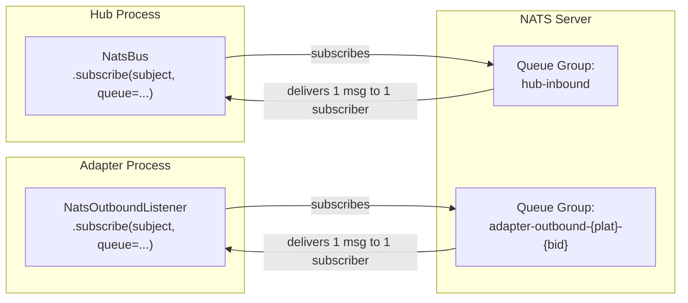

## Context

During rolling deploys or supervisor restarts, two instances of the same process briefly coexist. Without NATS queue groups, both instances receive every message on shared subjects, causing duplicate delivery (double sends to users). The TTS/STT standalone adapters already use queue groups correctly — the hub-side `NatsBus` and adapter-side `NatsOutboundListener` do not.

## Goal

Add NATS queue groups to all subscription sites that lack them, so only one instance per role receives each message during rolling restarts.

## Users

- **Primary:** End users (Telegram/Discord) — no more duplicate bot messages during deploys
- **Secondary:** Operators — deploys become safe without manual coordination

## Expected Behavior

1. Hub process subscribes to `lyra.inbound.{platform}.{bot_id}` with queue group `hub-inbound` (via its `NatsBus` instance for text)
2. Hub process subscribes to `lyra.inbound.audio.{platform}.{bot_id}` with queue group `hub-inbound-audio` (via its separate `NatsBus` instance for audio)
3. Each adapter subscribes to `lyra.outbound.{platform}.{bot_id}` with queue group `adapter-outbound-{platform}-{bot_id}`
4. During a rolling restart, the old and new process instances share the queue group — NATS delivers each message to exactly one of them
5. In single-instance mode (normal operation), queue group of 1 behaves identically to no group — no observable change
6. Unified mode (`unified.py`) works identically — same queue groups, single-member groups

**Note:** Adapter-side `NatsBus` instances (`adapter_standalone.py:93-108`) also call `start()` and subscribe to inbound subjects, but only use `put()` to publish — the subscriptions are never consumed. These are left unchanged (no queue group added) to avoid accidentally sharing a group with the hub and causing message loss. Cleaning up the unnecessary adapter-side subscriptions is a separate concern.

## Data Model & Consumers



### Consumer Summary

| Consumer | Subject | Queue Group | Status |
|----------|---------|-------------|--------|
| `NatsBus` (text inbound) | `lyra.inbound.{plat}.{bid}` | `hub-inbound` | this issue |
| `NatsBus` (audio inbound) | `lyra.inbound.audio.{plat}.{bid}` | `hub-inbound-audio` | this issue |
| `NatsOutboundListener` | `lyra.outbound.{plat}.{bid}` | `adapter-outbound-{plat}-{bid}` | this issue |
| `NatsBus` (adapter-side, text) | `lyra.inbound.{plat}.{bid}` | none (publish-only, sub unused) | out of scope |
| `NatsBus` (adapter-side, audio) | `lyra.inbound.audio.{plat}.{bid}` | none (publish-only, sub unused) | out of scope |
| STT adapter | `lyra.voice.stt.request` | `stt-workers` | already done |
| TTS adapter | `lyra.voice.tts.request` | `tts-workers` | already done |

## Breadboard

### Affordances

| ID | Element | Location |
|----|---------|----------|
| N1 | `NatsBus.__init__` accepts optional `queue_group` param | `nats_bus.py` |
| N2 | `NatsBus._make_handler` passes `queue=` to `nc.subscribe()` | `nats_bus.py:249` |
| N3 | `NatsOutboundListener.__init__` accepts optional `queue_group` param | `nats_outbound_listener.py` |
| N4 | `NatsOutboundListener.start` passes `queue=` to `nc.subscribe()` | `nats_outbound_listener.py:72` |
| N5 | Hub bootstrap passes `queue_group="hub-inbound"` to NatsBus | `hub_standalone.py`, `unified.py` |
| N6 | Hub bootstrap passes `queue_group="hub-inbound-audio"` to audio NatsBus | `hub_standalone.py`, `unified.py` |
| N7 | Adapter bootstrap passes queue group to NatsOutboundListener | `adapter_standalone.py` |

### Wiring

```
N5 → N1 → N2 (hub text inbound subscription)
N6 → N1 → N2 (hub audio inbound subscription)
N7 → N3 → N4 (adapter outbound subscription)
```

## Slices

| # | Slice | Affordances | Demo |
|---|-------|-------------|------|
| 1 | NatsBus queue group support | N1, N2, N5, N6 | Hub subscribes with queue group visible in NATS monitoring |
| 2 | NatsOutboundListener queue group support | N3, N4, N7 | Adapter subscribes with queue group visible in NATS monitoring |
| 3 | Tests | — | Unit tests verify `queue=` param passed to `nc.subscribe()` |

## Success Criteria

- [ ] `NatsBus._make_handler` calls `nc.subscribe(subject, queue=..., cb=handler)` with a non-empty queue group
- [ ] `NatsOutboundListener.start` calls `nc.subscribe(subject, queue=..., cb=self._handle)` with a non-empty queue group
- [ ] Queue group names are deterministic (same across restarts, derived from role + subject components)
- [ ] Single-instance mode is unaffected (queue group of 1 == no group functionally)
- [ ] All hub bootstrap sites (`hub_standalone.py`, `unified.py`) pass queue group to NatsBus
- [ ] All adapter bootstrap sites (`adapter_standalone.py`) pass queue group to NatsOutboundListener
- [ ] Existing tests continue to pass
- [ ] New unit tests verify queue group is passed to `nc.subscribe()`
