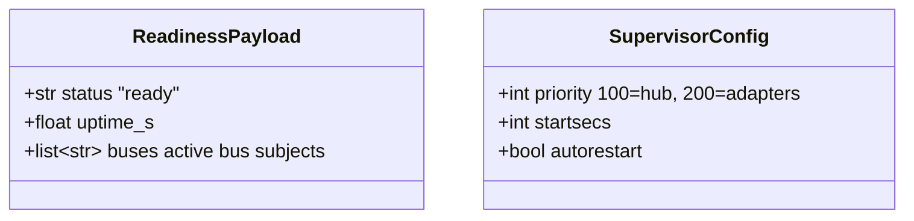

## Context

Supervisor starts `lyra_hub`, `lyra_telegram`, and `lyra_discord` concurrently — no `priority` directives, no readiness handshake. Core NATS is at-most-once: messages published before the other side subscribes are silently dropped.

Two race windows cause message loss during startup and restarts:
1. **Adapter → Hub** (inbound): adapter publishes to `lyra.inbound.*` before hub's `NatsBus` subscribes.
2. **Hub → Adapter** (outbound): hub publishes to `lyra.outbound.*` before adapter's `NatsOutboundListener` subscribes.

Window 2 is partially mitigated — adapters already subscribe to outbound *before* starting Telegram/Discord polling. But window 1 has no mitigation today.

## Goal

Eliminate the startup race so that no user messages are silently dropped when hub and adapters start (or restart) concurrently.

## Users

- **Primary:** End users — messages sent during the startup window currently vanish.
- **Secondary:** Operators — gain visibility into readiness state via health endpoint and logs.

## Expected Behavior

**Startup sequence (three-process mode):**

1. Supervisor starts `lyra_hub` first (priority 100), adapters second (priority 200).
2. Hub connects to NATS, starts inbound buses and dispatchers (`hub_standalone.py` after line 424), then immediately subscribes to `lyra.system.ready` — replying to any request with a readiness payload. This must happen *before* `asyncio.create_task()` calls that consume from buses.
3. Hub logs `"Hub ready — accepting readiness probes on lyra.system.ready"`.
4. Adapter connects to NATS, wires all `NatsOutboundListener` instances and calls `adapter.astart()` (outbound subscriptions live), then enters a readiness wait loop: sends NATS request to `lyra.system.ready` every 500ms (max 30s timeout). The probe runs *after* outbound is wired but *before* poll tasks are constructed.
5. On receiving a reply, adapter logs `"Hub readiness confirmed — starting polling"` and starts Telegram/Discord polling within one probe interval (≤ 500ms).
6. If timeout expires (hub unreachable after 30s), adapter logs a warning and starts anyway (graceful degradation — don't hard-block forever).

**Restart scenario (adapter restarts while hub is running):**
- Adapter reconnects, sends readiness probe, gets immediate reply, starts polling. No messages lost.

**Restart scenario (hub restarts while adapters are running):**
- Hub is down briefly. Adapters are already polling — inbound messages published to `lyra.inbound.*` are dropped (no subscriber). This remains a core NATS limitation — JetStream (#460) will fix it.
- When hub comes back and subscribes, normal flow resumes.

**Unified mode (`lyra start`):**
- Sequential in-process wiring — no race. Readiness probe is skipped (same process).

## Data Model & Consumers

| Consumer | Data | When | Status |
|----------|------|------|--------|
| Adapter bootstrap | `ReadinessPayload` | Before starting polling | This issue |
| Health endpoint | Bus subscription count | On `/health/detail` request | This issue |
| Monitoring/alerting | Readiness log lines | Startup | This issue (logs only) |
| JetStream migration | Durable subscriptions | Future | #460 (out of scope) |

## Breadboard

### Affordances

| ID | Element | Location |
|----|---------|----------|
| U1 | Supervisor `priority` field | `deploy/supervisor/conf.d/*.conf` |
| N1 | Readiness responder (NATS subscription on `lyra.system.ready`) | `src/lyra/nats/readiness.py` (new) |
| N2 | Readiness probe (NATS request + retry loop) | `src/lyra/nats/readiness.py` |
| S1 | Hub calls `start_readiness_responder(nc)` after buses start | `hub_standalone.py` |
| S2 | Adapter calls `await wait_for_hub(nc)` before polling | `adapter_standalone.py` |
| N3 | `NatsBus.subscription_count` property | `src/lyra/nats/nats_bus.py` |
| S3 | Health endpoint reflects bus readiness (uses N3) | `health.py` |

### Wiring

| From | To | Trigger |
|------|----|---------|
| U1 (priority) | Supervisor | Process start order |
| S1 → N1 | NATS subject `lyra.system.ready` | Hub buses started |
| S2 → N2 | NATS request to `lyra.system.ready` | Adapter bootstrap, before polling |
| N1 → N2 | NATS reply with `ReadinessPayload` | Probe received |
| S3 | `/health/detail` | HTTP request |

## Slices

| # | Slice | Affordances | Demo |
|---|-------|-------------|------|
| 1 | Supervisor priority ordering | U1 | `supervisorctl start all` — hub starts before adapters (visible in logs) |
| 2 | NATS readiness probe | N1, N2, N3, S1, S2, S3 | Adapter logs "Hub readiness confirmed" before "Starting polling". Health shows bus count. |

Slice 1 is independently valuable (reduces race window) but not sufficient alone (priority only controls start order, not readiness). Slice 2 is the core fix.

## Success Criteria

- [ ] Hub supervisor config has `priority=100` and `startsecs=10`; telegram and discord have `priority=200`
- [ ] Hub subscribes to `lyra.system.ready` after buses+dispatchers start, before `asyncio.create_task()` calls
- [ ] Adapter calls `wait_for_hub(nc)` after all `astart()` calls, before poll task construction
- [ ] Adapter starts polling within one probe interval (≤ 500ms) of hub replying
- [ ] Adapter starts anyway after 30s timeout with a WARNING log (graceful degradation)
- [ ] `NatsBus` exposes a public `subscription_count` property (returns `len(self._subscriptions)`)
- [ ] `/health/detail` includes a `buses` field showing active subscription count (uses `subscription_count`)
- [ ] Unified mode (`lyra start`) skips the readiness probe (no self-probe)
- [ ] Readiness responder does not unsubscribe on bus teardown (known limitation — deferred to #460)
- [ ] Existing tests pass
- [ ] Test: readiness probe receives reply and adapter proceeds
- [ ] Test: readiness probe times out and adapter proceeds with WARNING
- [ ] Test: concurrent hub+adapter startup (asyncio Event injection)
