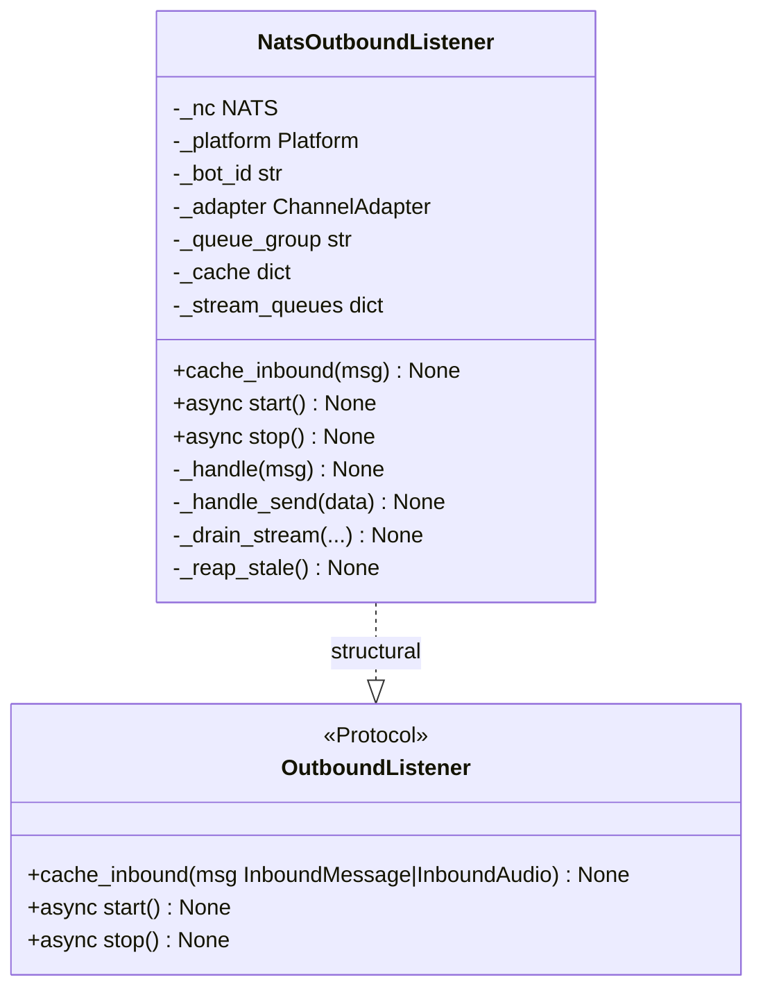
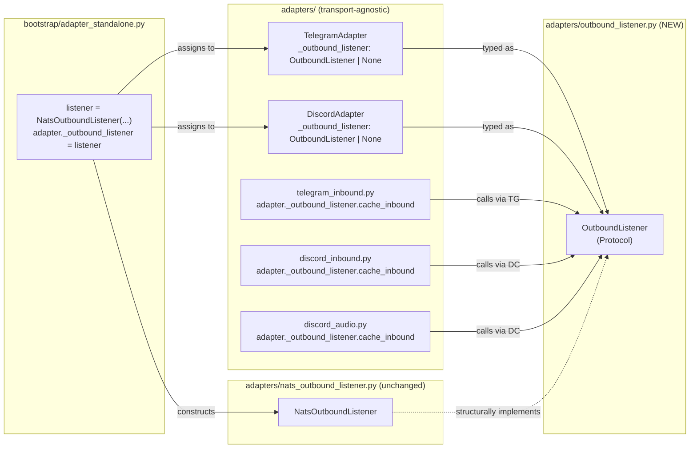

## Context

`TelegramAdapter` and `DiscordAdapter` declare their cached listener as a
concrete `NatsOutboundListener` type (`telegram.py:19,157`, `discord.py:14,124`),
and the inbound helpers reach into `adapter._outbound_listener.cache_inbound(...)`
(`telegram_inbound.py:45`, `discord_inbound.py:253`, `discord_audio.py:221`)
without a type boundary. Bootstrap wires the concrete instance in
`adapter_standalone.py:121,256`. The hub side already talks to an abstract
`Bus`, but the adapter side remains type-coupled to NATS — ADR-040 explicitly
calls out the "duck-typed `_outbound_listener` attribute" as a known tension.

## Goal

Introduce a narrow structural `OutboundListener` protocol in `adapters/` so
adapter classes and inbound helpers stop depending on the concrete
`NatsOutboundListener` type, while keeping runtime behaviour and wiring
identical.

## Users

- **Primary:** Lyra maintainers touching the adapter transport layer — they
  can now test with a fake listener without importing anything NATS-specific.
- **Secondary:** Future transport contributors (in-process dev mode, alternate
  bus) — pluggable without changing adapter source.

## Expected Behavior

1. A new module `src/lyra/adapters/outbound_listener.py` defines
   `OutboundListener`, a `typing.Protocol` class (not `@runtime_checkable`,
   matching `ChannelAdapter` in `core/hub/hub_protocol.py`) with the three
   methods adapter code actually calls: `cache_inbound`, `start`, `stop`.
2. `TelegramAdapter._outbound_listener` and `DiscordAdapter._outbound_listener`
   are annotated as `OutboundListener | None` instead of
   `"NatsOutboundListener | None"`. The `TYPE_CHECKING` imports are updated
   accordingly.
3. `NatsOutboundListener` is **not modified** — it already matches the
   protocol structurally (it has the three methods with the expected
   signatures).
4. `adapter_standalone.py` is **not modified**. Bootstrap legitimately knows
   about the concrete NATS implementation; the assignment
   `adapter._outbound_listener = listener` is accepted by the type checker
   because `NatsOutboundListener` satisfies `OutboundListener` structurally.
5. Inbound helpers (`telegram_inbound.py`, `discord_inbound.py`,
   `discord_audio.py`) are **not modified**. They access
   `adapter._outbound_listener` via the adapter instance, so they inherit
   the new protocol type through the adapter attribute annotation.
6. `tests/bootstrap/test_bootstrap_wiring.py` is **not modified** — it uses
   `MagicMock()` which duck-types regardless.
7. `tests/adapters/test_nats_outbound_listener.py` is **not modified** — it
   tests the concrete `NatsOutboundListener` directly.
8. A small new test file `tests/adapters/test_outbound_listener_protocol.py`
   statically asserts that `NatsOutboundListener` satisfies `OutboundListener`
   (via a typed variable assignment under `TYPE_CHECKING`, so the check runs
   at type-check time and the test file also has one runtime assertion that
   the methods exist).
9. `mypy`/`pyright` and `ruff` pass on all touched files. Full test suite
   passes unchanged.

## Data Model & Consumers

### Protocol shape



### Consumer map



### Consumer Summary

| Consumer | Touch | Action | Status |
|----------|-------|--------|--------|
| `telegram.py:19` | `TYPE_CHECKING` import | swap `NatsOutboundListener` → `OutboundListener` | this issue |
| `telegram.py:157` | attribute annotation | `"OutboundListener \| None"` | this issue |
| `discord.py:14` | `TYPE_CHECKING` import | swap `NatsOutboundListener` → `OutboundListener` | this issue |
| `discord.py:124` | attribute annotation | `"OutboundListener \| None"` | this issue |
| `telegram_inbound.py` | uses `adapter._outbound_listener.cache_inbound` | unchanged — inherits type via adapter | this issue (no edit) |
| `discord_inbound.py` | uses `adapter._outbound_listener.cache_inbound` | unchanged — inherits type via adapter | this issue (no edit) |
| `discord_audio.py` | uses `adapter._outbound_listener.cache_inbound` | unchanged — inherits type via adapter | this issue (no edit) |
| `adapter_standalone.py` | constructs `NatsOutboundListener` | unchanged — bootstrap may know concrete type | this issue (no edit) |
| `nats_outbound_listener.py` | concrete implementation | unchanged — already matches protocol shape | this issue (no edit) |
| `test_bootstrap_wiring.py` | `MagicMock` with `_outbound_listener = None` | unchanged — duck-types regardless | this issue (no edit) |
| `test_nats_outbound_listener.py` | tests concrete listener | unchanged | this issue (no edit) |
| Future in-process listener | would implement `OutboundListener` structurally | — | future |

## Breadboard

### Affordances

| ID | Element | Location |
|----|---------|----------|
| P1 | `OutboundListener` Protocol class | `src/lyra/adapters/outbound_listener.py` (NEW) |
| P2 | Protocol method: `cache_inbound(msg: InboundMessage \| InboundAudio) -> None` | `outbound_listener.py` |
| P3 | Protocol method: `async start() -> None` | `outbound_listener.py` |
| P4 | Protocol method: `async stop() -> None` | `outbound_listener.py` |
| T1 | `TelegramAdapter._outbound_listener` annotated as `OutboundListener \| None` | `telegram.py:157` |
| T2 | `TelegramAdapter` `TYPE_CHECKING` import swapped | `telegram.py:19` |
| D1 | `DiscordAdapter._outbound_listener` annotated as `OutboundListener \| None` | `discord.py:124` |
| D2 | `DiscordAdapter` `TYPE_CHECKING` import swapped | `discord.py:14` |
| C1 | Conformance test: `NatsOutboundListener` ⊢ `OutboundListener` | `tests/adapters/test_outbound_listener_protocol.py` (NEW) |

### Wiring

```
P1 → (P2, P3, P4)                           (protocol defines surface)
T2 → T1                                      (Telegram imports the protocol and uses it)
D2 → D1                                      (Discord imports the protocol and uses it)
P1 ⇐ NatsOutboundListener                    (structural implementation, no code change)
C1 → P1, NatsOutboundListener                (conformance check)
```

## Slices

| # | Slice | Affordances | Demo |
|---|-------|-------------|------|
| 1 | Define protocol | P1, P2, P3, P4 | `python -c "from lyra.adapters.outbound_listener import OutboundListener; print(OutboundListener)"` |
| 2 | Rewire adapter type hints | T1, T2, D1, D2 | `mypy src/lyra/adapters/telegram.py src/lyra/adapters/discord.py` passes; no more `NatsOutboundListener` import in those two files |
| 3 | Conformance test | C1 | `pytest tests/adapters/test_outbound_listener_protocol.py -q` passes |

Slice 1 is a pure addition. Slice 2 depends on Slice 1. Slice 3 depends on both. Each slice leaves the tree in a buildable state.

## Success Criteria

- [ ] `src/lyra/adapters/outbound_listener.py` exists and defines a class `OutboundListener` that inherits from `typing.Protocol`
- [ ] `OutboundListener`'s public method surface is exactly: `cache_inbound(msg: InboundMessage | InboundAudio) -> None`, `async start() -> None`, `async stop() -> None`. No other public members (dunder methods and private underscore attributes are allowed; additional public methods are a failure)
- [ ] The `cache_inbound` parameter type annotation in the protocol matches the annotation on `NatsOutboundListener.cache_inbound` (both accept `InboundMessage | InboundAudio`)
- [ ] `OutboundListener` is **not** decorated with `@runtime_checkable` (matches `ChannelAdapter` convention)
- [ ] `src/lyra/adapters/telegram.py` no longer imports `NatsOutboundListener` — the `TYPE_CHECKING` import references `OutboundListener` instead
- [ ] `src/lyra/adapters/discord.py` no longer imports `NatsOutboundListener` — the `TYPE_CHECKING` import references `OutboundListener` instead
- [ ] `TelegramAdapter._outbound_listener` is annotated as `"OutboundListener | None"`
- [ ] `DiscordAdapter._outbound_listener` is annotated as `"OutboundListener | None"`
- [ ] `NatsOutboundListener` is byte-identical to its pre-refactor state (no code changes)
- [ ] `adapter_standalone.py` is byte-identical to its pre-refactor state (no code changes)
- [ ] `telegram_inbound.py`, `discord_inbound.py`, `discord_audio.py` are byte-identical to their pre-refactor state
- [ ] `tests/adapters/test_outbound_listener_protocol.py` exists and asserts that `NatsOutboundListener` satisfies `OutboundListener` (static and runtime)
- [ ] `pytest tests/adapters/ tests/bootstrap/ -q` passes
- [ ] Full test suite `pytest -q` passes
- [ ] `ruff check src/lyra/adapters/` passes
- [ ] Type check on `src/lyra/adapters/telegram.py` and `src/lyra/adapters/discord.py` passes without errors about `_outbound_listener`
