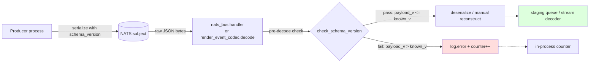

## Context

Promoted from [`artifacts/frames/530-nats-message-versioning-frame.mdx`](../frames/530-nats-message-versioning-frame.mdx). Analysis was skipped per F-lite flow — the frame captured enough detail to move directly to spec.

**Current state (verified):**
- NATS wire format = UTF-8 JSON produced by `_serialize.py`, which recursively encodes dataclasses.
- Envelope dataclasses: `InboundMessage`, `InboundAudio`, `OutboundMessage` (`src/lyra/core/message.py`); `TextRenderEvent`, `ToolSummaryRenderEvent` (`src/lyra/core/render_events.py`).
- `_decode_dataclass` (`_serialize.py:266`) silently falls back to dataclass defaults for missing fields → additive changes already degrade gracefully.
- Decode failures are already drop-and-log in `nats_bus.py:242` (`log.exception`, queue never stalls).
- `render_event_codec.py:66-79` has a **manual** decode path for `ToolSummaryRenderEvent` using `payload.get(...)` — this bypasses `deserialize()` and must be handled explicitly.
- **No metrics infrastructure exists** in Lyra — only logging. (`pipeline_events.py:5` notes metrics as "future".) This spec introduces an in-process counter only.

## Goal

When a NATS receiver gets a payload with a `schema_version` **higher** than what it was compiled against, it drops the message, logs an ERROR identifying the mismatch, and increments an in-process counter — instead of silently misinterpreting fields.

## Users

- **Primary:** Lyra maintainers evolving the wire format. A breaking schema change becomes a single-line bump + a coordinated deploy, with observable failure if the deploy is mis-sequenced.
- **Secondary:** On-call / operators reading logs — a version mismatch surfaces as an explicit ERROR with `(platform, bot_id, envelope_type, payload_version, receiver_version)` instead of "messages disappeared".
- **Secondary:** Future contributors — the `SCHEMA_VERSION_*` constants become the authoritative "current wire contract" per envelope type.

## Expected Behavior

### Happy path (same version)
Producer serializes `InboundMessage(schema_version=1, ...)` → JSON includes `"schema_version": 1`. Receiver decodes, sees 1 ≤ its own `SCHEMA_VERSION_INBOUND_MESSAGE = 1`, accepts the message, forwards to the staging queue. No change in throughput.

### Backwards read (legacy payload, no version field at all)
A payload from before this change has **no** `schema_version` field. The helper defaults it to `1` via `payload.get("schema_version", 1)`. The version check sees 1 ≤ 1, accepts. Legacy NATS messages in flight during the rollout are never dropped.

### Forward read — receiver newer, producer older (receiver was upgraded first)
Producer at v1, receiver at v2. Receiver sees 1 ≤ 2, accepts — additive schema changes already degrade, so v2 fields just take their defaults. This is the "rolling deploy where the newest process reads old traffic" case and it continues to work.

### Mismatch — receiver older, producer newer (producer was upgraded first, or a stray v2 message reaches a rolled-back v1 receiver)
Producer at v2, receiver at v1. Receiver sees 2 > 1:
1. Message **dropped** (never reaches staging queue / never dispatched).
2. `log.error("NATS schema version mismatch — dropping message: envelope=%s payload_version=%d receiver_version=%d subject=%s", ...)` emitted exactly once per message.
3. In-process counter `bus._version_mismatch_drops` (or codec equivalent) incremented.
4. No exception propagates — the NATS subscription keeps running.

### ToolSummaryRenderEvent landmine
The manual decode path in `render_event_codec.py:66-79` does NOT go through `_decode_dataclass`. The version check must run **before** the manual reconstruction, using the same helper as the `deserialize()` path. If the check fails, `decode()` returns `None` (already the "unknown/skip" sentinel for callers) and logs + counts the drop.

## Data Model & Consumers

### Envelopes getting a `schema_version` field (plus their module-level constant)

| Envelope | Module | Constant |
|---|---|---|
| `InboundMessage` (frozen) | `core/message.py` | `SCHEMA_VERSION_INBOUND_MESSAGE = 1` |
| `InboundAudio` (frozen) | `core/message.py` | `SCHEMA_VERSION_INBOUND_AUDIO = 1` |
| `OutboundMessage` (mutable) | `core/message.py` | `SCHEMA_VERSION_OUTBOUND_MESSAGE = 1` |
| `TextRenderEvent` (frozen) | `core/render_events.py` | `SCHEMA_VERSION_TEXT_RENDER_EVENT = 1` |
| `ToolSummaryRenderEvent` (frozen) | `core/render_events.py` | `SCHEMA_VERSION_TOOL_SUMMARY_RENDER_EVENT = 1` |

### Consumer map



### Consumer summary

| Consumer | Fields consumed | When |
|---|---|---|
| `NatsBus._make_handler` inner `handler()` | `InboundMessage` / `InboundAudio` | on every received NATS message |
| `NatsRenderEventCodec.decode()` — text branch | `TextRenderEvent` | per render-event chunk |
| `NatsRenderEventCodec.decode()` — tool_summary branch | `ToolSummaryRenderEvent` (manual extraction) | per render-event chunk |
| `nats_tts_client` / `nats_stt_client` | voiceCLI-owned payloads | **out of scope** — voiceCLI boundary |

All three in-scope consumers get the pre-decode version check in this issue. Serialized payloads at rest (dumps, replays) also benefit: `schema_version` is visible inline in the JSON.

## Breadboard

### Affordances → Handlers → Data

| ID | Affordance | Handler | Data |
|---|---|---|---|
| N1 | `schema_version: int = 1` field on each envelope dataclass | — (dataclass field) | Serialized into JSON via existing `_encode` path |
| N2 | `SCHEMA_VERSION_*` module-level constants | — (module consts) | `core/message.py`, `core/render_events.py` |
| N3 | `check_schema_version(payload, *, envelope_name, expected, subject, counter) -> bool` helper — **counter is caller-owned** (dict passed in, mutated on drop) | `nats/_version_check.py` (new) | Returns True on accept, False on drop; logs and increments `counter[envelope_name]` on drop |
| N4 | Pre-decode check in `NatsBus` handler | `nats_bus.py:_make_handler.handler()` | Call `check_schema_version` with `json.loads(msg.data)` + `self._version_mismatch_drops` before `deserialize_dict` |
| N5 | Pre-decode check in `NatsRenderEventCodec.decode` | `render_event_codec.py` | Same helper, both text and tool_summary branches. **Counter dict passed in by the caller** (e.g. `NatsOutboundListener` / `NatsChannelProxy`) — not a class attribute on the codec (avoids test-isolation bugs from static state). |
| N6 | In-process mismatch counter | `NatsBus._version_mismatch_drops: dict[str, int]` (instance attr). For the codec path, the counter lives on the **caller** that invokes `decode()` (listener/proxy), passed into each call. | Key = envelope_name; value = count |
| N7 | Introspection accessor | `NatsBus.version_mismatch_count(envelope_name: str) -> int`. Codec callers expose their own if needed. | Reads from N6 |
| N8 | Legacy-compatibility decode | existing `_decode_dataclass` defaults path | No change — defaults handle absent field transparently |

### Wiring notes

- **Single helper, two call sites.** `check_schema_version` lives in a new lean module `src/lyra/nats/_version_check.py` so both `nats_bus.py` and `render_event_codec.py` import it. Logs and counter-increments are the helper's responsibility — callers just branch on the bool.
- **Counter storage — always caller-owned.** Simple `dict[str, int]` held by whoever calls the helper. `NatsBus` stores it as `self._version_mismatch_drops`. For render events, since `NatsRenderEventCodec` is a stateless static-method class (see `render_event_codec.py:21`), the caller of `decode()` (e.g. `NatsOutboundListener`, `NatsChannelProxy`) owns the counter and passes it in. This keeps the codec stateless, avoids process-global test-isolation bugs, and makes the counter accessible where it's relevant (per-bus, per-stream-consumer).
- **JSON parse happens once.** The `NatsBus` handler currently calls `deserialize(msg.data, T)` which does `json.loads` internally. To check version before `_decode_dataclass` runs, the handler pre-parses with `json.loads(msg.data)`, calls the check, and then hands the dict to `deserialize_dict(d, T)` (existing function at `_serialize.py:54`) to avoid a double-parse. This also lets `render_event_codec.decode` stay on its existing parsed-dict path.
- **Helper signature.**
  ```python
  def check_schema_version(
      payload: dict,
      *,
      envelope_name: str,
      expected: int,
      subject: str | None = None,
      counter: dict[str, int] | None = None,
  ) -> bool:
      """Return True if payload.schema_version <= expected; else drop (log + count) and return False."""
  ```
- **Default for absent field.** `payload.get("schema_version", 1)` → legacy payloads are treated as v1.
- **Starting version.** Every envelope ships with version `1`. No migration needed.

## Slices

| # | Slice | Deliverable | Demo |
|---|---|---|---|
| 1 | **Version field + helper** — add `schema_version: int = 1` to all 5 envelopes, add `SCHEMA_VERSION_*` constants, add `_version_check.py` helper with tests. No call sites yet. | Envelopes serialize with the field; helper returns correct bool for all 4 cases (equal / less / greater / absent); helper increments counter and logs on drop | Unit test: `serialize(InboundMessage(...))` round-trips the field. Unit test: helper drops v2 when expected=1, accepts v1/absent. |
| 2 | **Wire up NatsBus** — `_make_handler.handler()` pre-parses JSON, calls helper with `SCHEMA_VERSION_INBOUND_MESSAGE` / `_INBOUND_AUDIO`, drops on mismatch, otherwise forwards to `deserialize_dict`. | Integration test: produce a v2 payload against a v1-expected bus → message dropped, counter == 1, log line emitted, subscription still alive; produce a v1 payload → message reaches staging queue. | `pytest tests/nats/test_nats_bus.py -k version_mismatch` |
| 3 | **Wire up RenderEventCodec + caller counter** — extend `NatsRenderEventCodec.decode()` to accept an optional `counter: dict[str, int]` kwarg and call the helper in both branches (text + tool_summary). Update callers (`NatsOutboundListener`, `NatsChannelProxy`) to own a counter dict and pass it in. Check runs before manual reconstruction in the tool_summary branch. | Decode a v2 text render event against v1-expected codec → returns `None`, caller counter == 1; v1 decodes normally. Same for tool_summary branch — manual `payload.get(...)` reconstruction is skipped on mismatch. | `pytest tests/nats/test_nats_channel_proxy.py -k version_mismatch` + new codec-level unit test |

## Success Criteria

- [ ] `InboundMessage`, `InboundAudio`, `OutboundMessage`, `TextRenderEvent`, `ToolSummaryRenderEvent` each declare `schema_version: int = 1` as a dataclass field.
- [ ] Module-level `SCHEMA_VERSION_*` constants exist in `core/message.py` and `core/render_events.py`, one per envelope, all equal to `1`.
- [ ] `src/lyra/nats/_version_check.py` exports `check_schema_version(payload, *, envelope_name, expected, subject=None, counter=None) -> bool`.
- [ ] Legacy JSON payload (no `schema_version` field) round-trips cleanly: `deserialize(serialize(dc))` where `dc` was constructed without setting the field, equals the original with `schema_version=1`.
- [ ] `NatsBus` handler drops a payload with `schema_version=2` when its known version is `1`: message does not reach the staging queue, `log.error` is emitted exactly once with `(envelope_name, payload_version, expected, subject)`, and the mismatch counter increments by 1.
- [ ] `NatsBus` handler accepts a payload with `schema_version=1` (matching) and forwards it unchanged.
- [ ] `NatsBus` handler accepts a payload with **no** `schema_version` field (legacy) — treated as `1`.
- [ ] `NatsRenderEventCodec.decode()` accepts an optional `counter: dict[str, int]` kwarg and returns `None` (logs + increments counter) for a v2 payload in the `text` branch when expected is v1.
- [ ] `NatsRenderEventCodec.decode()` returns `None` (logs + increments counter) for a v2 payload in the `tool_summary` branch when expected is v1 — the manual `payload.get(...)` reconstruction is **not** executed when version is mismatched.
- [ ] A version-mismatch drop does NOT raise an exception, does NOT close the NATS subscription, and does NOT stall the staging queue — verified by a test that publishes `[v1, v2_bad, v1]` and asserts the two v1 messages reach staging.
- [ ] `NatsBus.version_mismatch_count(envelope_name)` public method returns the cumulative count for the given envelope and is used in the tests above.
- [ ] The codec counter is caller-owned (passed in as a kwarg), verified by a unit test that asserts two independent dicts passed into two separate `decode()` calls get independent counts (no cross-talk from any static class state).
- [ ] `docs/ARCHITECTURE.md` (or the closest existing NATS doc) gains a new "Schema versioning" subsection that mentions (a) the `schema_version` field exists on every hub↔adapter envelope and (b) the forward-compat rule `payload_v <= expected`.
- [ ] That same doc includes a numbered "How to bump `schema_version`" procedure (e.g. 1. bump the `SCHEMA_VERSION_*` constant, 2. update the default on the dataclass field, 3. coordinate the deploy) — checkable by presence of the numbered list.
- [ ] `pytest tests/nats/` passes with all existing tests green (backwards compatibility with in-flight serialized payloads).

## Edge Cases

| Edge | Handling |
|---|---|
| Payload has `schema_version` as a string (malformed producer) | `check_schema_version` treats non-int as a drop (log + count). `payload.get("schema_version", 1)` coerced via `isinstance(..., int)` check. |
| Payload has `schema_version` as JSON `null` | `payload.get("schema_version", 1)` returns `None` for an explicit null; `isinstance(None, int)` is False → drop + log + count. |
| Payload `schema_version` is negative or zero | Treat as malformed → drop + log + count. Valid range is `>= 1`. |
| Payload dict doesn't have any fields (empty `{}`) | `json.loads` succeeds, `payload.get("schema_version", 1)` → 1, check passes, `deserialize_dict` will then fail on missing required fields → existing `log.exception` path catches it. No double-logging. |
| `json.loads` raises (invalid JSON) | Existing `try/except Exception` in `nats_bus.py:242` catches — no change. |
| Legacy v1 producer sending to a v1 receiver during rollout | Same version → accepted, no behavior change. |
| v1 receiver rolled back after v2 deploy → v2 messages still in subject buffer | Each one triggers one drop log. Rate-limit is **out of scope** — if this becomes noisy in practice, a follow-up can add log deduplication. |

## Open Questions

_None — reviewer feedback resolved both prior χ items:_
- Helper is a **pure function**, counter is caller-owned (`dict[str, int]`).
- `NatsBus.version_mismatch_count` is a **public method** (for future metrics export).

## Out of Scope (from frame, re-affirmed)

- Rolling deploys across breaking changes (coordinated deploy still required)
- Chunk-envelope versioning (the `{stream_id, seq, event_type, payload, done}` wrapper)
- NATS subject-pattern versioning
- TTS/STT wire format (voiceCLI owned)
- Schema registry / migration tooling
- Version negotiation / downgrade
- Prometheus / external metrics export — in-process counter only
