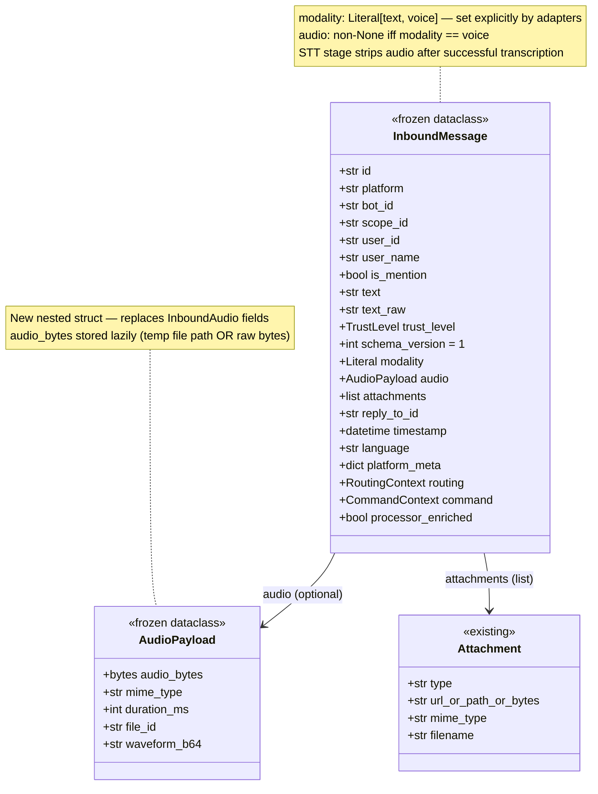

## Context

- **Frame:** `artifacts/frames/534-unify-inbound-audio-frame.mdx` (approved 2026-04-05)
- **Analysis:** `artifacts/analyses/534-unify-inbound-audio-analysis.mdx` (approved 2026-04-05, Shape B recommended)
- **Related:** #525 (platform_meta sanitization at NATS trust boundary) motivated this refactor
- **Precedent pattern:** #541 (adapter NatsBus publish-only mode) — same staged-rollout approach

## Goal

Collapse Lyra's dual-bus inbound architecture into a single `InboundMessage` envelope with modality-tagged voice payloads, processed through `MessagePipeline` as a new STT stage. Delivered in two slices:

- **Slice 1 (PR 1) — Hub-side unification.** `InboundMessage` gains an optional `audio` payload. `MessagePipeline` gains an STT stage. `AudioPipeline.run()` consumer loop is deleted. Hub subscribes to **both** old and new NATS subject trees, with a dedicated compat handler converting legacy `InboundAudio` envelopes into unified `InboundMessage(modality="voice")` and injecting into the single staging queue. Adapters unchanged — they still publish to `lyra.inbound.audio.*`. Fully resolves the #525 sanitization concern on the consumer side.
- **Slice 2 (PR 2) — Adapter migration + legacy removal.** Adapters publish `InboundMessage(modality="voice")` directly to `lyra.inbound.{platform}.{bot_id}`. Compat handler, `InboundAudio` class, `InboundAudioBus` shim, and `lyra.inbound.audio.*` subject tree are all deleted. `core/audio_pipeline.py` is renamed to `core/tts_dispatch.py`.

Both slices preserve zero data loss across independent supervisor restarts.

**Terminology glossary:** `compat shim` = `legacy handler` = `InboundAudioLegacyHandler` class in `src/lyra/nats/compat/inbound_audio_legacy.py`. Used interchangeably throughout this spec.

## Users

- **Primary:** Hub/core maintainers and adapter developers — every new adapter currently doubles wiring and normalize surface.
- **Secondary:** Operators (simpler bootstrap, fewer queues to monitor) and future multimodal work (image, video) that needs a clean extension point via the `modality` field.
- **Voice-message end users** — must experience zero regression in STT success rate, error messages, reply latency, or routing behavior.

## Expected Behavior

### End state (after Phase 2 ships)

```
Text:  adapter → InboundMessage(modality="text") ─┐
                                                   ├→ NatsBus → Hub → MessagePipeline → Pool → Agent
Voice: adapter → InboundMessage(modality="voice",  ┘                     │
                                audio=AudioPayload)                       ├ STT stage (voice only)
                                                                          │  ├ hub._stt is None → stt_unsupported reply, drop
                                                                          │  ├ STTUnavailableError → stt_unavailable reply, drop
                                                                          │  ├ is_whisper_noise(transcript) → stt_noise reply, drop
                                                                          │  ├ invalid (too long / slash-prefix) → stt_invalid reply, drop
                                                                          │  ├ unexpected exception → stt_failed reply, drop
                                                                          │  └ success → populate msg.text, strip msg.audio, echo transcript
                                                                          │
                                                                          └ continue: rate-limit → binding → agent → pool
```

**Walkthrough — voice message, happy path:**

1. User sends a voice note on Telegram.
2. Telegram adapter fetches the audio, runs size/magic-byte gates.
3. Adapter `normalize()` (unified, no `normalize_audio` split) produces `InboundMessage(modality="voice", text="", audio=AudioPayload(audio_bytes=..., mime_type=..., duration_ms=..., file_id=...))`.
4. Adapter publishes to NATS subject `lyra.inbound.telegram.{bot_id}` via unified `inbound_bus`.
5. Hub's `NatsBus[InboundMessage]` consumer receives, sanitizes `platform_meta` (once), enqueues on unified staging queue.
6. Hub drains the queue → `ResolveTrustMiddleware` runs → `MessagePipeline.process()` starts.
7. Pipeline stages: `_validate_platform` → `_check_rate_limit` → **`_run_stt_stage` (new)** → `_resolve_binding` → `_lookup_agent` → `get_or_create_pool` → command routing → `_submit_to_pool`.
8. STT stage sees `modality == "voice"` and `text == ""`: writes audio to temp file, calls `hub._stt.transcribe()`, populates `msg.text` with the transcript + `msg.text_raw = "🎤 [voice]: {transcript}"`, strips `msg.audio = None`, records `msg.language = result.language`, echoes transcript to user (informational, `reply=False`).
9. Pipeline continues with the now-text-populated message — identical to native text handling from here.

**Walkthrough — STT-free deployment:**

1–6 identical to above.
7. Pipeline reaches the STT stage.
8. Stage detects `hub._stt is None`, dispatches `stt_unsupported` reply via `hub.dispatch_response(synthetic_reply, Response(content=msg_manager.get("stt_unsupported")))`. Same template, same scope, same dispatcher as today.
9. Stage returns a terminal `PipelineResult` that stops the pipeline. Audio is dropped.

### Phase 1 interim behavior (PR 1 shipped, PR 2 not yet)

- Hub runs new code with unified envelope + STT pipeline stage.
- Adapters still run old code, publishing `InboundAudio` envelopes to `lyra.inbound.audio.{platform}.{bot_id}`.
- Hub subscribes to **both** subject trees:
  - `lyra.inbound.{platform}.{bot_id}` via `NatsBus[InboundMessage]` (text, and future-voice).
  - `lyra.inbound.audio.{platform}.{bot_id}` via a **dedicated raw subscription handler** (`src/lyra/nats/compat/inbound_audio_legacy.py`) that deserializes the legacy `InboundAudio` JSON, converts it to `InboundMessage(modality="voice", audio=AudioPayload(...))`, and injects it into the **same** unified staging queue as the new subject. No second `NatsBus` instance.
- From the pipeline's perspective, both sources produce indistinguishable `InboundMessage(modality="voice")` envelopes. One STT path, one sanitization path, one queue group (`HUB_INBOUND`).
- Legacy-subject message error replies (`stt_unsupported`, etc.) flow through the same `hub.dispatch_response()` path — no bifurcation.

### Accepted regression — STT stage latency

**Current behavior:** `AudioPipeline.run()` is a separate asyncio task from `Hub.run()`. A slow STT call blocks the audio queue drain but does **not** block text message drain — the two loops run concurrently.

**Post-refactor:** STT runs inside `MessagePipeline.process()`, which is awaited inside `Hub.run()`'s drain loop. A slow STT call will block the drain loop for up to the STT stage timeout, delaying **all** inbound messages (text + voice) for any conversation during that window.

**Mitigation:**
- STT stage enforces a **hard timeout of 30 seconds** (configurable via `hub._stt.timeout_ms`, default 30000). Timeout triggers the `stt_failed` reply path and releases the drain loop.
- Voice messages are infrequent (<1% of inbound traffic in current production); the 30s worst-case delay for text messages is a bounded, rare event.

**Explicit acceptance:** this regression is known and accepted within the 2-cycle appetite. A concurrent-drain redesign (e.g. `Hub.run()` spawning per-message pipeline tasks) is out of scope and would require a separate spec. If production data post-Slice-1 shows drain-loop starvation in practice, open a follow-up issue.

### Non-behaviors (must not change)

- STT reply templates: `stt_unsupported`, `stt_unavailable`, `stt_noise`, `stt_invalid`, `stt_failed` — all five preserved bit-for-bit from `msg_manager`.
- Transcript echo message format: `"🎤 [voice]: {transcript}"` (current) — unchanged.
- Slash-command injection guard: transcripts starting with `/` are rejected with `stt_invalid` — unchanged.
- Whisper noise detection via `is_whisper_noise()` — unchanged.
- Rate-limit key (`platform`, `bot_id`, `user_id`) — audio rate-limited identically to text.
- Scope routing: error replies use the same `scope_id` as the source voice message.
- `schema_version = 1` on `InboundMessage` — no version bump.

## Data Model & Consumers

### Unified envelope structure



### Consumer map

```mermaid
flowchart LR
    Adapter[Adapter normalize] -->|produces| IM[InboundMessage]
    Adapter -.old.-> IA[InboundAudio]

    IM -->|publish| NATS1[NATS: lyra.inbound.*]
    IA -.old.-> NATS2[NATS: lyra.inbound.audio.*]

    NATS1 -->|subscribe| NB1[NatsBus InboundMessage]
    NATS2 -.Phase 1 compat.-> CS[Legacy compat handler]
    CS -->|convert + inject| UQ[Unified staging queue]
    NB1 --> UQ

    UQ --> RTM[ResolveTrustMiddleware]
    RTM --> MP[MessagePipeline]

    MP --> S0[_validate_platform]
    S0 --> S1[_check_rate_limit]
    S1 --> STT[STT stage NEW]
    STT -->|modality != voice| S2[_resolve_binding]
    STT -->|voice, success| S2
    STT -->|voice, error| Dispatch[dispatch stt_* reply]
    Dispatch --> End((drop))
    S2 --> S3[_lookup_agent]
    S3 --> S4[get_or_create_pool]
    S4 --> S5[_prepare / is_command]
    S5 --> Pool[Pool → Agent]

    style IA stroke-dasharray: 5 5
    style NATS2 stroke-dasharray: 5 5
    style CS stroke-dasharray: 5 5
    style STT fill:#e0f0ff
```



### Consumer summary

| Consumer | Fields consumed | When | Status |
|---|---|---|---|
| `MessagePipeline._validate_platform` | `platform` | Every message | ✓ this issue (no change) |
| `MessagePipeline._check_rate_limit` | `platform`, `bot_id`, `user_id` | Every message | ✓ this issue (no change) |
| **`MessagePipeline._run_stt_stage`** (new) | `modality`, `audio`, `text`, `scope_id`, `user_id`, `platform_meta` | Voice only (`modality == "voice"`) | ✓ this issue |
| `MessagePipeline._resolve_binding` | `platform`, `bot_id`, `scope_id` | Every message | ✓ this issue (no change) |
| `Pool` + `Agent` | `text`, `text_raw`, `language`, `trust_level`, `routing`, `command` | Every message | ✓ this issue (audio stripped by STT stage before reaching here) |
| `InboundAudioCompat` handler | Legacy `InboundAudio` JSON fields | Phase 1 only | ✓ this issue (deleted in Phase 2) |
| `AudioPipeline.synthesize_and_dispatch_audio` | Takes `InboundMessage` + `OutboundAudio` | TTS dispatch (out of scope) | → future (file relocation deferred to Phase 2 cleanup) |
| Future multimodal (image, video) | `modality`, `attachments` | Out of scope | -.- future |

### Decisions resolved from analysis Open Unknowns

| # | Unknown | Decision | Rationale |
|---|---|---|---|
| 1 | STT re-entrance guard | Stage runs iff `modality == "voice"` AND `text == ""`. Re-entrant voice messages with populated text skip STT. `reply_to_id` is populated by adapter `normalize()` from source — not touched by STT stage. | Explicit, predictable, matches current behavior. |
| 2 | Audio field shape | **Nested `audio: AudioPayload \| None`**. New frozen dataclass with `audio_bytes`, `mime_type`, `duration_ms`, `file_id`, `waveform_b64`. | Keeps text-path `InboundMessage` tidy; clear ownership; trivial to strip (set to None) after STT; natural extension point for future fields. |
| 3 | `modality` default for text | Adapters set `modality="text"` explicitly for text, `modality="voice"` explicitly for voice. Stage gate: `modality == "voice"`. | Explicit beats implicit. Future modalities (image, video) get clean extension via literal expansion. |
| 4 | Agent raw-audio access | STT stage **strips** `audio = None` after successful transcription. | Agent history must not carry raw bytes (serialization bloat, log pollution). Raw-audio agents are a future concern with a dedicated mechanism. |
| 5 | Compat shim location | `src/lyra/nats/compat/inbound_audio_legacy.py` — dedicated module. Phase 2 deletes the entire `nats/compat/` directory. | Single file deletion target. Clear signal that the code is transitional. |
| 6 | Queue group | Single `HUB_INBOUND` queue group for all inbound. No artificial voice/text split. | YAGNI. Backpressure isolation is a hypothetical concern; revisit only if production shows starvation. |
| 7 | Test migration | Introduce `tests/helpers/messages.py::make_voice_message(**overrides)` + `make_text_message(**overrides)`. Migrate all `InboundAudio(...)` constructor calls to `make_voice_message()`. Migrate all `InboundMessage(text=...)` direct constructions to `make_text_message()` where touched. | Single point of churn for envelope shape evolution. |
| 8 | Error reply dispatch | STT stage calls `hub.dispatch_response(synthetic_reply, Response(content=template))` using the existing `OutboundDispatcher` registered for the message's `platform`. Synthetic reply is built with the same pattern as current `_dispatch_audio_reply()`: copy platform/bot_id/scope_id/user_id/user_name/is_mention/timestamp/trust_level/trust/platform_meta/routing, set `text=""` / `text_raw=""`, strip `message_id` from `platform_meta` if the reply is informational (echo) not a direct reply. | Unified path regardless of legacy or new subject (compat shim converts before pipeline sees the envelope). |
| 9 | Observability | Unified `NatsBus[InboundMessage].staging_qsize()` reports the single queue. `version_mismatch_drops` dict is keyed by envelope name (`InboundMessage`, `InboundAudio` during Phase 1). Compat shim adds its own counters: `inbound_audio_legacy_converted_total`, `inbound_audio_legacy_decode_errors_total`. STT stage adds `stt_stage_outcomes_total{outcome=success\|unsupported\|noise\|invalid\|failed\|unavailable}` and `stt_stage_duration_seconds`. | Observability must not regress. Compat shim metrics give a rollout-completion signal. |
| 10 | `audio_pipeline.py` file fate | Phase 1: `AudioPipeline.run()`, `_process_audio_item()`, `_dispatch_audio_reply()` are **deleted** from `core/audio_pipeline.py`. `synthesize_and_dispatch_audio()` remains in the same file temporarily. Phase 2: rename/move `audio_pipeline.py` → `core/tts_dispatch.py` (new home for the TTS helper), delete the old path. | Decouples the consumer-loop removal (Phase 1) from the TTS helper relocation (Phase 2 cleanup). Avoids mixing rename churn into the risky Phase 1 PR. |
| 11 | Bus injection API (architect review finding) | `NatsBus` and `LocalBus` gain a **new public method** `inject(item: T) -> None` that wraps `self._staging.put_nowait(item)` (or the equivalent on the concrete bus). This is the defined public API for compat-shim injection — no private attribute access. Added to both bus classes in Slice 1. | `_staging` is currently private on both bus classes. The compat shim must not break encapsulation. A single, auditable injection entry point is cleaner than one-off access. |
| 12 | Compat shim schema version check (architect review finding) | Compat shim calls `check_schema_version(payload, "InboundAudio", SCHEMA_VERSION_INBOUND_AUDIO)` **before** `deserialize_dict`. On mismatch, increments `inbound_audio_legacy_decode_errors_total` and drops the message (no injection). | Without this, a hypothetical v2 `InboundAudio` arriving during Phase 1 would be silently mis-deserialized. Parity with `NatsBus._make_handler` semantics. |
| 13 | STT stage latency bound (product-lead review finding) | STT stage enforces a hard timeout (default 30s, configurable via `hub._stt.timeout_ms`). Timeout → `stt_failed` reply. See "Accepted regression — STT stage latency" subsection above for the full rationale and acceptance note. | Current `AudioPipeline` has no timeout; moving STT into the pipeline drain loop requires a bound to cap worst-case text-message delay. |

## Breadboard

### Phase 1 affordances — Hub-side unification (PR 1)

| ID | Type | Element | Handler | Data touched |
|---|---|---|---|---|
| N1 | Data | `AudioPayload` frozen dataclass | `core/message.py` (new class) | `audio_bytes: bytes`, `mime_type: str`, `duration_ms: int \| None`, `file_id: str \| None`, `waveform_b64: str \| None` |
| N2 | Data | `InboundMessage.audio: AudioPayload \| None` field | `core/message.py` (field addition, additive schema v1) | Appended after existing defaulted fields (frozen dataclass ordering safe) |
| N3 | Data | `InboundMessage.modality` default-None → explicit assertion | `core/message.py` (no type change, adapter contract change) | Adapters set `modality="text"` or `"voice"` |
| N4 | Service | `MessagePipeline._run_stt_stage` | `core/hub/message_pipeline.py` (new method, inserted between `_check_rate_limit` and `_resolve_binding` in `process()` via a two-line insertion after line 137 per architect review) | Reads `modality`, `audio`, `text`; writes `text`, `text_raw`, `language`, `audio=None` on success; emits `PipelineResult` on error paths. **Wraps STT call in `asyncio.wait_for(..., timeout=hub._stt.timeout_ms / 1000)`**; `TimeoutError` → `stt_failed` reply path |
| N5 | Service | STT stage helpers: noise guard, length cap, slash-prefix guard | `core/hub/message_pipeline.py` (private helpers) | Reuses `is_whisper_noise` from `lyra.stt`; template lookups via `hub._msg_manager` |
| N6 | Service | Synthetic reply builder for STT errors | `core/hub/message_pipeline.py` (private helper) | Mirrors current `_dispatch_audio_reply()`; returns `InboundMessage` with stripped `message_id` from `platform_meta` |
| N7 | Service | `InboundAudioLegacyHandler` | `nats/compat/inbound_audio_legacy.py` (new module) | Raw `client.subscribe(subject="lyra.inbound.audio.>", queue=HUB_INBOUND, cb=...)`. On each message: (1) call `check_schema_version(payload, "InboundAudio", SCHEMA_VERSION_INBOUND_AUDIO)` — on mismatch, increment `inbound_audio_legacy_decode_errors_total` and drop; (2) `deserialize_dict(payload, InboundAudio)`; (3) construct `InboundMessage(modality="voice", audio=AudioPayload(...))` from the legacy envelope; (4) call `inbound_bus.inject(converted)` — the new public injection API added in N7b |
| N7b | Service | `Bus.inject(item: T) -> None` public method | `core/inbound_bus.py` (`LocalBus`) + `nats/nats_bus.py` (`NatsBus`) | New public method on both bus classes that wraps `self._staging.put_nowait(item)`. Sole defined public API for compat-shim injection. Must not break encapsulation elsewhere. |
| N8 | Bootstrap | Hub bootstrap wires legacy subscription | `bootstrap/hub_standalone.py` + `bootstrap/unified.py` | Instantiate `InboundAudioLegacyHandler(inbound_bus, nats_client)`; call `await handler.start()` after `inbound_bus` connect |
| N9 | Bootstrap | Hub constructor drops `inbound_audio_bus` parameter | `core/hub/hub.py` + callers | `Hub.__init__` signature narrowed to single bus |
| N10 | Removal | `Hub.run()` no longer spawns `AudioPipeline.run()` task | `core/hub/hub.py` or `hub_standalone.py` | Task start site deleted |
| N11 | Removal | `AudioPipeline.run()`, `_process_audio_item()`, `_dispatch_audio_reply()` deleted | `core/audio_pipeline.py` | ~240 LOC removed; `synthesize_and_dispatch_audio()` retained |
| N12 | Agent | `_stt is None` dead-code checks removed | `agents/anthropic_agent.py:169`, `agents/simple_agent.py:208-212`, `core/agent.py` | Pipeline stage guarantees transcribed text before agent sees voice messages |
| N13 | Observability | STT stage metric counters | `core/hub/message_pipeline.py` + whatever counter module exists | `stt_stage_outcomes_total{outcome=...}`, `stt_stage_duration_seconds` |
| N14 | Observability | Compat shim counters | `nats/compat/inbound_audio_legacy.py` | `inbound_audio_legacy_converted_total`, `inbound_audio_legacy_decode_errors_total` |
| N15 | Test helper | `tests/helpers/messages.py::make_voice_message`, `make_text_message` | New test helper module (or extend existing) | Factory fns with sensible defaults + kwargs overrides |
| T1 | Test | STT stage unit tests | `tests/core/hub/test_message_pipeline_stt.py` (new) | Cover all 6 outcomes (success, unsupported, unavailable, noise, invalid, failed) + re-entrance guard (text already populated) |
| T2 | Test | Compat shim unit tests | `tests/nats/compat/test_inbound_audio_legacy.py` (new) | Round-trip decode → convert → injection; decode error counter increments |
| T3 | Test | End-to-end voice flow integration test | `tests/integration/test_voice_end_to_end.py` (likely exists — update) | Telegram audio → NATS → hub → agent; assert transcript populated, audio stripped |
| T4 | Test | Migration: existing `InboundAudio` tests | All test files currently constructing `InboundAudio` | Replace with `make_voice_message()`; assert behavior parity |

### Phase 2 affordances — Adapter migration + legacy removal (PR 2)

| ID | Type | Element | Handler | Data touched |
|---|---|---|---|---|
| P1 | Adapter | Telegram `normalize_audio` fold into unified `normalize` | `adapters/telegram_normalize.py` + `adapters/telegram_inbound.py` | Return `InboundMessage(modality="voice", audio=AudioPayload(...))` instead of `InboundAudio` |
| P2 | Adapter | Discord `normalize_audio` fold into unified `normalize` | `adapters/discord_audio.py` + `adapters/discord.py` | Same |
| P3 | Adapter | `push_to_hub_guarded` signature narrowed | `adapters/_shared.py:75` | `msg: InboundMessage` only |
| P4 | Adapter | Drop `_inbound_audio_bus` from adapter classes | `adapters/telegram.py:98`, `adapters/discord.py:79` | Single bus reference |
| P5 | Bootstrap | Drop publish-only audio bus construction | `bootstrap/adapter_standalone.py:95-106, 229-240` | One `NatsBus[InboundMessage]` per adapter |
| P6 | Removal | Legacy subscription + compat shim | `bootstrap/hub_standalone.py` + `bootstrap/unified.py` + `nats/compat/` | Delete `InboundAudioLegacyHandler` wiring; delete `nats/compat/` directory |
| P7 | Removal | `InboundAudio` class | `core/message.py:108-136` | Delete class + its `schema_version` constant |
| P8 | Removal | `InboundAudioBus` shim file | `core/inbound_audio_bus.py` | Delete entire 17-line file |
| P9 | Removal | `NatsChannelProxy.normalize_audio` stub | `nats/nats_channel_proxy.py:70-78` | Delete method |
| P10 | Removal | `_ENVELOPE_VERSIONS[InboundAudio]` entry | `nats/nats_bus.py:60-62` | Remove dict entry |
| P11 | File move | `core/audio_pipeline.py` → `core/tts_dispatch.py` | New module | Move `synthesize_and_dispatch_audio` + its imports; delete old file; update call sites |
| P12 | Test | Remove/update tests referencing `InboundAudio` or legacy subject | All affected | Delete obsolete cases, update imports |

## Slices

Slices map 1-to-1 to PRs in Shape B. Each slice is independently deployable and demo-able.

| Slice | PR | Goal | Affordances | Demo | Deployable on its own? |
|---|---|---|---|---|---|
| **Slice 1** | PR 1 | Hub receives voice messages as unified `InboundMessage`, STT runs as pipeline stage, legacy subject still accepted via compat shim | N1–N15 + T1–T4 | Send a Telegram voice note to prod adapter (old code) → arrives at hub (new code) via `lyra.inbound.audio.*` → compat shim converts → STT stage transcribes → agent replies. Metrics show `inbound_audio_legacy_converted_total` incrementing, `stt_stage_outcomes_total{outcome=success}` incrementing. | ✓ Yes. Adapters unchanged. Hub restart is the only deploy. Rollback = revert PR 1, zero data loss. |
| **Slice 2** | PR 2 | Adapters publish unified envelope; legacy subject + compat shim + `InboundAudio` class deleted; `audio_pipeline.py` renamed to `tts_dispatch.py` | P1–P12 | Send Telegram voice note → publishes to `lyra.inbound.telegram.{bot_id}` (new subject, no audio segment in path) → hub receives via `NatsBus[InboundMessage]` directly (no compat shim) → STT stage → agent replies. Metrics show `inbound_audio_legacy_converted_total` flat (not incrementing). | ✓ Yes. Hub already accepts new subject (Phase 1 did that). Adapter restart + hub restart any order. Brief window where a PR 1 hub receives PR 2 adapter's new-subject voice messages — works (native path). Or a PR 2 adapter publishes before PR 2 hub is deployed — the legacy compat shim is gone but the new `NatsBus[InboundMessage]` subscription is still there. Works. |

**Ordering constraint:** Slice 1 must merge and deploy before Slice 2 is reviewed. The compat shim is the safety net that makes Slice 2 trivial.

## Success Criteria

### Slice 1 (PR 1) — Hub-side unification

- [ ] `AudioPayload` frozen dataclass exists in `core/message.py` with fields `audio_bytes: bytes`, `mime_type: str`, `duration_ms: int | None`, `file_id: str | None`, `waveform_b64: str | None`.
- [ ] `InboundMessage.audio: AudioPayload | None` field exists with default `None`, positioned after existing defaulted fields (frozen dataclass field ordering preserved).
- [ ] `InboundMessage.schema_version` remains `1` (no version bump).
- [ ] `MessagePipeline.process()` invokes `_run_stt_stage` after `_check_rate_limit` and before `_resolve_binding`, conditionally on `msg.modality == "voice"`.
- [ ] STT stage wraps the `hub._stt.transcribe(...)` call in `asyncio.wait_for(..., timeout=hub._stt.timeout_ms / 1000)` with default `timeout_ms=30000`.
- [ ] STT stage `asyncio.TimeoutError` is caught and routed to the `stt_failed` reply path (same template, same dispatch as other failure modes).
- [ ] STT stage returns a terminal `PipelineResult` (via dispatch of error reply + drop) for each of: `hub._stt is None`, `STTUnavailableError`, whisper noise, invalid transcript (slash-prefix or over-length), unexpected `Exception`, **STT timeout**.
- [ ] STT stage success path populates `msg.text`, `msg.text_raw = "🎤 [voice]: {transcript}"`, `msg.language`, sets `msg.audio = None`, echoes transcript to user with `reply=False`, and returns `None` (pipeline continues).
- [ ] STT stage with `modality != "voice"` is a no-op (returns `None` immediately).
- [ ] STT stage with `modality == "voice"` and `text != ""` is a no-op (re-entrance guard).
- [ ] `AudioPipeline.run()`, `_process_audio_item()`, `_dispatch_audio_reply()` are deleted from `core/audio_pipeline.py`. `synthesize_and_dispatch_audio()` is retained in the same file unchanged.
- [ ] `Hub.run()` no longer spawns an `AudioPipeline` consumer task.
- [ ] `Hub.__init__` signature no longer accepts `inbound_audio_bus`.
- [ ] `_stt is None` checks removed from `agents/anthropic_agent.py:169`, `agents/simple_agent.py:208-212`, and `core/agent.py`.
- [ ] `src/lyra/nats/compat/inbound_audio_legacy.py` exists, exports `InboundAudioLegacyHandler`, and subscribes to `lyra.inbound.audio.>` with queue group `HUB_INBOUND`.
- [ ] Legacy handler calls `check_schema_version(payload, "InboundAudio", SCHEMA_VERSION_INBOUND_AUDIO)` before deserialization; on mismatch, increments `inbound_audio_legacy_decode_errors_total` and drops the message without injection.
- [ ] Legacy handler deserializes incoming JSON via `deserialize_dict(payload, InboundAudio)`, converts to `InboundMessage(modality="voice", audio=AudioPayload(...))`, and injects into the unified `inbound_bus` staging queue via the public `Bus.inject()` method (no private attribute access).
- [ ] `LocalBus.inject(item: T) -> None` and `NatsBus.inject(item: T) -> None` public methods exist on both bus classes, each wrapping `self._staging.put_nowait(item)`.
- [ ] Legacy handler increments `inbound_audio_legacy_converted_total` on successful conversion and `inbound_audio_legacy_decode_errors_total` on decode or version-check failures.
- [ ] `bootstrap/hub_standalone.py` and `bootstrap/unified.py` instantiate `InboundAudioLegacyHandler` and call `.start()` after `inbound_bus` is connected.
- [ ] `bootstrap/hub_standalone.py` and `bootstrap/unified.py` no longer construct `inbound_audio_bus` as a `NatsBus[InboundAudio]`. (Note: `adapter_standalone.py` is untouched in Slice 1 — adapters still construct their publish-only audio bus.)
- [ ] `stt_stage_outcomes_total{outcome=...}` counter exists with labels: `success`, `unsupported`, `unavailable`, `noise`, `invalid`, `failed`.
- [ ] `stt_stage_duration_seconds` histogram exists.
- [ ] `tests/helpers/messages.py` (or equivalent test helper module) exports `make_voice_message(**overrides)` and `make_text_message(**overrides)`.
- [ ] Unit tests cover all 6 STT stage outcomes + re-entrance guard (`test_message_pipeline_stt.py`).
- [ ] Unit tests cover compat shim round-trip decode → convert → injection + decode error counter increment (`test_inbound_audio_legacy.py`).
- [ ] End-to-end integration test: Telegram voice note (published to legacy subject) arrives through compat shim → STT stage → agent reply, with `audio` stripped before agent sees the message.
- [ ] All existing tests that construct `InboundAudio(...)` are migrated to `make_voice_message(...)`, with behavior parity asserted.
- [ ] `ruff check` + `mypy` pass on all touched files.
- [ ] Full test suite passes.

### Slice 2 (PR 2) — Adapter migration + legacy removal

- [ ] `adapters/telegram_normalize.py` `normalize()` handles both text and voice paths, returning `InboundMessage` with `modality` set explicitly.
- [ ] `adapters/telegram_normalize.py` `normalize_audio()` function removed (or private helper inlined).
- [ ] `adapters/telegram_inbound.py` dispatches audio via unified `push_to_hub_guarded(inbound_bus=adapter._inbound_bus, msg=inbound_msg)`.
- [ ] `adapters/discord_audio.py` `normalize_audio()` returns `InboundMessage(modality="voice", audio=...)` or the logic is folded into `adapters/discord.py`.
- [ ] `adapters/telegram.py` and `adapters/discord.py` no longer store `_inbound_audio_bus`.
- [ ] `adapters/_shared.py` `push_to_hub_guarded` signature is `msg: InboundMessage` (union with `InboundAudio` removed).
- [ ] `bootstrap/adapter_standalone.py` constructs only one `NatsBus[InboundMessage]` per adapter (lines 95-106 and 229-240 collapsed).
- [ ] `bootstrap/hub_standalone.py` and `bootstrap/unified.py` no longer instantiate `InboundAudioLegacyHandler`.
- [ ] `src/lyra/nats/compat/inbound_audio_legacy.py` file is deleted. `src/lyra/nats/compat/` directory is deleted (if empty).
- [ ] `InboundAudio` class is deleted from `core/message.py`. `SCHEMA_VERSION_INBOUND_AUDIO` constant is deleted.
- [ ] `core/inbound_audio_bus.py` file is deleted.
- [ ] `nats/nats_channel_proxy.py` `normalize_audio` stub method is deleted.
- [ ] `nats/nats_bus.py` `_ENVELOPE_VERSIONS` dict no longer references `InboundAudio`.
- [ ] `core/audio_pipeline.py` is renamed to `core/tts_dispatch.py`. Module-level docstring updated. All call sites of `synthesize_and_dispatch_audio` updated to import from new path.
- [ ] All tests referencing `InboundAudio` or `lyra.inbound.audio.*` subject are removed or updated.
- [ ] End-to-end integration test: Telegram voice note is published to `lyra.inbound.telegram.{bot_id}` (new subject), received by hub via `NatsBus[InboundMessage]` directly, transcribed, and answered.
- [ ] `ruff check` + `mypy` pass on all touched files.
- [ ] Full test suite passes.

### Cross-cutting (both slices) — CI-verifiable

- [ ] Unit tests assert that each of the six STT error reply templates (`stt_unsupported`, `stt_unavailable`, `stt_noise`, `stt_invalid`, `stt_failed`, **STT timeout routed as `stt_failed`**) is dispatched with the exact same text, scope_id, user_id, and dispatcher (`hub.dispatch_response`) as the current `AudioPipeline._dispatch_audio_reply()` path. A snapshot test or text-equality assertion per template.
- [ ] `#525` sanitization concern verified eliminated: a unit test asserts that `NatsBus[InboundMessage]._sanitize_platform_meta` (or equivalent) is called exactly once per inbound envelope regardless of modality. Alternatively, a grep-based test confirms no other sanitization call site exists in the inbound path.
- [ ] STT stage latency bound verified: unit test with a mock `hub._stt.transcribe` that sleeps 31 seconds asserts the stage raises `asyncio.TimeoutError` within ≤31 seconds and dispatches `stt_failed`.

## Deploy Gates (operational — not CI)

These gates guard production rollout between slices. They are **not** code-merge criteria but **must** be satisfied before the corresponding PR is merged to staging.

### Gate 1 — Before Slice 1 (PR 1) merges to staging

- PR 1 has passed all Slice 1 Success Criteria above.
- Code review approvals per project policy.
- No blocking findings from `/code-review`.

### Gate 2 — Before Slice 2 (PR 2) can be planned/started

- **Slice 1 has been live in production for ≥48 hours.**
- `inbound_audio_legacy_converted_total` counter is **non-zero and incrementing** (confirming legacy traffic is flowing through the compat shim as intended).
- `stt_stage_outcomes_total{outcome=success}` rate matches pre-Slice-1 baseline within ±10% (evidence that voice messages are being transcribed at the expected rate).
- `inbound_audio_legacy_decode_errors_total` is zero or within historical noise floor.
- Zero production alerts from hub related to NATS subscription failures or STT stage errors.
- **Owner:** whoever merges Slice 1 is responsible for collecting this evidence and attaching it to the Slice 2 PR description as a screenshot or log excerpt before requesting review.

### Gate 3 — Before Slice 2 (PR 2) merges to staging

- All Gate 2 conditions still hold.
- PR 2 has passed all Slice 2 Success Criteria above.
- Code review approvals per project policy.

### Gate 4 — Post-Slice-2 verification (not blocking)

- Once Slice 2 has been live for ≥24 hours, confirm `inbound_audio_legacy_converted_total` is flat (no new legacy traffic). If counter still increments, an adapter is still on old code — investigate and re-deploy before declaring the rollout complete.

## [NEEDS CLARIFICATION]

None — all 10 analysis unknowns have been resolved inline in the "Decisions resolved from analysis Open Unknowns" table above. The spec is ready for `/plan`.
