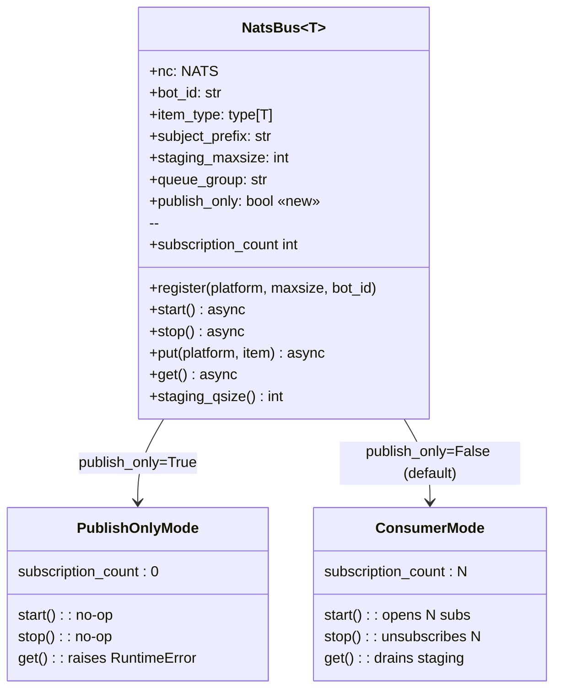

## Context

Source: `artifacts/frames/541-adapter-natsbus-unused-subs-frame.mdx` (approved).

Adapter processes construct `NatsBus` instances solely to **publish**
outbound-from-adapter messages (`bus.put(platform, msg)`) into the
`lyra.inbound.<platform>.<bot_id>` subjects for the hub to consume. But
because `NatsBus.start()` unconditionally creates real NATS subscriptions
on those subjects, every inbound message is also delivered back to the
adapter process, lands in an in-memory staging queue that is never
drained, and eventually triggers misleading `staging queue full` warnings.

This spec defines a **publish-only operating mode** for `NatsBus` so the
adapter can publish without ever opening a subscription.

## Goal

Eliminate accidental inbound subscriptions on adapter-side `NatsBus`
instances while preserving the existing `Bus[T]` protocol contract.

## Users

- **Primary — Lyra operators.** Fewer NATS subscriptions per rolling deploy,
  no spurious "staging queue full" warnings in adapter logs.
- **Secondary — Lyra contributors.** A self-describing flag makes it
  obvious at the construction site that a bus will never consume inbound.

## Expected Behavior

1. `NatsBus(nc, bot_id, item_type, publish_only=True)` constructs a bus
   that satisfies the `Bus[T]` protocol but never opens subscriptions.
2. `register(platform)` still records the `(platform, bot_id)` pair so
   that `put()` can resolve the subject — no raise.
3. `start()` on a publish-only bus is a **no-op**: zero subscriptions
   created, `subscription_count == 0`, no handlers registered with NATS.
4. `stop()` on a publish-only bus is a **no-op**: no unsubscribes.
5. `put(platform, item)` publishes to NATS exactly as today.
6. `get()` on a publish-only bus **raises** `RuntimeError` — defensive
   guard against accidental consumption on a bus that will never deliver.
7. `staging_qsize()` on a publish-only bus returns `0` (queue is unused).
8. Hub-side `NatsBus` (default `publish_only=False`) behavior is
   **unchanged**: `start()` opens subscriptions, `hub-inbound` queue group
   still dedupes deliveries across hub replicas.
9. `src/lyra/bootstrap/adapter_standalone.py` constructs its four adapter
   buses (`inbound_bus` + `inbound_audio_bus`, for Telegram and Discord)
   with `publish_only=True` and continues to call
   `register(platform) → start() → (run) → stop()` in the existing order.

## Out of Scope

- Alternative fix options rejected in the frame: distinct
  `adapter-inbound-{plat}-{bid}` queue group (option 2); documenting +
  silencing the warnings (option 3).
- Any change to NATS wire format, schema versioning, or `InboundMessage` /
  `InboundAudio` envelopes — owned by #530.
- Hub-side consumer / queue-group strategy — unchanged from #527.
- Splitting `NatsBus` into separate `NatsPublisher` / `NatsConsumer`
  classes (considered and rejected in favor of a constructor flag —
  see spec §Expected Behavior).
- Runtime mode switching — a bus is publish-only for its entire lifetime,
  decided at construction.

## Data Model & Consumers

### NatsBus operating modes



### Consumer map

```mermaid
flowchart LR
    subgraph Adapter Process
        A1[TelegramAdapter / DiscordAdapter]
        AB1[inbound_bus<br/>publish_only=True]
        AB2[inbound_audio_bus<br/>publish_only=True]
        A1 -->|put| AB1
        A1 -->|put| AB2
    end
    subgraph Hub Process
        H1[Hub.run]
        HB1[hub.inbound_bus<br/>publish_only=False]
        HB2[hub.inbound_audio_bus<br/>publish_only=False]
        HB1 -->|get| H1
        HB2 -->|get| H1
    end
    AB1 -. NATS lyra.inbound.* .-> HB1
    AB2 -. NATS lyra.inbound.audio.* .-> HB2
```

Solid arrows = in-process calls changed/verified by this issue.
Dashed arrows = NATS wire transport, unchanged.

### Consumer summary

| Consumer | Fields consumed | When | Status |
|---|---|---|---|
| `NatsBus.put()` in adapter | `_registrations`, `_subject_prefix`, `_nc` | Every inbound message from platform | this issue |
| `NatsBus.start()` in hub | `_registrations`, `_nc`, `_queue_group` | Hub bootstrap | unchanged |
| `NatsBus.get()` in hub | `_staging` | `Hub.run()` main loop | unchanged |
| `NatsOutboundListener` | own subscription | Adapter bootstrap | unchanged (separate code path) |

## Breadboard

### Affordances

| ID | Affordance | Handler | Data |
|----|------------|---------|------|
| N1 | `NatsBus(..., publish_only=True)` | `__init__` | new kwarg, default `False` |
| N2 | `bus.start()` — publish-only | `start()` | early-return branch |
| N3 | `bus.stop()` — publish-only | `stop()` | early-return branch |
| N4 | `bus.get()` — publish-only | `get()` | raise `RuntimeError` |
| N5 | Adapter constructs bus | `_bootstrap_adapter_standalone` | pass `publish_only=True` at 4 call sites |
| T1 | Unit test: `start()` is no-op | `test_nats_bus.py` | assert `subscription_count == 0` |
| T2 | Unit test: `get()` raises | `test_nats_bus.py` | pytest.raises `RuntimeError` |
| T3 | Unit test: `put()` still publishes | `test_nats_bus.py` | roundtrip via separate consumer |
| T4 | Integration test: hub still consumes | existing multibot test | reuse / extend |
| D1 | Constructor docstring + Bus protocol doc | inline docstrings | — |
| G1 | `register()` double-start guard still correct | `register()` | verify no-op on publish-only: guard checks `_subscriptions`, which stays empty, so register remains callable after `start()` — no tightening needed |

### Wiring

```
N1 ──┬──► N2 (publish_only branch)
     ├──► N3 (publish_only branch)
     ├──► N4 (publish_only branch)
     ├──► G1 (register guard verified no-op)
     └──► N5 (4 construction sites)
N1 ◄── T1, T2, T3 (unit tests)
N5 ◄── T4 (integration sanity)
N1 ◄── D1 (documentation)
```

## Slices

| # | Slice | Affordances | Independently demo-able |
|---|-------|-------------|-------------------------|
| 1 | **Publish-only kwarg + branch logic** | N1, N2, N3, N4, G1, D1 | Yes — unit tests alone prove new mode |
| 2 | **Adapter wiring** | N5 | Yes — integration test: adapter starts, `subscription_count == 0` on adapter-side buses, hub still receives messages |
| 3 | **Regression coverage** | T1, T2, T3, T4 | Yes — full test suite green, #527 dedup still enforced |

Execution order: 1 → 2 → 3. All three slices ship in a single PR. Slice 3
is not a trailing work item — tests T1–T4 are written in the same commit
as the code they cover (slices 1 and 2). The slice breakdown is a
conceptual split for review, not a commit boundary.

## Success Criteria

- [ ] `NatsBus.__init__` accepts `publish_only: bool = False` kwarg; default
      preserves existing behavior.
- [ ] `NatsBus.start()` is a no-op when `publish_only=True`
      (`subscription_count == 0` after call, no `nc.subscribe()` invocation).
- [ ] `NatsBus.stop()` is a no-op when `publish_only=True` (no exception,
      no unsubscribe calls).
- [ ] `NatsBus.get()` raises `RuntimeError` with a clear message when
      called on a publish-only bus.
- [ ] `NatsBus.put(platform, item)` publishes successfully on a publish-only
      bus after `register()`.
- [ ] All four adapter-side `NatsBus` constructions in
      `adapter_standalone.py` (Telegram `inbound_bus` + `inbound_audio_bus`,
      Discord `inbound_bus` + `inbound_audio_bus`) pass `publish_only=True`.
- [ ] Existing hub-side test `test_nats_bus.py` suite remains green without
      modification (hub path is unchanged).
- [ ] New unit tests cover the publish-only branches: `start()`, `stop()`,
      `get()`, `put()`.
- [ ] Integration coverage via `tests/nats/test_nats_bus_multibot.py` (or
      a new sibling test): with hub running, an adapter message
      round-trips hub→pipeline once, and `bus.staging_qsize()` on the
      adapter-side bus stays at `0`. Must pass in CI.
- [ ] No regression in #527 behavior: hub still dedupes via `hub-inbound`
      queue group.
- [ ] Constructor docstring and `Bus` protocol docstring mention the
      publish-only mode and its contract (get raises).
