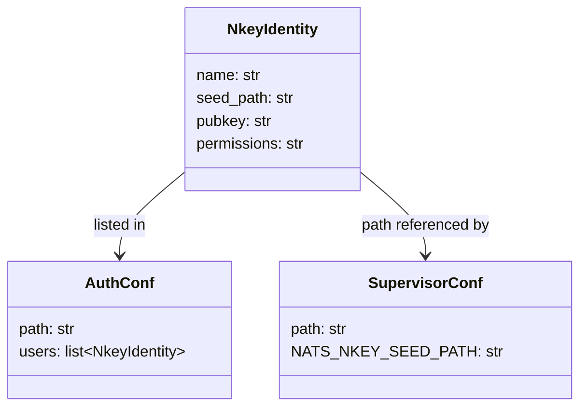
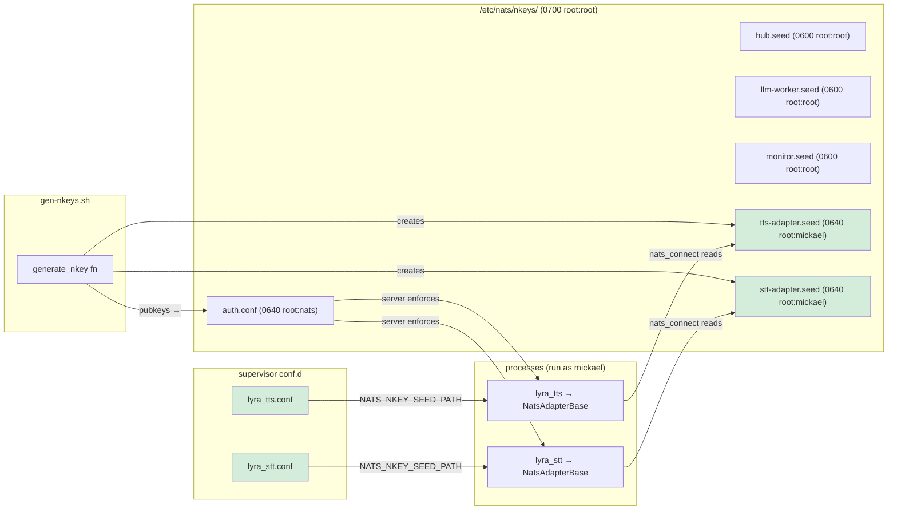

## Context

Security review `artifacts/reviews/2026-04-06-sec-auth.md` (finding MEDIUM) identified
that TTS and STT adapter processes lacked nkey credentials. The Python bypass was
resolved by #588 (NatsAdapterBase calls `nats_connect()` internally). This spec covers
the remaining infra gap: generating dedicated nkey seeds for `tts-adapter` and
`stt-adapter`, and wiring `NATS_NKEY_SEED_PATH` in their supervisor configs.

## Goal

When the NATS server enforces nkey authentication, `lyra_tts` and `lyra_stt` processes
connect with their own authorized identities — fail-closed if their seed files are absent
or unreadable.

## Users

- **Primary:** `lyra_tts` and `lyra_stt` supervisor processes on Machine 1 (`roxabituwer`)
- **Secondary:** operator running `gen-nkeys.sh` to provision or rotate nkeys

## Expected Behavior

1. Operator runs `sudo ./deploy/nats/gen-nkeys.sh` on Machine 1 (fresh run — no existing
   `auth.conf`).
2. Script generates two additional seed files: `tts-adapter.seed` and `stt-adapter.seed`
   at `/etc/nats/nkeys/` with permissions `0640 root:mickael` (readable by the supervisord
   user; not world-readable). Existing seeds (`hub`, `llm-worker`, `monitor`) use `0600
   root:root` — the new seeds match the pattern except group-read is granted to the
   service user to allow non-root supervisor processes to read them.
3. Script writes their public keys into `/etc/nats/nkeys/auth.conf` under the
   `authorization { users: [...] }` block (5 entries total).
4. Operator reloads NATS config without dropping connections:
   ```
   nats-server --signal reload=/run/nats-server/nats-server.pid
   ```
   (Only fall back to `systemctl restart nats-server` if the reload fails — restart drops
   all active connections.)
5. `lyra_tts` and `lyra_stt` supervisor configs each gain one new env var:
   - `lyra_tts.conf`: `NATS_NKEY_SEED_PATH=/etc/nats/nkeys/tts-adapter.seed`
   - `lyra_stt.conf`: `NATS_NKEY_SEED_PATH=/etc/nats/nkeys/stt-adapter.seed`
6. On startup, `NatsAdapterBase.run()` calls `nats_connect()`, which reads
   `NATS_NKEY_SEED_PATH`, loads the seed, and presents it to the NATS server.
7. NATS server validates the nkey — both processes connect authenticated.
8. If `NATS_NKEY_SEED_PATH` is set but the file is missing/unreadable/empty →
   `nats_connect()` calls `sys.exit()` with a descriptive message (fail-closed).

**Idempotency note:** `gen-nkeys.sh` uses a coarse-grained skip: if `auth.conf` already
exists, the entire script exits with a warning. It does not support incremental key
addition. To add new keys to an existing setup, the operator must: (1) back up existing
seeds, (2) delete `/etc/nats/nkeys/`, (3) re-run the script. This is the existing design
and is not changed by this fix.

## Data Model & Consumers





| Consumer | Fields consumed | When | Status |
|----------|----------------|------|--------|
| NATS server (`auth.conf`) | pubkey of tts-adapter, pubkey of stt-adapter | connection handshake | **this issue** |
| `lyra_tts` process | `/etc/nats/nkeys/tts-adapter.seed` via env | startup | **this issue** |
| `lyra_stt` process | `/etc/nats/nkeys/stt-adapter.seed` via env | startup | **this issue** |
| key rotation tooling | all `*.seed` paths | future | future |

## Breadboard

| ID | Affordance | Handler | Data |
|----|-----------|---------|------|
| N1 | `generate_nkey "tts-adapter"` call in gen-nkeys.sh | `generate_nkey()` fn (existing) | writes `/etc/nats/nkeys/tts-adapter.seed` (`0640 root:mickael`) |
| N2 | `generate_nkey "stt-adapter"` call in gen-nkeys.sh | `generate_nkey()` fn (existing) | writes `/etc/nats/nkeys/stt-adapter.seed` (`0640 root:mickael`) |
| N3 | `TTS_PUB` / `STT_PUB` vars captured in gen-nkeys.sh | shell var assignment | pubkey strings from `"${NK_BIN}" -inkey ... -pubout` |
| N4 | `auth.conf` heredoc updated with tts + stt entries | heredoc in gen-nkeys.sh | `{ nkey: "${TTS_PUB}", name: "tts-adapter" }` etc; update trailing `info` block to list all 5 seeds |
| E1 | `environment=` line appended in `lyra_tts.conf` | supervisord env injection | `NATS_NKEY_SEED_PATH=/etc/nats/nkeys/tts-adapter.seed` (absolute path, no interpolation) |
| E2 | `environment=` line appended in `lyra_stt.conf` | supervisord env injection | `NATS_NKEY_SEED_PATH=/etc/nats/nkeys/stt-adapter.seed` (absolute path, no interpolation) |

## Slices

| # | Slice | Affordances | Demo-able outcome |
|---|-------|-------------|-------------------|
| 1 | gen-nkeys.sh — add tts + stt seeds + update info block | N1, N2, N3, N4 | Script generates 5 seeds; auth.conf lists 5 users; info block lists all 5 |
| 2 | supervisor conf.d — wire env vars | E1, E2 | `lyra_tts` and `lyra_stt` start authenticated on nkey-enforced NATS |

## Success Criteria

- [ ] `sudo ./deploy/nats/gen-nkeys.sh` creates `/etc/nats/nkeys/tts-adapter.seed` and `stt-adapter.seed` with permissions `0640` and owner `root:mickael`
- [ ] `/etc/nats/nkeys/auth.conf` contains exactly 5 `nkey:` entries after a fresh script run: `hub`, `llm-worker`, `monitor`, `tts-adapter`, `stt-adapter`
- [ ] `lyra_tts.conf` `environment=` line includes `NATS_NKEY_SEED_PATH=/etc/nats/nkeys/tts-adapter.seed` (absolute path, no `%(ENV_HOME)s` interpolation)
- [ ] `lyra_stt.conf` `environment=` line includes `NATS_NKEY_SEED_PATH=/etc/nats/nkeys/stt-adapter.seed` (absolute path, no `%(ENV_HOME)s` interpolation)
- [ ] `lyra_tts` process starts without NATS auth error against a nkey-enforced NATS server
- [ ] `lyra_stt` process starts without NATS auth error against a nkey-enforced NATS server
- [ ] If `NATS_NKEY_SEED_PATH` is set but seed file missing/unreadable → process exits with descriptive error (fail-closed, not silent)
- [ ] `gen-nkeys.sh` skip-if-exists guard still works: re-running when `auth.conf` already exists exits with `[!] auth.conf already exists` warning and exit 0
- [ ] `gen-nkeys.sh` trailing `info` block lists all 5 seeds and uses `NATS_NKEY_SEED_PATH` (not legacy `NATS_*_NKEY_SEED` names)
